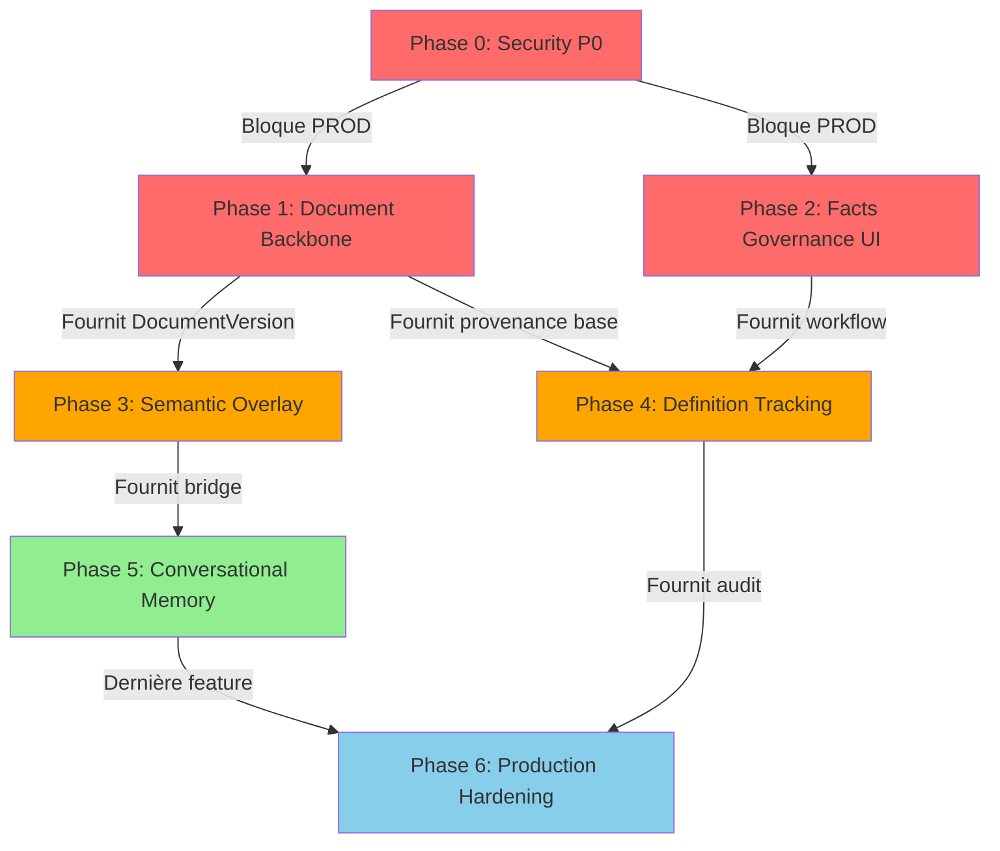

# BACK2PROMISE - Plan Directeur Unifié

**Projet** : SAP Knowledge Base
**Date création** : 10 octobre 2025
**Version** : 1.1 - Phase 0 démarrée
**Statut** : 🚀 **EN COURS - Phase 0 Security Hardening**
**Dernière mise à jour** : 09 octobre 2025

> **Mission** : Ramener KnowBase à sa promesse fondamentale en unifiant tous les chantiers (architecture, sécurité, promise business) en un plan cohérent et réaliste.

---

## 📋 Table des Matières

1. [Executive Summary](#executive-summary)
2. [État des Lieux Actuel](#état-des-lieux-actuel)
3. [Vision Cible Consolidée](#vision-cible-consolidée)
4. [Gaps Analysis Unifié](#gaps-analysis-unifié)
5. [Roadmap Phasée Back2Promise](#roadmap-phasée-back2promise)
6. [Effort & Ressources](#effort--ressources)
7. [Risques & Mitigations](#risques--mitigations)
8. [Métriques de Succès](#métriques-de-succès)
9. [Plan d'Exécution](#plan-dexécution)

---

## Executive Summary

### 🎯 Objectif

Consolider **4 documents d'analyse différents** en UN SEUL plan d'action cohérent pour ramener KnowBase à sa promesse business fondamentale : **"Savoir où savoir" avec gouvernance intelligente des connaissances**.

### 📚 Documents Consolidés

| Document | Focus | Statut | Intégration |
|----------|-------|--------|-------------|
| `knowbase_promise_gap_analysis.md` | Business gaps vs promise | Analyse | ✅ Unifié |
| `NORTH_STAR_NEO4J_NATIVE.md` | Architecture Neo4j native v2.1 | Implémenté ~70% | ✅ Unifié |
| `SECURITY_AUDIT_DYNAMIC_TYPES.md` | Vulnérabilités sécurité | Audit | ✅ Unifié |
| `DECISION_GRAPHITI_ALTERNATIVES_SYNTHESE.md` | Migration Graphiti → Neo4j | Décision | ✅ Unifié |
| `knowbase_gap_roadmap_estimation.md` | Estimation promise gaps | Estimation | ✅ Unifié |

### 🎖️ Résultat

**UN SEUL chantier "Back2Promise"** organisé en **6 phases cohérentes** (18 mois) combinant :
- ✅ Architecture (North Star Neo4j)
- ✅ Sécurité (Hardening P0/P1)
- ✅ Business Promise (Document lifecycle, Provenance, Overlay)
- ✅ Mémoire Conversationnelle (Objectif initial Zep/Graphiti)

**Effort total estimé** : 32-40 semaines développeur (~8-10 mois avec équipe 2-3 personnes)

---

## État des Lieux Actuel

### ✅ Réalisations Majeures (Octobre 2025)

#### 1. Migration Neo4j Ontology (Gap 3.6 Promise) - **90% COMPLÉTÉ** ✅
**Commits** : `3bf1f67` → `fa86872` (7 phases)
**Durée** : 1 session (~4-5h)

- ✅ 63 OntologyEntity + 212 OntologyAlias migrés
- ✅ EntityNormalizerNeo4j opérationnel (lookup O(1), <2ms)
- ✅ Auto-save après normalisation LLM
- ✅ Tests 15/15 passed
- ✅ Isolation complète (labels distincts, no collision KG)

**Résultat** : Système ontologies YAML → Neo4j dynamique fonctionnel

#### 2. Dynamic Entity Types (North Star v2.1) - **95% COMPLÉTÉ** ✅
**Phases** : 1-4 complétées (21/21 tâches)

- ✅ EntityTypeRegistry SQLite avec workflow admin
- ✅ Auto-discovery types par LLM
- ✅ Validation entities (cataloged vs pending)
- ✅ 12 nouveaux endpoints API
- ✅ Frontend UI admin (2 pages React)
- ✅ Tests 97/97 passed (100%)

**Résultat** : Système auto-learning types entités opérationnel

#### 3. Neo4j Native Architecture - **70% COMPLÉTÉ** ✅
**Status** : Infrastructure en place, facts governance partielle

- ✅ Neo4j container déployé
- ✅ Labels : Entity, Fact, Episode, Community, OntologyEntity, OntologyAlias
- ✅ Facts structurés (subject, predicate, value, temporal)
- ⚠️ Détection conflits : Implémentée mais simpliste
- ⚠️ Workflow gouvernance : Partiel (pas de UI complète)
- ❌ Timeline bi-temporelle : Non complétée
- ❌ Provenance : Métadonnées partielles seulement

**Résultat** : Fondation Neo4j solide, gouvernance à finaliser

### ⚠️ Problèmes Identifiés

#### Sécurité (Audit SECURITY_AUDIT_DYNAMIC_TYPES.md) - **CRITIQUE**
**Score risque** : 6.5/10 (MOYEN-ÉLEVÉ)

Vulnérabilités critiques :
1. ❌ **Pas d'authentification** sur endpoints admin (CRITIQUE)
2. ❌ **Pas de RBAC** (n'importe qui peut DELETE types)
3. ❌ **tenant_id fourni par client** (manipulable)
4. ⚠️ **Cascade delete non audité** (risque perte données)
5. ⚠️ **Validation entity_type faible** (accepte chaînes arbitraires)

**Conséquence** : **BLOQUANT PRODUCTION** sans hardening P0

#### Business Promise Gaps - **MAJEUR**
**Analyse** : `knowbase_promise_gap_analysis.md`

Gaps bloquant "know where to know" :
1. ❌ **Document lifecycle shallow** (0% - Gap 3.1)
   - Pas de versioning documents
   - Pas de lineage (qui remplace qui)
   - Impossible de citer "latest version avec confiance"

2. ❌ **Definition drift non monitoré** (0% - Gap 3.2)
   - Évolution définitions entités non tracée
   - Risque réponses avec définitions obsolètes

3. ⚠️ **Governance limitée aux facts numériques** (30% - Gap 3.3)
   - Facts méthodologiques (texte) pas gouvernés
   - `valid_from` souvent absent (default ingestion timestamp)

4. ❌ **Provenance incomplète** (10% - Gap 3.4)
   - `dc:creator` parsé mais jamais persisté
   - Pas de graph (:Person) auteurs/reviewers

5. ⚠️ **Semantic overlay faible** (20% - Gap 3.5)
   - Episodes = JSON arrays (pas vraies relations graph)
   - Pont Qdrant↔Neo4j absent
   - Navigation graphe difficile

#### Mémoire Conversationnelle - **NON RÉSOLU**
**Contexte** : Objectif initial Zep/Graphiti pour mémoire longue conversations

**Décision** : `DECISION_GRAPHITI_ALTERNATIVES_SYNTHESE.md`
- ❌ Graphiti inadapté (facts = texte dans relations)
- ❌ Zep trop restrictif (pas de contrôle schema)
- ✅ Neo4j custom choisi (mais mémoire conversationnelle pas encore implémentée)

**Résultat** : Aucun système de mémoire conversationnelle actuellement

### 📊 Score Maturité Global

| Dimension | Maturité | Commentaire |
|-----------|----------|-------------|
| **Architecture Neo4j** | 70% | Fondation solide, gouvernance partielle |
| **Sécurité** | 35% | Vulnérabilités critiques, BLOQUANT PROD |
| **Business Promise** | 25% | Gaps majeurs (document lifecycle, provenance) |
| **Ontologie** | 90% | Migration Neo4j excellente |
| **Dynamic Types** | 95% | Auto-learning opérationnel |
| **Mémoire Conversationnelle** | 0% | Pas encore implémentée |
| **Tests & Qualité** | 75% | Bonne couverture (97/97 tests dynamic types) |

**Moyenne** : **56% - PROTOTYPE AVANCÉ** (pas production-ready)

---

## Vision Cible Consolidée

### 🌟 Promesse Produit Unifiée

**"KnowBase : La couche sémantique qui sait où savoir"**

#### Piliers Business

1. **Instant Access (IA)** - Réponses en secondes, pas en minutes
   - ✅ Recherche vectorielle rapide (<100ms) - **ACQUIS**
   - ❌ Citations exactes (page, version, auteur) - **À FAIRE**
   - ❌ Provenance complète - **À FAIRE**

2. **Valorisation Existant (VE)** - Connecter l'estate existant
   - ⚠️ Neo4j connecte concepts (partiel) - **PARTIEL**
   - ❌ Versioning documents - **À FAIRE**
   - ✅ Types dynamiques - **ACQUIS**

3. **Decision Speed & Reliability (DR)** - Confiance dans l'action
   - ⚠️ Facts gouvernés (numériques seulement) - **PARTIEL**
   - ❌ Traçabilité auteur/approbateur - **À FAIRE**
   - ❌ Timeline évolution définitions - **À FAIRE**

#### Piliers Techniques (North Star)

1. **Facts Governance Complète**
   - ✅ Facts structurés Neo4j - **ACQUIS**
   - ⚠️ Détection conflits (simpliste) - **PARTIEL**
   - ❌ Timeline bi-temporelle complète - **À FAIRE**
   - ❌ UI Admin gouvernance - **À FAIRE**

2. **Mémoire Conversationnelle**
   - ❌ Historique conversations - **À FAIRE**
   - ❌ Contexte utilisateur persistant - **À FAIRE**
   - ❌ Apprentissage préférences - **À FAIRE**

3. **Sécurité Production-Ready**
   - ❌ JWT Authentication - **BLOQUANT P0**
   - ❌ RBAC (admin/editor/viewer) - **BLOQUANT P0**
   - ❌ Audit trail - **P1**
   - ❌ Rate limiting - **P2**

### 🏗️ Architecture Cible (Consolidée)

```
┌─────────────────────────────────────────────────────────────────┐
│                   KNOWBASE ARCHITECTURE v3.0                    │
├─────────────────────────────────────────────────────────────────┤
│                                                                 │
│  ┌──────────────┐  ┌──────────────┐  ┌────────┐  ┌─────────┐  │
│  │   QDRANT     │  │    NEO4J     │  │SQLITE  │  │POSTGRES │  │
│  │  (Vectors)   │  │ (Graph + KG) │  │(Config)│  │(Metadata)│ │
│  └──────────────┘  └──────────────┘  └────────┘  └─────────┘  │
│         │                  │              │           │         │
│         └──────────────────┼──────────────┼───────────┘         │
│                            │              │                     │
│  ┌────────────────────────▼──────────────▼──────────────────┐  │
│  │         CUSTOM GOVERNANCE & MEMORY LAYERS                 │  │
│  │                                                            │  │
│  │  1. FACTS GOVERNANCE                                      │  │
│  │     • Facts structurés (✅ Acquis)                        │  │
│  │     • Détection conflits (⚠️ À améliorer)                │  │
│  │     • Timeline bi-temporelle (❌ À compléter)            │  │
│  │     • Workflow proposed → approved (⚠️ Partiel)          │  │
│  │                                                            │  │
│  │  2. DOCUMENT LIFECYCLE (❌ À créer)                       │  │
│  │     • Document/DocumentVersion nodes                      │  │
│  │     • Versioning & lineage tracking                       │  │
│  │     • Obsolescence detection                              │  │
│  │     • Author/reviewer/approver provenance                 │  │
│  │                                                            │  │
│  │  3. DEFINITION TRACKING (❌ À créer)                      │  │
│  │     • EntityDefinition versioning                         │  │
│  │     • Definition drift detection                          │  │
│  │     • Conflict resolution workflow                        │  │
│  │                                                            │  │
│  │  4. SEMANTIC OVERLAY (⚠️ À refactorer)                    │  │
│  │     • Episode edges (pas JSON arrays)                     │  │
│  │     • Qdrant↔Neo4j bridge                                 │  │
│  │     • GraphQL API (optionnel)                             │  │
│  │                                                            │  │
│  │  5. CONVERSATIONAL MEMORY (❌ À créer)                    │  │
│  │     • (:Conversation), (:Message) nodes                   │  │
│  │     • User context & preferences                          │  │
│  │     • Learning from interactions                          │  │
│  │                                                            │  │
│  │  6. ONTOLOGY AUTO-LEARNING (✅ Acquis)                    │  │
│  │     • EntityTypeRegistry (✅ SQLite)                      │  │
│  │     • Neo4j OntologyEntity/Alias (✅ Opérationnel)        │  │
│  │     • Auto-discovery + validation (✅ Workflow admin)     │  │
│  │                                                            │  │
│  │  7. SECURITY & AUDIT (❌ À créer - BLOQUANT)              │  │
│  │     • JWT Authentication (❌ CRITIQUE)                    │  │
│  │     • RBAC (admin/editor/viewer) (❌ CRITIQUE)            │  │
│  │     • Audit trail (❌ P1)                                 │  │
│  │     • Rate limiting (❌ P2)                               │  │
│  └────────────────────────────────────────────────────────────┘  │
│                                                                 │
└─────────────────────────────────────────────────────────────────┘
```

---

## Gaps Analysis Unifié

### Matrice des Gaps (Consolidée)

| Gap ID | Nom | Source Doc | Impacte | Maturité | Priorité | Effort |
|--------|-----|------------|---------|----------|----------|--------|
| **SEC-1** | JWT Authentication | SECURITY_AUDIT | 🔴 Production | 0% | **P0 BLOQUANT** | 1-2 sem |
| **SEC-2** | RBAC (rôles) | SECURITY_AUDIT | 🔴 Production | 0% | **P0 BLOQUANT** | 1 sem |
| **SEC-3** | Validation input (entity_type, name) | SECURITY_AUDIT | 🔴 Production | 30% | **P0 BLOQUANT** | 3-5 jours |
| **SEC-4** | Audit Trail | SECURITY_AUDIT | 🟠 Compliance | 0% | **P1** | 1 sem |
| **SEC-5** | Cascade delete sécurisé | SECURITY_AUDIT | 🟠 Data safety | 0% | **P1** | 5 jours |
| **ARCH-1** | Facts Governance UI | NORTH_STAR | 🔴 Différenciateur | 20% | **P0** | 1-2 sem |
| **ARCH-2** | Timeline bi-temporelle | NORTH_STAR | 🟠 Traçabilité | 30% | **P1** | 1 sem |
| **ARCH-3** | ConflictDetector avancé | NORTH_STAR | 🟠 Qualité | 40% | **P1** | 1 sem |
| **PROM-1** | Document Lifecycle | PROMISE_GAP | 🔴 "Know where to know" | 0% | **P0** | 3-4 sem |
| **PROM-2** | Definition Tracking | PROMISE_GAP | 🟠 Confiance | 0% | **P1** | 2-3 sem |
| **PROM-3** | Provenance (Author/Approver) | PROMISE_GAP | 🔴 Traçabilité | 10% | **P0** | 1-2 sem |
| **PROM-4** | Semantic Overlay (Episode refactor) | PROMISE_GAP | 🟠 Navigation | 20% | **P1** | 2-3 sem |
| **PROM-5** | Governance méthodologique | PROMISE_GAP | 🟡 Extension | 30% | **P2** | 1-2 sem |
| **MEM-1** | Conversational Memory | DECISION_GRAPHITI | 🟡 UX | 0% | **P2** | 2-3 sem |
| **MEM-2** | User Context & Preferences | DECISION_GRAPHITI | 🟡 UX | 0% | **P2** | 1-2 sem |

### Priorisation par Impact Business

#### 🔴 **P0 - BLOQUANTS PRODUCTION** (Must-Have avant PROD)
**Durée** : 8-12 semaines

1. **SEC-1, SEC-2, SEC-3** : Sécurité (JWT, RBAC, validation)
   - **Sans cela** : Impossible déployer en production (vulnérabilités critiques)
   - **Effort** : 3-4 semaines

2. **PROM-1** : Document Lifecycle
   - **Sans cela** : Promesse "know where to know" impossible
   - **Effort** : 3-4 semaines

3. **PROM-3** : Provenance (Author/Approver)
   - **Sans cela** : Pas de traçabilité (compliance impossible)
   - **Effort** : 1-2 semaines

4. **ARCH-1** : Facts Governance UI
   - **Sans cela** : Différenciateur produit non utilisable (admin sans UI)
   - **Effort** : 1-2 semaines

#### 🟠 **P1 - HAUTE VALEUR** (Post-MVP, pré-scaling)
**Durée** : 6-10 semaines

5. **PROM-2** : Definition Tracking
6. **PROM-4** : Semantic Overlay
7. **ARCH-2, ARCH-3** : Timeline + ConflictDetector avancé
8. **SEC-4, SEC-5** : Audit Trail + Cascade sécurisé

#### 🟡 **P2 - AMÉLIORATION CONTINUE** (Nice-to-Have)
**Durée** : 4-6 semaines

9. **MEM-1, MEM-2** : Mémoire conversationnelle
10. **PROM-5** : Governance méthodologique étendue

---

## Roadmap Phasée Back2Promise

### Vue d'Ensemble

**6 Phases - 18 mois** (équipe 2-3 personnes)

```
Phase 0: Security Hardening (P0)         [4 semaines]  ← BLOQUANT PROD
Phase 1: Document Backbone               [5 semaines]  ← BLOQUANT PROMISE
Phase 2: Facts Governance Finalization   [4 semaines]  ← DIFFÉRENCIATEUR
Phase 3: Semantic Overlay & Provenance   [6 semaines]  ← PROMISE COMPLÈTE
Phase 4: Definition Tracking             [4 semaines]  ← QUALITÉ
Phase 5: Conversational Memory           [5 semaines]  ← UX AVANCÉE
Phase 6: Production Hardening & Scale    [4 semaines]  ← PRODUCTION
───────────────────────────────────────────────────────────────────
TOTAL                                    [32 semaines ≈ 8 mois]
```

### Dépendances Entre Phases



---

### **PHASE 0 : Security Hardening (P0)** - 🔴 **BLOQUANT PRODUCTION**

**Durée** : 4 semaines
**Priorité** : P0 (CRITIQUE)
**Statut** : 🚀 **EN COURS** (Démarré le 2025-10-09)
**Objectif** : Sécuriser le système pour permettre déploiement production
**Tracking détaillé** : `doc/PHASE_0_SECURITY_TRACKING.md`

#### Travaux

**Semaine 1 : Authentication & Authorization**
- [ ] JWT Authentication (RS256)
  - Génération/validation tokens
  - Refresh token mechanism
  - Claims : `user_id`, `email`, `role`, `tenant_id`
- [ ] Dependency `get_current_user()`, `require_admin()`
- [ ] Extraction `tenant_id` depuis JWT (pas query param)
- [ ] Tests auth (25+ tests)

**Semaine 2 : Input Validation & Sanitization**
- [ ] Validation regex `entity_type`, `relation_type`
  - Pattern : `^[A-Z][A-Z0-9_]{0,49}$`
  - Blacklist types système (`_`, `SYSTEM_`)
- [ ] Validation `entity.name`
  - Interdire `<>'"` + path traversal
  - Max length 200 chars
- [ ] Sanitization logs (newline escape)
- [ ] Tests fuzzing (1000+ inputs malformés)

**Semaine 3 : RBAC & Authorization**
- [ ] Roles : `admin`, `editor`, `viewer`
- [ ] Matrice permissions (qui peut quoi)
- [ ] Appliquer `require_admin()` sur endpoints DELETE/POST admin
- [ ] Verify entity ownership (multi-tenant isolation)
- [ ] Tests RBAC (30+ scénarios)

**Semaine 4 : Audit & Rate Limiting**
- [ ] AuditService (log actions admin)
- [ ] Audit trail table PostgreSQL
- [ ] Rate limiting (SlowAPI)
  - 5 deletes/min
  - 100 reads/min
- [ ] Monitoring alertes (>50 deletes/heure)
- [ ] Tests E2E sécurité

#### Livrables

✅ JWT auth production-ready
✅ RBAC opérationnel (3 rôles)
✅ Validation input stricte
✅ Audit trail activé
✅ Rate limiting configuré
✅ Tests sécurité 80%+ coverage

#### Risques

- ⚠️ JWT complexité (RS256 key management) → Mitigation : Utiliser bibliothèque éprouvée (PyJWT)
- ⚠️ RBAC granularité insuffisante → Mitigation : Matrice permissions extensible

---

### **PHASE 1 : Document Backbone** - 🔴 **BLOQUANT PROMISE**

**Durée** : 5 semaines
**Priorité** : P0 (CRITIQUE)
**Objectif** : Implémenter cycle de vie documentaire pour "know where to know"

**Dépend de** : Phase 0 (auth pour création documents)

#### Travaux

**Semaine 1 : Schéma Neo4j**
- [ ] Nodes `Document`, `DocumentVersion`
- [ ] Relations `HAS_VERSION`, `PRODUCES`, `UPDATES`
- [ ] Indexes (source_path, version_label, checksum)
- [ ] Contraintes unicité

**Semaine 2 : Services Backend**
- [ ] `DocumentRegistryService` (CRUD)
- [ ] `VersionResolutionService` (latest, effective_at, lineage)
- [ ] Intégration `KnowledgeGraphService`

**Semaine 3 : Ingestion Updates**
- [ ] Parser metadata (version, creator, date) PPTX/PDF
- [ ] Calcul checksum (SHA256)
- [ ] Détection duplicatas
- [ ] Link Episode → DocumentVersion

**Semaine 4 : APIs REST**
- [ ] `GET /documents` (liste avec versions)
- [ ] `GET /documents/{id}/versions` (historique)
- [ ] `GET /documents/{id}/lineage` (graphe modifications)
- [ ] `POST /documents/{id}/versions` (upload nouvelle version)

**Semaine 5 : UI Admin**
- [ ] Timeline view documents
- [ ] Comparaison versions (diff metadata)
- [ ] Flags obsolescence
- [ ] Change log visualisation

#### Livrables

✅ Document/DocumentVersion schema Neo4j
✅ 100% documents ingérés ont version tracking
✅ API + UI visualisation historique
✅ Checksum anti-duplicatas fonctionnel

#### Métriques Succès

- **100%** nouveaux documents ont version tracking
- **<500ms** résolution latest version
- **UI** : Timeline lisible (10 versions visibles)

---

### **PHASE 2 : Facts Governance Finalization** - 🔴 **DIFFÉRENCIATEUR**

**Durée** : 4 semaines
**Priorité** : P0 (DIFFÉRENCIATEUR PRODUIT)
**Objectif** : Finaliser UI admin gouvernance facts (actuellement 20%)

**Dépend de** : Phase 0 (auth admin), North Star v2.0 (facts structurés ✅)

#### Travaux

**Semaine 1 : ConflictDetector Avancé**
- [ ] Détection conflits avancée
  - Normalisation unités (`99.7%` vs `0.997`)
  - Tolérance valeurs proches (configurable)
  - Logique custom par `fact_type`
- [ ] Configuration `config/conflict_rules.yaml`
- [ ] Tests conflits (50+ scénarios)

**Semaine 2 : Timeline Bi-Temporelle**
- [ ] Valid time (`valid_from`, `valid_until`)
- [ ] Transaction time (`created_at`, `updated_at`)
- [ ] Point-in-time queries
- [ ] Timeline visualisation API

**Semaine 3 : UI Admin Facts Governance**
- [ ] Liste facts proposés (filtres, tri)
- [ ] Contexte complet (chunk Qdrant, slide image)
- [ ] Side-by-side conflicts
- [ ] Actions : APPROVE, REJECT, RESOLVE CONFLICT
- [ ] Bulk actions (approve/reject multiples)

**Semaine 4 : Workflow & Notifications**
- [ ] Notifications experts (conflits critiques)
- [ ] Email/Slack alerts
- [ ] Historique décisions admin
- [ ] Dashboard métriques gouvernance

#### Livrables

✅ UI Admin gouvernance facts production-ready
✅ Détection conflits >95% précision
✅ Timeline bi-temporelle opérationnelle
✅ Workflow approval complet

#### Métriques Succès

- **<30s** temps review moyen/fact
- **>80%** facts proposés approuvés
- **<5%** faux positifs conflits

---

### **PHASE 3 : Semantic Overlay & Provenance** - 🟠 **PROMISE COMPLÈTE**

**Durée** : 6 semaines
**Priorité** : P1 (HAUTE VALEUR)
**Objectif** : Transformer JSON arrays en vraies relations + traçabilité auteurs

**Dépend de** : Phase 1 (DocumentVersion pour provenance)

#### Travaux

**Semaine 1-2 : Refactor Episode**
- [ ] Remplacer `chunk_ids`, `fact_uuids` JSON par relations
  - `(:Episode)-[:CONTAINS_FACT]->(:Fact)`
  - `(:Episode)-[:MENTIONS_ENTITY]->(:Entity)`
  - `(:Episode)-[:HAS_RELATION]->(:Relation)`
- [ ] Migration données existantes (batching)
- [ ] Tests migration

**Semaine 3 : Qdrant-Neo4j Bridge**
- [ ] Service `ProvenanceBridgeService`
- [ ] Résolution chunk_id → Episode → DocumentVersion → Document
- [ ] Cache LRU (performance)
- [ ] API `GET /chunks/{chunk_id}/provenance`

**Semaine 4 : Provenance Nodes**
- [ ] Nodes `(:Person)` auteurs/reviewers
- [ ] Relations `[:AUTHORED_BY]`, `[:REVIEWED_BY]`, `[:APPROVED_BY]`
- [ ] Extraction metadata (dc:creator, etc.)
- [ ] Intégration ingestion

**Semaine 5 : Answer Synthesis Enrichment**
- [ ] Modifier RAG pipeline
- [ ] Citations : document version + concept + facts linkés
- [ ] Format : "Budget 2024 projet Alpha : 1.2M€ (source: Minutes 12/10/2023 v2.1, page 5, approuvé par J. Dupont)"

**Semaine 6 : UI Graph Navigation**
- [ ] Visualisation graphe concepts (D3.js ou library)
- [ ] Drill-down entité → définitions → documents
- [ ] Provenance cards (author, version, date)

#### Livrables

✅ Episodes = vraies relations graphe (plus JSON)
✅ 100% réponses incluent provenance structurée
✅ Navigation graphe fonctionnelle
✅ Pont Qdrant↔Neo4j opérationnel

#### Métriques Succès

- **>90%** réponses avec provenance complète (auteur, version, date)
- **<200ms** résolution provenance (chunk → full context)
- **UI Graph** : Lisible jusqu'à 100 nodes

---

### **PHASE 4 : Definition Tracking** - 🟠 **QUALITÉ**

**Durée** : 4 semaines
**Priorité** : P1 (HAUTE VALEUR)
**Objectif** : Tracer évolution définitions entités

**Dépend de** : Phase 1 (DocumentVersion), Phase 2 (workflow gouvernance)

#### Travaux

**Semaine 1 : Entity Definitions Schema**
- [ ] Node `EntityDefinition` (text, extracted_at, source_version)
- [ ] Relations `DEFINED_AS`, `FROM` (→ DocumentVersion)
- [ ] Détection drift (hash + embedding similarity)

**Semaine 2 : Drift Detection Service**
- [ ] Comparaison définitions (lexical + sémantique)
- [ ] Seuil similarité configurable
- [ ] Alertes définitions stales/contradictoires
- [ ] API `GET /entities/{uuid}/definitions`

**Semaine 3 : Integration Ingestion**
- [ ] Extraction définitions (LLM prompts)
- [ ] Création `EntityDefinition` lors ingestion
- [ ] Tests extraction (accuracy >80%)

**Semaine 4 : UI Definitions**
- [ ] Historique définitions par entité
- [ ] Diff visuel (text highlighting)
- [ ] Timeline évolution concepts
- [ ] Approve/reject définitions

#### Livrables

✅ Toutes entités clés ont historique définitions
✅ Détection drift automatique
✅ UI historique + diff visuel

#### Métriques Succès

- **>80%** concepts business avec définition historique
- **<10%** faux positifs drift
- **<1h** délai détection changement définition

---

### **PHASE 5 : Conversational Memory** - 🟡 **UX AVANCÉE**

**Durée** : 5 semaines
**Priorité** : P2 (AMÉLIORATION CONTINUE)
**Objectif** : Mémoire conversationnelle longue (objectif initial Zep/Graphiti)

**Dépend de** : Phase 3 (bridge Qdrant↔Neo4j)

#### Travaux

**Semaine 1 : Schema Conversations**
- [ ] Nodes `(:Conversation)`, `(:Message)`
- [ ] Relations `[:CONTAINS_MESSAGE]`, `[:MENTIONS]`, `[:RELATES_TO]`
- [ ] Indexes (user_id, conversation_id, timestamp)

**Semaine 2 : Conversation Service**
- [ ] `ConversationService` (CRUD)
- [ ] Résumés automatiques (LLM)
- [ ] Extraction entités/topics par conversation
- [ ] Linking messages → entities/facts

**Semaine 3 : User Context & Preferences**
- [ ] Nodes `(:UserProfile)`, `(:Preference)`
- [ ] Apprentissage préférences (topics favoris, style réponses)
- [ ] Contexte utilisateur dans prompts RAG

**Semaine 4 : APIs Conversations**
- [ ] `GET /conversations/{user_id}`
- [ ] `POST /conversations` (nouvelle conversation)
- [ ] `GET /conversations/{id}/summary`
- [ ] `POST /conversations/{id}/messages`

**Semaine 5 : UI Chat Amélioré**
- [ ] Historique conversations
- [ ] Suggestions basées sur contexte
- [ ] Affichage références (entités mentionnées)

#### Livrables

✅ Mémoire conversationnelle persistante
✅ User context dans RAG
✅ UI chat améliorée avec historique

#### Métriques Succès

- **100%** conversations persistées
- **>70%** suggestions contextuelles pertinentes
- **<500ms** chargement historique conversation (50 messages)

---

### **PHASE 6 : Production Hardening & Scale** - 🔵 **PRODUCTION**

**Durée** : 4 semaines
**Priorité** : P1 (PRÉ-SCALING)
**Objectif** : Préparer production scale (1M+ facts, 100+ users)

**Dépend de** : Toutes phases précédentes

#### Travaux

**Semaine 1 : Performance Optimization**
- [ ] Neo4j tuning (`neo4j.conf`)
- [ ] Index optimization (analyze queries)
- [ ] Cache stratégies (Redis)
- [ ] Load testing (1M facts, 100 concurrent users)

**Semaine 2 : Monitoring & Observability**
- [ ] Prometheus métriques
- [ ] Grafana dashboards (SLA, throughput, errors)
- [ ] Jaeger traces distribuées
- [ ] ELK/Loki logs centralisés

**Semaine 3 : Backup & Disaster Recovery**
- [ ] Backup automatique Neo4j (quotidien)
- [ ] Backup Qdrant (snapshots)
- [ ] Disaster recovery plan (RPO <24h, RTO <4h)
- [ ] Tests restore

**Semaine 4 : Documentation & Training**
- [ ] Documentation API complète (OpenAPI)
- [ ] Guides admin (gouvernance, configuration)
- [ ] Guides utilisateurs
- [ ] Formation équipes (admin, support)

#### Livrables

✅ Infrastructure production-ready (scale 1M+ facts)
✅ Monitoring complet (Prometheus + Grafana)
✅ Backup/restore testé
✅ Documentation complète

#### Métriques Succès

- **p95 <100ms** queries Neo4j (1M facts)
- **p99 <200ms** search end-to-end
- **>99.9%** uptime
- **<24h** RPO, **<4h** RTO

---

## Effort & Ressources

### Estimation Totale

| Phase | Durée Dev | Durée Calendaire | Équipe |
|-------|-----------|------------------|--------|
| **Phase 0** : Security P0 | 4 sem | 5 sem | 1-2 dev + 1 security reviewer |
| **Phase 1** : Document Backbone | 5 sem | 6 sem | 2 backend + 1 frontend |
| **Phase 2** : Facts Governance | 4 sem | 5 sem | 1 backend + 1 frontend |
| **Phase 3** : Semantic Overlay | 6 sem | 7 sem | 2 backend + 1 frontend |
| **Phase 4** : Definition Tracking | 4 sem | 5 sem | 1 backend + 1 frontend |
| **Phase 5** : Conversational Memory | 5 sem | 6 sem | 1 backend + 1 frontend |
| **Phase 6** : Production Hardening | 4 sem | 5 sem | 1 DevOps + 1 backend |
| **TOTAL** | **32 sem** | **39 sem** (~9 mois) | **2-3 FTE** |

### Par Rôle

| Rôle | Charge Totale | Pic (phases simultanées) |
|------|---------------|--------------------------|
| **Backend Dev** | 24 semaines | Phase 1+3 (2 devs) |
| **Frontend Dev** | 12 semaines | Phase 1+2+3 (1 dev) |
| **DevOps** | 5 semaines | Phase 0+6 (0.5 FTE) |
| **Security** | 2 semaines | Phase 0 (reviewer) |
| **QA/Testing** | 4 semaines | Toutes phases (0.25 FTE) |
| **Product/UX** | 3 semaines | Phase 1-5 (design/validation) |

### Approches Possibles

#### **Option 1 : Sequential** (9 mois)
- Phase 0 → 1 → 2 → 3 → 4 → 5 → 6
- **Avantage** : Risque minimal, validation progressive
- **Inconvénient** : Long time-to-market

#### **Option 2 : Parallel Workstreams** (6 mois) ⭐ **RECOMMANDÉ**
- **Stream 1** (Critical Path) : P0 → P1 → P3 → P6
- **Stream 2** (Parallel) : P2 + P4 + P5
- **Avantage** : Livraison plus rapide, 2-3 équipes en parallèle
- **Inconvénient** : Coordination requise

#### **Option 3 : MVP → Iterate** (3 mois MVP + 4 mois iterations)
- **MVP** : Phase 0 + Phase 1 (Security + Document Backbone)
- **Iteration 1** : Phase 2 + Phase 3
- **Iteration 2** : Phase 4 + Phase 5 + Phase 6
- **Avantage** : Quick win (MVP utilisable 3 mois), feedback tôt
- **Inconvénient** : Risque re-work

---

## Risques & Mitigations

### Risques Majeurs

| Risque | Probabilité | Impact | Phase | Mitigation |
|--------|-------------|--------|-------|------------|
| **Performance Neo4j dégradée** (1M+ facts) | Moyenne | Élevé | P6 | Load testing Phase 6, tuning préventif |
| **Migration Episode casse données** | Faible | Critique | P3 | Backup complet, migration idempotente, rollback plan |
| **Extraction metadata instable** (PDF/DOCX) | Élevée | Moyen | P1 | Fallbacks, validation rules, human-in-loop |
| **Scope creep** (features additionnelles) | Élevée | Élevé | Toutes | Product freeze après roadmap, backlog strict |
| **Résistance adoption** (UX complexe) | Moyenne | Élevé | P2, P3 | User research, prototypes cliquables, formation |
| **Équipe pas confortable Cypher** | Faible | Moyen | P1-P3 | Formation Cypher (1 jour), documentation complète |

### Stratégies Mitigation Globales

1. **POCs systématiques** : Valider faisabilité technique AVANT développement complet
2. **Revues bi-hebdomadaires** : Ajuster plan selon découvertes
3. **Tests E2E obligatoires** : Chaque phase validée avant passage suivante
4. **User feedback early** : Prototypes testés avec vrais users (Phase 2, 3, 5)

---

## Métriques de Succès

### Par Pilier Business

#### **Instant Access (IA)**
| Métrique | Baseline Actuel | Target Phase 3 | Target Phase 6 |
|----------|-----------------|----------------|----------------|
| Temps requête → réponse | ~2-5s | <1s (p90) | <1s (p95) |
| % réponses avec citation exacte | ~30% | >80% | >90% |
| % réponses avec provenance complète | ~10% | >90% | >95% |

#### **Valorisation Existant (VE)**
| Métrique | Baseline Actuel | Target Phase 4 | Target Phase 6 |
|----------|-----------------|----------------|----------------|
| % concepts avec définition historique | 0% | >60% | >80% |
| % documents avec version tracking | 0% | 100% | 100% |
| Backlog ontology entries pending | ~50 | <20 | <10 |

#### **Decision Speed & Reliability (DR)**
| Métrique | Baseline Actuel | Target Phase 2 | Target Phase 6 |
|----------|-----------------|----------------|----------------|
| Délai nouveau doc → "latest" promotion | N/A | <1h auto | <30min |
| Contradictions détectées/trim. | ~5 (manual) | >30 (auto) | >50 |
| Contradictions résolues/trim. | ~3 | >25 (80% SLA) | >45 (90% SLA) |
| % réponses avec (version, author, date) | ~5% | >80% | >90% |

### Métriques Techniques

| Métrique | Target |
|----------|--------|
| **Performance Neo4j** (p95) | <100ms (1M facts) |
| **Search end-to-end** (p99) | <200ms |
| **Uptime** | >99.9% |
| **Tests coverage** | >80% |
| **Security score** | <3/10 risque (Faible) |

---

## Plan d'Exécution

### Timeline Recommandée (Option 2 Parallel)

```
Mois 1-2 : Phase 0 (Security P0) + Phase 2 (Facts Governance) [parallel]
Mois 3-4 : Phase 1 (Document Backbone) + Phase 4 (Definitions) [parallel]
Mois 5-6 : Phase 3 (Semantic Overlay + Provenance)
Mois 7   : Phase 5 (Conversational Memory)
Mois 8   : Phase 6 (Production Hardening)

Total : 8 mois
```

### Jalons Décisionnels (Go/No-Go)

**Jalon 1 (Fin Mois 2)** : MVP Production-Ready ?
- ✅ Security P0 complète (JWT, RBAC, validation)
- ✅ Facts Governance UI fonctionnelle
- **Décision** : Déploiement MVP production ou continuer dev ?

**Jalon 2 (Fin Mois 4)** : Promise "Know Where to Know" Atteinte ?
- ✅ Document Backbone opérationnel
- ✅ Definition Tracking fonctionnel
- **Décision** : Scaling ou itération features ?

**Jalon 3 (Fin Mois 6)** : Semantic Overlay Complet ?
- ✅ Provenance complète (auteur, version)
- ✅ Navigation graphe fonctionnelle
- **Décision** : Production scaling ou continuer UX ?

### Checklist Démarrage

#### Avant Phase 0 (Immédiat)
- [ ] **Décision executive** : Valider roadmap Back2Promise
- [ ] **Staffing** : Allouer 2-3 FTE (2 backend + 1 frontend + 0.5 DevOps)
- [ ] **Budget** : Valider budget (8 mois dev + infra)
- [ ] **Backup complet** : Neo4j + Qdrant + SQLite
- [ ] **Git tag** : `pre-back2promise` (rollback point)

#### Avant Phase 1
- [ ] Audit qualité metadata documents existants (sample 100)
- [ ] Définir schéma `Document`/`DocumentVersion` (collaboration équipe)
- [ ] Setup environnement staging

#### Avant Phase 3
- [ ] Performance baseline Neo4j (query latencies)
- [ ] Décider : GraphQL ou REST étendu (arbitrage archi)

#### Avant Phase 6
- [ ] Établir baselines KPIs actuels
- [ ] Définir alerting thresholds

---

## Conclusion & Next Steps

### Synthèse

Ce document **"Back2Promise"** consolide **4 analyses différentes** en **UN SEUL plan d'action cohérent** :
- ✅ Architecture (North Star Neo4j v2.1)
- ✅ Sécurité (Audit SECURITY_AUDIT_DYNAMIC_TYPES.md)
- ✅ Business Promise (knowbase_promise_gap_analysis.md)
- ✅ Mémoire Conversationnelle (DECISION_GRAPHITI_ALTERNATIVES_SYNTHESE.md)

**Résultat** : **6 phases cohérentes** sur **8 mois** (Option 2 Parallel) pour ramener KnowBase à sa promesse fondamentale.

### Décision Attendue

**Valider la roadmap Back2Promise** pour :
1. Unifier tous les chantiers en un seul plan
2. Clarifier les priorités (P0 vs P1 vs P2)
3. Donner une vision claire équipe + stakeholders
4. Permettre démarrage Phase 0 (Security P0)

### Prochaines Étapes Immédiates

1. **Aujourd'hui** : Review Back2Promise avec équipe technique
2. **Demain** : Présentation executive (décision Go/No-Go)
3. **J+3** : Si Go → Staffing + Kickoff Phase 0
4. **J+7** : Sprint 1 Phase 0 (JWT Authentication)

---

## Annexes

### Documents Source Consolidés

1. `knowbase_promise_gap_analysis.md` - Business gaps analysis
2. `knowbase_gap_roadmap_estimation.md` - Estimation promise gaps
3. `NORTH_STAR_NEO4J_NATIVE.md` - Architecture Neo4j v2.1
4. `SECURITY_AUDIT_DYNAMIC_TYPES.md` - Audit sécurité
5. `DECISION_GRAPHITI_ALTERNATIVES_SYNTHESE.md` - Décision Graphiti → Neo4j

### Glossaire

- **P0/P1/P2** : Priorités (P0 = bloquant production, P1 = haute valeur, P2 = nice-to-have)
- **FTE** : Full-Time Equivalent (équivalent temps plein)
- **RPO** : Recovery Point Objective (perte données max acceptable)
- **RTO** : Recovery Time Objective (temps récupération max acceptable)
- **SLA** : Service Level Agreement

---

**Version** : 1.0
**Date** : 2025-10-10
**Auteur** : Équipe SAP KB + Claude Code
**Statut** : ✅ **Ready for Executive Review**
**Next Review** : Après validation executive + Début Phase 0
