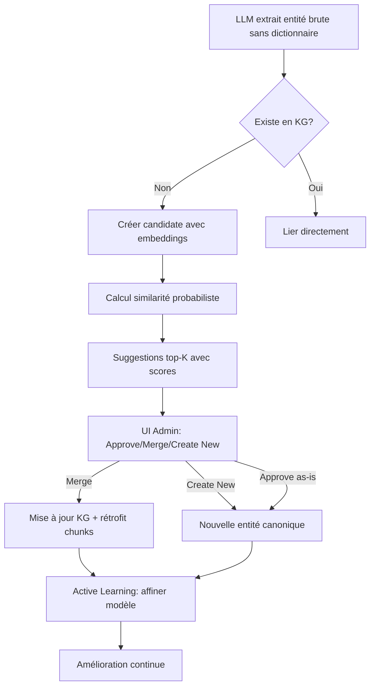

# Stratégie de Canonicalisation Probabiliste - Ontologie Émergente

**Date**: 30 septembre 2025
**Statut**: ✅ **VALIDÉ** - Paradigme "Ontologie Émergente" vs "Dictionnaire Statique"
**Objectif**: Éliminer les dictionnaires hardcodés, permettre l'émergence d'ontologies par validation assistée IA

---

## 🎯 VISION STRATÉGIQUE

### Paradigme Shift

**Aujourd'hui (Dictionnaire Statique)** ❌:
```python
# src/knowbase/common/sap/solutions_dict.py (hardcodé)
SAP_SOLUTIONS = {
    "S4HANA_PUBLIC": {
        "canonical_name": "SAP S/4HANA Cloud, Public Edition",
        "aliases": ["SAP Cloud ERP", "S/4HANA Cloud", ...]
    }
}
```

**Problèmes**:
- Rigide : chaque nouveau domaine = réécrire dictionnaire
- Maintenance lourde : aliases à jour manuellement
- Non-scalable : impossible de couvrir toutes les variations
- Pas d'apprentissage : erreurs répétées non capturées
- Couplage fort : SAP encodé en dur dans l'application

---

**Demain (Ontologie Émergente)** ✅:



**Avantages**:
- ✅ **Flexibilité totale** : SAP, Retail, Pharma, Finance sans recoder
- ✅ **Apprentissage continu** : chaque validation améliore le système
- ✅ **Coverage infinie** : détecte variations non prévues
- ✅ **Time-to-value** : nouveau domaine en **jours** vs **semaines**
- ✅ **Découplage** : domaine métier externalisé dans le KG
- ✅ **Scalabilité** : fonctionne avec 10 ou 10 000 entités

---

## 🔧 ARCHITECTURE TECHNIQUE

### 1. Extraction Sans Dictionnaire

**Principe**: Le LLM identifie les entités **AS-IS** sans normalisation préalable.

**Prompt modifié** (`config/prompts.yaml`):
```yaml
slide:
  default:
    template: |
      Identify entities in this content WITHOUT using any predefined dictionary.
      Extract names AS-IS as they appear in the document.

      Entity types:
      - PRODUCT: Software, platforms, solutions (e.g., "SAP Cloud ERP", "Salesforce")
      - TECHNOLOGY: APIs, protocols, frameworks (e.g., "OData API", "REST")
      - PERSONA: Roles, job titles (e.g., "IT Manager", "CFO")
      - FEATURE: Modules, capabilities (e.g., "Financial Planning", "Inventory Mgmt")
      - CONCEPT: Abstract ideas (e.g., "Cloud-native", "Real-time")
      - VENDOR: Companies, brands (e.g., "SAP", "Microsoft")

      Return JSON:
      {
        "entities": [
          {
            "name": "SAP Cloud ERP",  // ⚠️ AS-IS, pas de normalisation
            "entity_type": "PRODUCT",
            "description": "Cloud ERP solution mentioned in context...",
            "confidence": 0.9,
            "context": {
              "mentioned_with": ["Fiori", "HANA"],  // Co-occurrences
              "sentence": "Original sentence where entity was found..."
            }
          }
        ]
      }

      IMPORTANT:
      - Do NOT normalize names (keep "SAP Cloud ERP", not "SAP S/4HANA Cloud")
      - Extract even if uncertain (use low confidence)
      - Capture context for similarity matching
```

**Code** (`src/knowbase/ingestion/extractors/entity_extractor.py`):
```python
class EntityExtractor:
    """Extraction sans dictionnaire - LLM identifie entités candidates"""

    async def extract_entities(
        self,
        slide_content: Dict,
        deck_context: Dict
    ) -> List[EntityCandidate]:
        """
        Extrait entités brutes sans normalisation

        Returns:
            List[EntityCandidate] avec embeddings pré-calculés
        """

        # Appel LLM Vision (déjà unifié avec chunks)
        result = await self.llm_router.complete(
            TaskType.VISION,
            prompt=self._build_prompt(slide_content, deck_context)
        )

        raw_entities = result.get("entities", [])

        candidates = []
        for e in raw_entities:
            # Calcul embedding immédiat (pour canonicalisation)
            embedding = self.embedder.encode(
                f"{e['name']}. {e.get('description', '')}"
            )

            candidates.append(EntityCandidate(
                raw_name=e["name"],
                entity_type=EntityType[e["entity_type"]],
                description=e.get("description", ""),
                confidence=e.get("confidence", 0.8),
                embedding=embedding.tolist(),
                context={
                    "mentioned_with": e.get("context", {}).get("mentioned_with", []),
                    "sentence": e.get("context", {}).get("sentence", "")
                },
                provenance={
                    "slide_index": slide_content["slide_index"],
                    "source_name": deck_context["source_name"],
                    "extraction_date": datetime.now(timezone.utc).isoformat()
                }
            ))

        return candidates
```

---

### 2. Canonicalisation Probabiliste (Cœur du Système)

**Principe**: Calculer une **distribution de probabilités** vers entités canoniques existantes.

**Exemple**:
```json
{
  "candidate": "SAP Cloud ERP",
  "suggestions": [
    {
      "canonical_id": "uuid-s4hana-public",
      "canonical_name": "SAP S/4HANA Cloud, Public Edition",
      "score": 0.85,
      "breakdown": {
        "string_similarity": 0.75,    // Levenshtein normalisé
        "semantic_similarity": 0.90,  // Cosine embeddings
        "graph_context": 0.80         // Relations communes
      },
      "evidence": [
        "Co-occurs with 'Fiori' (also linked to S/4HANA in KG)",
        "Mentioned in same doc as 'HANA Database'",
        "String contains 'Cloud' and 'ERP' (alias known)"
      ]
    },
    {
      "canonical_id": "uuid-business-suite",
      "canonical_name": "SAP Business Suite",
      "score": 0.15,
      "breakdown": {...}
    }
  ]
}
```

**Code** (`src/knowbase/canonicalization/probabilistic_matcher.py`):
```python
from typing import List, Tuple
import numpy as np
from sentence_transformers import SentenceTransformer
from rapidfuzz import fuzz

class ProbabilisticCanonicalizer:
    """Calcule distribution de proximité vers entités canoniques existantes"""

    def __init__(self):
        self.embedder = SentenceTransformer("all-MiniLM-L6-v2")
        self.kg_service = get_knowledge_graph_service()

        # Poids initiaux (ajustables par active learning)
        self.weights = {
            "string_similarity": 0.3,
            "semantic_similarity": 0.5,
            "graph_context": 0.2
        }

    async def suggest_canonical_matches(
        self,
        candidate: EntityCandidate,
        top_k: int = 5,
        group_id: str = None
    ) -> List[CanonicalSuggestion]:
        """
        Calcule score de similarité multi-dimensionnel

        Returns:
            Liste de suggestions triées par score décroissant
        """

        # 1️⃣ Récupérer entités canoniques du même type
        canonical_entities = await self.kg_service.get_entities_by_type(
            entity_type=candidate.entity_type,
            status="approved",  # Seulement les entités validées
            group_id=group_id
        )

        if not canonical_entities:
            return []  # Aucune entité canonique → forcément nouveau

        # 2️⃣ Calcul multi-dimensionnel pour chaque candidat
        scores = []

        for canonical in canonical_entities:
            # A. String distance (Levenshtein normalisé)
            string_sim = self._string_similarity(
                candidate.raw_name,
                canonical.name
            )

            # B. Similarité sémantique (embeddings)
            semantic_sim = self._semantic_similarity(
                candidate,
                canonical
            )

            # C. Contexte graphe (relations communes)
            graph_sim = await self._graph_context_similarity(
                candidate,
                canonical
            )

            # D. Score pondéré final
            final_score = (
                self.weights["string_similarity"] * string_sim +
                self.weights["semantic_similarity"] * semantic_sim +
                self.weights["graph_context"] * graph_sim
            )

            # E. Génération d'evidence (explainabilité)
            evidence = self._generate_evidence(
                candidate,
                canonical,
                string_sim,
                semantic_sim,
                graph_sim
            )

            scores.append(CanonicalSuggestion(
                canonical_entity_id=canonical.uuid,
                canonical_name=canonical.name,
                score=final_score,
                breakdown={
                    "string_similarity": round(string_sim, 3),
                    "semantic_similarity": round(semantic_sim, 3),
                    "graph_context": round(graph_sim, 3)
                },
                evidence=evidence
            ))

        # Trier par score décroissant
        return sorted(scores, key=lambda x: x.score, reverse=True)[:top_k]

    def _string_similarity(self, str1: str, str2: str) -> float:
        """
        Levenshtein + normalisation

        Gère aussi:
        - Casse (lowercase)
        - Accents (unidecode)
        - Espaces multiples
        """
        from unidecode import unidecode

        # Normalisation
        s1 = unidecode(str1.lower().strip())
        s2 = unidecode(str2.lower().strip())

        # Levenshtein ratio
        return fuzz.ratio(s1, s2) / 100.0

    def _semantic_similarity(
        self,
        candidate: EntityCandidate,
        canonical: Entity
    ) -> float:
        """
        Cosine similarity embeddings

        Compare:
        - Nom + description candidate
        - Nom + description canonical
        """
        # Embedding candidate (déjà calculé à l'extraction)
        emb1 = np.array(candidate.embedding)

        # Embedding canonical (nom + description)
        canonical_text = f"{canonical.name}. {canonical.description}"
        emb2 = self.embedder.encode(canonical_text)

        # Cosine similarity
        return float(
            np.dot(emb1, emb2) / (np.linalg.norm(emb1) * np.linalg.norm(emb2))
        )

    async def _graph_context_similarity(
        self,
        candidate: EntityCandidate,
        canonical: Entity
    ) -> float:
        """
        Similarité via relations communes (Jaccard)

        Exemple:
        - Candidate "Cloud ERP" co-mentionné avec "Fiori"
        - Canonical "S/4HANA Cloud" lié à "Fiori" dans KG
        → Score élevé
        """
        # Entités co-mentionnées avec candidate (contexte extraction)
        candidate_context = set(candidate.context.get("mentioned_with", []))

        if not candidate_context:
            return 0.0

        # Entités liées à canonical dans KG
        canonical_relations = await self.kg_service.get_related_entities(
            canonical.uuid,
            max_depth=1
        )
        canonical_context = set(r.target_name for r in canonical_relations)

        if not canonical_context:
            return 0.0

        # Intersection / union (Jaccard similarity)
        intersection = len(candidate_context & canonical_context)
        union = len(candidate_context | canonical_context)

        return intersection / union if union > 0 else 0.0

    def _generate_evidence(
        self,
        candidate: EntityCandidate,
        canonical: Entity,
        string_sim: float,
        semantic_sim: float,
        graph_sim: float
    ) -> List[str]:
        """
        Génère explications humaines pour le score

        Exemple:
        - "String similarity 75% ('Cloud ERP' vs 'S/4HANA Cloud')"
        - "Co-occurs with 'Fiori' (also linked to S/4HANA in KG)"
        """
        evidence = []

        # String
        if string_sim > 0.7:
            evidence.append(
                f"String similarity {int(string_sim*100)}% "
                f"('{candidate.raw_name}' vs '{canonical.name}')"
            )

        # Semantic
        if semantic_sim > 0.8:
            evidence.append(
                f"Semantic similarity {int(semantic_sim*100)}% "
                f"(descriptions are very close)"
            )

        # Graph
        candidate_ctx = candidate.context.get("mentioned_with", [])
        if graph_sim > 0.5 and candidate_ctx:
            evidence.append(
                f"Co-occurs with {', '.join(candidate_ctx[:3])} "
                f"(also linked to {canonical.name} in KG)"
            )

        return evidence

    async def update_weights(self, new_weights: Dict[str, float]):
        """Mise à jour poids via active learning"""
        self.weights = new_weights

        # Persister dans DB pour réutilisation
        await self.db.save_canonicalizer_weights(new_weights)
```

---

### 3. Service Gouvernance Étendu

**API** (`src/knowbase/api/routers/governance.py`):
```python
@router.get("/canonicalization/queue")
async def get_canonicalization_queue(
    filters: Optional[str] = None,
    sort_by: str = "occurrences",  # occurrences, confidence, date
    limit: int = 50,
    user_context: Dict = Depends(get_user_context)
) -> CanonicalizationQueueResponse:
    """
    Retourne file d'attente avec suggestions probabilistes

    Response:
    {
      "total": 150,
      "items": [
        {
          "candidate": {
            "id": "uuid-candidate-1",
            "raw_name": "SAP Cloud ERP",
            "type": "PRODUCT",
            "confidence": 0.9,
            "occurrences": 15,
            "first_seen": "2025-09-30",
            "sources": ["doc1.pptx", "doc2.pdf"],
            "embedding": [...]
          },
          "suggestions": [
            {
              "canonical_id": "uuid-s4hana-public",
              "canonical_name": "SAP S/4HANA Cloud, Public Edition",
              "score": 0.85,
              "breakdown": {...},
              "evidence": [...]
            }
          ],
          "recommended_action": "MERGE",
          "recommended_target": "uuid-s4hana-public"
        }
      ]
    }
    """

    service = GovernanceService()

    return await service.get_canonicalization_queue(
        filters=filters,
        sort_by=sort_by,
        limit=limit,
        group_id=user_context["group_id"]
    )


@router.post("/canonicalization/merge")
async def merge_candidate_to_canonical(
    request: MergeRequest,
    user_context: Dict = Depends(get_user_context)
) -> MergeResponse:
    """
    Merge candidate → canonical + rétrofit chunks

    Body:
    {
      "candidate_id": "uuid-candidate-1",
      "canonical_id": "uuid-s4hana-public",
      "user_notes": "Confirmed via customer documentation"
    }

    Actions:
    1. Merge dans KG (candidate devient alias de canonical)
    2. Retrouver tous chunks mentionnant candidate
    3. Ajouter canonical_id dans related_node_ids.approved
    4. Logger pour active learning
    """

    service = GovernanceService()

    result = await service.apply_merge(
        candidate_id=request.candidate_id,
        canonical_id=request.canonical_id,
        user_notes=request.user_notes,
        user_context=user_context
    )

    return result


@router.post("/canonicalization/create-new")
async def create_new_canonical_entity(
    request: CreateNewEntityRequest,
    user_context: Dict = Depends(get_user_context)
) -> CreateNewResponse:
    """
    Promouvoir candidate en nouvelle entité canonique

    Body:
    {
      "candidate_id": "uuid-candidate-1",
      "canonical_name": "SAP Cloud ERP",  // Peut être édité
      "description": "Public cloud ERP solution...",
      "aliases": ["Cloud ERP", "S/4HANA Cloud"]
    }
    """

    service = GovernanceService()

    result = await service.create_canonical_from_candidate(
        candidate_id=request.candidate_id,
        canonical_name=request.canonical_name,
        description=request.description,
        aliases=request.aliases,
        user_context=user_context
    )

    return result


@router.post("/canonicalization/reject")
async def reject_candidate(
    request: RejectRequest,
    user_context: Dict = Depends(get_user_context)
) -> RejectResponse:
    """
    Rejeter une candidate (faux positif)

    Body:
    {
      "candidate_id": "uuid-candidate-1",
      "reason": "Not a real entity, generic term"
    }
    """

    service = GovernanceService()

    result = await service.reject_candidate(
        candidate_id=request.candidate_id,
        reason=request.reason,
        user_context=user_context
    )

    return result
```

**Service** (`src/knowbase/api/services/governance.py`):
```python
class GovernanceService:
    """Gestion workflow entities candidates → approved"""

    def __init__(self):
        self.kg_service = get_knowledge_graph_service()
        self.qdrant_service = get_qdrant_service()
        self.canonicalizer = ProbabilisticCanonicalizer()
        self.active_learning = ActiveLearningService()

    async def get_canonicalization_queue(
        self,
        filters: Optional[str],
        sort_by: str,
        limit: int,
        group_id: str
    ) -> List[EntityCandidateWithSuggestions]:
        """
        Retourne file d'attente avec suggestions probabilistes
        """

        # 1️⃣ Récupérer candidates non traitées
        candidates = await self.kg_service.get_entities(
            status="proposed",
            group_id=group_id,
            limit=limit * 2  # Surcharge pour filtrage
        )

        results = []

        for candidate in candidates:
            # 2️⃣ Calcul suggestions probabilistes
            suggestions = await self.canonicalizer.suggest_canonical_matches(
                candidate,
                top_k=5,
                group_id=group_id
            )

            # 3️⃣ AI recommande action
            recommended_action, recommended_target = self._recommend_action(
                candidate,
                suggestions
            )

            # 4️⃣ Compter occurrences dans chunks
            occurrences = await self.qdrant_service.count_chunks_with_entity(
                candidate.uuid
            )

            results.append({
                "candidate": {
                    **candidate.dict(),
                    "occurrences": occurrences
                },
                "suggestions": suggestions,
                "recommended_action": recommended_action,
                "recommended_target": recommended_target
            })

        # 5️⃣ Tri selon sort_by
        if sort_by == "occurrences":
            results.sort(key=lambda x: x["candidate"]["occurrences"], reverse=True)
        elif sort_by == "confidence":
            results.sort(key=lambda x: x["candidate"]["confidence"], reverse=True)
        elif sort_by == "date":
            results.sort(key=lambda x: x["candidate"]["first_seen"], reverse=True)

        return results[:limit]

    def _recommend_action(
        self,
        candidate: Entity,
        suggestions: List[CanonicalSuggestion]
    ) -> Tuple[str, Optional[str]]:
        """
        Recommandation AI basée sur scores

        Règles:
        - Score ≥ 0.8 → MERGE (haute confiance)
        - 0.5 ≤ Score < 0.8 → REVIEW (incertitude)
        - Score < 0.5 → CREATE_NEW (probablement nouveau)
        """
        if not suggestions:
            return "CREATE_NEW", None

        best_match = suggestions[0]

        if best_match.score >= 0.8:
            return "MERGE", best_match.canonical_entity_id
        elif best_match.score >= 0.5:
            return "REVIEW", None
        else:
            return "CREATE_NEW", None

    async def apply_merge(
        self,
        candidate_id: str,
        canonical_id: str,
        user_notes: Optional[str],
        user_context: Dict
    ) -> MergeResponse:
        """
        Merge candidate → canonical + rétrofit chunks
        """

        # 1️⃣ Récupérer entities
        candidate = await self.kg_service.get_entity(candidate_id)
        canonical = await self.kg_service.get_entity(canonical_id)

        # 2️⃣ Merge dans KG (candidate devient alias)
        await self.kg_service.merge_entities(
            source_id=candidate_id,
            target_id=canonical_id,
            user_id=user_context["user_id"],
            notes=user_notes
        )

        # 3️⃣ Retrouver chunks affectés
        affected_chunks = await self.qdrant_service.find_chunks_with_entity(
            candidate_id
        )

        # 4️⃣ Mise à jour Qdrant (rétrofit)
        for chunk in affected_chunks:
            # Retirer de candidates, ajouter à approved
            if candidate_id in chunk.related_node_ids.get("candidates", []):
                chunk.related_node_ids["candidates"].remove(candidate_id)

            if canonical_id not in chunk.related_node_ids.get("approved", []):
                chunk.related_node_ids.setdefault("approved", []).append(canonical_id)

            await self.qdrant_service.update_chunk_payload(
                chunk_id=chunk.id,
                payload={"related_node_ids": chunk.related_node_ids}
            )

        # 5️⃣ Active learning (feedback loop)
        await self.active_learning.log_merge(
            candidate_name=candidate.name,
            canonical_name=canonical.name,
            user_decision="merge",
            suggestions_scores=[s.score for s in suggestions] if suggestions else []
        )

        return MergeResponse(
            merged_entity_id=canonical_id,
            canonical_name=canonical.name,
            chunks_updated=len(affected_chunks),
            message=f"Successfully merged '{candidate.name}' into '{canonical.name}'"
        )

    async def create_canonical_from_candidate(
        self,
        candidate_id: str,
        canonical_name: str,
        description: str,
        aliases: List[str],
        user_context: Dict
    ) -> CreateNewResponse:
        """
        Promouvoir candidate en entité canonique
        """

        candidate = await self.kg_service.get_entity(candidate_id)

        # 1️⃣ Créer nouvelle entité canonique
        new_canonical = await self.kg_service.create_entity(
            EntityCreate(
                name=canonical_name,
                entity_type=candidate.entity_type,
                description=description,
                attributes={
                    **candidate.attributes,
                    "aliases": aliases,
                    "created_from_candidate": candidate_id,
                    "approved_by": user_context["user_id"],
                    "approved_at": datetime.now(timezone.utc).isoformat()
                },
                status="approved"
            ),
            user_context
        )

        # 2️⃣ Mettre à jour candidate (status → merged)
        await self.kg_service.update_entity_status(
            candidate_id,
            status="merged",
            merged_into=new_canonical.uuid
        )

        # 3️⃣ Mise à jour chunks Qdrant
        affected_chunks = await self.qdrant_service.find_chunks_with_entity(
            candidate_id
        )

        for chunk in affected_chunks:
            chunk.related_node_ids.get("candidates", []).remove(candidate_id)
            chunk.related_node_ids.setdefault("approved", []).append(new_canonical.uuid)

            await self.qdrant_service.update_chunk_payload(
                chunk.id,
                {"related_node_ids": chunk.related_node_ids}
            )

        # 4️⃣ Active learning
        await self.active_learning.log_create_new(
            candidate_name=candidate.name,
            canonical_name=canonical_name,
            user_decision="create_new"
        )

        return CreateNewResponse(
            canonical_entity_id=new_canonical.uuid,
            canonical_name=canonical_name,
            chunks_updated=len(affected_chunks),
            message=f"Created new canonical entity '{canonical_name}'"
        )
```

---

### 4. Interface Admin (Frontend)

**Page principale** (`frontend/src/app/governance/canonicalization/page.tsx`):

```typescript
"use client";

import { useState, useEffect } from "react";
import {
  Table,
  TableHeader,
  TableBody,
  TableColumn,
  TableRow,
  TableCell,
  Badge,
  Button,
  ButtonGroup,
  Text,
  Flex,
  Stack,
  Tooltip,
  Progress,
  Select,
  Input,
  Modal,
} from "@/components/ui";

interface EntityCandidateRow {
  candidate: {
    id: string;
    raw_name: string;
    type: string;
    confidence: number;
    occurrences: number;
    first_seen: string;
    sources: string[];
  };
  suggestions: Array<{
    canonical_id: string;
    canonical_name: string;
    score: number;
    breakdown: {
      string_similarity: number;
      semantic_similarity: number;
      graph_context: number;
    };
    evidence: string[];
  }>;
  recommended_action: "MERGE" | "REVIEW" | "CREATE_NEW";
  recommended_target?: string;
}

export default function CanonicalizationQueue() {
  const [queue, setQueue] = useState<EntityCandidateRow[]>([]);
  const [loading, setLoading] = useState(true);
  const [sortBy, setSortBy] = useState("occurrences");
  const [filter, setFilter] = useState("");

  const [selectedCandidate, setSelectedCandidate] = useState<EntityCandidateRow | null>(null);
  const [showMergeModal, setShowMergeModal] = useState(false);
  const [showCreateModal, setShowCreateModal] = useState(false);

  useEffect(() => {
    fetchQueue();
  }, [sortBy, filter]);

  const fetchQueue = async () => {
    setLoading(true);
    const res = await fetch(
      `/api/governance/canonicalization/queue?sort_by=${sortBy}&filters=${filter}`
    );
    const data = await res.json();
    setQueue(data.items);
    setLoading(false);
  };

  const handleQuickMerge = async (candidateId: string, canonicalId: string) => {
    await fetch("/api/governance/canonicalization/merge", {
      method: "POST",
      headers: { "Content-Type": "application/json" },
      body: JSON.stringify({ candidate_id: candidateId, canonical_id: canonicalId }),
    });

    fetchQueue(); // Refresh
  };

  const handleCreateNew = (row: EntityCandidateRow) => {
    setSelectedCandidate(row);
    setShowCreateModal(true);
  };

  const handleReject = async (candidateId: string) => {
    const reason = prompt("Reason for rejection?");
    if (!reason) return;

    await fetch("/api/governance/canonicalization/reject", {
      method: "POST",
      headers: { "Content-Type": "application/json" },
      body: JSON.stringify({ candidate_id: candidateId, reason }),
    });

    fetchQueue();
  };

  const getScoreColor = (score: number): string => {
    if (score >= 0.8) return "green";
    if (score >= 0.5) return "orange";
    return "red";
  };

  const getActionColor = (action: string): string => {
    switch (action) {
      case "MERGE": return "green";
      case "REVIEW": return "orange";
      case "CREATE_NEW": return "blue";
      default: return "gray";
    }
  };

  if (loading) {
    return <Progress value={undefined} label="Loading canonicalization queue..." />;
  }

  return (
    <Stack spacing="lg">
      {/* Header */}
      <Flex justify="between" align="center">
        <div>
          <h1>Canonicalisation Probabiliste</h1>
          <Text size="sm" color="gray">
            {queue.length} entités candidates à traiter
          </Text>
        </div>

        <Flex gap="md">
          <Select value={sortBy} onChange={(e) => setSortBy(e.target.value)}>
            <option value="occurrences">Trier par Occurrences</option>
            <option value="confidence">Trier par Confiance</option>
            <option value="date">Trier par Date</option>
          </Select>

          <Input
            placeholder="Filtrer par nom..."
            value={filter}
            onChange={(e) => setFilter(e.target.value)}
          />
        </Flex>
      </Flex>

      {/* Table principale */}
      <Table>
        <TableHeader>
          <TableColumn>Entité Candidate</TableColumn>
          <TableColumn>Occurrences</TableColumn>
          <TableColumn>Suggestions (Top 3)</TableColumn>
          <TableColumn>Recommandation AI</TableColumn>
          <TableColumn>Actions</TableColumn>
        </TableHeader>

        <TableBody>
          {queue.map((row) => (
            <TableRow key={row.candidate.id}>
              {/* Colonne 1: Entité candidate */}
              <TableCell>
                <Stack spacing="xs">
                  <Flex gap="xs" align="center">
                    <Badge color="purple">{row.candidate.type}</Badge>
                    <Text weight="bold">{row.candidate.raw_name}</Text>
                  </Flex>
                  <Text size="sm" color="gray">
                    Confidence: {Math.round(row.candidate.confidence * 100)}%
                  </Text>
                  <Text size="xs" color="gray">
                    First seen: {row.candidate.first_seen}
                  </Text>
                </Stack>
              </TableCell>

              {/* Colonne 2: Occurrences */}
              <TableCell>
                <Stack spacing="xs">
                  <Badge color="blue" size="lg">
                    {row.candidate.occurrences} chunks
                  </Badge>
                  <Text size="xs" color="gray">
                    Sources: {row.candidate.sources.slice(0, 2).join(", ")}
                    {row.candidate.sources.length > 2 && " ..."}
                  </Text>
                </Stack>
              </TableCell>

              {/* Colonne 3: Suggestions avec scores */}
              <TableCell>
                {row.suggestions.length === 0 ? (
                  <Text size="sm" color="gray">
                    Aucune suggestion (probablement nouveau)
                  </Text>
                ) : (
                  <Stack spacing="sm">
                    {row.suggestions.slice(0, 3).map((sug, idx) => (
                      <Flex key={sug.canonical_id} justify="between" align="center">
                        <div style={{ flex: 1 }}>
                          <Text size="sm" weight={idx === 0 ? "bold" : "normal"}>
                            {idx + 1}. {sug.canonical_name}
                          </Text>

                          {/* Evidence */}
                          {sug.evidence.length > 0 && (
                            <Text size="xs" color="gray" style={{ marginTop: 4 }}>
                              {sug.evidence[0]}
                            </Text>
                          )}
                        </div>

                        <Flex gap="xs" align="center">
                          <Badge color={getScoreColor(sug.score)} size="sm">
                            {Math.round(sug.score * 100)}%
                          </Badge>

                          {/* Tooltip breakdown */}
                          <Tooltip
                            content={
                              <Stack spacing="xs">
                                <Text size="xs">
                                  String: {Math.round(sug.breakdown.string_similarity * 100)}%
                                </Text>
                                <Text size="xs">
                                  Semantic: {Math.round(sug.breakdown.semantic_similarity * 100)}%
                                </Text>
                                <Text size="xs">
                                  Graph: {Math.round(sug.breakdown.graph_context * 100)}%
                                </Text>
                              </Stack>
                            }
                          >
                            <IconInfo size={16} />
                          </Tooltip>
                        </Flex>
                      </Flex>
                    ))}
                  </Stack>
                )}
              </TableCell>

              {/* Colonne 4: Recommandation AI */}
              <TableCell>
                <Badge color={getActionColor(row.recommended_action)}>
                  {row.recommended_action}
                </Badge>

                {row.recommended_target && (
                  <Text size="xs" color="gray" style={{ marginTop: 4 }}>
                    → {row.suggestions.find(s => s.canonical_id === row.recommended_target)?.canonical_name}
                  </Text>
                )}
              </TableCell>

              {/* Colonne 5: Actions rapides */}
              <TableCell>
                <ButtonGroup orientation="vertical" spacing="xs">
                  {/* Merge 1-clic (suggestion top-1) */}
                  {row.suggestions[0]?.score > 0.7 && (
                    <Button
                      color="success"
                      size="sm"
                      onClick={() => handleQuickMerge(
                        row.candidate.id,
                        row.suggestions[0].canonical_id
                      )}
                    >
                      ✅ Merge → {row.suggestions[0].canonical_name}
                    </Button>
                  )}

                  {/* Create New */}
                  <Button
                    color="primary"
                    size="sm"
                    onClick={() => handleCreateNew(row)}
                  >
                    🆕 Créer Nouvelle Entité
                  </Button>

                  {/* Reject */}
                  <Button
                    color="danger"
                    size="sm"
                    variant="outline"
                    onClick={() => handleReject(row.candidate.id)}
                  >
                    ❌ Rejeter
                  </Button>
                </ButtonGroup>
              </TableCell>
            </TableRow>
          ))}
        </TableBody>
      </Table>

      {/* Modal Create New */}
      {showCreateModal && selectedCandidate && (
        <CreateNewEntityModal
          candidate={selectedCandidate.candidate}
          onClose={() => setShowCreateModal(false)}
          onSuccess={() => {
            setShowCreateModal(false);
            fetchQueue();
          }}
        />
      )}
    </Stack>
  );
}
```

**Modal Create New** (`frontend/src/app/governance/canonicalization/CreateNewEntityModal.tsx`):
```typescript
interface CreateNewEntityModalProps {
  candidate: EntityCandidateRow["candidate"];
  onClose: () => void;
  onSuccess: () => void;
}

export function CreateNewEntityModal({
  candidate,
  onClose,
  onSuccess,
}: CreateNewEntityModalProps) {
  const [canonicalName, setCanonicalName] = useState(candidate.raw_name);
  const [description, setDescription] = useState("");
  const [aliases, setAliases] = useState<string[]>([]);
  const [loading, setLoading] = useState(false);

  const handleSubmit = async () => {
    setLoading(true);

    await fetch("/api/governance/canonicalization/create-new", {
      method: "POST",
      headers: { "Content-Type": "application/json" },
      body: JSON.stringify({
        candidate_id: candidate.id,
        canonical_name: canonicalName,
        description,
        aliases,
      }),
    });

    setLoading(false);
    onSuccess();
  };

  return (
    <Modal open onClose={onClose} title="Créer Nouvelle Entité Canonique">
      <Stack spacing="md">
        <Input
          label="Nom Canonique"
          value={canonicalName}
          onChange={(e) => setCanonicalName(e.target.value)}
          placeholder="SAP S/4HANA Cloud, Public Edition"
        />

        <Textarea
          label="Description"
          value={description}
          onChange={(e) => setDescription(e.target.value)}
          placeholder="Cloud ERP solution..."
          rows={4}
        />

        <TagsInput
          label="Aliases"
          value={aliases}
          onChange={setAliases}
          placeholder="Ajouter alias (SAP Cloud ERP, S/4HANA Cloud...)"
        />

        <Flex justify="end" gap="sm">
          <Button variant="outline" onClick={onClose}>
            Annuler
          </Button>
          <Button color="primary" onClick={handleSubmit} loading={loading}>
            Créer Entité
          </Button>
        </Flex>
      </Stack>
    </Modal>
  );
}
```

---

### 5. Active Learning (Phase 6)

**Service** (`src/knowbase/ml/active_learning.py`):
```python
class ActiveLearningService:
    """Apprend des décisions humaines pour améliorer suggestions"""

    def __init__(self):
        self.db = get_database()
        self.canonicalizer = ProbabilisticCanonicalizer()

    async def log_merge(
        self,
        candidate_name: str,
        canonical_name: str,
        user_decision: str,
        suggestions_scores: List[float]
    ):
        """Enregistre décision humaine (merge)"""

        await self.db.insert_learning_sample({
            "candidate_name": candidate_name,
            "canonical_name": canonical_name,
            "user_decision": user_decision,  # merge
            "ai_top_suggestion_score": suggestions_scores[0] if suggestions_scores else 0,
            "ai_suggested_correctly": suggestions_scores[0] > 0.8 if suggestions_scores else False,
            "timestamp": datetime.now()
        })

    async def log_create_new(
        self,
        candidate_name: str,
        canonical_name: str,
        user_decision: str
    ):
        """Enregistre décision humaine (create new)"""

        await self.db.insert_learning_sample({
            "candidate_name": candidate_name,
            "canonical_name": canonical_name,
            "user_decision": user_decision,  # create_new
            "ai_top_suggestion_score": 0,
            "ai_suggested_correctly": False,  # AI pensait merge, user a créé nouveau
            "timestamp": datetime.now()
        })

    async def retrain_similarity_weights(self):
        """
        Ajuste poids (string, semantic, graph) selon feedback

        Objectif: Maximiser la précision des suggestions top-1

        Exemple:
        - Si humains mergent souvent malgré string_sim faible
        → Augmenter poids semantic_sim
        """

        # 1️⃣ Récupérer échantillons labellisés (1000 derniers)
        samples = await self.db.get_learning_samples(limit=1000)

        if len(samples) < 100:
            return  # Pas assez de données

        # 2️⃣ Optimisation (grid search simple)
        best_weights = None
        best_accuracy = 0

        for alpha in [0.2, 0.3, 0.4]:  # String
            for beta in [0.4, 0.5, 0.6]:  # Semantic
                gamma = 1.0 - alpha - beta  # Graph

                # Tester ces poids sur échantillons
                accuracy = await self._evaluate_weights(
                    samples,
                    {"string_similarity": alpha, "semantic_similarity": beta, "graph_context": gamma}
                )

                if accuracy > best_accuracy:
                    best_accuracy = accuracy
                    best_weights = {"string_similarity": alpha, "semantic_similarity": beta, "graph_context": gamma}

        # 3️⃣ Mettre à jour canonicalizer
        if best_weights:
            await self.canonicalizer.update_weights(best_weights)

            print(f"✅ Active learning: weights updated (accuracy {best_accuracy:.2%})")
            print(f"   New weights: {best_weights}")

    async def _evaluate_weights(
        self,
        samples: List[Dict],
        weights: Dict[str, float]
    ) -> float:
        """
        Évalue précision des poids sur échantillons

        Métrique: % de fois où suggestion top-1 correspond au choix humain
        """
        correct = 0

        for sample in samples:
            # Recalculer suggestions avec ces poids
            # (simplifié ici, en réalité on réutilise embeddings stockés)
            predicted_canonical = self._predict_with_weights(
                sample["candidate_name"],
                weights
            )

            if predicted_canonical == sample["canonical_name"]:
                correct += 1

        return correct / len(samples)
```

---

## 📊 MIGRATION PROGRESSIVE

### Phase 1: Coexistence (Court Terme)

**Objectif**: Maintenir compatibilité existante

```python
# src/knowbase/common/sap/normalizer.py (adapté)

def normalize_solution_name(raw_name: str) -> Tuple[str, str]:
    """
    Normalisation SAP avec fallback dictionnaire

    V1 (actuel): Dictionnaire hardcodé
    V2 (cible): Canonicalisation probabiliste
    """

    # 🆕 Tentative canonicalisation probabiliste d'abord
    if settings.ENABLE_PROBABILISTIC_CANONICALIZATION:
        canonical = await canonicalizer.get_best_match(
            raw_name,
            entity_type="PRODUCT",
            threshold=0.8
        )

        if canonical:
            return canonical.id, canonical.name

    # ⚠️ Fallback dictionnaire SAP (legacy)
    for solution_id, data in SAP_SOLUTIONS.items():
        canonical_name = data["canonical_name"]
        aliases = data["aliases"]

        # Fuzzy matching sur aliases
        for alias in [canonical_name] + aliases:
            score = fuzz.ratio(raw_name.lower(), alias.lower())
            if score > 80:
                return solution_id, canonical_name

    # Non trouvé
    return "UNMAPPED", raw_name
```

---

### Phase 2: Migration Progressive (Moyen Terme)

**Script de migration** (`scripts/migrate_sap_dict_to_kg.py`):
```python
#!/usr/bin/env python3
"""
Migre dictionnaire SAP hardcodé → entités canoniques dans KG

Usage:
    python scripts/migrate_sap_dict_to_kg.py --dry-run
    python scripts/migrate_sap_dict_to_kg.py  # Apply
"""

async def migrate_sap_solutions_to_kg():
    """Popule KG avec solutions SAP depuis dictionnaire"""

    kg_service = get_knowledge_graph_service()

    for solution_id, data in SAP_SOLUTIONS.items():
        canonical_name = data["canonical_name"]
        aliases = data["aliases"]

        # Créer entité canonique
        entity = await kg_service.create_entity(
            EntityCreate(
                name=canonical_name,
                entity_type=EntityType.PRODUCT,
                description=f"SAP solution (migrated from hardcoded dict)",
                attributes={
                    "solution_id": solution_id,
                    "aliases": aliases,
                    "vendor": "SAP",
                    "category": data.get("category", "unknown"),
                    "migrated_from": "solutions_dict.py",
                    "migration_date": datetime.now().isoformat()
                },
                status="approved"  # ✅ Pré-approuvé (confiance haute)
            ),
            {"user_id": "migration_script", "group_id": "default"}
        )

        print(f"✅ Migrated: {canonical_name} ({solution_id})")

    print(f"\n✅ Migration complete: {len(SAP_SOLUTIONS)} solutions migrated to KG")
```

---

### Phase 3: Déprécation Dictionnaire (Long Terme)

```python
# src/knowbase/common/sap/solutions_dict.py (deprecated)

import warnings

warnings.warn(
    "solutions_dict.py is DEPRECATED. "
    "Use probabilistic canonicalization via KG. "
    "This file will be removed in v2.0",
    DeprecationWarning,
    stacklevel=2
)

# Garder uniquement pour tests legacy
SAP_SOLUTIONS = {
    # ... (minimal, pour backward compatibility tests)
}
```

---

## 📊 COMPARAISON APPROCHES

| Aspect | Dictionnaire Statique | Ontologie Émergente |
|--------|----------------------|---------------------|
| **Setup nouveau domaine** | 2-4 semaines (écrire dictionnaire) | 2-3 jours (ingérer docs + valider candidats) |
| **Maintenance** | Manuelle (ajouter aliases) | Automatique (active learning) |
| **Coverage** | Limitée (aliases prévus) | Infinie (détecte variations) |
| **Qualité** | Dépend exhaustivité dictionnaire | S'améliore dans le temps |
| **Coût initial** | Faible (dev simple) | Moyen (ML + UI admin) |
| **ROI** | Décroissant (maintenance croissante) | Croissant (apprentissage) |
| **Scalabilité** | 1 domaine = 1 dictionnaire | N domaines = 1 système |
| **Découplage** | ❌ SAP encodé en dur | ✅ Métier externalisé KG |

---

## ✅ PLAN D'IMPLÉMENTATION

### Sprint 1 (Phase 3 - Extraction Unifiée)
- ✅ Extraction LLM sans dictionnaire
- ✅ Stockage entities candidates dans KG (status="proposed")
- ✅ Tests sur 1 PPTX

### Sprint 2 (Phase 4 - Canonicalisation Probabiliste)
- ✅ Implémenter `ProbabilisticCanonicalizer`
- ✅ API `/canonicalization/queue` avec suggestions
- ✅ Tests unitaires algorithme similarité

### Sprint 3 (Phase 4 - UI Admin)
- ✅ Page Canonicalisation Queue
- ✅ Actions: Merge 1-clic, Create New, Reject
- ✅ Tests E2E workflow complet

### Sprint 4 (Phase 6 - Active Learning)
- ✅ Logging décisions humaines
- ✅ Retraining poids périodique
- ✅ Métriques qualité suggestions

### Sprint 5 (Migration)
- ✅ Script migration SAP dict → KG
- ✅ Coexistence dictionnaire + probabiliste
- ✅ Tests regression SAP

### Sprint 6 (Multi-Domaine)
- ✅ Test Retail (nouveau domaine)
- ✅ Déprécation dictionnaire SAP
- ✅ Documentation finale

---

## 🎯 MÉTRIQUES DE SUCCÈS

### Court Terme (Sprint 1-3)
- ✅ Extraction sans dictionnaire fonctionne (≥90% entities détectées)
- ✅ Suggestions probabilistes ≥80% pertinentes (top-3 contient bonne réponse)
- ✅ UI Admin utilisable (temps revue <30s/entité)

### Moyen Terme (Sprint 4-5)
- ✅ Active learning améliore précision (+10% après 500 validations)
- ✅ Migration SAP dict → KG sans perte de qualité
- ✅ Time-to-value nouveau domaine ≤ 3 jours

### Long Terme (Sprint 6+)
- ✅ Multi-domaine opérationnel (SAP + Retail + Pharma)
- ✅ Dictionnaires statiques supprimés (code simplifié)
- ✅ Ontologie émergente couvre 95%+ variations réelles

---

## 🚀 CONCLUSION

### Transformation Architecturale

Ce changement de paradigme transforme la plateforme d'un **système spécialisé SAP** vers une **plateforme générique multi-domaine** :

**Avant** ❌:
- Dictionnaires hardcodés par domaine
- Maintenance manuelle lourde
- Time-to-value élevé (semaines)
- Non scalable

**Après** ✅:
- Ontologie émergente assistée IA
- Apprentissage continu automatique
- Time-to-value faible (jours)
- Scalable infiniment

### Recommandation Finale

**GO avec priorité HAUTE** ✅

Cette approche est **essentielle** pour atteindre la vision North Star :
- Multi-domaine
- Time-to-value court
- Industrialisation

**Next steps**:
1. Valider POC canonicalisation probabiliste (Sprint 2)
2. Paralléliser avec extraction unifiée (Sprint 1)
3. Démo stakeholders après Sprint 3

---

**Document de référence** pour canonicalisation probabiliste et ontologie émergente.
