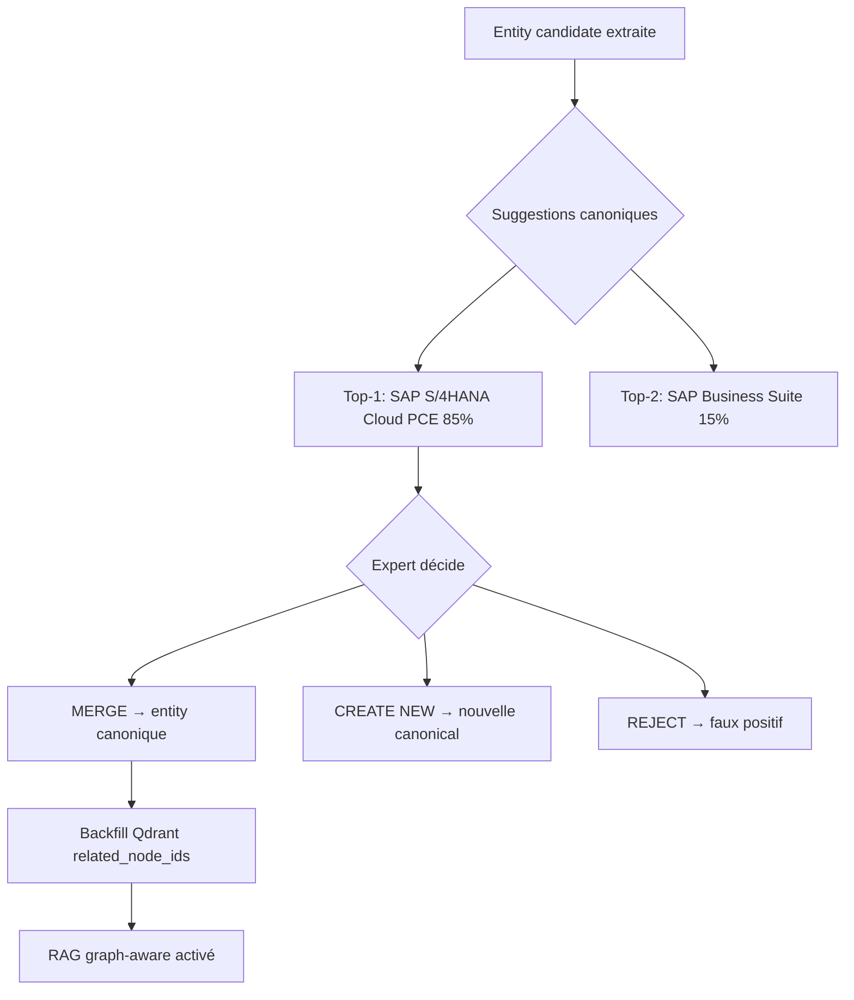
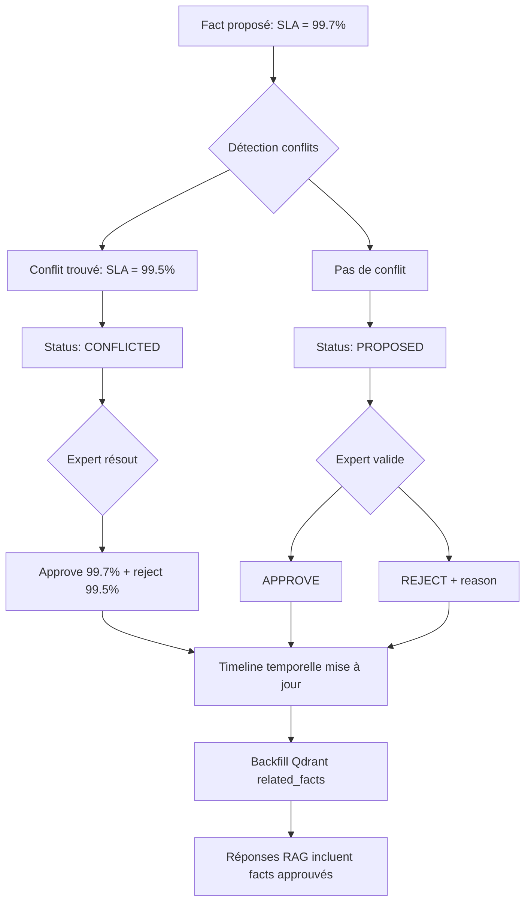

# Distinction Critique : Entities vs Facts — Architecture Knowbase

*Document de référence pour comprendre la dualité extraction sémantique*

---

## 🎯 Résumé Exécutif

L'architecture Knowledge Graph de la plateforme repose sur **deux types d'extraction complémentaires mais distincts** :

1. **Entities/Relations** : Concepts sémantiques du domaine métier → **Canonicalisation probabiliste**
2. **Facts structurés** : Assertions quantifiables avec valeur → **Gouvernance avec détection conflits**

Ces deux extractions sont réalisées **simultanément** via un seul appel LLM Vision par slide (extraction unifiée, zéro coût additionnel), mais suivent des **workflows de validation différents**.

---

## 📊 Comparaison Détaillée

| Dimension | **Entities** | **Facts** |
|-----------|--------------|-----------|
| **Nature** | Concept/objet du domaine métier | Assertion quantifiable avec valeur |
| **Exemples** | "SAP S/4HANA Cloud"<br>"SAP Fiori"<br>"Two-Tier ERP"<br>"Machine Learning" | "SLA S/4HANA PCE = 99.7%"<br>"Rétention logs = 10 ans"<br>"Limite quotas = 50k users"<br>"Taux conversion RFP = 35%" |
| **Problématique** | **Variantes de nom**<br>"SAP Cloud ERP"<br>"S/4HANA Cloud Edition"<br>"SAP ERP Cloud" → même chose ? | **Contradictions/Obsolescence**<br>"SLA = 99.7%" vs "SLA = 99.5%"<br>"Rétention = 10 ans" vs "Rétention = 7 ans"<br>Laquelle est correcte ? Quand a changé ? |
| **Solution** | **Canonicalisation probabiliste** (Phase 4)<br>- Suggestions top-K avec scores<br>- Similarité multi-dimensionnelle<br>- Merge 1-clic UI Admin<br>- Ontologie émergente | **Gouvernance avec validation** (Phase 3)<br>- Workflow proposed → approved/rejected<br>- Détection automatique conflits<br>- Timeline temporelle bi-temporelle<br>- Résolution expert avec traçabilité |
| **Statuts** | `candidate` → `canonical` (via merge) | `proposed` → `approved` / `rejected` / `conflicted` |
| **Types de conflits** | Doublons sémantiques<br>(même concept, noms différents) | CONTRADICTS<br>OVERRIDES<br>DUPLICATES<br>OUTDATED |
| **Schéma Backend** | `EntityCreate`, `EntityResponse`<br>`RelationCreate`, `RelationResponse` | `FactCreate`, `FactResponse`<br>`ConflictDetail`, `FactTimelineEntry` |
| **API Endpoints** | `/api/knowledge-graph/entities`<br>`/api/canonicalization/queue`<br>`/api/canonicalization/merge` | `/api/facts`<br>`/api/facts/{id}/approve`<br>`/api/facts/{id}/reject`<br>`/api/facts/conflicts/list`<br>`/api/facts/timeline/{entity}` |
| **UI Admin** | `/governance/canonicalization`<br>- Queue suggestions<br>- Actions merge/create-new/reject<br>- Scores explainability | `/governance/facts`<br>`/governance/pending`<br>`/governance/conflicts`<br>- Dashboard métriques<br>- Approve/reject actions<br>- Résolution conflits side-by-side |
| **Temporalité** | **Non applicable**<br>(entité existe ou pas) | **Bi-temporelle**<br>`valid_from` / `valid_until`<br>`created_at` / `updated_at` |
| **Lien Qdrant** | `related_node_ids.approved` | `related_facts.approved` |
| **Phase Roadmap** | **Phase 4** | **Phase 3** |
| **Effort implémentation** | ~10 jours (service + UI + tests) | ✅ **Déjà implémenté** (code complet Phase 3) |

---

## 🔍 Exemples Concrets d'Extraction

### Slide Source : "SAP S/4HANA Cloud, Private Edition - SLA & Performance"

**Contenu slide** :
```
SAP S/4HANA Cloud, Private Edition offre une garantie SLA de 99.7% avec un support 24/7.
Les données de log sont conservées pendant 10 ans selon les normes GDPR.
Le système supporte jusqu'à 50,000 utilisateurs concurrents.
L'interface utilisateur est basée sur SAP Fiori 3.0.
```

**Extraction LLM Vision unifiée** (un seul appel) :

#### 📦 Chunks (Qdrant)
```json
{
  "text": "SAP S/4HANA Cloud, Private Edition offre une garantie SLA de 99.7% avec un support 24/7...",
  "title": "SLA & Performance",
  "related_node_ids": {"candidates": ["entity_1", "entity_2"], "approved": []},
  "related_facts": {"proposed": ["fact_1", "fact_2", "fact_3"], "approved": []}
}
```

#### 🏷️ Entities (Knowledge Graph)
```json
[
  {
    "name": "SAP S/4HANA Cloud, Private Edition",
    "entity_type": "PRODUCT",
    "description": "Solution ERP cloud de SAP en édition privée",
    "confidence": 0.95,
    "status": "candidate"
  },
  {
    "name": "SAP Fiori 3.0",
    "entity_type": "TECHNOLOGY",
    "description": "Interface utilisateur SAP version 3.0",
    "confidence": 0.90,
    "status": "candidate"
  }
]
```

#### 🔗 Relations (Knowledge Graph)
```json
[
  {
    "source_entity": "SAP S/4HANA Cloud, Private Edition",
    "target_entity": "SAP Fiori 3.0",
    "relation_type": "USES_INTERFACE",
    "confidence": 0.85
  }
]
```

#### ✅ Facts (Graphiti - Gouvernance)
```json
[
  {
    "subject": "SAP S/4HANA Cloud, Private Edition",
    "predicate": "SLA_garantie",
    "object": "99.7%",
    "fact_type": "SERVICE_LEVEL",
    "status": "proposed",
    "valid_from": "2024-01-01",
    "confidence": 0.95,
    "source_chunk_id": "chunk_uuid_123"
  },
  {
    "subject": "SAP S/4HANA Cloud, Private Edition",
    "predicate": "retention_logs",
    "object": "10 ans",
    "fact_type": "DATA_RETENTION",
    "status": "proposed",
    "valid_from": "2024-01-01",
    "confidence": 0.92,
    "source_chunk_id": "chunk_uuid_123"
  },
  {
    "subject": "SAP S/4HANA Cloud, Private Edition",
    "predicate": "limite_utilisateurs_concurrents",
    "object": "50000",
    "fact_type": "CAPACITY_LIMIT",
    "status": "proposed",
    "confidence": 0.88,
    "source_chunk_id": "chunk_uuid_123"
  }
]
```

---

## 🛠️ Workflows de Validation

### Workflow Entities (Phase 4 - Canonicalisation)



**Problème résolu** : "SAP Cloud ERP", "S/4HANA Cloud Edition", "SAP ERP Cloud" → tous normalisés vers "SAP S/4HANA Cloud, Public Edition"

**Bénéfice** : Recherche unifiée, pas de doublons dans le graphe

---

### Workflow Facts (Phase 3 - Gouvernance)



**Problème résolu** : Contradictions détectées automatiquement, expert décide quelle valeur est correcte

**Bénéfice** : Base de connaissances gouvernée, traçabilité complète, timeline historique

---

## 🔄 Interaction Entities ↔ Facts

### Cas d'usage : Requête utilisateur

**Question** : "Quel est le SLA de SAP Cloud ERP ?"

**Pipeline de recherche** :

1. **Query Understanding** détecte :
   - Intent : recherche fact quantifiable (SLA)
   - Entity : "SAP Cloud ERP" (variante non canonique)

2. **Canonicalisation** :
   - "SAP Cloud ERP" → résolution probabiliste → "SAP S/4HANA Cloud, Public Edition" (canonical)

3. **Recherche Facts gouvernés** :
   - Filtrer `status = "approved"`
   - `subject = "SAP S/4HANA Cloud, Public Edition"`
   - `predicate = "SLA_garantie"`
   - Résultat : **"99.7%"** (fact approuvé avec valid_from 2024-01-01)

4. **Recherche Qdrant hybride** (complément) :
   - Chunks liés via `related_facts.approved`
   - Graph-aware ranking via `related_node_ids.approved`

5. **Synthèse Réponse** :
   ```
   Le SLA garanti pour SAP S/4HANA Cloud, Public Edition est de 99.7% (approuvé le 2024-03-15).

   Sources :
   - Fact approuvé : SLA_garantie (confidence: 95%)
   - Document : "SAP_S4HANA_Cloud_Overview_Q2_2024.pptx" (slide 12)
   - Mis à jour : 2024-01-01
   ```

**Résultat** : Réponse précise, traçable, avec fact validé expert

---

## 📈 Métriques de Qualité

### Entities (Canonicalisation)

- **Top-1 accuracy** : ≥70% (suggestion #1 est la bonne)
- **Top-3 accuracy** : ≥90% (bonne réponse dans top-3)
- **ERR (Expected Reciprocal Rank)** : ≥0.75
- **Taux merge automatisé** : 50-60% (high confidence)
- **Temps revue/100 entities** : −50% vs manuel

### Facts (Gouvernance)

- **Détection conflits** : 100% contradictions trouvées
- **Temps validation** : <30s par fact (expert)
- **Audit trail** : 100% actions loggées
- **Taux approbation** : 70-80% (proposed → approved)
- **Coverage facts** : ≥60% documents couverts par ≥1 fact

---

## 🚀 État Actuel d'Implémentation

### ✅ Facts Gouvernance (Phase 3) - **100% CODE COMPLET**

**Backend** :
- ✅ Schémas : `src/knowbase/api/schemas/facts_governance.py` (12 classes)
- ✅ Service : `src/knowbase/api/services/facts_governance_service.py` (10 méthodes)
- ✅ API : `src/knowbase/api/routers/facts_governance.py` (9 endpoints REST)
- ✅ Tests : `tests/integration/test_facts_governance.py` (16 tests)
- ✅ Intelligence : `src/knowbase/api/services/facts_intelligence.py` (scoring LLM, détection patterns)

**Frontend** :
- ✅ Dashboard : `frontend/src/app/governance/page.tsx`
- ✅ Pending facts : `frontend/src/app/governance/pending/page.tsx`
- ✅ Conflicts : `frontend/src/app/governance/conflicts/page.tsx`
- ✅ All facts : `frontend/src/app/governance/facts/page.tsx`

**Status** : Prêt pour validation fonctionnelle (nécessite Neo4j actif)

---

### ⏳ Entities Canonicalisation (Phase 4) - **EN ATTENTE**

**Architecture définie** :
- ✅ Document technique : `doc/CANONICALIZATION_PROBABILISTIC_STRATEGY.md`
- ✅ Algorithme multi-dimensionnel : string (30%) + semantic (50%) + graph (20%)
- ✅ Code exemple complet : ProbabilisticCanonicalizer, GovernanceService
- ✅ UI wireframes : Queue suggestions, merge 1-clic, active learning

**Effort estimé** : ~10 jours (service + API + UI + tests)

---

## 🔗 Références Documentation

| Document | Contenu | Statut |
|----------|---------|--------|
| `ARCHITECTURE_RAG_KG_NORTH_STAR.md` | Vision globale architecture + roadmap phasé | ✅ Intégré Entities vs Facts |
| `UNIFIED_LLM_EXTRACTION_STRATEGY.md` | Extraction unifiée (chunks + entities + relations + facts) | ✅ Complet |
| `CANONICALIZATION_PROBABILISTIC_STRATEGY.md` | Canonicalisation Entities (Phase 4) | ✅ Design complet |
| `GRAPHITI_POC_TRACKING.md` | Tracking Phase 0-3 Graphiti (incl. Facts Gouvernance) | ✅ Phase 3 100% implémentée |
| `OPENAI_FEEDBACK_EVALUATION.md` | Production readiness (P0 critiques) | ✅ Évaluation complète |

---

## 💡 Conclusion

**Entities et Facts sont deux faces complémentaires de la même extraction LLM** :

- **Entities** : "Quels sont les concepts mentionnés ?" → Problème : variantes de nom → Solution : Canonicalisation
- **Facts** : "Quelles valeurs quantifiables sont affirmées ?" → Problème : contradictions → Solution : Gouvernance validation

**Les deux sont extraits simultanément** (zéro coût additionnel), mais suivent des **workflows de validation différents** adaptés à leur nature.

Cette distinction est **critique** pour :
1. Éviter de mélanger les workflows (canonicaliser un fact n'a pas de sens)
2. Garantir la qualité des deux dimensions (ontologie propre + base de connaissances gouvernée)
3. Permettre RAG hybride performant (graph-aware + facts-first)

---

*Dernière mise à jour : 30 septembre 2025*
