# Architecture Technique - Semantic Intelligence Platform

**Version:** 1.0
**Date:** 2025-10-13
**Objectif:** Spécification technique détaillée des composants Semantic Intelligence pour KnowWhere

---

## Table des Matières

1. [Vue d'Ensemble Architecture](#1-vue-densemble-architecture)
2. [Composants Core](#2-composants-core)
3. [Schémas de Données](#3-schémas-de-données)
4. [APIs et Interfaces](#4-apis-et-interfaces)
5. [Flux de Données](#5-flux-de-données)
6. [Stack Technique](#6-stack-technique)
7. [Scalabilité et Performance](#7-scalabilité-et-performance)

---

## 1. Vue d'Ensemble Architecture

### 1.1 Architecture Globale

```mermaid
flowchart TB
    START[📄 Document Upload] --> SEMANTIC_LAYER[🧠 Semantic Intelligence Layer]

    SEMANTIC_LAYER --> PROFILER[Semantic Document Profiler]
    PROFILER --> SEGMENTATION[Intelligent Segmentation Engine]
    SEGMENTATION --> EXTRACTION[Dual-Storage Extraction]

    EXTRACTION --> PROTO_STORAGE{Proto Storage}
    PROTO_STORAGE -->|Concepts/Facts| QDRANT_PROTO[(Qdrant Proto)]
    PROTO_STORAGE -->|Entities/Relations| NEO4J_PROTO[(Neo4j Proto-KG)]

    QDRANT_PROTO --> GATEKEEPER[⚖️ Semantic Gatekeeper]
    NEO4J_PROTO --> GATEKEEPER

    GATEKEEPER -->|Promote| QDRANT_PUB[(Qdrant Published)]
    GATEKEEPER -->|Promote| NEO4J_PUB[(Neo4j Published KG)]

    GATEKEEPER -->|Lifecycle| VOLUMETRY[📦 Volumetry Manager]
    VOLUMETRY --> HOT_WARM_COLD[HOT/WARM/COLD/FROZEN]

    NEO4J_PUB --> LIVING_ONTO[🔄 Living Ontology]
    LIVING_ONTO --> PATTERN_DISCOVERY[Pattern Discovery Engine]

    NEO4J_PUB --> QUERY[🔍 Query Interface]
    QDRANT_PUB --> QUERY
    QUERY --> USER[👤 User]

    style SEMANTIC_LAYER fill:#e1f5ff
    style GATEKEEPER fill:#ffe1f5
    style NEO4J_PUB fill:#e1ffe1
    style QDRANT_PUB fill:#e1ffe1
```



### 1.2 Principes d'Architecture

**Separation of Concerns**
- Semantic Intelligence Layer : Comprendre le document
- Proto Storage : Staging des candidats
- Gatekeeper : Quality control
- Published Storage : Production data
- Living Ontology : Evolution continue

**Dual-Graph Strategy**
- Proto-KG (Neo4j + Qdrant) : Candidates non-validés
- Published-KG (Neo4j + Qdrant) : Données validées haute qualité
- Promotion unidirectionnelle avec audit trail

**Intelligence-First**
- Toutes les décisions basées sur semantic intelligence
- Pas de règles fixes (seuils adaptatifs)
- Learning loop continu

---

## 2. Composants Core

### 2.1 Semantic Intelligence Layer

#### 2.1.1 SemanticDocumentProfiler

**Responsabilité** : Analyser document pour guider tout le pipeline

```python
# src/knowbase/semantic/profiler/document_profiler.py

from dataclasses import dataclass
from typing import List, Dict, Optional
from enum import Enum

class DocumentComplexity(Enum):
    LOW = "low"           # Simple, factuel, peu de liens
    MEDIUM = "medium"     # Structure moyenne, quelques relations
    HIGH = "high"         # Riche, narratif, multi-relations
    VERY_HIGH = "very_high"  # Complexe, causal chains, temporal

class DocumentDomain(Enum):
    TECHNICAL = "technical"
    BUSINESS = "business"
    REGULATORY = "regulatory"
    RESEARCH = "research"
    MIXED = "mixed"

@dataclass
class NarrativeThread:
    """Fil narratif reliant plusieurs segments"""
    thread_id: str
    thread_type: str  # causal, temporal, reference, evolution
    segments: List[str]  # IDs segments connectés
    strength: float  # 0.0-1.0
    evidence: List[str]  # Phrases connectrices

@dataclass
class ComplexityZone:
    """Zone de complexité dans le document"""
    zone_id: str
    start_segment: int
    end_segment: int
    complexity_score: float
    reasoning_depth: int  # Nombre de niveaux causal
    entity_density: float  # Entités par 100 mots
    relation_density: float

@dataclass
class DocumentIntelligence:
    """Profile complet d'intelligence sémantique"""
    document_id: str
    narrative_threads: List[NarrativeThread]
    complexity_zones: List[ComplexityZone]
    domain: DocumentDomain
    overall_complexity: DocumentComplexity
    semantic_richness: float  # 0.0-1.0
    causal_chains_count: int
    temporal_sequences_count: int
    cross_references_count: int
    recommended_budget: float  # $ budget LLM recommandé
    extraction_strategy: str  # PREMIUM, STANDARD, BASIC

class SemanticDocumentProfiler:
    """
    Analyse l'intelligence sémantique d'un document pour guider le pipeline.
    """

    def __init__(self, llm_client, config):
        self.llm_client = llm_client
        self.config = config

    async def analyze_document(
        self,
        document_path: str,
        document_text: str
    ) -> DocumentIntelligence:
        """
        Analyse complète du document.

        Étapes:
        1. Identify narrative threads (fils causaux, temporels, références)
        2. Map complexity zones (zones riches vs simples)
        3. Classify domain and archetype
        4. Allocate intelligence budget
        """

        # 1. Narrative Thread Detection
        narrative_threads = await self._identify_narrative_threads(document_text)

        # 2. Complexity Mapping
        complexity_zones = await self._map_complexity_zones(
            document_text,
            narrative_threads
        )

        # 3. Domain Classification
        domain = await self._classify_domain(document_text)

        # 4. Budget Allocation
        budget = self._allocate_budget(
            complexity_zones,
            domain,
            len(narrative_threads)
        )

        return DocumentIntelligence(
            document_id=document_path,
            narrative_threads=narrative_threads,
            complexity_zones=complexity_zones,
            domain=domain,
            overall_complexity=self._compute_overall_complexity(complexity_zones),
            semantic_richness=self._compute_semantic_richness(
                narrative_threads, complexity_zones
            ),
            causal_chains_count=len([t for t in narrative_threads if t.thread_type == "causal"]),
            temporal_sequences_count=len([t for t in narrative_threads if t.thread_type == "temporal"]),
            cross_references_count=len([t for t in narrative_threads if t.thread_type == "reference"]),
            recommended_budget=budget,
            extraction_strategy=self._determine_extraction_strategy(budget)
        )

    async def _identify_narrative_threads(
        self,
        document_text: str
    ) -> List[NarrativeThread]:
        """
        Identifie les fils narratifs qui connectent les segments.

        Détection de:
        - Connecteurs causaux: "therefore", "consequently", "due to", "because"
        - Connecteurs temporels: "then", "later", "subsequently", "after"
        - Références: "as mentioned", "this approach", "the aforementioned"
        - Évolution: "revised", "updated", "supersedes", "replaces"
        """

        # Analyse LLM pour détecter narrative structure
        prompt = f"""
        Analyze this document for narrative threads connecting different parts.

        Identify:
        1. Causal connections (A causes B, A leads to B)
        2. Temporal sequences (A happened before B)
        3. Cross-references (A refers to B)
        4. Evolution chains (A supersedes B, A revises B)

        Document:
        {document_text[:8000]}  # Premier chunk pour analyse

        Return JSON array of threads with:
        - type (causal/temporal/reference/evolution)
        - connected_segments (indices or text excerpts)
        - strength (0.0-1.0)
        - evidence (connector phrases)
        """

        response = await self.llm_client.complete(
            prompt=prompt,
            model="gpt-4",
            response_format={"type": "json_object"}
        )

        # Parser et créer NarrativeThread objects
        threads_data = response.json()
        threads = []
        for thread_data in threads_data.get("threads", []):
            thread = NarrativeThread(
                thread_id=f"thread_{len(threads)}",
                thread_type=thread_data["type"],
                segments=thread_data["connected_segments"],
                strength=thread_data["strength"],
                evidence=thread_data["evidence"]
            )
            threads.append(thread)

        return threads

    async def _map_complexity_zones(
        self,
        document_text: str,
        narrative_threads: List[NarrativeThread]
    ) -> List[ComplexityZone]:
        """
        Identifie les zones de complexité sémantique.

        Critères:
        - Densité d'entités (entités/100 mots)
        - Densité de relations
        - Profondeur raisonnement (niveaux causaux)
        - Richesse contextuelle
        """

        # Segmentation en chunks 500 mots
        chunks = self._chunk_text(document_text, chunk_size=500)

        zones = []
        for i, chunk in enumerate(chunks):
            # Analyse rapide de complexité
            entity_density = self._estimate_entity_density(chunk)
            relation_density = self._estimate_relation_density(chunk)
            reasoning_depth = self._estimate_reasoning_depth(chunk, narrative_threads)

            complexity_score = (
                entity_density * 0.3 +
                relation_density * 0.4 +
                reasoning_depth * 0.3
            )

            zone = ComplexityZone(
                zone_id=f"zone_{i}",
                start_segment=i * 500,
                end_segment=(i + 1) * 500,
                complexity_score=complexity_score,
                reasoning_depth=reasoning_depth,
                entity_density=entity_density,
                relation_density=relation_density
            )
            zones.append(zone)

        return zones

    def _allocate_budget(
        self,
        complexity_zones: List[ComplexityZone],
        domain: DocumentDomain,
        threads_count: int
    ) -> float:
        """
        Alloue budget LLM selon complexité et domaine.

        Budget base:
        - LOW complexity: 0.10$ per document
        - MEDIUM: 0.30$
        - HIGH: 0.60$
        - VERY_HIGH: 1.00$

        Multiplicateurs domaine:
        - TECHNICAL: 1.2x (termes spécialisés)
        - REGULATORY: 1.5x (précision critique)
        - RESEARCH: 1.3x (concepts complexes)
        - BUSINESS: 1.0x (standard)
        """

        avg_complexity = sum(z.complexity_score for z in complexity_zones) / len(complexity_zones)

        if avg_complexity < 0.3:
            base_budget = 0.10
        elif avg_complexity < 0.6:
            base_budget = 0.30
        elif avg_complexity < 0.8:
            base_budget = 0.60
        else:
            base_budget = 1.00

        # Multiplicateur domaine
        domain_multipliers = {
            DocumentDomain.TECHNICAL: 1.2,
            DocumentDomain.REGULATORY: 1.5,
            DocumentDomain.RESEARCH: 1.3,
            DocumentDomain.BUSINESS: 1.0,
            DocumentDomain.MIXED: 1.1
        }

        budget = base_budget * domain_multipliers.get(domain, 1.0)

        # Ajustement narrative threads
        if threads_count > 10:
            budget *= 1.2  # Rich narrative structure

        return round(budget, 2)
```

#### 2.1.2 NarrativeThreadDetector

**Responsabilité** : Détecter relations cross-documents et cross-segments

```python
# src/knowbase/semantic/narrative/thread_detector.py

from typing import List, Dict, Optional
import re
from dataclasses import dataclass

@dataclass
class CausalConnector:
    """Connecteur causal entre segments"""
    source_segment: str
    target_segment: str
    connector_type: str  # "causes", "leads_to", "results_in"
    connector_phrase: str
    confidence: float

@dataclass
class TemporalSequence:
    """Séquence temporelle d'événements"""
    sequence_id: str
    events: List[Dict[str, any]]  # {segment, timestamp, event_type}
    duration: Optional[str]
    sequence_type: str  # "linear", "branching", "cyclic"

@dataclass
class CrossDocumentReference:
    """Référence entre documents"""
    source_doc_id: str
    target_doc_id: str
    reference_type: str  # "supersedes", "complements", "contradicts", "revises"
    evidence_text: str
    confidence: float

class NarrativeThreadDetector:
    """
    Détecte les fils narratifs reliant segments et documents.
    """

    # Patterns de connecteurs causaux
    CAUSAL_PATTERNS = [
        r"\btherefore\b",
        r"\bconsequently\b",
        r"\bdue to\b",
        r"\bbecause of\b",
        r"\bas a result\b",
        r"\bleads to\b",
        r"\bcauses\b",
        r"\bthus\b",
        r"\bhence\b"
    ]

    # Patterns temporels
    TEMPORAL_PATTERNS = [
        r"\bthen\b",
        r"\blater\b",
        r"\bsubsequently\b",
        r"\bafter\b",
        r"\bbefore\b",
        r"\bin \d{4}\b",  # années
        r"\bon [A-Z][a-z]+ \d{1,2}",  # dates
    ]

    # Patterns de référence
    REFERENCE_PATTERNS = [
        r"\bas mentioned\b",
        r"\bas stated\b",
        r"\bthis approach\b",
        r"\bthe aforementioned\b",
        r"\bpreviously described\b",
        r"\brefers to\b"
    ]

    # Patterns d'évolution
    EVOLUTION_PATTERNS = [
        r"\brevised\b",
        r"\bupdated\b",
        r"\bsupersedes\b",
        r"\breplaces\b",
        r"\bobsoletes\b",
        r"\bnew version\b",
        r"\bv?\d+\.\d+",  # version numbers
    ]

    def __init__(self, llm_client):
        self.llm_client = llm_client

    def detect_causal_connectors(
        self,
        document_text: str,
        segments: List[str]
    ) -> List[CausalConnector]:
        """
        Détecte les connecteurs causaux entre segments.
        """

        connectors = []

        for i, segment in enumerate(segments):
            # Recherche patterns causaux
            for pattern in self.CAUSAL_PATTERNS:
                matches = re.finditer(pattern, segment, re.IGNORECASE)
                for match in matches:
                    # Analyser contexte pour identifier source/target
                    context = self._extract_context(segment, match.start(), match.end())

                    connector = CausalConnector(
                        source_segment=f"seg_{i}",
                        target_segment=f"seg_{i+1}" if i < len(segments)-1 else f"seg_{i}",
                        connector_type=self._classify_causal_type(match.group()),
                        connector_phrase=context,
                        confidence=0.7  # Base confidence
                    )
                    connectors.append(connector)

        return connectors

    def detect_temporal_sequences(
        self,
        document_text: str,
        segments: List[str]
    ) -> List[TemporalSequence]:
        """
        Détecte les séquences temporelles dans le document.
        """

        sequences = []
        events = []

        for i, segment in enumerate(segments):
            # Extraire dates et événements temporels
            temporal_matches = []
            for pattern in self.TEMPORAL_PATTERNS:
                matches = re.finditer(pattern, segment, re.IGNORECASE)
                temporal_matches.extend(matches)

            if temporal_matches:
                event = {
                    "segment": f"seg_{i}",
                    "timestamp": self._extract_timestamp(segment, temporal_matches),
                    "event_type": "temporal_marker",
                    "text": segment[:200]
                }
                events.append(event)

        # Grouper événements en séquences
        if events:
            sequence = TemporalSequence(
                sequence_id=f"seq_0",
                events=sorted(events, key=lambda e: e.get("timestamp", "")),
                duration=None,
                sequence_type="linear"
            )
            sequences.append(sequence)

        return sequences

    async def detect_cross_document_references(
        self,
        current_doc_id: str,
        current_doc_text: str,
        existing_documents: List[Dict[str, str]]
    ) -> List[CrossDocumentReference]:
        """
        Détecte les références entre documents.

        Cas d'usage: Détecter qu'un rapport 2023 révise un rapport 2022
        """

        references = []

        # Chercher patterns d'évolution dans doc courant
        evolution_mentions = []
        for pattern in self.EVOLUTION_PATTERNS:
            matches = re.finditer(pattern, current_doc_text, re.IGNORECASE)
            evolution_mentions.extend([m.group() for m in matches])

        if not evolution_mentions:
            return references

        # Analyser avec LLM pour déterminer si référence à docs existants
        for existing_doc in existing_documents:
            prompt = f"""
            Analyze if the current document references or relates to an existing document.

            Current document excerpt:
            {current_doc_text[:2000]}

            Existing document: {existing_doc['title']}
            Excerpt: {existing_doc['text'][:1000]}

            Does the current document:
            1. Supersede the existing one? (replaces, obsoletes)
            2. Complement it? (builds upon, extends)
            3. Contradict it? (different approach, revised)
            4. Revise it? (updated version, correction)

            Return JSON:
            {{
                "has_reference": true/false,
                "reference_type": "supersedes|complements|contradicts|revises",
                "evidence": "text showing the reference",
                "confidence": 0.0-1.0
            }}
            """

            response = await self.llm_client.complete(
                prompt=prompt,
                model="gpt-4",
                response_format={"type": "json_object"}
            )

            result = response.json()

            if result.get("has_reference"):
                ref = CrossDocumentReference(
                    source_doc_id=current_doc_id,
                    target_doc_id=existing_doc['id'],
                    reference_type=result["reference_type"],
                    evidence_text=result["evidence"],
                    confidence=result["confidence"]
                )
                references.append(ref)

        return references

    def _classify_causal_type(self, connector_phrase: str) -> str:
        """Classifie le type de lien causal"""
        phrase_lower = connector_phrase.lower()
        if any(w in phrase_lower for w in ["causes", "leads to", "results in"]):
            return "direct_causation"
        elif any(w in phrase_lower for w in ["due to", "because"]):
            return "reason"
        elif any(w in phrase_lower for w in ["therefore", "thus", "hence"]):
            return "conclusion"
        else:
            return "general_causal"
```

### 2.2 Intelligent Segmentation Engine

**Responsabilité** : Créer clusters préservant intelligence narrative

```python
# src/knowbase/semantic/segmentation/intelligent_engine.py

from typing import List, Dict
from dataclasses import dataclass

@dataclass
class IntelligentCluster:
    """
    Cluster de segments préservant fils narratifs.
    """
    cluster_id: str
    primary_segment: str
    narrative_context: List[str]  # Segments additionnels pour contexte
    narrative_threads: List['NarrativeThread']
    extraction_strategy: str  # SEMANTIC_REASONING, STANDARD, BASIC
    budget_allocation: str  # HIGH, MEDIUM, LOW
    complexity_score: float

class IntelligentSegmentationEngine:
    """
    Crée des clusters intelligents préservant le contexte narratif.
    """

    def __init__(self, config):
        self.config = config

    def create_intelligent_clusters(
        self,
        document_intelligence: 'DocumentIntelligence',
        base_segments: List[str]
    ) -> List[IntelligentCluster]:
        """
        Crée des clusters qui préservent l'intelligence sémantique.

        Stratégie:
        - Segment avec narrative threads → cluster avec contexte étendu
        - Segment isolé simple → cluster basique
        - Segment haute complexité → cluster premium avec budget élevé
        """

        clusters = []

        for i, segment in enumerate(base_segments):
            # Trouver threads touchant ce segment
            relevant_threads = [
                thread for thread in document_intelligence.narrative_threads
                if f"seg_{i}" in thread.segments
            ]

            # Déterminer zone de complexité
            complexity_zone = self._find_complexity_zone(
                i,
                document_intelligence.complexity_zones
            )

            if relevant_threads:
                # Segment avec narrative → cluster riche
                cluster = self._build_narrative_cluster(
                    segment_id=f"seg_{i}",
                    segment_text=segment,
                    narrative_threads=relevant_threads,
                    complexity_zone=complexity_zone,
                    all_segments=base_segments
                )
            else:
                # Segment isolé → cluster standard
                cluster = self._build_standard_cluster(
                    segment_id=f"seg_{i}",
                    segment_text=segment,
                    complexity_zone=complexity_zone
                )

            clusters.append(cluster)

        return clusters

    def _build_narrative_cluster(
        self,
        segment_id: str,
        segment_text: str,
        narrative_threads: List['NarrativeThread'],
        complexity_zone: 'ComplexityZone',
        all_segments: List[str]
    ) -> IntelligentCluster:
        """
        Construit cluster préservant fils narratifs.

        Inclut:
        - Segment principal
        - Segments liés par threads (context)
        - Metadata threads pour LLM extraction
        """

        # Collecter segments connectés
        connected_segment_ids = set()
        for thread in narrative_threads:
            connected_segment_ids.update(thread.segments)

        # Ordonner chronologiquement
        narrative_context = [
            all_segments[int(seg_id.split("_")[1])]
            for seg_id in sorted(connected_segment_ids)
            if seg_id != segment_id
        ]

        # Déterminer stratégie extraction
        if complexity_zone.complexity_score > 0.7:
            strategy = "SEMANTIC_REASONING"
            budget = "HIGH"
        elif complexity_zone.complexity_score > 0.4:
            strategy = "STANDARD"
            budget = "MEDIUM"
        else:
            strategy = "BASIC"
            budget = "LOW"

        return IntelligentCluster(
            cluster_id=f"cluster_{segment_id}",
            primary_segment=segment_text,
            narrative_context=narrative_context,
            narrative_threads=narrative_threads,
            extraction_strategy=strategy,
            budget_allocation=budget,
            complexity_score=complexity_zone.complexity_score
        )

    def _build_standard_cluster(
        self,
        segment_id: str,
        segment_text: str,
        complexity_zone: 'ComplexityZone'
    ) -> IntelligentCluster:
        """Cluster standard sans narrative threads"""

        return IntelligentCluster(
            cluster_id=f"cluster_{segment_id}",
            primary_segment=segment_text,
            narrative_context=[],
            narrative_threads=[],
            extraction_strategy="STANDARD",
            budget_allocation="MEDIUM",
            complexity_score=complexity_zone.complexity_score
        )
```

### 2.3 Semantic Gatekeeper

**Responsabilité** : Évaluer qualité et promouvoir Proto → Published

```python
# src/knowbase/semantic/gatekeeper/intelligent_gatekeeper.py

from typing import Dict, List, Optional
from dataclasses import dataclass
from enum import Enum

class PromotionAction(Enum):
    PROMOTE = "promote"
    STAGE_HUMAN_REVIEW = "stage_review"
    REJECT = "reject"
    NEED_MORE_EVIDENCE = "need_evidence"

class EvidenceLevel(Enum):
    STRONG = "strong"        # 3+ sources, high confidence
    MODERATE = "moderate"    # 2 sources, medium confidence
    WEAK = "weak"           # 1 source, low confidence
    INSUFFICIENT = "insufficient"

@dataclass
class PromotionDecision:
    """Décision de promotion d'un candidat"""
    action: PromotionAction
    composite_score: float
    evidence_level: EvidenceLevel
    criteria_scores: Dict[str, float]
    intelligence_scores: Dict[str, float]
    justification: str
    recommendations: List[str]

class SemanticIntelligentGatekeeper:
    """
    Gatekeeper intelligent évaluant qualité sémantique pour promotion.
    """

    def __init__(self, llm_client, config):
        self.llm_client = llm_client
        self.config = config

    async def evaluate_for_promotion(
        self,
        candidate: Dict,  # Entity, Relation, Concept, ou Fact
        candidate_type: str,  # "entity", "relation", "concept", "fact"
        proto_context: Dict
    ) -> PromotionDecision:
        """
        Évalue candidat pour promotion Proto → Published.

        Critères de base:
        1. LLM confidence score
        2. Source count (multi-document support)
        3. Ontology compliance
        4. Orphan penalty (entité sans relations)

        Critères intelligence sémantique:
        5. Narrative coherence (fait partie d'un fil narratif)
        6. Causal reasoning quality (liens causaux clairs)
        7. Contextual richness (contexte préservé)
        8. Semantic uniqueness (apport sémantique unique)
        """

        # 1. Critères de base
        base_criteria = {
            'llm_confidence': candidate.get('confidence', 0.0),
            'source_count': min(candidate.get('source_count', 1) / 3.0, 1.0),
            'type_validity': await self._validate_ontology_compliance(candidate, candidate_type),
            'orphan_penalty': self._assess_orphan_penalty(candidate, candidate_type, proto_context)
        }

        # 2. Critères intelligence sémantique
        intelligence_criteria = {
            'narrative_coherence': await self._assess_narrative_coherence(
                candidate, proto_context
            ),
            'causal_reasoning_quality': await self._assess_causal_reasoning(candidate),
            'contextual_richness': self._assess_contextual_richness(candidate),
            'semantic_uniqueness': await self._assess_semantic_uniqueness(
                candidate, proto_context
            )
        }

        # 3. Score composite avec poids adaptatifs
        composite_score = self._compute_intelligence_weighted_score(
            base_criteria,
            intelligence_criteria,
            proto_context.get('domain')
        )

        # 4. Evidence level classification
        evidence_level = self._classify_evidence_level(base_criteria, intelligence_criteria)

        # 5. Décision promotion
        action = self._decide_promotion_action(
            composite_score,
            intelligence_criteria,
            evidence_level
        )

        # 6. Justification
        justification = await self._generate_justification(
            candidate,
            base_criteria,
            intelligence_criteria,
            action
        )

        return PromotionDecision(
            action=action,
            composite_score=composite_score,
            evidence_level=evidence_level,
            criteria_scores=base_criteria,
            intelligence_scores=intelligence_criteria,
            justification=justification,
            recommendations=self._generate_recommendations(action, intelligence_criteria)
        )

    async def _assess_narrative_coherence(
        self,
        candidate: Dict,
        proto_context: Dict
    ) -> float:
        """
        Évalue si le candidat s'intègre dans des fils narratifs cohérents.

        Score élevé si:
        - Candidat fait partie d'une chaîne narrative documentée
        - Relations causales/temporelles claires
        - Contexte multi-document cohérent
        """

        narrative_fit_score = 0.0

        # Chercher threads narratifs pertinents
        relevant_threads = proto_context.get('narrative_threads', [])

        candidate_mentions = []
        for thread in relevant_threads:
            # Vérifier si candidat apparaît dans thread
            if self._candidate_in_thread(candidate, thread):
                candidate_mentions.append(thread)

        if not candidate_mentions:
            return 0.3  # Pas de narrative, score faible mais non-bloquant

        # Évaluer cohérence de chaque thread
        for thread in candidate_mentions:
            thread_coherence = await self._evaluate_thread_coherence(
                candidate, thread
            )
            narrative_fit_score = max(narrative_fit_score, thread_coherence)

        return narrative_fit_score

    async def _assess_causal_reasoning(self, candidate: Dict) -> float:
        """
        Évalue qualité du raisonnement causal associé au candidat.

        Relations avec "causes", "leads_to", "results_in" = haute qualité
        Relations génériques "related_to" = basse qualité
        """

        if candidate.get('type') != 'relation':
            return 0.5  # N/A pour non-relations

        relation_type = candidate.get('relation_type', '')

        # Relations causales explicites
        causal_types = [
            'causes', 'leads_to', 'results_in', 'enables',
            'prevents', 'facilitates', 'optimizes'
        ]

        if any(ct in relation_type.lower() for ct in causal_types):
            # Vérifier que la causalité est supportée par evidence
            evidence = candidate.get('evidence_text', '')
            if len(evidence) > 50:  # Evidence suffisante
                return 0.9
            else:
                return 0.6

        # Relations génériques
        generic_types = ['related_to', 'associated_with', 'linked_to']
        if any(gt in relation_type.lower() for gt in generic_types):
            return 0.3

        return 0.5  # Relations moyennes

    def _compute_intelligence_weighted_score(
        self,
        base_criteria: Dict[str, float],
        intelligence_criteria: Dict[str, float],
        domain: Optional[str]
    ) -> float:
        """
        Score composite avec poids adaptatifs selon domaine.

        Poids base:
        - Technical domain: favoriser ontology compliance (40%)
        - Regulatory domain: favoriser source_count (40%)
        - Research domain: favoriser narrative coherence (40%)
        - Business domain: équilibré
        """

        # Poids par défaut
        base_weights = {
            'llm_confidence': 0.20,
            'source_count': 0.25,
            'type_validity': 0.25,
            'orphan_penalty': 0.30
        }

        intelligence_weights = {
            'narrative_coherence': 0.35,
            'causal_reasoning_quality': 0.30,
            'contextual_richness': 0.20,
            'semantic_uniqueness': 0.15
        }

        # Ajustements domaine
        if domain == 'technical':
            base_weights['type_validity'] = 0.40
            intelligence_weights['narrative_coherence'] = 0.25
        elif domain == 'regulatory':
            base_weights['source_count'] = 0.40
            intelligence_weights['contextual_richness'] = 0.30

        # Calcul scores pondérés
        base_score = sum(
            base_criteria[k] * base_weights[k]
            for k in base_criteria
        )

        intelligence_score = sum(
            intelligence_criteria[k] * intelligence_weights[k]
            for k in intelligence_criteria
        )

        # Composite: 60% intelligence, 40% base
        # Intelligence privilégiée pour différenciation
        composite = (base_score * 0.40) + (intelligence_score * 0.60)

        return round(composite, 3)

    def _decide_promotion_action(
        self,
        composite_score: float,
        intelligence_criteria: Dict[str, float],
        evidence_level: EvidenceLevel
    ) -> PromotionAction:
        """
        Décision promotion avec seuils adaptatifs selon intelligence.

        Seuils:
        - Narrative coherence > 0.8 → seuil 0.65 (plus permissif)
        - Causal reasoning > 0.7 → seuil 0.70 (standard)
        - Sinon → seuil 0.75 (plus strict)
        """

        # Déterminer seuil adaptatif
        if intelligence_criteria['narrative_coherence'] > 0.8:
            promotion_threshold = 0.65
        elif intelligence_criteria['causal_reasoning_quality'] > 0.7:
            promotion_threshold = 0.70
        else:
            promotion_threshold = 0.75

        # Décision
        if composite_score >= promotion_threshold:
            if evidence_level in [EvidenceLevel.STRONG, EvidenceLevel.MODERATE]:
                return PromotionAction.PROMOTE
            else:
                return PromotionAction.NEED_MORE_EVIDENCE

        elif composite_score >= (promotion_threshold - 0.10):
            return PromotionAction.STAGE_HUMAN_REVIEW

        else:
            return PromotionAction.REJECT
```

### 2.4 Dual-Graph Management

#### 2.4.1 Neo4j Proto-KG Manager

```python
# src/knowbase/semantic/storage/neo4j_proto_manager.py

from typing import Dict, List
from neo4j import AsyncGraphDatabase

class Neo4jProtoManager:
    """
    Gestion Neo4j Proto-KG (staging entities/relations).
    """

    def __init__(self, neo4j_uri, neo4j_user, neo4j_password):
        self.driver = AsyncGraphDatabase.driver(
            neo4j_uri,
            auth=(neo4j_user, neo4j_password)
        )

    async def stage_entity(
        self,
        tenant_id: str,
        entity_data: Dict
    ) -> str:
        """
        Stage entity en Proto-KG avec MERGE sur (tenant_id, normalized_name, entity_type).

        Si entity existe:
        - Incrémenter source_count
        - Ajouter source_document à liste
        - Mettre à jour confidence si plus élevée

        Si nouvelle entity:
        - Créer avec status=PROTO
        - source_count=1
        """

        normalized_name = self._normalize_entity_name(entity_data['name'])

        cypher = """
        MERGE (e:CandidateEntity {
            tenant_id: $tenant_id,
            normalized_name: $normalized_name,
            entity_type: $entity_type
        })
        ON CREATE SET
            e.uuid = $uuid,
            e.original_name = $original_name,
            e.description = $description,
            e.confidence = $confidence,
            e.stage = 'PROTO',
            e.source_count = 1,
            e.sources = [$source_doc],
            e.narrative_threads = $narrative_threads,
            e.complexity_score = $complexity_score,
            e.created_at = datetime(),
            e.tier = 'HOT'
        ON MATCH SET
            e.source_count = e.source_count + 1,
            e.sources = apoc.coll.toSet(e.sources + [$source_doc]),
            e.confidence = CASE
                WHEN $confidence > e.confidence THEN $confidence
                ELSE e.confidence
            END,
            e.narrative_threads = apoc.coll.union(
                e.narrative_threads,
                $narrative_threads
            ),
            e.updated_at = datetime()
        RETURN e.uuid as entity_uuid, e.source_count as source_count
        """

        async with self.driver.session() as session:
            result = await session.run(
                cypher,
                tenant_id=tenant_id,
                normalized_name=normalized_name,
                entity_type=entity_data['entity_type'],
                uuid=entity_data.get('uuid', str(uuid.uuid4())),
                original_name=entity_data['name'],
                description=entity_data.get('description', ''),
                confidence=entity_data.get('confidence', 0.5),
                source_doc=entity_data['source_document'],
                narrative_threads=entity_data.get('narrative_threads', []),
                complexity_score=entity_data.get('complexity_score', 0.5)
            )

            record = await result.single()
            return record['entity_uuid']

    async def promote_entity_to_published(
        self,
        entity_uuid: str,
        promotion_metadata: Dict
    ) -> bool:
        """
        Promote entity de Proto-KG vers Published-KG.

        Opération transactionnelle:
        1. Copier entity vers Published-KG
        2. Marquer entity en Proto-KG comme "PROMOTED"
        3. Conserver trace pour audit trail
        """

        cypher = """
        // 1. Récupérer candidate entity
        MATCH (ce:CandidateEntity {uuid: $entity_uuid})

        // 2. Créer dans Published-KG
        MERGE (pe:Entity {
            tenant_id: ce.tenant_id,
            normalized_name: ce.normalized_name,
            entity_type: ce.entity_type
        })
        ON CREATE SET
            pe.uuid = ce.uuid,
            pe.original_name = ce.original_name,
            pe.description = ce.description,
            pe.confidence = ce.confidence,
            pe.source_count = ce.source_count,
            pe.sources = ce.sources,
            pe.narrative_threads = ce.narrative_threads,
            pe.stage = 'PUBLISHED',
            pe.promoted_at = datetime(),
            pe.promotion_score = $promotion_score,
            pe.promotion_justification = $justification

        // 3. Marquer candidate comme promoted
        SET ce.stage = 'PROMOTED',
            ce.promoted_at = datetime(),
            ce.promoted_to_uuid = pe.uuid

        RETURN pe.uuid as published_uuid
        """

        async with self.driver.session() as session:
            result = await session.run(
                cypher,
                entity_uuid=entity_uuid,
                promotion_score=promotion_metadata['composite_score'],
                justification=promotion_metadata['justification']
            )

            record = await result.single()
            return record is not None
```

#### 2.4.2 Volumetry Manager

```python
# src/knowbase/semantic/lifecycle/volumetry_manager.py

from typing import List
from enum import Enum
from datetime import datetime, timedelta

class Tier(Enum):
    HOT = "hot"           # 0-14 jours, tout en mémoire
    WARM = "warm"         # 15-60 jours, agrégation partielle
    COLD = "cold"         # 60-365 jours, archivé avec métadonnées
    FROZEN = "frozen"     # >365 jours, statistiques seulement

class IntelligentVolumetryManager:
    """
    Gestion lifecycle Proto-KG pour maîtriser volumétrie.
    """

    def __init__(self, neo4j_manager, qdrant_manager, config):
        self.neo4j_manager = neo4j_manager
        self.qdrant_manager = qdrant_manager
        self.config = config

    async def manage_proto_kg_lifecycle(self):
        """
        Exécute cycle de vie complet Proto-KG.

        Actions:
        1. HOT → WARM: Après 14 jours si pas promu
        2. WARM → COLD: Après 60 jours, agrégation
        3. COLD → FROZEN: Après 365 jours, stats seulement
        """

        await self._transition_hot_to_warm()
        await self._transition_warm_to_cold()
        await self._transition_cold_to_frozen()
        await self._apply_caps()

    async def _transition_hot_to_warm(self):
        """
        HOT → WARM après 14 jours.

        Critères rétention prioritaire:
        - Intelligence score > 0.8 → garder 21 jours
        - Narrative threads riches → garder plus longtemps
        - Sinon → WARM après 14 jours
        """

        cypher = """
        MATCH (ce:CandidateEntity)
        WHERE ce.tier = 'HOT'
          AND ce.stage = 'PROTO'
          AND datetime() > ce.created_at + duration({days: 14})
          AND ce.complexity_score < 0.8
        SET ce.tier = 'WARM',
            ce.transitioned_warm_at = datetime()
        RETURN count(ce) as transitioned_count
        """

        result = await self.neo4j_manager.execute_cypher(cypher)
        return result['transitioned_count']

    async def _apply_caps(self):
        """
        Applique caps intelligents sur Proto-KG.

        Caps par tier:
        - HOT: max 10 000 entities
        - WARM: max 20 000 entities
        - COLD: illimité (archivé)

        Si dépassement: promouvoir forcé ou rejeter selon score
        """

        # Compter entities par tier
        hot_count = await self._count_entities_by_tier(Tier.HOT)

        if hot_count > 10000:
            # Forcer promotion ou transition des meilleurs candidats
            await self._force_promotion_best_candidates(limit=1000)
            await self._force_transition_hot_to_warm(limit=1000)
```

---

## 3. Schémas de Données

### 3.1 Neo4j Proto-KG Schema

```cypher
// CandidateEntity (Proto-KG)
CREATE CONSTRAINT candidate_entity_unique IF NOT EXISTS
FOR (e:CandidateEntity)
REQUIRE (e.tenant_id, e.normalized_name, e.entity_type) IS UNIQUE;

CREATE INDEX candidate_entity_stage IF NOT EXISTS
FOR (e:CandidateEntity) ON (e.stage);

CREATE INDEX candidate_entity_tier IF NOT EXISTS
FOR (e:CandidateEntity) ON (e.tier);

// Entity (Published-KG)
CREATE CONSTRAINT entity_unique IF NOT EXISTS
FOR (e:Entity)
REQUIRE (e.tenant_id, e.normalized_name, e.entity_type) IS UNIQUE;

// CandidateRelation (Proto-KG)
(:CandidateEntity)-[:CANDIDATE_RELATION {
    relation_type: string,
    confidence: float,
    evidence_text: string,
    source_document: string,
    narrative_thread_id: string,
    causal_type: string,
    stage: "PROTO"|"PROMOTED"|"REJECTED"
}]->(:CandidateEntity)

// Relation (Published-KG)
(:Entity)-[:RELATION {
    relation_type: string,
    confidence: float,
    source_count: int,
    evidence_texts: [string],
    narrative_coherence: float,
    promoted_at: datetime
}]->(:Entity)
```

### 3.2 Qdrant Proto Collections

```python
# Collection: concepts_proto
{
    "vector": [float] * 384,  # sentence-transformers embedding
    "payload": {
        "concept_id": str,
        "text": str,
        "narrative_context": str,
        "semantic_richness": float,
        "source_document": str,
        "stage": "PROTO" | "PROMOTED" | "REJECTED",
        "tier": "HOT" | "WARM" | "COLD" | "FROZEN",
        "confidence": float,
        "complexity_score": float,
        "narrative_threads": [str],
        "created_at": timestamp
    }
}

# Collection: concepts_published
{
    "vector": [float] * 384,
    "payload": {
        "concept_id": str,
        "text": str,
        "source_count": int,
        "sources": [str],
        "narrative_coherence": float,
        "promoted_at": timestamp,
        "promotion_score": float
    }
}
```

---

## 4. APIs et Interfaces

### 4.1 Ingestion API

```python
# POST /api/v1/ingest/document

@router.post("/ingest/document")
async def ingest_document_semantic(
    file: UploadFile,
    document_type_id: Optional[str] = None,
    use_vision: bool = False,
    extraction_profile: str = "AUTO"  # AUTO, PREMIUM, STANDARD, BASIC
):
    """
    Ingestion avec Semantic Intelligence.

    Flow:
    1. Semantic Document Profiling
    2. Intelligent Segmentation
    3. Extraction avec narrative context
    4. Staging Proto-KG
    5. Gatekeeper evaluation
    6. Auto-promotion si score élevé
    """
    pass
```

### 4.2 Gatekeeper API

```python
# GET /api/v1/gatekeeper/pending
# POST /api/v1/gatekeeper/promote/{candidate_id}
# POST /api/v1/gatekeeper/reject/{candidate_id}

@router.get("/gatekeeper/pending")
async def get_pending_candidates(
    candidate_type: str = "all",  # entity, relation, concept, fact
    min_score: float = 0.0,
    max_results: int = 100
):
    """
    Récupère candidats en attente de validation.

    Retourne:
    - Candidates avec scores
    - Recommandations promotion
    - Evidence levels
    """
    pass
```

### 4.3 Query API

```python
# POST /api/v1/query/semantic

@router.post("/query/semantic")
async def query_with_narrative_awareness(
    query: str,
    include_evolution: bool = True,
    include_cross_doc_relations: bool = True
):
    """
    Requête avec intelligence narrative.

    Exemple: "What's current Customer Retention Rate formula?"

    Retourne:
    - Current definition
    - Evolution timeline
    - Source documents
    - Warnings (contradictions, outdated refs)
    """
    pass
```

---

## 5. Flux de Données

### 5.1 Flux Ingestion Complet


---

## 6. Stack Technique

### 6.1 Dépendances Python

```txt
# Core
fastapi==0.104.0
pydantic==2.5.0
python-multipart==0.0.6

# Neo4j
neo4j==5.14.0
neomodel==5.2.0

# Qdrant
qdrant-client==1.7.0

# NLP / Semantic
spacy==3.7.2
neuralcoref==4.0  # Résolution anaphores
transformers==4.35.2
sentence-transformers==2.2.2
torch==2.1.0

# LLM Clients
openai==1.3.0
anthropic==0.7.0

# Pattern Mining
scikit-learn==1.3.2
networkx==3.2

# Monitoring
prometheus-client==0.19.0
opentelemetry-api==1.21.0
opentelemetry-instrumentation-fastapi==0.42b0

# Async / Queue
rq==1.15.1
redis==5.0.1
```

### 6.2 Configuration Environnement

```yaml
# config/semantic_intelligence.yaml

semantic_profiler:
  llm_model: "gpt-4"
  max_threads_per_doc: 50
  complexity_threshold:
    low: 0.3
    medium: 0.6
    high: 0.8

gatekeeper:
  auto_promote_threshold: 0.75
  human_review_threshold: 0.65
  reject_threshold: 0.50

  weights:
    base:
      llm_confidence: 0.20
      source_count: 0.25
      type_validity: 0.25
      orphan_penalty: 0.30
    intelligence:
      narrative_coherence: 0.35
      causal_reasoning: 0.30
      contextual_richness: 0.20
      semantic_uniqueness: 0.15

volumetry:
  tiers:
    hot:
      max_days: 14
      max_entities: 10000
    warm:
      max_days: 60
      max_entities: 20000
    cold:
      max_days: 365
      max_entities: null  # unlimited

  caps_enforcement: true
  force_promotion_on_cap: true

budget:
  max_monthly_spend_usd: 1000
  cost_per_semantic_analysis: 0.05
  cost_per_narrative_detection: 0.10
  cost_per_gatekeeper_eval: 0.02
```

---

## 7. Scalabilité et Performance

### 7.1 Optimisations Performance

**Caching Strategy**
```python
# Cache narrative threads pour éviter re-compute
from functools import lru_cache
from hashlib import sha256

@lru_cache(maxsize=1000)
def get_narrative_threads_cached(document_hash: str):
    """Cache threads par document hash"""
    pass

# Cache embedding vectors
# Qdrant: TTL 7 jours pour proto, permanent pour published
```

**Batch Processing**
```python
# Batch LLM calls (3-5 segments par call)
async def extract_batch(clusters: List[IntelligentCluster]):
    """
    Au lieu de 1 call par segment:
    - Grouper 3-5 segments en 1 prompt
    - Réduire latence et coût
    """
    pass
```

**Horizontal Scaling**
```yaml
# docker-compose.yml

services:
  ingestion-worker-1:
    ...
  ingestion-worker-2:
    ...
  ingestion-worker-3:
    ...

  # Redis queue load balancing automatique
```

### 7.2 Monitoring et Observabilité

```python
# Prometheus metrics

from prometheus_client import Counter, Histogram, Gauge

# Ingestion metrics
documents_processed = Counter(
    'documents_processed_total',
    'Total documents processed',
    ['extraction_strategy', 'domain']
)

narrative_threads_detected = Histogram(
    'narrative_threads_per_document',
    'Number of narrative threads detected per document'
)

# Gatekeeper metrics
candidates_evaluated = Counter(
    'gatekeeper_candidates_evaluated_total',
    'Total candidates evaluated',
    ['candidate_type', 'action']
)

promotion_score_distribution = Histogram(
    'gatekeeper_promotion_score',
    'Distribution of promotion scores'
)

# Volumetry metrics
proto_kg_size = Gauge(
    'proto_kg_entities_total',
    'Total entities in Proto-KG',
    ['tier']
)

# Budget metrics
llm_cost = Counter(
    'llm_cost_usd_total',
    'Total LLM cost in USD',
    ['component', 'model']
)
```

---

## Conclusion Architecture Technique

Cette architecture Semantic Intelligence fournit :

✅ **Intelligence Réelle** : Narrative threads, causal reasoning, contexte préservé
✅ **Qualité Gouvernée** : Gatekeeper multi-critères avec seuils adaptatifs
✅ **Scalabilité** : Dual-graph + lifecycle management maîtrise volumétrie
✅ **Différenciation** : Capacités uniques vs Copilot/Gemini
✅ **Maintenabilité** : Architecture modulaire, observabilité complète

**Complexité** : Élevée, mais justifiée par USP produit
**Faisabilité** : Haute avec approche progressive (32 semaines)
**ROI** : Long terme (3-5 ans) mais différenciation majeure

---

**Next Steps** : Voir `REFACTORING_PLAN_EXISTANT.md` pour plan de migration de l'architecture actuelle vers Semantic Intelligence.
