# Architecture Technique - Semantic Intelligence Platform V2.1

**Version:** 2.1
**Date:** 2025-10-14
**Objectif:** Architecture simplifiée focus documents descriptifs avec approche language-agnostic

---

## Table des Matières

1. [Vue d'Ensemble Architecture](#1-vue-densemble-architecture)
2. [Composants Core](#2-composants-core)
3. [Schémas de Données](#3-schémas-de-données)
4. [APIs et Interfaces](#4-apis-et-interfaces)
5. [Flux de Données](#5-flux-de-données)
6. [Stack Technique](#6-stack-technique)
7. [Scalabilité et Performance](#7-scalabilité-et-performance)

---

## 1. Vue d'Ensemble Architecture

### 1.1 Architecture Globale V2.1

```mermaid
flowchart TB
    START[📄 Document Upload] --> SEMANTIC_LAYER[🧠 Semantic Intelligence Layer]

    SEMANTIC_LAYER --> SEGMENTATION[Topic Segmentation]
    SEGMENTATION --> EXTRACTION[Multilingual Concept Extraction]
    EXTRACTION --> INDEXING[Semantic Indexing]
    INDEXING --> LINKING[Cross-Document Linking]

    LINKING --> PROTO_STORAGE{Proto Storage}
    PROTO_STORAGE -->|Concepts| QDRANT_PROTO[(Qdrant Proto)]
    PROTO_STORAGE -->|Graph| NEO4J_PROTO[(Neo4j Proto-KG)]

    QDRANT_PROTO --> GATEKEEPER[⚖️ Semantic Gatekeeper]
    NEO4J_PROTO --> GATEKEEPER

    GATEKEEPER -->|Promote| QDRANT_PUB[(Qdrant Published)]
    GATEKEEPER -->|Promote| NEO4J_PUB[(Neo4j Published KG)]

    NEO4J_PUB --> QUERY[🔍 Query Interface]
    QDRANT_PUB --> QUERY
    QUERY --> USER[👤 User]

    style SEMANTIC_LAYER fill:#e1f5ff
    style GATEKEEPER fill:#ffe1f5
    style NEO4J_PUB fill:#e1ffe1
    style QDRANT_PUB fill:#e1ffe1
```



### 1.2 Principes d'Architecture V2.1

**Simplification Focus**
- ✅ **100% Documents Descriptifs** (guidelines, architecture, standards, CR)
- ✅ **Language-Agnostic** (multilingue automatique sans keywords hardcodés)
- ✅ **Concept-First** (extraction de concepts sémantiques, pas d'événements temporels)
- ✅ **Production-Ready** (architecture simple, maintenable, scalable)

**Changements Majeurs vs V1.0**
- ❌ **Supprimé** : NarrativeThreadDetector (focus événements narratifs)
- ❌ **Supprimé** : EventExtractor, ThreadBuilder (complexité inutile)
- ❌ **Supprimé** : Keywords hardcodés monolingues
- ✅ **Ajouté** : MultilingualConceptExtractor (NER + embeddings + LLM)
- ✅ **Ajouté** : SemanticIndexer (canonicalization cross-lingual)
- ✅ **Simplifié** : Pipeline 4 étapes au lieu de 6+

**Dual-Graph Strategy** (inchangé)
- Proto-KG (Neo4j + Qdrant) : Candidates non-validés
- Published-KG (Neo4j + Qdrant) : Données validées haute qualité
- Promotion unidirectionnelle avec audit trail

---

## 2. Composants Core

### 2.1 Topic Segmentation Engine

**Responsabilité** : Découper documents en topics sémantiquement cohérents

```python
# src/knowbase/semantic/segmentation/topic_segmenter.py

from typing import List, Dict
from dataclasses import dataclass

@dataclass
class Topic:
    """Topic sémantiquement cohérent"""
    topic_id: str
    section_path: str  # Ex: "1.2.3 Security Architecture"
    windows: List[Window]  # Fenêtres de texte (3000 chars, overlap 25%)
    anchors: List[str]  # Entités clés + keywords
    cohesion_score: float  # 0.0-1.0, similarité intra-topic

class TopicSegmenter:
    """
    Segmente documents en topics cohérents.

    ✅ Validé : Fonctionne excellemment sur docs descriptifs
    ✅ Language-agnostic : Embeddings multilingues
    """

    def __init__(self, config):
        self.config = config
        # Embeddings multilingues (même espace vectoriel FR/EN/DE/IT/ES)
        self.embedder = SentenceTransformer('intfloat/multilingual-e5-large')
        # NER multilingue (spaCy)
        self.ner = MultiLangNER()
        # Clustering (HDBSCAN + fallbacks)
        self.primary_clusterer = HDBSCANClusterer()
        self.fallback_clusterer = AgglomerativeClusterer()

    async def segment_document(
        self,
        document: Document
    ) -> List[Topic]:
        """
        Pipeline segmentation:
        1. Structural segmentation (headers)
        2. Semantic windowing (3000 chars, 25% overlap)
        3. Embeddings (cached, multilingues)
        4. Clustering (HDBSCAN + fallbacks robustes)
        5. Anchor extraction (NER multilingue)
        6. Validation cohesion
        """

        # 1. Structural segmentation
        sections = self._extract_sections(document)

        all_topics = []
        for section in sections:
            # 2. Semantic windowing
            windows = self._create_windows(
                section.text,
                size=self.config.window_size,  # 3000
                overlap=self.config.overlap  # 0.25
            )

            # 3. Embeddings (multilingues, cached)
            embeddings = await self.embedder.embed_batch(
                [w.text for w in windows]
            )

            # 4. Clustering robuste (avec fallbacks)
            clusters = self._cluster_with_fallbacks(
                windows,
                embeddings,
                section
            )

            # 5. Pour chaque cluster → topic
            for cluster_id, cluster_windows in clusters.items():
                # Anchor extraction (NER multilingue)
                anchors = self._extract_anchors_multilingual(cluster_windows)

                # Cohesion score
                cohesion = self._calculate_cohesion(
                    cluster_windows,
                    embeddings
                )

                # Validation
                if cohesion < self.config.cohesion_threshold:
                    continue

                topic = Topic(
                    topic_id=f"{section.id}_cluster_{cluster_id}",
                    section_path=section.path,
                    windows=cluster_windows,
                    anchors=anchors,
                    cohesion_score=cohesion
                )

                all_topics.append(topic)

        return all_topics

    def _extract_anchors_multilingual(
        self,
        windows: List[Window]
    ) -> List[str]:
        """
        Extrait anchors (entités clés) multilingue.

        ✅ Language-agnostic : NER détecte automatiquement
        ❌ PAS de keywords hardcodés
        """

        anchors = set()
        all_text = " ".join([w.text for w in windows])

        # 1. Détection automatique langue
        lang = self._detect_language(all_text)

        # 2. NER multilingue (spaCy ou xlm-roberta)
        entities = self.ner.extract(all_text, lang=lang)

        # Types pertinents (universels)
        relevant_types = ["ORG", "PRODUCT", "LAW", "NORP", "FAC", "GPE"]
        for entity in entities:
            if entity.label_ in relevant_types:
                anchors.add(entity.text)

        # 3. TF-IDF keywords (language-agnostic)
        tfidf_keywords = self._tfidf_keywords(windows, top_k=10)
        anchors.update(tfidf_keywords)

        return sorted(anchors)[:20]  # Max 20 anchors
```

---

### 2.2 Multilingual Concept Extraction

**Responsabilité** : Extraire concepts sémantiques sans keywords hardcodés

```python
# src/knowbase/semantic/extraction/concept_extractor.py

from typing import List, Dict
from dataclasses import dataclass
from enum import Enum

class ConceptType(Enum):
    ENTITY = "entity"          # SAP S/4HANA, ISO 27001, MFA
    PRACTICE = "practice"      # threat modeling, penetration testing
    STANDARD = "standard"      # ISO 27001, GDPR, SOC2
    TOOL = "tool"             # SAST, DAST, SIEM
    ROLE = "role"             # BISO, CSO, Security Champion

@dataclass
class Concept:
    """Concept extrait d'un topic"""
    name: str
    type: ConceptType
    definition: str
    context: str  # Contexte d'extraction
    language: str  # Langue détectée automatiquement
    confidence: float
    source_topic_id: str
    extraction_method: str  # NER, CLUSTERING, LLM
    related_concepts: List[str] = None

class MultilingualConceptExtractor:
    """
    Extrait concepts via 3 méthodes complémentaires.

    ✅ Language-agnostic : Fonctionne en FR, EN, DE, IT, ES automatiquement
    ❌ PAS de keywords hardcodés
    """

    def __init__(self, llm_dispatcher, config):
        self.llm = llm_dispatcher
        self.config = config

        # NER multilingue
        self.ner_models = {
            "en": spacy.load("en_core_web_trf"),
            "fr": spacy.load("fr_core_news_trf"),
            "de": spacy.load("de_core_news_trf"),
            "xx": spacy.load("xx_ent_wiki_sm")  # Fallback universel
        }

        # Embeddings multilingues (100+ langues, même espace)
        self.embedder = SentenceTransformer('intfloat/multilingual-e5-large')

        # Détecteur langue automatique
        self.lang_detector = fasttext.load_model('lid.176.bin')

    async def extract_concepts(
        self,
        topic: Topic
    ) -> List[Concept]:
        """
        Extraction via 3 méthodes complémentaires:

        1. NER Multilingue (rapide, haute précision)
        2. Semantic Clustering (grouping sémantique)
        3. LLM Structured Extraction (contexte, haute recall)

        Fusion résultats pour coverage optimal.
        """

        concepts = []

        # Méthode 1: NER Multilingue
        concepts_ner = await self._extract_via_ner(topic)
        concepts.extend(concepts_ner)

        # Méthode 2: Semantic Clustering
        concepts_clustering = await self._extract_via_clustering(topic)
        concepts.extend(concepts_clustering)

        # Méthode 3: LLM (si NER+clustering insuffisants)
        if len(concepts) < self.config.min_concepts_per_topic:
            concepts_llm = await self._extract_via_llm(topic)
            concepts.extend(concepts_llm)

        # Déduplication (embeddings similarity)
        concepts_deduplicated = self._deduplicate_concepts(concepts)

        return concepts_deduplicated

    async def _extract_via_ner(
        self,
        topic: Topic
    ) -> List[Concept]:
        """
        Extraction NER multilingue.

        ✅ Détecte entités SANS dictionnaire
        ✅ Fonctionne automatiquement en toute langue
        """

        topic_text = " ".join([w.text for w in topic.windows])

        # 1. Détection automatique langue
        lang = self._detect_language(topic_text)

        # 2. NER avec modèle approprié
        if lang in self.ner_models:
            doc = self.ner_models[lang](topic_text)
        else:
            doc = self.ner_models["xx"](topic_text)  # Fallback

        # 3. Extraction concepts
        concepts = []
        for ent in doc.ents:
            if ent.label_ in ["ORG", "PRODUCT", "LAW", "NORP", "FAC"]:
                concept = Concept(
                    name=ent.text,
                    type=self._map_ner_label_to_concept_type(ent.label_),
                    definition="",  # À enrichir via LLM si besoin
                    context=topic_text[max(0, ent.start_char-100):ent.end_char+100],
                    language=lang,
                    confidence=0.85,  # NER haute confiance
                    source_topic_id=topic.topic_id,
                    extraction_method="NER"
                )
                concepts.append(concept)

        return concepts

    async def _extract_via_clustering(
        self,
        topic: Topic
    ) -> List[Concept]:
        """
        Clustering sémantique via embeddings multilingues.

        ✅ Cross-lingual automatique
        ✅ Groupe concepts similaires
        """

        # 1. Extraire noun phrases (indépendant langue)
        noun_phrases = []
        for window in topic.windows:
            lang = self._detect_language(window.text)
            doc = self.ner_models.get(lang, self.ner_models["xx"])(window.text)

            for chunk in doc.noun_chunks:
                if len(chunk.text.split()) >= 2:
                    noun_phrases.append(chunk.text)

        if len(noun_phrases) < 3:
            return []

        # 2. Embeddings multilingues
        embeddings = self.embedder.encode(noun_phrases)

        # 3. Clustering (HDBSCAN)
        clusterer = HDBSCAN(
            min_cluster_size=3,
            metric='cosine'
        )
        cluster_labels = clusterer.fit_predict(embeddings)

        # 4. Pour chaque cluster → 1 concept
        concepts = []
        for cluster_id in set(cluster_labels):
            if cluster_id == -1:  # Noise
                continue

            cluster_phrases = [
                noun_phrases[i]
                for i, label in enumerate(cluster_labels)
                if label == cluster_id
            ]

            # Phrase la plus centrale = canonical name
            cluster_embeddings = embeddings[cluster_labels == cluster_id]
            centroid = cluster_embeddings.mean(axis=0)
            distances = cosine_distances(cluster_embeddings, [centroid])
            most_central_idx = distances.argmin()

            canonical_name = cluster_phrases[most_central_idx]

            concept = Concept(
                name=canonical_name,
                type=ConceptType.ENTITY,  # Type générique, à classifier
                definition="",
                context=topic.windows[0].text[:200],
                language=self._detect_language(canonical_name),
                confidence=0.75,
                source_topic_id=topic.topic_id,
                extraction_method="CLUSTERING",
                related_concepts=cluster_phrases  # Aliases
            )
            concepts.append(concept)

        return concepts

    async def _extract_via_llm(
        self,
        topic: Topic
    ) -> List[Concept]:
        """
        Extraction LLM avec prompt adapté à la langue.

        ✅ Détection langue automatique
        ✅ Prompt multilingue
        ✅ Structured output JSON
        """

        topic_text = " ".join([w.text for w in topic.windows])

        # 1. Détection langue
        lang = self._detect_language(topic_text)

        # 2. Sélection prompt selon langue
        prompts = {
            "en": """Extract key concepts from the following text.
For each concept, identify:
- name: the concept name
- type: ENTITY, PRACTICE, STANDARD, TOOL, or ROLE
- definition: a brief definition
- relationships: related concepts (list)

Text: {text}

Return JSON array of concepts.""",

            "fr": """Extrait les concepts clés du texte suivant.
Pour chaque concept, identifie :
- name : le nom du concept
- type : ENTITY, PRACTICE, STANDARD, TOOL, ou ROLE
- definition : une brève définition
- relationships : concepts liés (liste)

Texte : {text}

Retourne un tableau JSON de concepts.""",

            "de": """Extrahiere die Schlüsselkonzepte aus folgendem Text.
Für jedes Konzept identifiziere:
- name: der Konzeptname
- type: ENTITY, PRACTICE, STANDARD, TOOL, oder ROLE
- definition: eine kurze Definition
- relationships: verwandte Konzepte (Liste)

Text: {text}

Gib ein JSON-Array von Konzepten zurück."""
        }

        prompt = prompts.get(lang, prompts["en"])

        # 3. LLM call avec structured output
        response = await self.llm.dispatch(
            prompt=prompt.format(text=topic_text[:3000]),
            model="gpt-4o-mini",
            response_format={"type": "json_object"},
            temperature=0.3
        )

        # 4. Parse JSON
        concepts_data = json.loads(response.content)

        concepts = []
        for concept_data in concepts_data.get("concepts", []):
            concept = Concept(
                name=concept_data["name"],
                type=ConceptType[concept_data["type"]],
                definition=concept_data.get("definition", ""),
                context=topic_text[:200],
                language=lang,
                confidence=0.80,  # LLM confiance
                source_topic_id=topic.topic_id,
                extraction_method="LLM",
                related_concepts=concept_data.get("relationships", [])
            )
            concepts.append(concept)

        return concepts

    def _detect_language(self, text: str) -> str:
        """Détection automatique langue (fasttext)"""
        predictions = self.lang_detector.predict(text.replace('\n', ' '))
        lang_code = predictions[0][0].replace('__label__', '')
        return lang_code[:2]  # ISO 639-1
```

---

### 2.3 Semantic Indexing & Canonicalization

**Responsabilité** : Canonicaliser concepts cross-lingual et construire hiérarchie

```python
# src/knowbase/semantic/indexing/semantic_indexer.py

from typing import List, Dict
from dataclasses import dataclass

@dataclass
class CanonicalConcept:
    """Concept canonique unifié cross-lingual"""
    canonical_name: str  # Nom canonique (priorité anglais)
    aliases: List[str]  # Variantes toutes langues
    languages: List[str]  # Langues représentées
    type: ConceptType
    definition: str
    hierarchy_parent: str  # Parent dans hiérarchie
    hierarchy_children: List[str]  # Enfants
    related_concepts: List[str]  # Relations sémantiques
    source_concepts: List[Concept]  # Concepts sources
    embedding: np.ndarray  # Embedding canonique
    support: int  # Nombre mentions

class SemanticIndexer:
    """
    Canonicalisation cross-lingual et construction hiérarchie.

    ✅ Cross-lingual : FR "authentification" = EN "authentication"
    ✅ Embeddings-based : Pas de dictionnaire bilingue
    ✅ Hierarchy construction : LLM-based inference
    """

    def __init__(self, llm_dispatcher, config):
        self.llm = llm_dispatcher
        self.config = config
        self.embedder = SentenceTransformer('intfloat/multilingual-e5-large')

    async def canonicalize_concepts(
        self,
        concepts: List[Concept]
    ) -> List[CanonicalConcept]:
        """
        Canonicalise concepts cross-lingual.

        Pipeline:
        1. Embeddings similarity (cross-lingual)
        2. Clustering concepts similaires
        3. Sélection nom canonique (priorité anglais)
        4. Hierarchy construction
        5. Relations extraction
        """

        # 1. Embeddings de tous les concepts
        concept_texts = [c.name for c in concepts]
        embeddings = self.embedder.encode(concept_texts)

        # 2. Calcul similarité pairwise
        similarity_matrix = cosine_similarity(embeddings)

        # 3. Clustering (seuil élevé pour éviter false positives)
        threshold = 0.85

        canonical_groups = []
        visited = set()

        for i, concept in enumerate(concepts):
            if i in visited:
                continue

            # Trouver concepts similaires
            similar_indices = np.where(similarity_matrix[i] > threshold)[0]

            # Créer groupe canonique
            group_concepts = [concepts[j] for j in similar_indices]
            visited.update(similar_indices)

            # Choisir nom canonique
            canonical_name = self._select_canonical_name(group_concepts)

            # Construire concept canonique
            canonical = CanonicalConcept(
                canonical_name=canonical_name,
                aliases=[c.name for c in group_concepts],
                languages=list(set(c.language for c in group_concepts)),
                type=group_concepts[0].type,
                definition=await self._generate_unified_definition(group_concepts),
                hierarchy_parent="",  # À remplir après
                hierarchy_children=[],
                related_concepts=[],
                source_concepts=group_concepts,
                embedding=embeddings[similar_indices].mean(axis=0),
                support=len(group_concepts)
            )

            canonical_groups.append(canonical)

        # 4. Hierarchy construction (LLM-based)
        canonical_groups_with_hierarchy = await self._build_hierarchy(
            canonical_groups
        )

        # 5. Relations extraction
        canonical_groups_with_relations = await self._extract_relations(
            canonical_groups_with_hierarchy
        )

        return canonical_groups_with_relations

    def _select_canonical_name(
        self,
        concepts: List[Concept]
    ) -> str:
        """
        Sélectionne nom canonique.

        Stratégie:
        1. Si anglais présent → prendre nom anglais (international)
        2. Sinon → prendre le plus fréquent (support)
        3. Sinon → prendre le premier
        """

        # Priorité anglais
        en_concepts = [c for c in concepts if c.language == "en"]
        if en_concepts:
            # Prendre le plus court (souvent plus clean)
            return min(en_concepts, key=lambda c: len(c.name)).name

        # Sinon, le plus fréquent
        concepts_sorted = sorted(
            concepts,
            key=lambda c: len(c.related_concepts or []),
            reverse=True
        )
        return concepts_sorted[0].name

    async def _generate_unified_definition(
        self,
        concepts: List[Concept]
    ) -> str:
        """
        Génère définition unifiée via LLM.

        Fusionne définitions multiples en une seule cohérente.
        """

        if not any(c.definition for c in concepts):
            return ""

        definitions = [c.definition for c in concepts if c.definition]

        prompt = f"""Synthesize a single, concise definition from these multiple definitions of the same concept:

{json.dumps(definitions, indent=2)}

Return a unified definition (1-2 sentences, clear, technical)."""

        response = await self.llm.dispatch(
            prompt=prompt,
            model="gpt-4o-mini",
            temperature=0.3
        )

        return response.content.strip()

    async def _build_hierarchy(
        self,
        canonical_concepts: List[CanonicalConcept]
    ) -> List[CanonicalConcept]:
        """
        Construit hiérarchie parent-child via LLM.

        Ex: "Security Testing" (parent) → "SAST", "DAST", "Pen Testing" (children)
        """

        # Demander au LLM de détecter relations hiérarchiques
        prompt = f"""Analyze these concepts and identify hierarchical relationships (parent-child).

Concepts:
{json.dumps([c.canonical_name for c in canonical_concepts], indent=2)}

Return JSON:
{{
  "hierarchies": [
    {{"parent": "Security Testing", "children": ["SAST", "DAST", "Penetration Testing"]}},
    ...
  ]
}}"""

        response = await self.llm.dispatch(
            prompt=prompt,
            model="gpt-4o-mini",
            response_format={"type": "json_object"},
            temperature=0.3
        )

        hierarchies_data = json.loads(response.content)

        # Appliquer hiérarchies
        concept_by_name = {c.canonical_name: c for c in canonical_concepts}

        for hierarchy in hierarchies_data.get("hierarchies", []):
            parent_name = hierarchy["parent"]
            children_names = hierarchy["children"]

            if parent_name in concept_by_name:
                parent = concept_by_name[parent_name]
                parent.hierarchy_children = children_names

                for child_name in children_names:
                    if child_name in concept_by_name:
                        child = concept_by_name[child_name]
                        child.hierarchy_parent = parent_name

        return canonical_concepts

    async def _extract_relations(
        self,
        canonical_concepts: List[CanonicalConcept]
    ) -> List[CanonicalConcept]:
        """
        Extrait relations sémantiques (USES, REQUIRES, IMPLEMENTS, etc.).

        Via embeddings similarity + LLM classification.
        """

        # Calcul similarité pairwise
        embeddings = np.array([c.embedding for c in canonical_concepts])
        similarity_matrix = cosine_similarity(embeddings)

        # Pour chaque concept, trouver top-5 similaires
        for i, concept in enumerate(canonical_concepts):
            similarities = similarity_matrix[i]
            # Exclure soi-même
            similarities[i] = -1

            # Top-5 similaires
            top_indices = similarities.argsort()[-5:][::-1]
            top_concepts = [canonical_concepts[j] for j in top_indices if similarities[j] > 0.7]

            # Classifier relation via LLM
            if top_concepts:
                relations = await self._classify_relations(concept, top_concepts)
                concept.related_concepts = relations

        return canonical_concepts
```

---

### 2.4 Cross-Document Linking

**Responsabilité** : Lier concepts à travers documents

```python
# src/knowbase/semantic/linking/concept_linker.py

from typing import List, Dict
from dataclasses import dataclass
from enum import Enum

class DocumentRole(Enum):
    DEFINES = "defines"              # Standard, guideline
    IMPLEMENTS = "implements"        # Project, solution
    AUDITS = "audits"               # Audit report
    PROVES = "proves"               # Certificate, attestation
    REFERENCES = "references"        # Mention

@dataclass
class ConceptConnection:
    """Connexion concept ↔ document"""
    document_id: str
    document_title: str
    document_role: DocumentRole
    concept: CanonicalConcept
    similarity: float
    context: str  # Contexte mention

class ConceptLinker:
    """
    Lie concepts à travers documents.

    ✅ Cross-document semantic linking
    ✅ Role classification (DEFINES, IMPLEMENTS, etc.)
    ✅ Traceability graph
    """

    def __init__(self, llm_dispatcher, qdrant_manager, config):
        self.llm = llm_dispatcher
        self.qdrant = qdrant_manager
        self.config = config
        self.embedder = SentenceTransformer('intfloat/multilingual-e5-large')

    async def find_related_documents(
        self,
        concept: str,
        min_similarity: float = 0.7
    ) -> List[ConceptConnection]:
        """
        Trouve tous documents mentionnant un concept.

        Pipeline:
        1. Semantic search (embeddings + keywords)
        2. Classify document role (LLM)
        3. Build connection graph
        4. Sort by relevance & type
        """

        # 1. Semantic search
        concept_embedding = self.embedder.encode(concept)

        candidates = await self.qdrant.search(
            collection="concepts_published",
            query_vector=concept_embedding,
            limit=50,
            score_threshold=min_similarity
        )

        # 2. Classify document roles
        connections = []
        for candidate in candidates:
            doc_id = candidate.payload['source_document']
            doc = await self._load_document_metadata(doc_id)

            # Classifier rôle du document
            role = await self._classify_document_role(doc, concept)

            connection = ConceptConnection(
                document_id=doc_id,
                document_title=doc.title,
                document_role=role,
                concept=concept,
                similarity=candidate.score,
                context=candidate.payload['context']
            )
            connections.append(connection)

        # 3. Group by role
        grouped = self._group_by_role(connections)

        return grouped

    async def _classify_document_role(
        self,
        doc: Document,
        concept: str
    ) -> DocumentRole:
        """
        Classifie rôle du document par rapport au concept.

        Heuristiques simples + LLM fallback.
        """

        # Heuristiques basées sur type/titre
        if "guideline" in doc.title.lower() or "standard" in doc.title.lower():
            return DocumentRole.DEFINES
        elif "implementation" in doc.title.lower() or "project" in doc.title.lower():
            return DocumentRole.IMPLEMENTS
        elif "audit" in doc.title.lower() or "compliance" in doc.title.lower():
            return DocumentRole.AUDITS
        elif "certificate" in doc.title.lower() or "attestation" in doc.title.lower():
            return DocumentRole.PROVES
        else:
            # Fallback LLM
            role = await self._llm_classify_role(doc, concept)
            return role
```

---

## 3. Schémas de Données

### 3.1 Neo4j Proto-KG Schema V2.1

```cypher
// ========================================
// NODES
// ========================================

// Documents (tous types)
CREATE CONSTRAINT document_unique IF NOT EXISTS
FOR (d:Document)
REQUIRE (d.tenant_id, d.document_id) IS UNIQUE;

(:Document {
  tenant_id: string,
  document_id: string,
  title: string,
  type: "GUIDELINE" | "IMPLEMENTATION" | "AUDIT" | "REFERENCE",
  language: string,  // Détecté automatiquement
  source: string,
  created_at: datetime
})

// Topics (segments cohérents)
CREATE INDEX topic_doc IF NOT EXISTS
FOR (t:Topic) ON (t.document_id);

(:Topic {
  topic_id: string,
  document_id: string,
  section_path: string,
  cohesion_score: float,
  anchors: [string]
})

// Concepts (pour docs DESCRIPTIFS)
CREATE CONSTRAINT concept_unique IF NOT EXISTS
FOR (c:Concept)
REQUIRE (c.tenant_id, c.canonical_name) IS UNIQUE;

(:Concept {
  tenant_id: string,
  canonical_name: string,  // Nom canonique (priorité EN)
  aliases: [string],  // Variantes toutes langues
  languages: [string],  // Langues représentées
  type: "ENTITY" | "PRACTICE" | "STANDARD" | "TOOL" | "ROLE",
  definition: string,
  support: int,  // Nombre mentions
  confidence: float,
  stage: "PROTO" | "PROMOTED" | "REJECTED",
  tier: "HOT" | "WARM" | "COLD" | "FROZEN",
  created_at: datetime
})

// ========================================
// RELATIONSHIPS
// ========================================

// Document → Topic
(:Document)-[:CONTAINS {
  position: int
}]->(:Topic)

// Topic → Concept
(:Topic)-[:MENTIONS {
  frequency: int,
  context: string,
  extraction_method: "NER" | "CLUSTERING" | "LLM"
}]->(:Concept)

// Concept ↔ Concept (Relations sémantiques)
(:Concept)-[:RELATES_TO {
  type: string,  // "COMPOSED_OF", "USES", "REQUIRES", "IMPLEMENTS"
  strength: float
}]->(:Concept)

(:Concept)-[:PARENT_OF]->(:Concept)
(:Concept)-[:CHILD_OF]->(:Concept)

// Document ↔ Concept (Rôle)
(:Document)-[:DEFINES]->(:Concept)
(:Document)-[:IMPLEMENTS]->(:Concept)
(:Document)-[:AUDITS]->(:Concept)
(:Document)-[:PROVES]->(:Concept)
(:Document)-[:REFERENCES]->(:Concept)
```

### 3.2 Qdrant Collections V2.1

```python
# Collection: concepts_proto
{
    "vector": [float] * 1024,  # multilingual-e5-large embedding
    "payload": {
        "concept_id": str,
        "canonical_name": str,
        "aliases": [str],
        "languages": [str],
        "type": str,
        "definition": str,
        "context": str,
        "source_document": str,
        "source_topic_id": str,
        "stage": "PROTO" | "PROMOTED" | "REJECTED",
        "tier": "HOT" | "WARM" | "COLD",
        "confidence": float,
        "support": int,
        "created_at": timestamp
    }
}

# Collection: concepts_published
{
    "vector": [float] * 1024,
    "payload": {
        "concept_id": str,
        "canonical_name": str,
        "aliases": [str],
        "languages": [str],
        "type": str,
        "definition": str,
        "source_count": int,
        "sources": [str],
        "hierarchy_parent": str,
        "hierarchy_children": [str],
        "related_concepts": [str],
        "promoted_at": timestamp,
        "promotion_score": float
    }
}
```

---

## 4. APIs et Interfaces

### 4.1 Ingestion API

```python
# POST /api/v1/semantic/ingest/document

@router.post("/semantic/ingest/document")
async def ingest_document_semantic(
    file: UploadFile,
    tenant_id: str,
    document_type: str = "REFERENCE"
):
    """
    Ingestion semantic V2.1.

    Flow:
    1. Topic Segmentation
    2. Multilingual Concept Extraction
    3. Semantic Indexing (canonicalization)
    4. Cross-Document Linking
    5. Staging Proto-KG
    6. Gatekeeper evaluation
    7. Auto-promotion si score élevé
    """
    pass
```

### 4.2 Query API

```python
# POST /api/v1/semantic/query

@router.post("/semantic/query")
async def query_semantic(
    query: str,
    mode: str = "compliance"  # "compliance", "architecture", "connector"
):
    """
    Query avec 3 modes:

    1. COMPLIANCE: "Which projects are ISO 27001 compliant?"
    2. ARCHITECTURE: "Show me security controls in RISE architecture"
    3. CONNECTOR: "Find all documents about MFA authentication"
    """
    pass
```

---

## 5. Stack Technique

### 5.1 Dépendances Python

```txt
# Core
fastapi==0.104.0
pydantic==2.5.0

# Neo4j
neo4j==5.14.0

# Qdrant
qdrant-client==1.7.0

# NLP / Semantic (Multilingue)
spacy==3.7.2
sentence-transformers==2.2.2
transformers==4.35.2
torch==2.1.0
fasttext==0.9.2  # Détection langue

# LLM Clients
openai==1.3.0

# Monitoring
prometheus-client==0.19.0
```

### 5.2 Configuration

```yaml
# config/semantic_intelligence_v2.1.yaml

semantic:
  # Topic Segmentation
  window_size: 3000
  overlap: 0.25
  cohesion_threshold: 0.65

  # Concept Extraction
  extraction_methods:
    - NER
    - CLUSTERING
    - LLM
  min_concepts_per_topic: 2

  # Canonicalization
  similarity_threshold: 0.85  # Cross-lingual matching
  canonical_name_priority: "en"  # Priorité anglais

  # Multilingue
  supported_languages:
    - en
    - fr
    - de
    - it
    - es
  fallback_language: "en"

  # Gatekeeper
  auto_promote_threshold: 0.75
  reject_threshold: 0.50

  # Budget
  max_monthly_spend_usd: 500
  cost_per_document_target: 0.03
```

---

## 6. Performance et Scalabilité

### 6.1 Targets Performance

| Document | Pages | Topics | Concepts | Time Target | Cost Target |
|----------|-------|--------|----------|------------|-------------|
| Court    | 15    | 8-10   | 50+      | <10s       | $0.01       |
| Moyen    | 100   | 20-25  | 100+     | <20s       | $0.03       |
| Long     | 650   | 80-100 | 300+     | <45s       | $0.05       |

### 6.2 Optimisations

**Caching**
- Embeddings: LRU cache 1000 entries
- NER models: Chargés en mémoire
- LLM responses: Cache 7 jours

**Parallélisation**
- Topic processing: asyncio.gather()
- Concept extraction: Batch LLM calls
- Qdrant queries: Concurrent requests

---

## 7. Conclusion Architecture V2.1

Cette architecture V2.1 simplifiée fournit :

✅ **Simplicité** : 4 étapes au lieu de 6+, focus descriptif uniquement
✅ **Multilingue** : Language-agnostic, pas de keywords hardcodés
✅ **Performance** : <20s sur 650 pages, <$0.03/doc
✅ **Scalabilité** : Dual-graph + lifecycle management
✅ **Production-Ready** : Architecture simple, maintenable

**Complexité** : Moyenne, maîtrisée
**Faisabilité** : Haute, plan 13 semaines réaliste
**ROI** : Court terme (6-12 mois)

---

**Next Steps** : Voir `OSMOSE_AMBITION_PRODUIT_ROADMAP.md` pour plan implémentation détaillé.