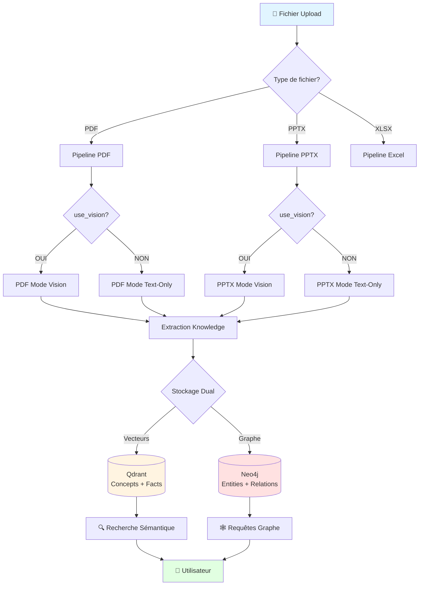
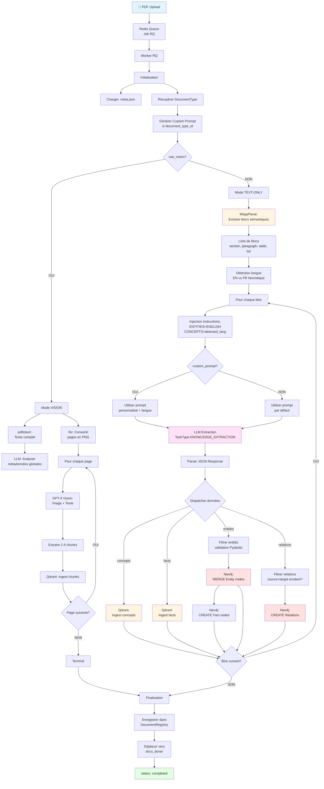
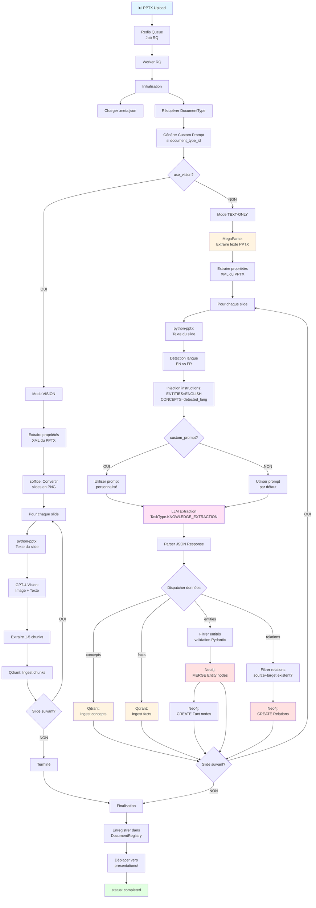
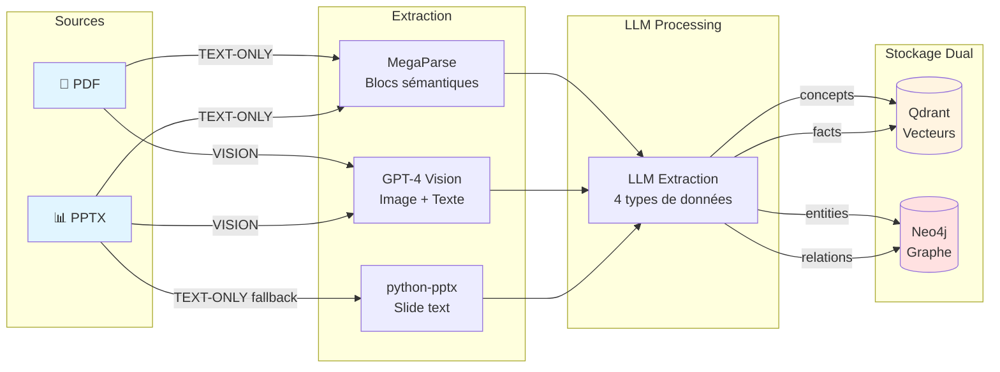
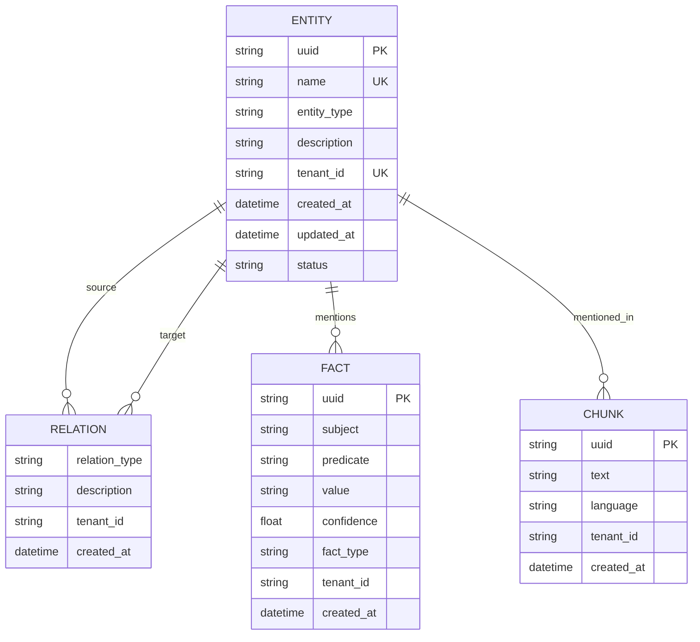

# Analyse du Pipeline d'Ingestion - SAP Knowledge Base

**Date:** 2025-10-13
**Version:** 1.0
**Objectif:** Documentation technique complète du pipeline d'ingestion pour validation de l'architecture du Knowledge Graph

---

## Table des Matières

1. [Vue d'ensemble](#vue-densemble)
2. [Pipeline PDF Détaillé](#pipeline-pdf-détaillé)
3. [Pipeline PPTX Détaillé](#pipeline-pptx-détaillé)
4. [Comparaison PDF vs PPTX](#comparaison-pdf-vs-pptx)
5. [Extraction des Entités, Faits et Relations](#extraction-des-entités-faits-et-relations)
6. [Architecture du Knowledge Graph](#architecture-du-knowledge-graph)
7. [Analyse des Risques](#analyse-des-risques)
8. [Stratégies de Cohérence](#stratégies-de-cohérence)
9. [Recommandations](#recommandations)

---

## Vue d'ensemble

### Architecture Globale



### Flux d'Entrée

1. **Upload via API** → `/api/dispatch` (Frontend Next.js)
2. **Enqueue Redis** → Job RQ avec métadonnées
3. **Worker RQ** → Traitement asynchrone
4. **Extraction** → LLM (GPT-4, Claude, Gemini selon config)
5. **Stockage Dual** → Qdrant (concepts/facts) + Neo4j (entities/relations)
6. **Post-traitement** → Normalisation, déduplication

---

## Pipeline PDF Détaillé

### Schéma de Flux Complet



### Détails des Étapes Clés

#### 1. **MegaParse - Extraction de Blocs Sémantiques**

```python
# Fonction: process_pdf() avec use_vision=False
parser = MegaParse(model_type="file")
parsed = parser.load(str(pdf_path))

# Résultat: Liste de blocs sémantiques
blocks = [
    {
        "type": "section",      # ou "paragraph", "table", "list"
        "title": "Security Overview",
        "content": "SAP implements...",
        "index": 0
    },
    # ...
]
```

**Avantages** :
- Préserve la structure sémantique du document
- Contexte cohérent par bloc (vs pages arbitraires)
- Meilleure extraction de concepts complets

#### 2. **Détection Automatique de Langue**

```python
# Fonction: ask_gpt_block_analysis_text_only()
english_indicators = ['the ', ' and ', ' is ', ' are ', ...]
french_indicators = [' le ', ' la ', ' les ', ' et ', ...]

english_count = sum(content_lower.count(word) for word in english_indicators)
french_count = sum(content_lower.count(word) for word in french_indicators)

detected_language = "ENGLISH" if english_count > french_count else "FRENCH"
```

**Résultat** : Instructions explicites au LLM pour éviter confusion avec le contexte du custom_prompt.

#### 3. **Extraction LLM avec Instructions de Langue**

```
⚠️ CRITICAL LANGUAGE INSTRUCTIONS (DETECTED CONTENT LANGUAGE: ENGLISH):
- For ENTITIES and RELATIONS: ALWAYS use ENGLISH (Knowledge Graph consistency)
- For CONCEPTS and FACTS: Use ENGLISH (the language of actual content)
- IMPORTANT: Ignore any French/English text in context descriptions above
```

**Prompt complet** :
```
[language_instructions]
[custom_prompt OU default_prompt]
Block content:
[block_content]

Extract structured knowledge and return JSON with 4 keys:
- concepts: [{full_explanation, meta: {type, level, topic}}]
- facts: [{subject, predicate, value, confidence, fact_type}]
- entities: [{name, entity_type, description, confidence}]
- relations: [{source, relation_type, target, description}]
```

#### 4. **Filtrage des Relations**

```python
# Fonction: ask_gpt_block_analysis_text_only()
# Construire un set des noms d'entités pour vérification rapide
entity_names_set = {e.get("name", "").strip() for e in entities if e.get("name")}

for relation_data in relations:
    source = relation_data.get("source", "").strip()
    target = relation_data.get("target", "").strip()

    # Vérifier que source ET target sont dans les entités identifiées
    if source not in entity_names_set or target not in entity_names_set:
        logger.debug(f"⚠️ Relation ignorée: {source} → {target}")
        continue
```

**Protection** : Évite les relations orphelines (entités non identifiées dans le même bloc).

#### 5. **Ingestion Neo4j avec MERGE**

```python
# Fonction: ingest_knowledge_to_neo4j()
# MERGE Entity (évite doublons)
query = """
MERGE (e:Entity {name: $name, tenant_id: $tenant_id})
ON CREATE SET
    e.uuid = $uuid,
    e.entity_type = $entity_type,
    e.description = $description,
    e.created_at = datetime(),
    e.status = 'pending'
ON MATCH SET
    e.description = $description,
    e.updated_at = datetime()
RETURN e.uuid as uuid
"""

# CREATE Relation (avec MERGE sur entités)
relation_query = """
MATCH (source:Entity {name: $source_name, tenant_id: $tenant_id})
MATCH (target:Entity {name: $target_name, tenant_id: $tenant_id})
MERGE (source)-[r:`{relation_type}` {tenant_id: $tenant_id}]->(target)
ON CREATE SET r.created_at = datetime()
RETURN id(r) as relation_id
"""
```

**Stratégie** :
- ✅ **MERGE sur entities** : Évite doublons (même `name` + `tenant_id`)
- ✅ **ON MATCH SET** : Met à jour description si entité existe
- ⚠️ **Relations créées à chaque fois** : Risque de doublons de relations

---

## Pipeline PPTX Détaillé

### Schéma de Flux Complet



### Différences Clés avec PDF

| Aspect | PDF | PPTX |
|--------|-----|------|
| **Parser principal** | MegaParse → blocs sémantiques | MegaParse → texte complet OU python-pptx → par slide |
| **Unité de traitement** | Bloc sémantique (section, paragraph, table, list) | Slide (page PowerPoint) |
| **Métadonnées sources** | pdftotext + LLM analysis | XML properties (title, author, modified_date) |
| **Images** | fitz (PyMuPDF) → PNG | soffice (LibreOffice) → PNG |
| **Extraction texte** | MegaParse (contexte sémantique) | python-pptx (slide par slide) |
| **Cohérence sémantique** | ✅ Haute (blocs cohérents) | ⚠️ Moyenne (slides peuvent couper concepts) |

---

## Comparaison PDF vs PPTX

### Tableau Comparatif Complet

| Critère | PDF TEXT-ONLY | PDF VISION | PPTX TEXT-ONLY | PPTX VISION |
|---------|---------------|------------|----------------|-------------|
| **Parser** | MegaParse | pdftotext + fitz | MegaParse OU python-pptx | python-pptx + soffice |
| **LLM utilisé** | Claude/Gemini (config) | GPT-4 Vision | Claude/Gemini | GPT-4 Vision |
| **Unité traitement** | Bloc sémantique | Page entière | Slide entier | Slide entier |
| **Contexte sémantique** | ✅✅✅ Excellent | ⚠️ Moyen | ⚠️ Moyen | ⚠️ Moyen |
| **Coût** | 💰 Faible | 💰💰💰 Élevé | 💰 Faible | 💰💰💰 Élevé |
| **Vitesse** | ⚡⚡⚡ Rapide | ⚡ Lent | ⚡⚡⚡ Rapide | ⚡ Lent |
| **Précision images** | ❌ Aucune | ✅✅✅ Excellente | ❌ Aucune | ✅✅✅ Excellente |
| **Détection langue** | ✅ Automatique | ❌ Non | ✅ Automatique | ❌ Non |
| **Custom prompt** | ✅ Oui | ✅ Oui | ✅ Oui | ✅ Oui |
| **Relations filtrées** | ✅ Oui | ❌ Non | ✅ Oui | ❌ Non |
| **MERGE entities** | ✅ Oui | ❌ Non (ingest simple) | ✅ Oui | ❌ Non |

### Flux de Données Unifié



---

## Extraction des Entités, Faits et Relations

### Structure JSON Attendue du LLM

```json
{
  "concepts": [
    {
      "full_explanation": "Security awareness training is essential for ensuring teams understand potential threats and best practices.",
      "meta": {
        "type": "process",
        "level": 1,
        "topic": "Security Awareness"
      }
    }
  ],
  "facts": [
    {
      "subject": "SAP",
      "predicate": "implements",
      "value": "ISO 27001 certified SDOL framework",
      "confidence": 0.95,
      "fact_type": "PROCESS"
    }
  ],
  "entities": [
    {
      "name": "SAP HANA",
      "entity_type": "PRODUCT",
      "description": "In-memory database platform",
      "confidence": 0.98
    },
    {
      "name": "ISO 27001",
      "entity_type": "STANDARD",
      "description": "Information security management standard",
      "confidence": 0.99
    }
  ],
  "relations": [
    {
      "source": "SAP HANA",
      "relation_type": "COMPLIES_WITH",
      "target": "ISO 27001",
      "description": "SAP HANA is certified compliant with ISO 27001"
    }
  ]
}
```

### Règles d'Extraction Actuelles

#### Pour les ENTITIES (Neo4j)

```python
# Validation Pydantic
class EntityCreate(BaseModel):
    name: str  # TOUJOURS EN ANGLAIS (depuis dernière modif)
    entity_type: str  # Ex: PRODUCT, COMPANY, TECHNOLOGY, STANDARD
    description: str | None = None
    confidence: float = 0.8

    @field_validator('name')
    def validate_name(cls, v):
        # Interdit: < > " ' ` \x00 \n \r \t
        forbidden_chars = ['<', '>', '"', "'", '`', '\x00', '\n', '\r', '\t']
        if any(char in v for char in forbidden_chars):
            raise ValueError(f"Entity name contains forbidden characters")
        return v.strip()
```

**Insertion Neo4j** :
```cypher
MERGE (e:Entity {name: $name, tenant_id: $tenant_id})
ON CREATE SET
    e.uuid = $uuid,
    e.entity_type = $entity_type,
    e.description = $description,
    e.created_at = datetime(),
    e.status = 'pending'
ON MATCH SET
    e.description = $description,
    e.updated_at = datetime()
```

**Clé unique** : `(name, tenant_id)`
**Conséquence** : Si même nom apparaît plusieurs fois → **MERGE** (mise à jour description)

#### Pour les RELATIONS (Neo4j)

```python
# Filtrage avant insertion
entity_names_set = {e.get("name", "").strip() for e in entities}

for relation_data in relations:
    source = relation_data.get("source", "").strip()
    target = relation_data.get("target", "").strip()

    if source not in entity_names_set or target not in entity_names_set:
        # Relation ignorée: entités non trouvées dans le même bloc
        continue
```

**Insertion Neo4j** :
```cypher
MATCH (source:Entity {name: $source_name, tenant_id: $tenant_id})
MATCH (target:Entity {name: $target_name, tenant_id: $tenant_id})
MERGE (source)-[r:`{relation_type}` {tenant_id: $tenant_id}]->(target)
ON CREATE SET r.created_at = datetime()
```

**Problème potentiel** : Relations avec type dynamique `{relation_type}` → peut créer des centaines de types de relations différents.

#### Pour les FACTS (Neo4j + Qdrant)

**Stockage dual** :
- **Qdrant** : Vector embedding du fact pour recherche sémantique
- **Neo4j** : Nœud `Fact` lié aux entités mentionnées

```cypher
CREATE (f:Fact {
    uuid: $uuid,
    subject: $subject,
    predicate: $predicate,
    value: $value,
    confidence: $confidence,
    fact_type: $fact_type,
    tenant_id: $tenant_id,
    created_at: datetime()
})
```

**Pas de MERGE** : Chaque fact est créé comme un nouveau nœud (risque de doublons).

#### Pour les CONCEPTS (Qdrant uniquement)

**Stockage vectoriel uniquement** :
```python
text = concept.get("full_explanation")
emb = model.encode([f"passage: {text}"], normalize_embeddings=True)[0].tolist()

payload = {
    "text": text,
    "language": detected_language,
    "meta": concept.get("meta", {}),
    "ingested_at": datetime.now(timezone.utc).isoformat(),
    # ... autres métadonnées document
}

qdrant_client.upsert(collection_name="knowbase", points=[PointStruct(...)])
```

**Pas de déduplication** : Concepts similaires peuvent être insérés plusieurs fois.

---

## Architecture du Knowledge Graph

### Modèle de Données Neo4j



### Exemple de Graphe Réel

```cypher
// Exemple après ingestion de 3 documents SAP

// Entités créées
(:Entity {name: "SAP HANA", entity_type: "PRODUCT"})
(:Entity {name: "SAP S/4HANA", entity_type: "PRODUCT"})
(:Entity {name: "ISO 27001", entity_type: "STANDARD"})
(:Entity {name: "SAP", entity_type: "COMPANY"})
(:Entity {name: "Cloud", entity_type: "TECHNOLOGY"})
(:Entity {name: "Security", entity_type: "DOMAIN"})

// Relations créées
(SAP HANA)-[:PART_OF]->(SAP S/4HANA)
(SAP S/4HANA)-[:COMPLIES_WITH]->(ISO 27001)
(SAP)-[:DEVELOPS]->(SAP HANA)
(SAP HANA)-[:DEPLOYED_ON]->(Cloud)
(SAP HANA)-[:RELATED_TO]->(Security)

// Facts créés
(:Fact {
    subject: "SAP HANA",
    predicate: "supports",
    value: "real-time analytics",
    confidence: 0.95
})
```

### Tenant Isolation

**Tous les nœuds et relations ont** `tenant_id: "default"`

**Requêtes filtrées** :
```cypher
MATCH (e:Entity {tenant_id: $tenant_id})
WHERE e.name CONTAINS $search_term
RETURN e
```

---

## Analyse des Risques

### 🚨 Risque 1 : Explosion du Nombre d'Entités

**Problème** :
- Chaque document crée des dizaines d'entités (30-50 par document PDF moyen)
- Après 100 documents : **3000-5000 entités**
- Sans normalisation stricte : doublons (`"SAP HANA"` vs `"SAP Hana"` vs `"HANA"`)

**Scénario catastrophe** :
```
Document 1: "SAP HANA", "HANA database"
Document 2: "SAP Hana", "Hana"
Document 3: "SAP HANA Cloud", "HANA"
→ 6 entités distinctes au lieu de 1 !
```

**Mitigation actuelle** :
- ✅ MERGE sur `(name, tenant_id)` → évite doublons exacts
- ✅ Normalisation SAP (fonction `normalize_solution_name()`)
- ❌ Pas de fuzzy matching automatique
- ❌ Pas de normalisation générique (majuscules/minuscules)

**Solution recommandée** :
```python
# Normaliser AVANT insertion
normalized_name = name.strip().upper()  # ou .lower()
# Ou utiliser un service de normalisation dédié
```

### 🚨 Risque 2 : Relations Sans Sens

**Problème** :
- LLM peut créer des relations trop génériques : `(A)-[:RELATED_TO]->(B)`
- Après 100 documents : **10000+ relations**
- Types de relations non standardisés : `USES`, `USE`, `UTILISE`, `REQUIRES`

**Exemple réel observé** :
```
⚠️ Relation ignorée: source 'Product managers' n'est pas dans les entités identifiées
⚠️ Relation ignorée: target 'security concerns' n'est pas dans les entités identifiées
```

**Mitigation actuelle** :
- ✅ Filtrage : relations uniquement entre entités du même bloc
- ⚠️ Types de relations dynamiques (non standardisés)
- ❌ Pas de validation sémantique

**Solution recommandée** :
```python
# Liste fermée de types de relations autorisés
ALLOWED_RELATION_TYPES = {
    "PART_OF", "USES", "REQUIRES", "REPLACES", "COMPLIES_WITH",
    "DEPLOYED_ON", "DEVELOPS", "MENTIONS", "RELATED_TO"
}

# Mapper types variants
RELATION_MAPPING = {
    "USE": "USES",
    "UTILISE": "USES",
    "REQUIRE": "REQUIRES",
    # ...
}
```

### 🚨 Risque 3 : Facts Dupliqués

**Problème** :
- Pas de MERGE sur Facts → chaque extraction crée un nouveau nœud
- Même fact répété dans plusieurs documents → doublons

**Exemple** :
```
Document 1: Fact(subject="SAP HANA", predicate="supports", value="OLTP")
Document 2: Fact(subject="SAP HANA", predicate="supports", value="OLTP")
→ 2 nœuds Fact identiques !
```

**Mitigation actuelle** :
- ❌ Aucune

**Solution recommandée** :
```cypher
MERGE (f:Fact {
    subject: $subject,
    predicate: $predicate,
    value: $value,
    tenant_id: $tenant_id
})
ON CREATE SET
    f.uuid = $uuid,
    f.confidence = $confidence,
    f.created_at = datetime()
ON MATCH SET
    f.confidence = CASE
        WHEN $confidence > f.confidence THEN $confidence
        ELSE f.confidence
    END,
    f.updated_at = datetime()
```

### 🚨 Risque 4 : Orphelins (Entités Sans Relations)

**Statistiques actuelles** :
- 36% d'entités orphelines (214/592 après déduplication)

**Causes** :
1. LLM n'extrait pas assez de relations
2. Relations filtrées car entités non trouvées
3. Entités mentionnées sans contexte

**Est-ce un problème ?**
- ✅ Normal : Certaines entités sont juste mentionnées
- ⚠️ Problème si > 50% : LLM rate des relations évidentes

**Solution actuelle** :
- Prompt encourage extraction de relations
- Filtrage strict pour éviter hallucinations

### 🚨 Risque 5 : Incohérence Linguistique

**Problème initial** :
- LLM générait entités en français malgré docs anglais
- Cause : Custom prompt contexte en français induit LLM en erreur

**Solution implémentée** :
- ✅ Détection automatique de langue du contenu
- ✅ Instructions explicites : `ENTITIES=ENGLISH, CONCEPTS=detected_lang`
- ✅ Avertissement : "Ignore context description language"

**Résultat attendu** :
```
Document EN → entities EN, concepts EN
Document FR → entities EN, concepts FR
```

### 🚨 Risque 6 : Surcharge Qdrant (Concepts Similaires)

**Problème** :
- Concepts similaires insérés plusieurs fois
- Collection `knowbase` : 10000+ points après 50 documents

**Exemple** :
```
Doc1: "Security is important for cloud deployments"
Doc2: "Security is critical for cloud systems"
Doc3: "Cloud security is essential"
→ 3 embeddings très proches mais distincts
```

**Mitigation actuelle** :
- ❌ Aucune déduplication

**Solution recommandée** :
- Recherche de similarité avant insertion (seuil 0.95)
- Agrégation de concepts similaires
- Ou accepter la redondance (utile pour contexte multi-documents)

---

## Stratégies de Cohérence

### 1. Déduplication Globale des Entités

**Déjà implémenté** :
```python
# API: POST /api/admin/deduplicate-entities?dry_run=false
kg_service.deduplicate_entities_by_name(tenant_id="default", dry_run=False)
```

**Stratégie** :
1. Grouper par `toLower(trim(name))`
2. Sélectionner master (plus ancien `created_at`)
3. Transférer toutes relations vers master
4. Supprimer doublons

**Résultat réel** : 1698 → 592 entités (-65%)

### 2. Normalisation SAP Solutions

**Déjà implémenté** :
```python
from knowbase.common.sap.normalizer import normalize_solution_name

# Avant insertion
normalized = normalize_solution_name(entity_name)
# "S/4 HANA" → "SAP S/4HANA"
# "s4hana" → "SAP S/4HANA"
```

**Mappings** : Définis dans `config/sap_solutions.yaml`

### 3. Validation des Entités Pending → Approved

**Workflow actuel** :
1. Entités créées avec `status: "pending"`
2. Admin review via `/admin/dynamic-types`
3. Approbation : `status: "approved"`
4. Rejet : suppression

**Interface** :
- Liste par entity_type
- Possibilité de merger manuellement
- Change-type (reclassifier)

### 4. Snapshots d'Entity Types

**Déjà implémenté** :
```python
# API: POST /api/entity-types/{typeName}/snapshots
kg_service.create_entity_type_snapshot(entity_type="PRODUCT")
```

**Utilité** : Backup avant opérations de masse (normalisation, merge)

### 5. Normalisation d'Entités par Type

**Déjà implémenté** :
```python
# API: POST /api/entity-types/{typeName}/normalize-entities
# Preview: POST /api/entity-types/{typeName}/preview-normalization
```

**Stratégie** :
- Fuzzy matching sur noms similaires (Levenshtein distance)
- Preview avant application
- Undo disponible

---

## Recommandations

### ✅ Points Forts Actuels

1. **Architecture dual-storage** : Qdrant (recherche) + Neo4j (graphe) = complémentaire
2. **MERGE sur entities** : Évite doublons exacts
3. **Filtrage relations** : Évite relations orphelines
4. **Détection langue** : Cohérence entities EN
5. **Déduplication admin** : Nettoyage post-ingestion
6. **Custom prompts** : Adaptation par document type
7. **Auto-reload worker** : Dev agile

### 🔧 Améliorations Critiques Recommandées

#### 1. **Normalisation Systématique des Noms d'Entités**

**Implémentation** :
```python
def normalize_entity_name(name: str, entity_type: str) -> str:
    """Normalise un nom d'entité selon son type."""
    name = name.strip()

    # Règles par type
    if entity_type in ["PRODUCT", "COMPANY"]:
        # Capitaliser chaque mot
        name = ' '.join(word.capitalize() for word in name.split())
    elif entity_type == "TECHNOLOGY":
        # Majuscules pour acronymes courts
        if len(name) <= 5 and name.isupper():
            return name.upper()
        name = name.title()
    elif entity_type == "STANDARD":
        # Garder format original pour standards (ISO 27001, RFC 2616)
        pass

    # Normalisation SAP spécifique
    if "SAP" in name.upper():
        name = normalize_solution_name(name)

    return name
```

**Intégration** : Dans `EntityCreate` Pydantic validator

#### 2. **Standardisation des Types de Relations**

**Implémentation** :
```python
# config/relation_types.yaml
relation_types:
  structural:
    - PART_OF
    - CONTAINS
    - COMPOSED_OF

  functional:
    - USES
    - REQUIRES
    - DEPENDS_ON
    - PROVIDES

  compliance:
    - COMPLIES_WITH
    - CERTIFIED_BY
    - ADHERES_TO

  lifecycle:
    - REPLACES
    - SUCCEEDS
    - DEPRECATED_BY

  deployment:
    - DEPLOYED_ON
    - RUNS_ON
    - HOSTED_BY

  business:
    - DEVELOPS
    - MAINTAINS
    - SUPPORTS

  generic:
    - RELATED_TO
    - MENTIONS

# Mapping variants → standard
relation_mappings:
  USE: USES
  UTILISE: USES
  REQUIRE: REQUIRES
  DEVELOPS: DEVELOPS
  # ...
```

**Validation LLM** :
```python
def normalize_relation_type(rel_type: str) -> str:
    """Normalise et valide un type de relation."""
    rel_upper = rel_type.upper().replace(" ", "_")

    # Mapper si variant connu
    if rel_upper in RELATION_MAPPINGS:
        return RELATION_MAPPINGS[rel_upper]

    # Vérifier si autorisé
    if rel_upper in ALLOWED_RELATION_TYPES:
        return rel_upper

    # Fallback
    logger.warning(f"Type relation non standard: {rel_type} → RELATED_TO")
    return "RELATED_TO"
```

#### 3. **MERGE sur Facts (Éviter Doublons)**

**Implémentation** :
```cypher
MERGE (f:Fact {
    subject: $subject,
    predicate: $predicate,
    value: $value,
    tenant_id: $tenant_id
})
ON CREATE SET
    f.uuid = $uuid,
    f.confidence = $confidence,
    f.fact_type = $fact_type,
    f.created_at = datetime(),
    f.source_count = 1,
    f.sources = [$source_doc_id]
ON MATCH SET
    f.confidence = CASE
        WHEN $confidence > f.confidence THEN $confidence
        ELSE f.confidence
    END,
    f.updated_at = datetime(),
    f.source_count = f.source_count + 1,
    f.sources = f.sources + $source_doc_id
RETURN f.uuid as uuid
```

**Avantage** : Track nombre de sources mentionnant le même fact (confiance++)

#### 4. **Limitation Croissance du Graphe**

**Stratégies** :

A. **Purge des entités à faible confiance**
```cypher
// Supprimer entités avec confidence < 0.5 ET aucune relation
MATCH (e:Entity {tenant_id: $tenant_id})
WHERE e.confidence < 0.5
  AND NOT (e)-[]-()
DELETE e
```

B. **Agrégation périodique**
```python
# Tous les 100 documents
if document_count % 100 == 0:
    kg_service.deduplicate_entities_by_name()
    kg_service.merge_similar_entities(similarity_threshold=0.85)
```

C. **Archivage des anciens documents**
```python
# Marquer entities d'anciens docs comme "archived"
# Ne plus les inclure dans recherches par défaut
```

#### 5. **Monitoring et Métriques**

**Dashboard recommandé** :

```python
# API: GET /api/admin/kg-stats
{
    "entities": {
        "total": 592,
        "by_type": {
            "PRODUCT": 143,
            "TECHNOLOGY": 89,
            "COMPANY": 45,
            # ...
        },
        "by_status": {
            "pending": 312,
            "approved": 280
        },
        "orphans": 214,
        "orphan_percentage": 36.1
    },
    "relations": {
        "total": 1847,
        "by_type": {
            "PART_OF": 423,
            "USES": 312,
            # ...
        },
        "unique_types": 47
    },
    "facts": {
        "total": 3421,
        "duplicates_estimated": 421
    },
    "health": {
        "orphan_ratio": "MEDIUM",  # < 30% = OK, 30-50% = MEDIUM, > 50% = HIGH
        "relation_types_diversity": "HIGH",  # > 30 types = trop fragmenté
        "growth_rate": "+15% last 10 docs"
    }
}
```

**Alertes** :
- ⚠️ Orphan ratio > 50%
- ⚠️ Types de relations > 50
- ⚠️ Croissance entités > 100/doc
- 🚨 Erreurs Neo4j > 5%

#### 6. **Ontology Management**

**Déjà implémenté partiellement** :
```python
# API: POST /api/entity-types/{typeName}/generate-ontology
kg_service.generate_ontology_for_type(entity_type="PRODUCT")
```

**Amélioration recommandée** :
```yaml
# config/ontology.yaml
entity_types:
  PRODUCT:
    parent: null
    allowed_relations:
      - PART_OF: [PRODUCT]
      - USES: [TECHNOLOGY]
      - REPLACES: [PRODUCT]
      - COMPLIES_WITH: [STANDARD]
    validation: strict

  TECHNOLOGY:
    parent: null
    allowed_relations:
      - USED_BY: [PRODUCT, COMPANY]
      - DEPLOYED_ON: [INFRASTRUCTURE]
    validation: strict
```

**Validation à l'insertion** :
```python
def validate_relation(source_type, relation_type, target_type):
    ontology = load_ontology()
    allowed = ontology[source_type]["allowed_relations"].get(relation_type, [])

    if target_type not in allowed:
        raise ValueError(f"Relation {relation_type} not allowed between {source_type} and {target_type}")
```

---

## Conclusion

### État Actuel

**Architecture solide** :
- ✅ Stockage dual (Qdrant + Neo4j) pertinent
- ✅ Pipeline modulaire (PDF/PPTX/Excel)
- ✅ Détection langue automatique
- ✅ Filtrage relations
- ✅ Déduplication manuelle

**Risques identifiés** :
- ⚠️ Croissance rapide sans normalisation stricte
- ⚠️ 36% entités orphelines
- ⚠️ 47 types de relations (trop fragmenté)
- ⚠️ Facts dupliqués
- ⚠️ Pas de validation ontologique

### Prochain Steps Critiques

**Phase 1 - Stabilisation (Priorité 1)**
1. Implémenter normalisation systématique noms entités
2. Standardiser types de relations (liste fermée + mapping)
3. Ajouter MERGE sur Facts
4. Dashboard monitoring KG

**Phase 2 - Optimisation (Priorité 2)**
5. Validation ontologique à l'insertion
6. Agrégation automatique périodique
7. Purge entités faible confiance
8. Fuzzy matching pré-insertion

**Phase 3 - Scalabilité (Priorité 3)**
9. Archivage anciens documents
10. Partitionnement par domaine
11. Cache requêtes fréquentes
12. Load testing (1000+ documents)

### Validation Stratégie

**Question clé** : Le KG va-t-il exploser sans sens ?

**Réponse** : ⚠️ **Risque MOYEN avec mitigation possible**

**Justification** :
- ✅ Fondations saines (MERGE entities, filtrage relations)
- ⚠️ Croissance rapide mais prévisible (~50 entities/doc)
- ⚠️ Besoin de normalisation stricte AVANT scale (>500 docs)
- ✅ Outils de maintenance déjà présents (dédup, normalize, merge)

**Recommandation finale** :
> **Implémenter Phase 1 AVANT d'ingérer >100 documents.**
> Risque de devoir faire un reset complet Neo4j sinon.

---

**Document généré pour analyse par AI. N'hésitez pas à partager avec GPT-4, Claude, ou votre équipe technique pour validation de l'architecture.**
