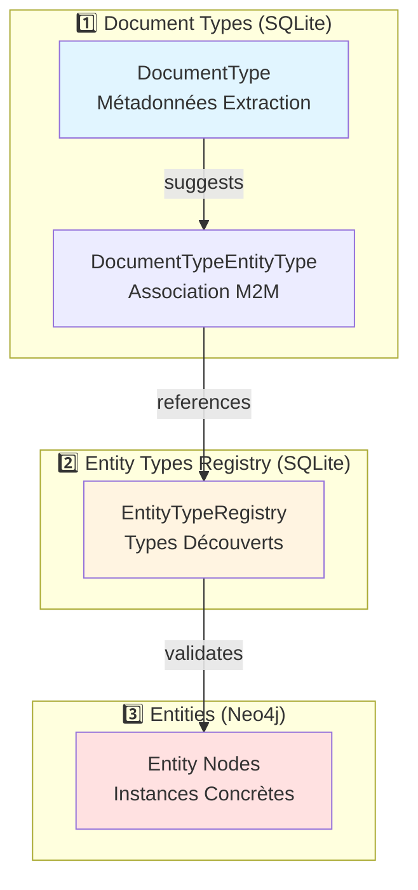
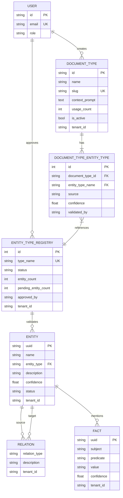
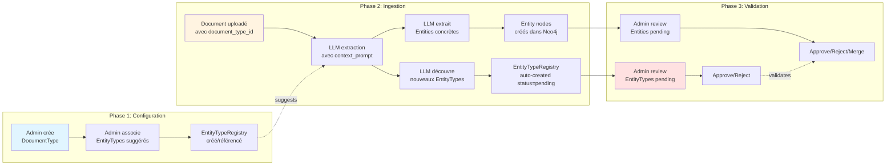
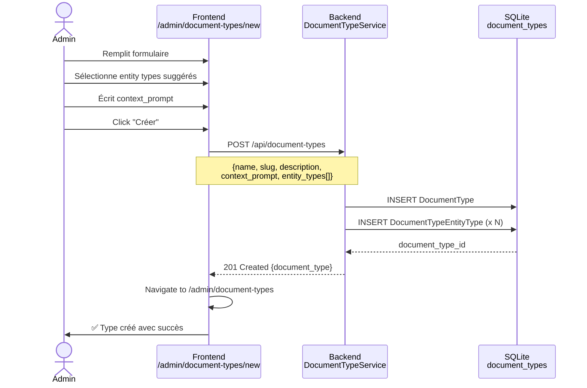
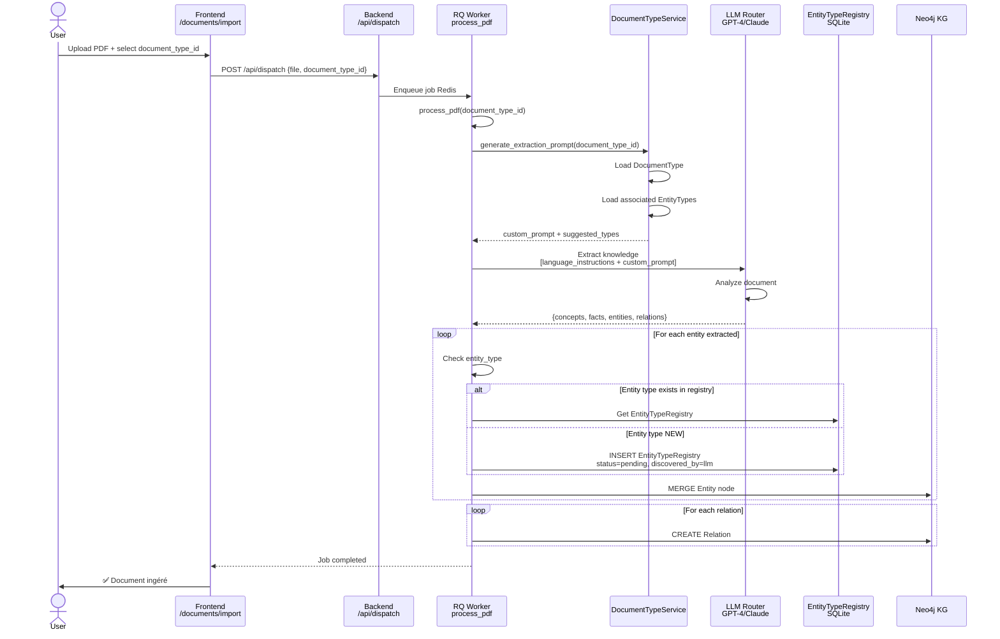
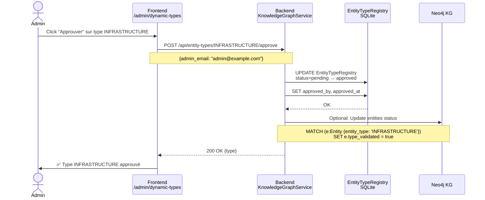
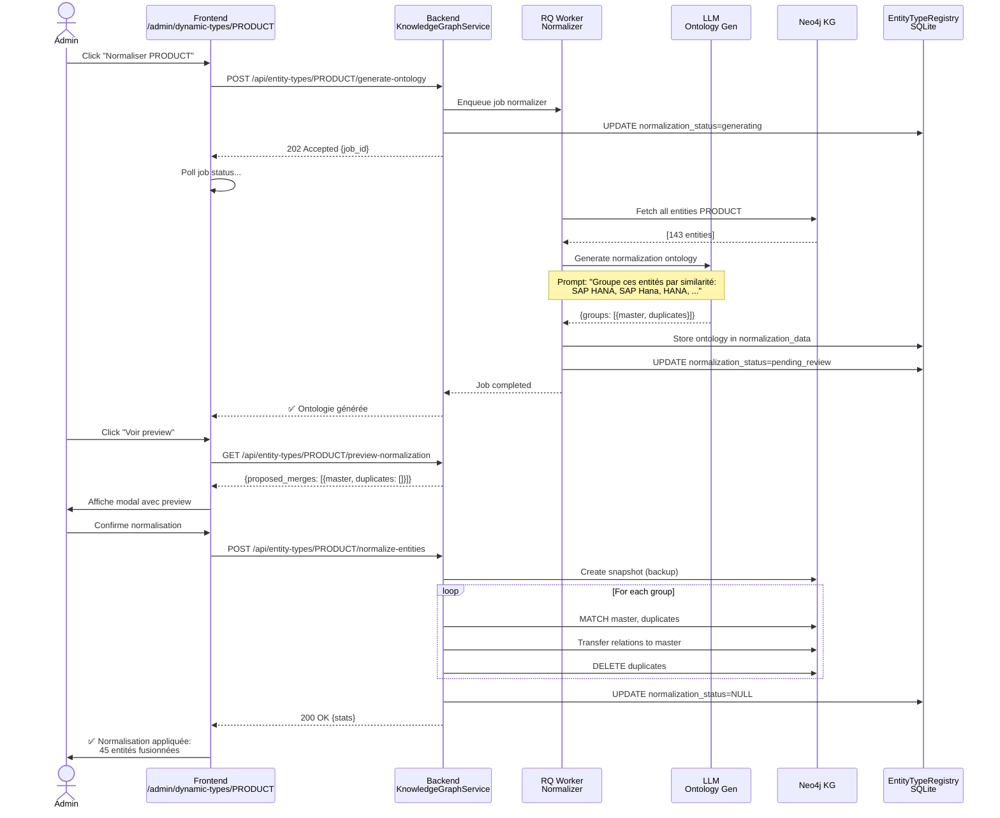
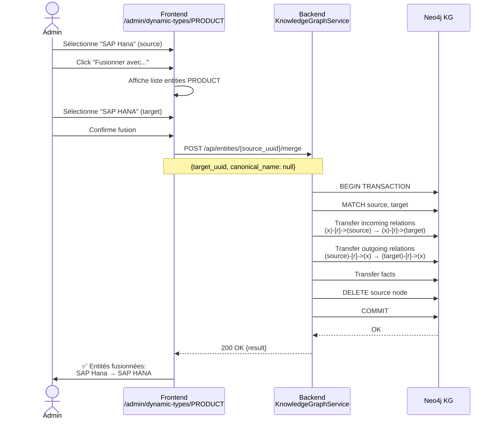

# Architecture de Gestion des Types - SAP Knowledge Base

**Date:** 2025-10-13
**Version:** 1.0
**Objectif:** Documentation complète de la gestion DocumentTypes/EntityTypes/Entities pour analyse et refonte architecture

---

## Table des Matières

1. [Vue d'Ensemble](#vue-densemble)
2. [Modèles de Données](#modèles-de-données)
3. [Relations et Dépendances](#relations-et-dépendances)
4. [Services Backend](#services-backend)
5. [Pages Frontend](#pages-frontend)
6. [Flux de Données Complets](#flux-de-données-complets)
7. [Problèmes et Incohérences](#problèmes-et-incohérences)
8. [Recommandations Architecture](#recommandations-architecture)

---

## Vue d'Ensemble

### Les 3 Concepts Fondamentaux



### Hiérarchie Conceptuelle

```
DocumentType (ex: "Technical Documentation")
    ↓ suggests
DocumentTypeEntityType (ex: PRODUCT, TECHNOLOGY, INFRASTRUCTURE)
    ↓ references
EntityTypeRegistry (ex: PRODUCT avec status=approved)
    ↓ validates
Entity (ex: "SAP HANA", "SAP S/4HANA", "Cloud Platform")
```

**Analogie** :
- **DocumentType** = "Modèle de document" (comme un template Word)
- **EntityTypeRegistry** = "Dictionnaire de types autorisés" (ontologie)
- **Entity** = "Données réelles" (instances concrètes)

---

## Modèles de Données

### 1. DocumentType (SQLite)

**Fichier** : `src/knowbase/db/models.py` (lignes 220-334)

```python
class DocumentType(Base):
    """
    Types de documents pour guider l'extraction d'entités.

    Permet de définir des contextes métier (technique, marketing, produit...)
    avec types d'entités suggérés pour améliorer la précision du LLM.
    """
    __tablename__ = "document_types"

    # Primary key
    id = Column(String(36), primary_key=True, default=uuid.uuid4)

    # Informations de base
    name = Column(String(100), nullable=False)  # Ex: "Technical Documentation"
    slug = Column(String(50), nullable=False, unique=True)  # Ex: "technical"
    description = Column(Text, nullable=True)

    # Prompt contextuel pour guider le LLM
    context_prompt = Column(Text, nullable=True)
    prompt_config = Column(Text, nullable=True)  # JSON config

    # Statistiques
    usage_count = Column(Integer, default=0)  # Nombre de documents importés

    # État
    is_active = Column(Boolean, default=True)

    # Multi-tenancy
    tenant_id = Column(String(50), default="default")

    # Timestamps
    created_at = Column(DateTime(timezone=True), default=datetime.now(timezone.utc))
    updated_at = Column(DateTime(timezone=True), onupdate=datetime.now(timezone.utc))

    # Relations
    entity_type_associations = relationship(
        "DocumentTypeEntityType",
        back_populates="document_type",
        cascade="all, delete-orphan"
    )
```

**Clé Unique** : `(slug, tenant_id)`

**Rôle** :
- Définir des "profils d'extraction" pour différents types de documents
- Générer des prompts contextualisés pour le LLM
- Suggérer quels types d'entités chercher
- Tracker combien de documents ont été traités avec ce type

**Exemple de données** :
```json
{
  "id": "a1b2c3d4-...",
  "name": "Technical Documentation",
  "slug": "technical",
  "description": "Documentation technique d'architecture système",
  "context_prompt": "Ce document présente des infrastructures cloud et des modèles de déploiement...",
  "usage_count": 42,
  "is_active": true
}
```

---

### 2. DocumentTypeEntityType (SQLite - Table Association)

**Fichier** : `src/knowbase/db/models.py` (lignes 336-446)

```python
class DocumentTypeEntityType(Base):
    """
    Association entre DocumentType et EntityType (many-to-many).

    Indique quels types d'entités sont suggérés pour un type de document,
    avec métadonnées sur la source et validation.
    """
    __tablename__ = "document_type_entity_types"

    # Primary key composite
    id = Column(Integer, primary_key=True, autoincrement=True)

    # Foreign keys
    document_type_id = Column(String(36), ForeignKey("document_types.id", ondelete="CASCADE"))
    entity_type_name = Column(String(50), nullable=False)  # Ex: "PRODUCT", "TECHNOLOGY"

    # Métadonnées
    source = Column(String(20), default="manual")  # manual | llm_discovered | template
    confidence = Column(Float, nullable=True)  # 0.0-1.0 si découvert par LLM

    # Validation
    validated_by = Column(String(100), nullable=True)
    validated_at = Column(DateTime(timezone=True), nullable=True)

    # Metadata additionnelle
    examples = Column(Text, nullable=True)  # JSON array d'exemples

    # Multi-tenancy
    tenant_id = Column(String(50), default="default")

    # Timestamps
    created_at = Column(DateTime(timezone=True), default=datetime.now(timezone.utc))
    updated_at = Column(DateTime(timezone=True), onupdate=datetime.now(timezone.utc))

    # Relations
    document_type = relationship("DocumentType", back_populates="entity_type_associations")
```

**Clé Unique** : `(document_type_id, entity_type_name)`

**Rôle** :
- Lier DocumentType → EntityType (M2M)
- Tracker la source (manuel vs découvert par LLM)
- Stocker des exemples d'entités pour ce type
- Validation admin

**Exemple de données** :
```json
{
  "id": 1,
  "document_type_id": "a1b2c3d4-...",
  "entity_type_name": "PRODUCT",
  "source": "manual",
  "confidence": null,
  "validated_by": "admin@example.com",
  "validated_at": "2025-10-12T10:30:00Z",
  "examples": "[\"SAP HANA\", \"SAP S/4HANA\", \"SAP BTP\"]"
}
```

---

### 3. EntityTypeRegistry (SQLite)

**Fichier** : `src/knowbase/db/models.py` (lignes 20-218)

```python
class EntityTypeRegistry(Base):
    """
    Registry des types d'entités découverts dynamiquement.

    Stocke tous les entity_types créés par le système (LLM ou admin),
    avec leur statut de validation et métadonnées.

    Workflow:
    1. LLM découvre nouveau type (ex: INFRASTRUCTURE) → créé avec status=pending
    2. Admin review → approve (status=approved) ou reject (status=rejected + cascade delete)
    3. Types approved deviennent "officiels" dans le système
    """
    __tablename__ = "entity_types_registry"

    # Primary key
    id = Column(Integer, primary_key=True, index=True, autoincrement=True)

    # Type info
    type_name = Column(String(50), nullable=False, index=True)  # UPPERCASE

    status = Column(String(20), default="pending", index=True)  # pending | approved | rejected

    # Metadata découverte
    first_seen = Column(DateTime(timezone=True), default=datetime.now(timezone.utc))
    discovered_by = Column(String(20), default="llm")  # llm | admin | system

    # Compteurs (mis à jour périodiquement)
    entity_count = Column(Integer, default=0)  # Total dans Neo4j
    pending_entity_count = Column(Integer, default=0)

    # Validation admin
    approved_by = Column(String(100), nullable=True)
    approved_at = Column(DateTime(timezone=True), nullable=True)
    rejected_by = Column(String(100), nullable=True)
    rejected_at = Column(DateTime(timezone=True), nullable=True)
    rejection_reason = Column(Text, nullable=True)

    # Multi-tenancy
    tenant_id = Column(String(50), default="default", index=True)

    # Metadata description (optionnel)
    description = Column(Text, nullable=True)

    # Normalisation workflow (Phase 5B)
    normalization_status = Column(String(20), nullable=True)  # generating | pending_review | NULL
    normalization_job_id = Column(String(50), nullable=True)
    normalization_started_at = Column(DateTime(timezone=True), nullable=True)

    # Timestamps
    created_at = Column(DateTime(timezone=True), default=datetime.now(timezone.utc))
    updated_at = Column(DateTime(timezone=True), onupdate=datetime.now(timezone.utc))
```

**Clé Unique** : `(type_name, tenant_id)`

**Rôle** :
- **Registre central** de tous les types d'entités découverts
- **Workflow de validation** : pending → approved/rejected
- **Compteurs** : combien d'entités de ce type dans Neo4j
- **Normalisation** : tracking des jobs de normalisation

**Exemple de données** :
```json
{
  "id": 1,
  "type_name": "PRODUCT",
  "status": "approved",
  "first_seen": "2025-09-15T08:00:00Z",
  "discovered_by": "llm",
  "entity_count": 143,
  "pending_entity_count": 23,
  "approved_by": "admin@example.com",
  "approved_at": "2025-09-15T09:30:00Z",
  "description": "SAP products and solutions"
}
```

---

### 4. Entity (Neo4j)

**Emplacement** : Nœuds Neo4j (pas de modèle SQLAlchemy)

**Schéma Cypher** :
```cypher
CREATE (e:Entity {
    uuid: '...',              // UUID unique
    name: 'SAP HANA',         // Nom de l'entité (ENGLISH)
    entity_type: 'PRODUCT',   // Référence vers EntityTypeRegistry
    description: '...',       // Description détaillée
    confidence: 0.95,         // Score confiance LLM (0.0-1.0)
    status: 'pending',        // pending | approved | rejected
    tenant_id: 'default',     // Isolation multi-tenant
    created_at: datetime(),
    updated_at: datetime()
})
```

**Rôle** :
- **Instance concrète** d'un EntityType
- Stockage dans **Knowledge Graph** (Neo4j)
- Liées par **Relations** vers d'autres entities
- Validation manuelle : pending → approved

**Exemple de données** :
```json
{
  "uuid": "e1234567-...",
  "name": "SAP HANA",
  "entity_type": "PRODUCT",
  "description": "In-memory database platform",
  "confidence": 0.98,
  "status": "pending",
  "tenant_id": "default",
  "created_at": "2025-10-12T14:23:45Z"
}
```

**Requête Neo4j typique** :
```cypher
MATCH (e:Entity {entity_type: 'PRODUCT', tenant_id: 'default'})
WHERE e.status = 'pending'
RETURN e
ORDER BY e.created_at DESC
LIMIT 50
```

---

## Relations et Dépendances

### Diagramme de Relations Complet



### Flux de Dépendances



### Cardinalités

| Relation | Type | Description |
|----------|------|-------------|
| **User → DocumentType** | 1:N | Un admin crée plusieurs document types |
| **DocumentType → DocumentTypeEntityType** | 1:N | Un document type suggère plusieurs entity types |
| **DocumentTypeEntityType → EntityTypeRegistry** | N:1 | Plusieurs associations référencent un même entity type |
| **EntityTypeRegistry → Entity (Neo4j)** | 1:N | Un entity type regroupe plusieurs entities concrètes |
| **Entity → Relation → Entity** | N:M | Entities liées par relations (graphe) |

---

## Services Backend

### DocumentTypeService

**Fichier** : `src/knowbase/api/services/document_type_service.py`

**Fonctions principales** :

```python
class DocumentTypeService:
    def __init__(self, db: Session, qdrant_client):
        self.db = db
        self.qdrant_client = qdrant_client

    # CRUD Operations
    def create_document_type(
        self,
        name: str,
        slug: str,
        description: str | None,
        context_prompt: str | None,
        entity_types: list[str],
        tenant_id: str = "default"
    ) -> DocumentType:
        """Crée un nouveau document type avec entity types associés."""

    def get_document_type(self, document_type_id: str) -> DocumentType | None:
        """Récupère un document type par ID."""

    def list_document_types(
        self,
        tenant_id: str = "default",
        is_active: bool | None = None
    ) -> list[dict]:
        """Liste tous les document types avec leurs entity types."""

    def update_document_type(
        self,
        document_type_id: str,
        name: str | None,
        description: str | None,
        context_prompt: str | None,
        entity_types: list[str] | None,
        is_active: bool | None
    ) -> DocumentType:
        """Met à jour un document type."""

    def delete_document_type(self, document_type_id: str) -> None:
        """Supprime un document type (cascade sur associations)."""

    # Prompt Generation
    def generate_extraction_prompt(
        self,
        document_type_id: str,
        base_content: str
    ) -> str:
        """
        Génère un prompt contextualisé pour l'extraction.

        Injecte le context_prompt du document type + liste des entity types suggérés.
        """

    # Analytics
    def get_document_type_stats(self, document_type_id: str) -> dict:
        """Statistiques d'utilisation d'un document type."""
```

**Endpoints API** :
- `GET /api/document-types` → Liste
- `POST /api/document-types` → Créer
- `GET /api/document-types/{id}` → Détail
- `PUT /api/document-types/{id}` → Modifier
- `DELETE /api/document-types/{id}` → Supprimer

---

### KnowledgeGraphService

**Fichier** : `src/knowbase/api/services/knowledge_graph_service.py`

**Fonctions liées aux EntityTypes et Entities** :

```python
class KnowledgeGraphService:
    def __init__(self, neo4j_driver, tenant_id: str = "default"):
        self.driver = neo4j_driver
        self.tenant_id = tenant_id

    # EntityType Registry Operations
    def create_or_update_entity_type(
        self,
        type_name: str,
        discovered_by: str = "llm",
        description: str | None = None
    ) -> dict:
        """Crée ou met à jour un entity type dans le registry."""

    def get_entity_types(
        self,
        status: str | None = None,
        include_counts: bool = True
    ) -> list[dict]:
        """Liste tous les entity types avec compteurs Neo4j."""

    def approve_entity_type(
        self,
        type_name: str,
        admin_email: str
    ) -> dict:
        """Approuve un entity type."""

    def reject_entity_type(
        self,
        type_name: str,
        admin_email: str,
        reason: str | None = None
    ) -> dict:
        """Rejette un entity type (cascade delete entities Neo4j)."""

    # Entity Operations (Neo4j)
    def get_entities_by_type(
        self,
        entity_type: str,
        status: str | None = None,
        limit: int = 100
    ) -> list[dict]:
        """Liste entities Neo4j d'un type donné."""

    def approve_entity(
        self,
        entity_uuid: str,
        admin_email: str
    ) -> dict:
        """Approuve une entity (status: pending → approved)."""

    def merge_entities(
        self,
        source_uuid: str,
        target_uuid: str,
        canonical_name: str | None = None
    ) -> dict:
        """
        Fusionne 2 entities:
        1. Transfert toutes relations de source vers target
        2. Supprime source
        3. Optionnellement renomme target
        """

    def change_entity_type(
        self,
        entity_uuid: str,
        new_entity_type: str
    ) -> dict:
        """Change le type d'une entity."""

    def bulk_change_entity_type(
        self,
        entity_uuids: list[str],
        new_entity_type: str
    ) -> dict:
        """Change le type de plusieurs entities en batch."""

    # Deduplication
    def deduplicate_entities_by_name(
        self,
        tenant_id: str,
        dry_run: bool = False
    ) -> dict:
        """
        Déduplique entities par nom (case-insensitive).
        Fusionne toutes vers la plus ancienne.
        """

    # Normalization (Phase 5B)
    def generate_ontology_for_type(
        self,
        entity_type: str
    ) -> dict:
        """Génère ontologie de normalisation pour un entity type."""

    def preview_normalization(
        self,
        entity_type: str
    ) -> dict:
        """Preview des fusions proposées par normalisation."""

    def apply_normalization(
        self,
        entity_type: str
    ) -> dict:
        """Applique la normalisation (fusions effectives)."""

    def undo_normalization(
        self,
        entity_type: str,
        snapshot_id: str
    ) -> dict:
        """Annule normalisation (restaure snapshot)."""

    # Snapshots
    def create_entity_type_snapshot(
        self,
        entity_type: str
    ) -> dict:
        """Crée snapshot (backup) avant opérations risquées."""

    def list_snapshots(
        self,
        entity_type: str
    ) -> list[dict]:
        """Liste snapshots disponibles pour un entity type."""
```

**Endpoints API** :
- `GET /api/entity-types` → Liste registry
- `POST /api/entity-types/{typeName}/approve` → Approuver type
- `POST /api/entity-types/{typeName}/reject` → Rejeter type
- `GET /api/entity-types/{typeName}/entities` → Entities d'un type
- `POST /api/entities/{uuid}/approve` → Approuver entity
- `POST /api/entities/{uuid}/merge` → Fusionner entities
- `POST /api/entities/{uuid}/change-type` → Changer type
- `POST /api/admin/deduplicate-entities` → Déduplication globale
- `POST /api/entity-types/{typeName}/normalize-entities` → Normalisation
- `POST /api/entity-types/{typeName}/snapshots` → Créer snapshot

---

## Pages Frontend

### Hiérarchie des Pages Admin

```
/admin
├── /document-types                      # Gestion Document Types
│   ├── page.tsx                        # Liste document types
│   ├── /new/page.tsx                   # Créer document type
│   └── /[id]/page.tsx                  # Éditer document type
│
└── /dynamic-types                       # Gestion Entity Types & Entities
    ├── page.tsx                        # Vue globale entity types
    └── /[typeName]/page.tsx            # Drill-down sur un entity type
```

---

### 1. `/admin/document-types` - Liste Document Types

**Fichier** : `frontend/src/app/admin/document-types/page.tsx`

**Capture d'écran conceptuelle** :
```
┌─────────────────────────────────────────────────────────────┐
│ Types de Documents                     [+ Nouveau Type]      │
├─────────────────────────────────────────────────────────────┤
│                                                               │
│  Nom                 Slug      Entity Types  Usage  Actif    │
│  ──────────────────────────────────────────────────────────  │
│  Technical Documentation                                      │
│    technical         3 types   42 docs      ✓               │
│                      [Voir] [Éditer] [Supprimer]             │
│                                                               │
│  Marketing Material                                           │
│    marketing         2 types   15 docs      ✓               │
│                      [Voir] [Éditer] [Supprimer]             │
│                                                               │
│  Product Roadmap                                              │
│    product-roadmap   4 types   8 docs       ✗ (Archivé)     │
│                      [Voir] [Éditer] [Supprimer]             │
│                                                               │
└─────────────────────────────────────────────────────────────┘
```

**Fonctionnalités** :
- ✅ Liste tous les document types
- ✅ Affiche nombre d'entity types associés
- ✅ Affiche usage (nombre de documents importés)
- ✅ Badge actif/archivé
- ✅ Actions : Voir détail, Éditer, Supprimer
- ✅ Navigation vers création nouveau type

**Composants** :
```tsx
interface DocumentType {
  id: string
  name: string
  slug: string
  description: string
  context_prompt: string
  is_active: boolean
  usage_count: number
  entity_type_count: number
  suggested_entity_types: string[]
  created_at: string
  updated_at: string
}

// Requête API
const { data } = useQuery({
  queryKey: ['document-types'],
  queryFn: async () => {
    const response = await apiClient.get('/document-types')
    return response.data
  },
})

// Affichage Table Chakra UI
<Table variant="simple">
  <Thead>
    <Tr>
      <Th>Nom</Th>
      <Th>Slug</Th>
      <Th>Entity Types</Th>
      <Th>Usage</Th>
      <Th>Statut</Th>
      <Th>Actions</Th>
    </Tr>
  </Thead>
  <Tbody>
    {documentTypes.map(dt => (
      <Tr key={dt.id}>
        <Td>{dt.name}</Td>
        <Td><Code>{dt.slug}</Code></Td>
        <Td>
          <Badge>{dt.entity_type_count} types</Badge>
          <Text fontSize="xs">{dt.suggested_entity_types.join(', ')}</Text>
        </Td>
        <Td>{dt.usage_count} docs</Td>
        <Td>
          <Badge colorScheme={dt.is_active ? 'green' : 'gray'}>
            {dt.is_active ? 'Actif' : 'Archivé'}
          </Badge>
        </Td>
        <Td>
          <IconButton icon={<ViewIcon />} onClick={() => router.push(`/admin/document-types/${dt.id}`)} />
          <IconButton icon={<EditIcon />} />
          <IconButton icon={<DeleteIcon />} onClick={() => handleDelete(dt.id)} />
        </Td>
      </Tr>
    ))}
  </Tbody>
</Table>
```

---

### 2. `/admin/document-types/new` - Créer Document Type

**Fichier** : `frontend/src/app/admin/document-types/new/page.tsx`

**Capture d'écran conceptuelle** :
```
┌─────────────────────────────────────────────────────────────┐
│ ← Retour                  Créer Type de Document             │
├─────────────────────────────────────────────────────────────┤
│                                                               │
│  📋 Informations de Base                                      │
│  ┌────────────────────────────────────────────────────────┐  │
│  │ Nom *                                                   │  │
│  │ [Technical Documentation____________________________]   │  │
│  │                                                          │  │
│  │ Slug *                                                   │  │
│  │ [technical_________________________________________]   │  │
│  │                                                          │  │
│  │ Description                                              │  │
│  │ [Documentation technique d'architecture système_____]   │  │
│  │ [________________________________________________]   │  │
│  └────────────────────────────────────────────────────────┘  │
│                                                               │
│  🔍 Types d'Entités Suggérés                                 │
│  ┌────────────────────────────────────────────────────────┐  │
│  │ Sélectionner types d'entités à rechercher :             │  │
│  │                                                          │  │
│  │  ☑ PRODUCT        ☑ TECHNOLOGY    ☑ INFRASTRUCTURE     │  │
│  │  ☑ STANDARD       ☐ COMPANY       ☐ PERSON             │  │
│  │  ☐ SOLUTION       ☐ SERVICE       ☐ FEATURE            │  │
│  │                                                          │  │
│  │  [+ Ajouter type personnalisé]                          │  │
│  └────────────────────────────────────────────────────────┘  │
│                                                               │
│  💬 Prompt Contextuel (Optionnel)                            │
│  ┌────────────────────────────────────────────────────────┐  │
│  │ Ce prompt sera injecté dans l'extraction LLM :          │  │
│  │                                                          │  │
│  │ [Ce document présente des infrastructures cloud et__]   │  │
│  │ [des modèles de déploiement. Focalisez-vous sur les]   │  │
│  │ [technologies SAP, les produits mentionnés et les___]   │  │
│  │ [standards de sécurité.___________________________]   │  │
│  └────────────────────────────────────────────────────────┘  │
│                                                               │
│  ⚙️ Configuration Avancée                                     │
│  ┌────────────────────────────────────────────────────────┐  │
│  │  ☑ Activer ce type de document                          │  │
│  │  ☐ Définir comme type par défaut                        │  │
│  └────────────────────────────────────────────────────────┘  │
│                                                               │
│                           [Annuler]  [Créer le Type]         │
│                                                               │
└─────────────────────────────────────────────────────────────┘
```

**Fonctionnalités** :
- ✅ Formulaire de création avec validation
- ✅ Sélection multiple entity types (checkboxes)
- ✅ Champ texte pour prompt contextuel
- ✅ Preview du prompt généré
- ✅ Validation slug unique
- ✅ Submit → API POST `/api/document-types`

**Form State** :
```tsx
const [formData, setFormData] = useState({
  name: '',
  slug: '',
  description: '',
  context_prompt: '',
  entity_types: [] as string[],
  is_active: true
})

const createMutation = useMutation({
  mutationFn: async (data: typeof formData) => {
    return await apiClient.post('/document-types', data)
  },
  onSuccess: () => {
    toast({ title: 'Type créé avec succès', status: 'success' })
    router.push('/admin/document-types')
  }
})
```

---

### 3. `/admin/document-types/[id]` - Éditer Document Type

**Fichier** : `frontend/src/app/admin/document-types/[id]/page.tsx`

**Similaire à `/new`** mais :
- ✅ Pré-rempli avec données existantes
- ✅ Affiche statistiques d'utilisation
- ✅ Bouton "Archiver" au lieu de "Supprimer"
- ✅ Historique des modifications (optionnel)

---

### 4. `/admin/dynamic-types` - Vue Globale Entity Types

**Fichier** : `frontend/src/app/admin/dynamic-types/page.tsx`

**Capture d'écran conceptuelle** :
```
┌─────────────────────────────────────────────────────────────────────────────┐
│ Gestion des Types d'Entités                                                  │
├─────────────────────────────────────────────────────────────────────────────┤
│                                                                               │
│  Filtres:  [Tous ▼]  [Pending ▼]  [Approved ▼]  [Rejected ▼]                │
│            [Vue: ⊞ Cards  ≡ Table]     🔄 [Dédupliquer Globalement]         │
│                                                                               │
│  ┌─────────────────────┐  ┌─────────────────────┐  ┌─────────────────────┐ │
│  │ PRODUCT            │  │ TECHNOLOGY         │  │ INFRASTRUCTURE     │ │
│  │ ─────────────────  │  │ ─────────────────  │  │ ─────────────────  │ │
│  │ Status: ✓ Approved │  │ Status: ✓ Approved │  │ Status: ⏱ Pending  │ │
│  │                     │  │                     │  │                     │ │
│  │ 143 entités        │  │ 89 entités         │  │ 34 entités         │ │
│  │ 23 pending         │  │ 12 pending         │  │ 34 pending         │ │
│  │ 120 approved       │  │ 77 approved        │  │ 0 approved         │ │
│  │                     │  │                     │  │                     │ │
│  │ Découvert: LLM     │  │ Découvert: LLM     │  │ Découvert: LLM     │ │
│  │ 2025-09-15         │  │ 2025-09-16         │  │ 2025-10-12         │ │
│  │                     │  │                     │  │                     │ │
│  │ [Voir Entités]     │  │ [Voir Entités]     │  │ [Approuver] [Rej.] │ │
│  │ [Normaliser]       │  │ [Normaliser]       │  │                     │ │
│  └─────────────────────┘  └─────────────────────┘  └─────────────────────┘ │
│                                                                               │
│  ┌─────────────────────┐  ┌─────────────────────┐  ┌─────────────────────┐ │
│  │ COMPANY            │  │ STANDARD           │  │ SOLUTION           │ │
│  │ Status: ✓ Approved │  │ Status: ✓ Approved │  │ Status: ✓ Approved │ │
│  │ 45 entités         │  │ 28 entités         │  │ 67 entités         │ │
│  │ [Voir Entités]     │  │ [Voir Entités]     │  │ [Voir Entités]     │ │
│  └─────────────────────┘  └─────────────────────┘  └─────────────────────┘ │
│                                                                               │
└─────────────────────────────────────────────────────────────────────────────┘
```

**Fonctionnalités** :
- ✅ Vue cards ou table (toggle)
- ✅ Filtrage par status (all, pending, approved, rejected)
- ✅ Affichage compteurs entities (total, pending, approved)
- ✅ Actions par type :
  - **Pending** : Approuver, Rejeter
  - **Approved** : Voir entités, Normaliser, Exporter YAML, Importer YAML
- ✅ Déduplication globale (tous types confondus)
- ✅ Navigation drill-down vers `/[typeName]`

**Composants** :
```tsx
interface EntityType {
  id: number
  type_name: string
  status: string
  entity_count: number
  pending_entity_count: number
  validated_entity_count: number
  first_seen: string
  discovered_by: string
  description?: string
}

// Requête API avec filtre
const fetchTypes = async () => {
  const url = statusFilter === 'all'
    ? '/api/entity-types'
    : `/api/entity-types?status=${statusFilter}`

  const response = await fetchWithAuth(url)
  const data = await response.json()
  setTypes(data.types || [])
}

// Actions
const handleApprove = async (typeName: string) => {
  await fetchWithAuth(`/api/entity-types/${typeName}/approve`, {
    method: 'POST',
    body: JSON.stringify({ admin_email: 'admin@example.com' })
  })
  toast({ title: 'Type approuvé', status: 'success' })
  fetchTypes()
}

const handleReject = async (typeName: string) => {
  await fetchWithAuth(`/api/entity-types/${typeName}/reject`, {
    method: 'POST',
    body: JSON.stringify({
      admin_email: 'admin@example.com',
      reason: 'Type non pertinent'
    })
  })
  toast({ title: 'Type rejeté', status: 'success' })
  fetchTypes()
}

const handleDeduplicate = async (dryRun: boolean = false) => {
  setDeduplicating(true)
  try {
    const response = await fetchWithAuth(
      `/api/admin/deduplicate-entities?dry_run=${dryRun}`,
      { method: 'POST' }
    )
    const data = await response.json()

    if (dryRun) {
      toast({
        title: 'Simulation terminée',
        description: `${data.stats.entities_to_merge} entités à fusionner`,
        status: 'info',
        duration: 5000
      })
    } else {
      toast({
        title: 'Déduplication terminée',
        description: `${data.stats.entities_deleted} entités fusionnées`,
        status: 'success',
        duration: 5000
      })
      fetchTypes()
    }
  } finally {
    setDeduplicating(false)
  }
}
```

---

### 5. `/admin/dynamic-types/[typeName]` - Drill-down Entity Type

**Fichier** : `frontend/src/app/admin/dynamic-types/[typeName]/page.tsx`

**Capture d'écran conceptuelle** :
```
┌─────────────────────────────────────────────────────────────────────────────────────┐
│ ← Types d'Entités              PRODUCT (143 entités)                                 │
├─────────────────────────────────────────────────────────────────────────────────────┤
│                                                                                       │
│  ℹ️ Informations                                                                     │
│  ┌──────────────────────────────────────────────────────────────────────────────┐   │
│  │ Status: ✓ Approved                     Découvert: LLM (2025-09-15)           │   │
│  │ Total: 143 entités  |  Pending: 23  |  Approved: 120                         │   │
│  │                                                                                │   │
│  │ Actions:  [🔍 Normaliser...]  [📸 Créer Snapshot]  [📥 Exporter YAML]        │   │
│  │           [📤 Importer YAML]  [🔄 Fusionner vers...]                          │   │
│  └──────────────────────────────────────────────────────────────────────────────┘   │
│                                                                                       │
│  🔎 Filtres et Actions Bulk                                                           │
│  ┌──────────────────────────────────────────────────────────────────────────────┐   │
│  │ Statut: [Tous ▼]  [Pending]  [Approved]                                       │   │
│  │ Recherche: [SAP HANA_____________________________]                            │   │
│  │                                                                                │   │
│  │ Actions sélectionnées (3 sélectionnées):                                      │   │
│  │  [✓ Approuver]  [✗ Rejeter]  [🔀 Changer Type]  [🔗 Fusionner]              │   │
│  └──────────────────────────────────────────────────────────────────────────────┘   │
│                                                                                       │
│  📋 Entités                                                                           │
│  ┌──────────────────────────────────────────────────────────────────────────────┐   │
│  │ ☐  SAP HANA                                      ⏱ Pending    0.98  [Actions▼]│   │
│  │    "In-memory database platform"                 2025-10-12                    │   │
│  │    → Relations: 12  |  Facts: 8                                                │   │
│  │                                                                                 │   │
│  │ ☐  SAP S/4HANA                                   ✓ Approved   0.95  [Actions▼]│   │
│  │    "Next-generation ERP suite"                   2025-09-20                    │   │
│  │    → Relations: 34  |  Facts: 21                                               │   │
│  │                                                                                 │   │
│  │ ☐  SAP BTP                                       ⏱ Pending    0.92  [Actions▼]│   │
│  │    "Business Technology Platform"                2025-10-11                    │   │
│  │    → Relations: 18  |  Facts: 12                                               │   │
│  │                                                                                 │   │
│  │ ... (140 autres)                                                                │   │
│  │                                                                                 │   │
│  │ [← Précédent]  [1] [2] [3] ... [15]  [Suivant →]                              │   │
│  └──────────────────────────────────────────────────────────────────────────────┘   │
│                                                                                       │
│  📊 Statistiques                                                                      │
│  ┌──────────────────────────────────────────────────────────────────────────────┐   │
│  │ Distribution confiance:  <0.7 (12)  |  0.7-0.9 (45)  |  >0.9 (86)            │   │
│  │ Orphelins: 23 entités sans relations (16%)                                    │   │
│  │ Documents sources: 42 documents différents                                     │   │
│  └──────────────────────────────────────────────────────────────────────────────┘   │
│                                                                                       │
└─────────────────────────────────────────────────────────────────────────────────────┘
```

**Fonctionnalités** :
- ✅ Liste paginée de toutes les entities d'un type
- ✅ Filtrage par status (pending, approved)
- ✅ Recherche texte sur nom entity
- ✅ Sélection multiple (checkboxes)
- ✅ Actions individuelles (menu dropdown) :
  - Approuver
  - Rejeter
  - Fusionner avec... (sélectionner target)
  - Changer type
  - Voir dans graphe Neo4j (visualisation)
- ✅ Actions bulk (sur sélection) :
  - Approuver toutes
  - Rejeter toutes
  - Changer type de toutes
- ✅ Actions sur l'entity type :
  - **Normaliser** : Génère ontologie + preview fusions suggérées
  - **Créer snapshot** : Backup avant opération risquée
  - **Exporter YAML** : Export définition entity type
  - **Importer YAML** : Import définition
  - **Fusionner vers** : Merge tout ce type vers un autre type
- ✅ Statistiques :
  - Distribution confiance
  - Orphelins (entities sans relations)
  - Documents sources

**Composants** :
```tsx
interface Entity {
  uuid: string
  name: string
  entity_type: string
  description: string
  confidence: number
  status: string
  created_at: string
  relation_count: number
  fact_count: number
}

// Requête API avec pagination
const { data, isLoading } = useQuery({
  queryKey: ['entities', typeName, page, statusFilter, searchTerm],
  queryFn: async () => {
    const params = new URLSearchParams({
      page: page.toString(),
      limit: '50',
      ...(statusFilter !== 'all' && { status: statusFilter }),
      ...(searchTerm && { search: searchTerm })
    })
    const response = await fetchWithAuth(
      `/api/entity-types/${typeName}/entities?${params}`
    )
    return response.json()
  }
})

// Actions
const handleApproveEntity = async (uuid: string) => {
  await fetchWithAuth(`/api/entities/${uuid}/approve`, {
    method: 'POST',
    body: JSON.stringify({ admin_email: 'admin@example.com' })
  })
  refetch()
}

const handleMergeEntities = async (sourceUuid: string, targetUuid: string) => {
  await fetchWithAuth(`/api/entities/${sourceUuid}/merge`, {
    method: 'POST',
    body: JSON.stringify({
      target_uuid: targetUuid,
      canonical_name: null  // Garder nom target
    })
  })
  toast({ title: 'Entités fusionnées', status: 'success' })
  refetch()
}

const handleChangeType = async (uuids: string[], newType: string) => {
  await fetchWithAuth('/api/entities/bulk-change-type', {
    method: 'POST',
    body: JSON.stringify({
      entity_uuids: uuids,
      new_entity_type: newType
    })
  })
  refetch()
}

const handleNormalize = async () => {
  // 1. Générer ontologie (job async)
  const generateResponse = await fetchWithAuth(
    `/api/entity-types/${typeName}/generate-ontology`,
    { method: 'POST' }
  )

  // 2. Attendre job completion
  // ... polling job status ...

  // 3. Preview fusions proposées
  const previewResponse = await fetchWithAuth(
    `/api/entity-types/${typeName}/preview-normalization`
  )
  const preview = await previewResponse.json()

  // 4. Afficher modal de confirmation avec preview
  // ...

  // 5. Si confirmé, appliquer normalisation
  if (confirmed) {
    await fetchWithAuth(
      `/api/entity-types/${typeName}/normalize-entities`,
      { method: 'POST' }
    )
    toast({ title: 'Normalisation appliquée', status: 'success' })
    refetch()
  }
}
```

---

## Flux de Données Complets

### Flux 1 : Création Document Type



---

### Flux 2 : Ingestion Document avec DocumentType



---

### Flux 3 : Validation Entity Type (Approve)



---

### Flux 4 : Normalisation Entity Type



---

### Flux 5 : Merge Manuel de 2 Entities



---

## Problèmes et Incohérences

### 🚨 Problème 1 : Confusion DocumentType vs EntityType

**Description** :
Deux concepts avec noms similaires mais rôles différents. Confusion fréquente pour nouveaux développeurs et utilisateurs.

**Situation actuelle** :
- **DocumentType** : "Profil d'extraction" pour guider le LLM (metadata)
- **EntityType** : Type d'entité concrète dans le KG (données)

**Exemple confusion** :
```
User: "Je veux créer un type 'Technical Documentation'"
→ Crée un DocumentType ✅

User: "Je veux créer un type 'PRODUCT'"
→ Devrait créer EntityType... MAIS UI crée EntityTypeRegistry automatiquement via LLM
→ Pas de CRUD manuel EntityType !
```

**Problème** : EntityType ne peut être créé manuellement, seulement via LLM ou approbation.

---

### 🚨 Problème 2 : Association M2M Faible

**Description** :
La table `DocumentTypeEntityType` associe DocumentType → EntityType (nom string), mais **aucune vraie Foreign Key** vers `EntityTypeRegistry`.

**Code actuel** :
```python
class DocumentTypeEntityType:
    document_type_id = Column(String(36), ForeignKey("document_types.id"))
    entity_type_name = Column(String(50))  # ❌ Pas de FK vers EntityTypeRegistry !
```

**Conséquence** :
- Peut référencer un EntityType qui n'existe pas dans le registry
- Pas de contrainte d'intégrité référentielle
- Suppression d'EntityType ne cascade pas

**Exemple problématique** :
```sql
-- Admin associe DocumentType → "INFRASTRUCTURE"
INSERT INTO document_type_entity_types (document_type_id, entity_type_name)
VALUES ('dt-123', 'INFRASTRUCTURE');

-- Plus tard, admin rejette EntityType INFRASTRUCTURE
DELETE FROM entity_types_registry WHERE type_name = 'INFRASTRUCTURE';

-- ❌ L'association reste orpheline !
SELECT * FROM document_type_entity_types WHERE entity_type_name = 'INFRASTRUCTURE';
-- → Retourne la ligne orpheline
```

---

### 🚨 Problème 3 : Pas de CRUD Manuel EntityType

**Description** :
Il est **impossible de créer manuellement un EntityType** via l'interface. Seuls moyens :
1. LLM le découvre automatiquement (status=pending)
2. Admin approuve un type pending

**Impact** :
- Impossible de définir ontologie à l'avance
- Impossible de préparer les types avant ingestion
- Dépendance totale au LLM pour découverte

**Workflow actuel** :
```
1. Admin crée DocumentType "Technical"
2. Admin associe types suggérés: PRODUCT, TECHNOLOGY (chaînes libres)
3. Import premier document
4. LLM découvre PRODUCT → crée EntityTypeRegistry status=pending
5. Admin doit approuver
```

**Workflow attendu (impossible actuellement)** :
```
1. Admin crée EntityType "PRODUCT" manuellement (status=approved)
2. Admin crée DocumentType "Technical"
3. Admin associe PRODUCT (FK vrai)
4. Import document → LLM utilise PRODUCT (déjà approuvé)
```

---

### 🚨 Problème 4 : Dupli cation Logique EntityTypeRegistry vs Neo4j

**Description** :
Les EntityTypes existent en **double** :
1. **EntityTypeRegistry (SQLite)** : Metadata, compteurs, workflow validation
2. **Neo4j property `entity_type`** : Sur chaque nœud Entity

**Problème** :
- Pas de synchronisation garantie
- Compteurs `entity_count` peuvent dériver
- Suppression EntityType ne supprime pas entities Neo4j automatiquement

**Exemple drift** :
```python
# SQLite
EntityTypeRegistry(type_name="PRODUCT", entity_count=143)

# Neo4j query
MATCH (e:Entity {entity_type: 'PRODUCT'})
RETURN count(e)
// Retourne 151 ≠ 143 !
```

**Cause** : Compteurs mis à jour manuellement (API call), pas en temps réel.

---

### 🚨 Problème 5 : Status Validation Incohérent

**Description** :
Trois niveaux de status qui peuvent être incohérents :

1. **EntityTypeRegistry.status** : pending | approved | rejected
2. **Entity.status** (Neo4j) : pending | approved | rejected
3. **DocumentType.is_active** : true | false

**Scénario problématique** :
```
1. EntityType INFRASTRUCTURE status=pending
2. LLM extrait Entity "Cloud Infrastructure" status=pending
3. Admin approuve EntityType → status=approved
4. ❌ Entity reste status=pending !
```

**Pas de cascade automatique** du status EntityType → Entities.

---

### 🚨 Problème 6 : Custom Prompt en Français Induit LLM en Erreur

**Description** :
Comme vu dans le document précédent, si `context_prompt` est en français, le LLM génère des entités en français malgré instructions contraires.

**Exemple** :
```
DocumentType "Technical Documentation"
context_prompt: "Ce document présente des infrastructures cloud..."

→ LLM pense document en français
→ Génère: {"name": "Infrastructure Cloud", "entity_type": "INFRASTRUCTURE"}
→ ❌ Devrait être: {"name": "Cloud Infrastructure", "entity_type": "INFRASTRUCTURE"}
```

**Solution implémentée** : Détection automatique langue + instructions explicites (voir doc pipeline).

---

### 🚨 Problème 7 : UI Pas de Validation Types Suggérés

**Description** :
Dans `/admin/document-types/new`, les entity types suggérés sont des **checkboxes libres** sans validation.

**Code actuel** :
```tsx
// Admin peut cocher n'importe quoi
<Checkbox value="PRODUCT">PRODUCT</Checkbox>
<Checkbox value="FOOBAR">FOOBAR</Checkbox>  // ❌ Type invalide accepté
```

**Problème** :
- Pas de liste fermée des types valides
- Pas de vérification si type existe dans registry
- Typos possibles (PRODCUT au lieu de PRODUCT)

**Solution attendue** :
```tsx
// Charger types depuis EntityTypeRegistry
const { data: validTypes } = useQuery({
  queryKey: ['entity-types', 'approved'],
  queryFn: () => apiClient.get('/entity-types?status=approved')
})

// Afficher seulement types approved
validTypes.map(type => (
  <Checkbox value={type.type_name}>{type.type_name}</Checkbox>
))
```

---

### 🚨 Problème 8 : Pas de Versioning Prompts

**Description** :
Un DocumentType peut être modifié (notamment `context_prompt`), mais aucun versioning.

**Impact** :
- Impossible de savoir quel prompt a été utilisé pour un document déjà importé
- Impossible de reproduire extraction
- Dérive possible si prompt modifié après 100 documents

**Solution attendue** :
- Versioning prompts (v1, v2, v3...)
- Tracking version utilisée par document
- Possibilité de ré-extraire avec nouvelle version

---

## Recommandations Architecture

### ✅ Recommandation 1 : Renommer pour Clarté

**Proposition** :

| Actuel | Nouveau (Suggéré) | Raison |
|--------|-------------------|--------|
| DocumentType | **ExtractionProfile** ou **DocumentTemplate** | Plus clair : c'est un profil/template, pas un type |
| EntityTypeRegistry | **EntityTypeDefinition** ou **OntologyType** | Plus clair : c'est une définition d'ontologie |
| Entity (Neo4j) | **EntityInstance** ou garder **Entity** | OK si distinction claire avec EntityType |

**Exemple après refonte** :
```
ExtractionProfile "Technical Documentation"
  ↓ suggests
OntologyType "PRODUCT" (approved)
  ↓ validates
EntityInstance "SAP HANA" (Neo4j)
```

---

### ✅ Recommandation 2 : Vraie FK sur DocumentTypeEntityType

**Implémentation** :

```python
class DocumentTypeEntityType(Base):
    # Foreign keys
    document_type_id = Column(String(36), ForeignKey("document_types.id", ondelete="CASCADE"))

    # ✅ NOUVEAU: FK vers EntityTypeRegistry
    entity_type_id = Column(
        Integer,
        ForeignKey("entity_types_registry.id", ondelete="CASCADE"),
        nullable=False,
        index=True
    )

    # ❌ SUPPRIMER: entity_type_name (redondant)
    # entity_type_name = Column(String(50))

    # Relations
    document_type = relationship("DocumentType", back_populates="entity_type_associations")
    entity_type = relationship("EntityTypeRegistry")  # ✅ NOUVEAU
```

**Avantages** :
- ✅ Intégrité référentielle garantie
- ✅ Cascade delete automatique
- ✅ Join SQL efficace
- ✅ Pas d'orphelins possibles

---

### ✅ Recommandation 3 : CRUD Manuel EntityType

**Ajouter page** : `/admin/entity-types/new`

```tsx
// Formulaire création EntityType manuel
<FormControl>
  <FormLabel>Nom du Type *</FormLabel>
  <Input
    value={typeName}
    onChange={(e) => setTypeName(e.target.value.toUpperCase())}
    placeholder="Ex: PRODUCT, TECHNOLOGY, STANDARD"
  />
</FormControl>

<FormControl>
  <FormLabel>Description</FormLabel>
  <Textarea
    value={description}
    onChange={(e) => setDescription(e.target.value)}
    placeholder="Ex: SAP products and solutions"
  />
</FormControl>

<FormControl>
  <FormLabel>Statut Initial</FormLabel>
  <Select value={status}>
    <option value="approved">Approved (type officiel)</option>
    <option value="pending">Pending (nécessite review)</option>
  </Select>
</FormControl>

<Button onClick={handleCreate}>Créer EntityType</Button>
```

**API Endpoint** :
```python
@router.post("/entity-types")
async def create_entity_type_manual(
    type_name: str,
    description: str | None,
    status: str = "approved",
    admin: dict = Depends(require_admin)
):
    """Crée manuellement un EntityType (admin only)."""
    # Valider type_name (UPPERCASE, pas de spaces)
    # INSERT EntityTypeRegistry
    # Retourner entity_type créé
```

---

### ✅ Recommandation 4 : Synchronisation Registry ↔ Neo4j

**Stratégie 1 : Compteurs en Temps Réel (Idéal)**

```python
# Trigger Neo4j → SQLite après chaque mutation
def after_entity_created(entity_type: str):
    with SessionLocal() as db:
        registry = db.query(EntityTypeRegistry).filter_by(type_name=entity_type).first()
        if registry:
            registry.entity_count += 1
            registry.pending_entity_count += 1
            db.commit()

def after_entity_approved(entity_type: str):
    # pending_entity_count -= 1
    # validated_entity_count += 1
```

**Stratégie 2 : Recompute Périodique (Pragmatique)**

```python
@router.post("/admin/sync-entity-counts")
async def sync_entity_counts(admin: dict = Depends(require_admin)):
    """Recalcule les compteurs depuis Neo4j."""
    with SessionLocal() as db:
        types = db.query(EntityTypeRegistry).all()

        for entity_type in types:
            # Query Neo4j
            count_query = """
            MATCH (e:Entity {entity_type: $type_name, tenant_id: $tenant_id})
            RETURN count(e) as total,
                   sum(CASE WHEN e.status = 'pending' THEN 1 ELSE 0 END) as pending,
                   sum(CASE WHEN e.status = 'approved' THEN 1 ELSE 0 END) as approved
            """
            result = neo4j.run(count_query, type_name=entity_type.type_name, tenant_id="default")

            # Update registry
            entity_type.entity_count = result['total']
            entity_type.pending_entity_count = result['pending']
            entity_type.validated_entity_count = result['approved']

        db.commit()
```

**Cronjob** : Tous les 15 minutes

---

### ✅ Recommandation 5 : Cascade Status EntityType → Entities

**Implémentation** :

```python
@router.post("/entity-types/{type_name}/approve")
async def approve_entity_type(
    type_name: str,
    admin_email: str,
    cascade_entities: bool = False,  # ✅ NOUVEAU paramètre
    admin: dict = Depends(require_admin)
):
    # 1. Approuver EntityType dans registry
    with SessionLocal() as db:
        registry = db.query(EntityTypeRegistry).filter_by(type_name=type_name).first()
        registry.approve(admin_email)
        db.commit()

    # 2. Si cascade_entities=True, approuver toutes entities pending
    if cascade_entities:
        query = """
        MATCH (e:Entity {entity_type: $type_name, status: 'pending', tenant_id: $tenant_id})
        SET e.status = 'approved', e.approved_by = $admin_email, e.approved_at = datetime()
        RETURN count(e) as approved_count
        """
        result = neo4j.run(query, type_name=type_name, tenant_id="default", admin_email=admin_email)

        return {
            "success": True,
            "entity_type": type_name,
            "status": "approved",
            "cascaded_entities": result['approved_count']
        }
```

**UI** :
```tsx
<Button onClick={() => handleApprove(typeName, cascadeEntities=true)}>
  Approuver Type + Toutes Entities
</Button>
<Button onClick={() => handleApprove(typeName, cascadeEntities=false)}>
  Approuver Type Seulement
</Button>
```

---

### ✅ Recommandation 6 : Validation Frontend Types Suggérés

**Implémentation** :

```tsx
// Charger types approved depuis registry
const { data: approvedTypes } = useQuery({
  queryKey: ['entity-types', 'approved'],
  queryFn: async () => {
    const response = await apiClient.get('/entity-types?status=approved')
    return response.data.types
  }
})

// Afficher seulement types approved + option "Autre"
<FormControl>
  <FormLabel>Types d'Entités Suggérés</FormLabel>
  <CheckboxGroup value={selectedTypes} onChange={setSelectedTypes}>
    <Grid templateColumns="repeat(3, 1fr)" gap={4}>
      {approvedTypes.map(type => (
        <Checkbox key={type.type_name} value={type.type_name}>
          {type.type_name}
          <Text fontSize="xs" color="gray.500">
            ({type.entity_count} entities)
          </Text>
        </Checkbox>
      ))}
    </Grid>
  </CheckboxGroup>

  {/* Option custom type */}
  <HStack mt={4}>
    <Input
      placeholder="Type personnalisé..."
      value={customType}
      onChange={(e) => setCustomType(e.target.value.toUpperCase())}
    />
    <Button
      onClick={() => {
        if (customType && !selectedTypes.includes(customType)) {
          setSelectedTypes([...selectedTypes, customType])
          setCustomType('')
        }
      }}
    >
      Ajouter
    </Button>
  </HStack>
</FormControl>
```

---

### ✅ Recommandation 7 : Versioning Prompts

**Schema update** :

```python
class DocumentType(Base):
    # ... existing fields ...

    # ✅ NOUVEAU: Versioning
    prompt_version = Column(Integer, default=1, nullable=False)
    prompt_history = Column(Text, nullable=True)  # JSON array des versions précédentes
```

**Tracking version utilisée** :

```python
# Dans DocumentRegistry (table documents importés)
class DocumentImport:
    document_type_id = Column(String(36), ForeignKey("document_types.id"))
    prompt_version_used = Column(Integer)  # ✅ NOUVEAU: Track version prompt
```

**UI Version Selector** :
```tsx
<FormControl>
  <FormLabel>Version Prompt</FormLabel>
  <HStack>
    <Badge colorScheme="blue">v{promptVersion}</Badge>
    <Button size="sm" onClick={handleVersionHistory}>
      Voir historique
    </Button>
  </HStack>
</FormControl>

{/* Modal historique versions */}
<Modal isOpen={showHistory}>
  <ModalBody>
    <Timeline>
      <TimelineItem>
        <Text fontWeight="bold">v3 (Actuelle)</Text>
        <Text fontSize="sm">Modifié le 2025-10-12 par admin@example.com</Text>
        <Code>{currentPrompt}</Code>
      </TimelineItem>
      <TimelineItem>
        <Text fontWeight="bold">v2</Text>
        <Text fontSize="sm">Modifié le 2025-09-20 par admin@example.com</Text>
        <Code>{previousPromptV2}</Code>
      </TimelineItem>
    </Timeline>
  </ModalBody>
</Modal>
```

---

### ✅ Recommandation 8 : Architecture Alternative Complète

**Proposition architecture refonte totale** :

```mermaid
erDiagram
    EXTRACTION_PROFILE ||--|{ PROFILE_ONTOLOGY_TYPE : has
    ONTOLOGY_TYPE ||--o{ ENTITY_INSTANCE : validates

    EXTRACTION_PROFILE {
        string id PK
        string name
        string slug UK
        text extraction_rules JSON
        int version
    }

    PROFILE_ONTOLOGY_TYPE {
        int id PK
        string profile_id FK
        int ontology_type_id FK
        bool is_required
        int priority
    }

    ONTOLOGY_TYPE {
        int id PK
        string type_name UK
        string category
        text ontology_rules JSON
        bool is_system
    }

    ENTITY_INSTANCE {
        string uuid PK
        int ontology_type_id FK
        string name
        text properties JSON
        string status
    }
```

**Changements majeurs** :
1. **ExtractionProfile** remplace DocumentType (plus clair)
2. **OntologyType** remplace EntityTypeRegistry (vraie FK)
3. **ProfileOntologyType** table association avec priority, is_required
4. **EntityInstance** référence OntologyType par FK (pas string)
5. **extraction_rules** et **ontology_rules** en JSON structuré

**Avantages** :
- ✅ Intégrité référentielle complète
- ✅ Pas de confusion terminologique
- ✅ Ontologie = concept distinct et gérable
- ✅ Priority et required sur associations
- ✅ Règles en JSON (extensible)

---

## Conclusion

### État Actuel

**Architecture fonctionnelle** mais avec plusieurs problèmes :
- ⚠️ Confusion DocumentType vs EntityType
- ⚠️ Pas de FK vraie sur associations
- ⚠️ Pas de CRUD manuel EntityType
- ⚠️ Duplication logique Registry ↔ Neo4j
- ⚠️ Status incohérent entre niveaux
- ⚠️ Pas de versioning prompts

**Points forts** :
- ✅ Workflow de validation (pending → approved)
- ✅ Multi-tenancy
- ✅ UI intuitive (cards + drill-down)
- ✅ Normalisation avancée (fuzzy matching)
- ✅ Snapshots (backup)

### Priorités de Refonte

**Phase 1 - Correctifs Critiques (1-2 semaines)** :
1. ✅ Ajouter FK vraie sur DocumentTypeEntityType
2. ✅ Ajouter endpoint CRUD manuel EntityType
3. ✅ Implémenter sync compteurs Registry ↔ Neo4j
4. ✅ Validation frontend types suggérés

**Phase 2 - Amélioration UX (2-3 semaines)** :
5. ✅ Renommage DocumentType → ExtractionProfile
6. ✅ Cascade status EntityType → Entities (optionnel)
7. ✅ Versioning prompts
8. ✅ UI historique modifications

**Phase 3 - Refonte Architecture (1-2 mois)** :
9. ✅ Nouvelle architecture complète (si validé)
10. ✅ Migration données existantes
11. ✅ Tests E2E complets

---

**Document généré pour analyse par AI architecture. Recommandations adaptables selon contraintes projet.**
