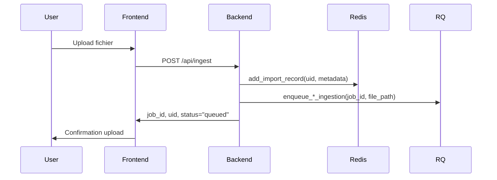
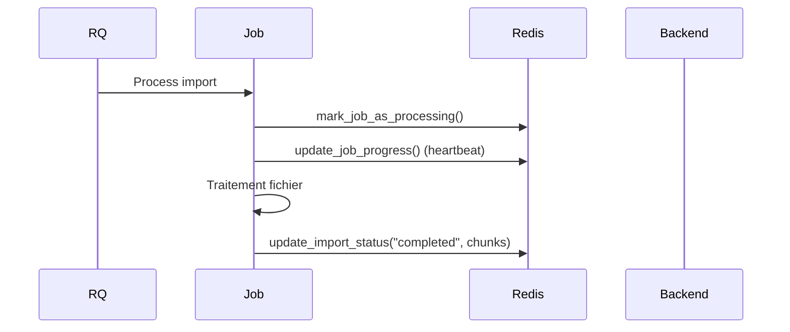
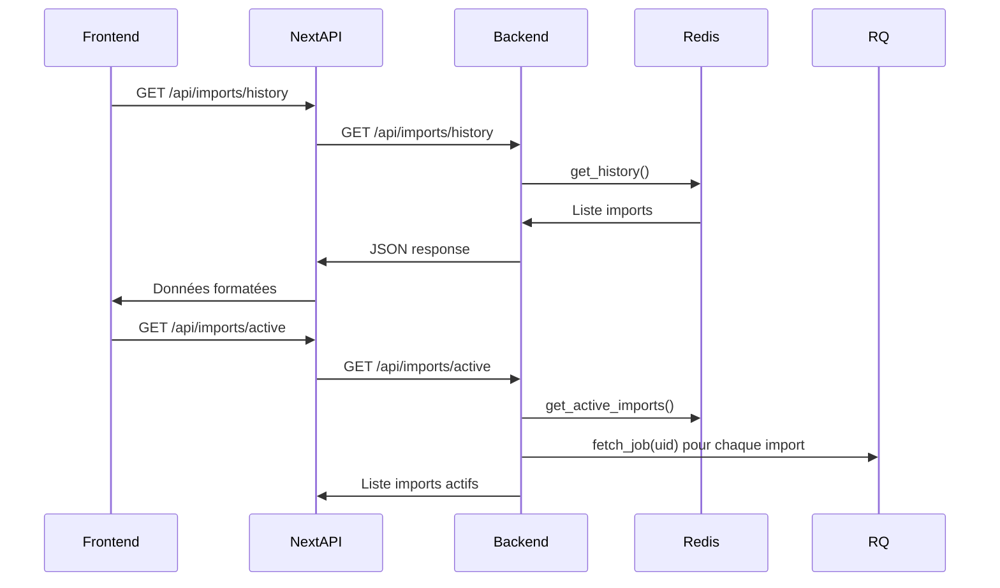

# Analyse du Système de Gestion des Status d'Imports

## Vue d'ensemble

Ce document décrit l'architecture complète du système de gestion des status d'imports dans l'application SAP Knowledge Base, incluant la logique de traitement, les APIs, et les routes.

> **⚠️ RÈGLE DE MAINTENANCE DE CE DOCUMENT**
> Ce fichier décrit le **fonctionnement actuel** du système, pas un historique de modifications. Lors de toute modification du système :
> - **Remplacer** directement les informations obsolètes par les nouvelles
> - **Ne jamais ajouter** d'historique de changements ou de sections "Problèmes Corrigés"
> - **Maintenir** uniquement l'état présent pour permettre une compréhension rapide dans de nouveaux chats
> - **OBLIGATION** : Toute modification du fonctionnement du système de status par Claude doit être impactée dans ce fichier

## Architecture Générale

### Composants Principaux

1. **Frontend Next.js** (`frontend/`)
   - Page de status : `/documents/status`
   - Routes API proxy vers le backend
   - Gestion de l'état avec React Query

2. **Backend FastAPI** (`src/knowbase/api/`)
   - Services de gestion des imports
   - Routes API REST
   - Intégration Redis et RQ (Redis Queue)

3. **Infrastructure**
   - Redis : Stockage de l'historique et queue des jobs
   - RQ (Redis Queue) : Traitement asynchrone des imports

## Flux de Données

### 1. Création d'un Import



**Fichiers impliqués :**
- `src/knowbase/api/services/ingestion.py:221-232` - Enregistrement initial
- `src/knowbase/api/services/import_history_redis.py:30-67` - Création record Redis

### 2. Traitement d'un Import



**Fichiers impliqués :**
- `src/knowbase/ingestion/queue/jobs.py:59-75` - Marquage comme processing
- `src/knowbase/ingestion/queue/jobs.py:42-56` - Mise à jour progression
- `src/knowbase/api/services/status.py:29-46` - Finalisation job

### 3. Affichage Status Frontend



**Fichiers impliqués :**
- `frontend/src/app/documents/status/page.tsx:90-111` - Requêtes frontend
- `frontend/src/app/api/imports/history/route.ts` - Proxy Next.js
- `src/knowbase/api/routers/imports.py:11-22` - Endpoints backend
- `src/knowbase/api/services/import_history_redis.py:109-141` - Service historique

## Structure Redis

### Bases de Données
- **DB 0** : Queue RQ et jobs
- **DB 1** : Historique des imports

## Structure Qdrant

### Collections
- **`knowbase`** : Documents PPTX/PDF (364 chunks)
- **`rfp_qa`** : Fichiers Excel Q/A (473 chunks)

### Types de Chunks
- **Documents** : Slides PPTX avec analyse vision et métadonnées
- **Excel Q/A** : Paires question/réponse extraites des fichiers Excel RFP

### Clés Redis (DB 1)

```
import:{uid}                    # Hash - Détails d'un import
└── uid: string
└── filename: string
└── status: string
└── started_at: ISO string
└── completed_at: ISO string (optionnel)
└── duration: number (optionnel)
└── chunks_inserted: number (optionnel)
└── client: string
└── topic: string
└── document_type: string
└── language: string
└── source_date: string
└── solution: string
└── import_type: string
└── error_message: string (optionnel)

import_history:list             # Sorted Set - Liste ordonnée par timestamp
└── score: timestamp
└── member: uid
```

## Routes API

### Backend (FastAPI)

| Méthode | Route | Description | Fichier |
|---------|-------|-------------|---------|
| GET | `/api/imports/history` | Liste historique | `src/knowbase/api/routers/imports.py:11` |
| GET | `/api/imports/active` | Imports actifs | `src/knowbase/api/routers/imports.py:18` |
| POST | `/api/imports/sync` | Sync jobs orphelins | `src/knowbase/api/routers/imports.py:25` |
| POST | `/api/imports/cleanup` | Nettoyage anciens | `src/knowbase/api/routers/imports.py:36` |
| DELETE | `/api/imports/{uid}/delete` | Suppression complète | `src/knowbase/api/routers/imports.py:47` |
| GET | `/api/status/{uid}` | Status job spécifique | `src/knowbase/api/routers/status.py:10` |

### Frontend (Next.js API Routes)

| Méthode | Route | Description | Fichier |
|---------|-------|-------------|---------|
| GET | `/api/imports/history` | Proxy historique | `frontend/src/app/api/imports/history/route.ts` |
| GET | `/api/imports/active` | Proxy imports actifs | `frontend/src/app/api/imports/active/route.ts` |
| DELETE | `/api/imports/[uid]/delete` | Proxy suppression | `frontend/src/app/api/imports/[uid]/delete/route.ts` |
| GET | `/api/status/[uid]` | Proxy status job | `frontend/src/app/api/status/[uid]/route.ts` |

**Note :** Les routes proxy Next.js existent pour compatibilité mais ne sont pas utilisées pour les status en temps réel. Le frontend fait des appels directs à `http://localhost:8000` pour éviter les problèmes de cache.

## Services Principaux

### RedisImportHistoryService

**Fichier :** `src/knowbase/api/services/import_history_redis.py`

**Méthodes clés :**
- `add_import_record()` - Création nouvel import
- `update_import_status()` - Mise à jour status
- `get_history()` - Récupération historique
- `get_active_imports()` - Imports en cours avec heartbeat check
- `sync_orphaned_jobs()` - Synchronisation jobs orphelins
- `cleanup_old_records()` - Nettoyage automatique

### Status Service

**Fichier :** `src/knowbase/api/services/status.py`

**Fonction principale :** `job_status(uid)` - Récupération status job RQ avec mise à jour automatique Redis

## Types d'Imports Supportés

### 1. Documents (PPTX/PDF)
- **Route de création :** `/api/ingest` avec `action_type=ingest`
- **Import type :** `document`
- **Pipeline :** `pptx_pipeline` ou `pdf_pipeline`

### 2. Excel Q/A
- **Route de création :** `/api/documents/upload-excel-qa`
- **Import type :** `excel_qa`
- **Pipeline :** `excel_pipeline`

### 3. Excel RFP Fill
- **Route de création :** `/api/documents/fill-rfp-excel`
- **Import type :** `rfp_fill`
- **Pipeline :** `fill_excel_pipeline`

## Status Possibles

| Status | Description | Transitions |
|--------|-------------|-------------|
| `pending` | Import créé, en attente | → `processing` |
| `queued` | Dans la queue RQ | → `processing` |
| `processing` | En cours de traitement | → `completed`, `failed` |
| `in_progress` | Alias de processing | → `completed`, `failed` |
| `completed` | Terminé avec succès | Final |
| `done` | Alias de completed | Final |
| `failed` | Échec de traitement | Final |
| `error` | Alias de failed | Final |

## Système de Heartbeat

### Mécanisme
- **Émission :**
  - Toutes les opérations dans les jobs (`update_job_progress()`)
  - Avant conversion PPTX → PDF (qui peut prendre plusieurs minutes)
  - Toutes les 3 slides pendant l'analyse PPTX (plus fréquent pour imports > 50 slides)
  - Timing : max 10 minutes entre heartbeats (conversion PDF) ou 45s (analyse slides)
- **Stockage :** `job.meta["last_heartbeat"]` + `job.meta["worker_id"]`
- **Vérification :** Dans `get_active_imports()` toutes les 10 secondes (frontend)
- **Timeout :** 10 minutes sans heartbeat → job marqué comme `failed`

**Fichiers impliqués :**
- `src/knowbase/ingestion/queue/jobs.py:30-40` - Émission heartbeat
- `src/knowbase/api/services/import_history_redis.py:170-196` - Vérification timeout

## Architecture Frontend

### Gestion des Appels API
Le frontend utilise des **appels directs** à `http://localhost:8000` au lieu du proxy Next.js pour les données de status en temps réel. Cette architecture évite les problèmes de cache du proxy Next.js qui peuvent créer des incohérences entre l'état réel des imports et l'affichage.

### Gestion du Cache React Query
- **Invalidation intelligente** : Utilisation de `queryClient.invalidateQueries()` au lieu de `window.location.reload()`
- **Polling optimisé** :
  - Historique des imports : toutes les 5 secondes
  - Imports actifs : toutes les 10 secondes (réduit la charge serveur)
  - Configuration : `staleTime: 0` et `gcTime: 0` pour fraîcheur maximale
- **Bouton de synchronisation manuelle** : Permet de forcer la resynchronisation des jobs orphelins

### Interface Utilisateur
- **Bouton de synchronisation** : Appel direct à `http://localhost:8000/api/imports/sync`
- **Actualisation intelligente** : Invalidation des caches React Query après les opérations
- **Statut en temps réel** : Affichage des imports en cours, en attente et terminés

## Monitoring et Debugging

### Logs Utiles

```bash
# Status d'un import spécifique
docker-compose exec redis redis-cli -n 1 HGETALL "import:{uid}"

# Liste des imports dans l'historique
docker-compose exec redis redis-cli -n 1 ZRANGE "import_history:list" 0 -1

# Vérifier les jobs RQ actifs
docker-compose exec redis redis-cli -n 0 KEYS "rq:job:*"

# Logs backend en temps réel
docker-compose logs -f app
```

### Commandes de Maintenance

```bash
# Synchroniser les jobs orphelins (via API)
curl -X POST http://localhost:3000/api/imports/sync

# Nettoyer les anciens imports (30 jours)
curl -X POST "http://localhost:3000/api/imports/cleanup?days=30"

# Supprimer complètement un import
curl -X DELETE http://localhost:3000/api/imports/{uid}/delete
```

## Points d'Attention

### Performance
- Les appels `/api/imports/active` sont coûteux (vérification heartbeat + jobs RQ)
- Polling optimisé depuis le frontend :
  - Historique : toutes les 5 secondes
  - Imports actifs : toutes les 10 secondes
- Limite de 100 imports dans l'historique par défaut

### Synchronisation Redis ↔ Qdrant
Le système maintient la cohérence entre l'historique Redis et les chunks réels dans Qdrant :
- **Collection principale** (`knowbase`) : Documents PPTX/PDF
- **Collection Excel Q/A** (`rfp_qa`) : Fichiers Excel avec questions/réponses
- **Surveillance automatique** : Détection des désynchronisations via `/api/imports/sync`

### Timings Typiques d'Import PPTX
- **Conversion PDF :** Quelques secondes à plusieurs minutes (selon taille document)
- **Analyse par slide :** 5-15 secondes (selon complexité visuelle)
- **Heartbeat :**
  - Avant conversion PDF (couvre les gros documents)
  - Toutes les 3 slides = max 45 secondes pendant analyse
- **Timeout heartbeat :** 10 minutes (couvre conversion PDF + marge)
- **Import total :** Variable selon nombre de slides :
  - 20 slides : ~5-10 minutes
  - 50 slides : ~15-25 minutes
  - 100+ slides : 30+ minutes

### Sécurité
- Pas d'authentification sur les routes de suppression
- Accès direct aux métadonnées des imports

### Évolutivité
- Redis DB 1 peut grossir rapidement
- Cleanup automatique recommandé (cron job)
- Monitoring des timeouts workers nécessaire

## Scripts de Maintenance Recommandés

### Cleanup Automatique (à ajouter au cron)
```bash
#!/bin/bash
# Nettoyer les imports > 30 jours tous les jours à 2h du matin
0 2 * * * curl -X POST "http://localhost:3000/api/imports/cleanup?days=30"
```

### Synchronisation Orphelins (à ajouter au cron)
```bash
#!/bin/bash
# Synchroniser les jobs orphelins toutes les heures
0 * * * * curl -X POST http://localhost:3000/api/imports/sync
```

## Conclusion

Le système de gestion des status d'imports offre :
- **Surveillance en temps réel** des imports PPTX, PDF et Excel Q/A
- **Gestion robuste des timeouts** adaptée aux longs processus d'analyse vision
- **Interface utilisateur réactive** avec synchronisation manuelle
- **Architecture de cache optimisée** pour l'affichage temps réel
- **Monitoring complet** avec heartbeats et détection d'orphelins

Pour toute modification future, référez-vous à ce document pour comprendre l'architecture complète et les implications des changements.