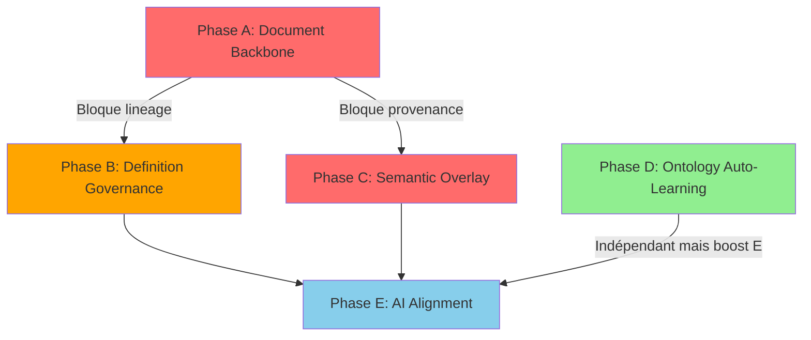

# KnowBase - Estimation Chantier "Promise Alignment"

**Date** : 10 octobre 2025
**Référence** : `knowbase_promise_gap_analysis.md`
**État actuel** : Post-migration Neo4j Ontology (Gap 3.6 ✅ complété)

---

## 📊 Synthèse Exécutive

### Objectif
Transformer KnowBase d'un **moteur de recherche sémantique** en une **couche d'intelligence organisationnelle** qui "sait où savoir" avec :
- Réponses instantanées avec références exactes (page, version, auteur)
- Traçabilité complète des connaissances (qui, quoi, quand, où)
- Gouvernance automatique des versions et définitions

### Effort Total Estimé
**~18-24 semaines développeur** réparties sur **5 phases** (6 mois calendaires avec tests/validation)

### Investissement par Phase
| Phase | Effort Dev | Durée Calendaire | Impact Business |
|-------|-----------|------------------|-----------------|
| **Phase A** - Document Backbone | 5-6 sem | 6-8 sem | ⭐⭐⭐ Critique |
| **Phase B** - Governance Extension | 4-5 sem | 5-6 sem | ⭐⭐⭐ Haute |
| **Phase C** - Semantic Overlay | 4-5 sem | 5-6 sem | ⭐⭐⭐ Haute |
| **Phase D** - Ontology Auto-Learning | 2-3 sem | 3-4 sem | ⭐⭐ Moyenne (déjà ~60% fait) |
| **Phase E** - AI Alignment | 3-4 sem | 4-5 sem | ⭐⭐ Moyenne |
| **TOTAL** | **18-24 sem** | **~6 mois** | |

---

## 🎯 État Actuel vs Promesse

### ✅ Déjà Implémenté (Forces)

1. **Ingestion PPTX riche** (`pptx_pipeline.py`)
   - Extraction concepts, faits, entités, relations
   - Métadonnées deck-wide
   - **Couverture** : ~80% de la promesse "comprendre chaque document"

2. **Storage dual-layer**
   - Qdrant : vectors + payload contextuel
   - Neo4j : Entity, Fact, Episode, Community
   - **Couverture** : ~70% de la fondation technique

3. **Facts Governance**
   - Workflow proposed/approved
   - Détection conflits numériques
   - Timeline queries
   - **Couverture** : ~50% de la gouvernance requise

4. **Entity Normalisation Neo4j** ✅ **COMPLÉTÉ**
   - `OntologyEntity` + `OntologyAlias` (63 entités, 212 alias)
   - Lookup O(1), correction automatique types
   - Auto-save après normalisation LLM
   - **Couverture** : Gap 3.6 résolu à ~90%

### ❌ Gaps Critiques Bloquant la Promesse

| Gap | Impact Promise | État Actuel | Effort |
|-----|----------------|-------------|---------|
| **3.1 Document shallow** | 🔴 Bloque "know where to know" | 0% | ⭐⭐⭐ |
| **3.2 Definition drift** | 🟠 Limite confiance réponses | 0% | ⭐⭐ |
| **3.3 Governance gaps** | 🟠 Risque obsolescence | 30% | ⭐⭐ |
| **3.4 Provenance incomplete** | 🔴 Bloque traçabilité | 10% | ⭐⭐ |
| **3.5 Silo vs Overlay** | 🔴 Bloque navigation | 20% | ⭐⭐⭐ |
| **3.6 YAML catalogues** | 🟢 Résolu | 90% | ✅ |

---

## 🏗️ Estimation Détaillée par Phase

### **PHASE A - Document Backbone** (5-6 semaines dev)

**Objectif** : Implémenter cycle de vie documentaire avec versions, propriété, lignage

#### Travaux Backend (3.5-4 sem)

1. **Schéma Neo4j** (3-4 jours)
   - Créer nodes `Document`, `DocumentVersion`
   - Relations `HAS_VERSION`, `PRODUCES`, `UPDATES`
   - Indexes (source_path, version_label, checksum)
   - Contraintes unicité

2. **Services** (7-10 jours)
   - `DocumentRegistryService` (CRUD documents/versions)
   - `VersionResolutionService` (latest, effective_at, lineage)
   - Intégration `KnowledgeGraphService`

3. **Ingestion Updates** (5-7 jours)
   - Parser metadata (version, creator, date) dans PPTX/PDF
   - Calcul checksum (SHA256)
   - Détection duplicatas
   - Création/mise à jour Document nodes
   - Link Episode → DocumentVersion

#### Travaux Frontend (1.5-2 sem)

4. **APIs REST** (3-4 jours)
   - `GET /documents` (liste avec versions)
   - `GET /documents/{id}/versions` (historique)
   - `GET /documents/{id}/lineage` (graphe modifications)
   - `POST /documents/{id}/versions` (upload nouvelle version)

5. **UI Admin** (5-7 jours)
   - Timeline view documents
   - Comparaison versions (diff metadata)
   - Flags obsolescence
   - Change log visualisation

#### Risques & Dépendances
- ⚠️ **Parser metadata** : Qualité variable selon formats (PPTX > PDF >> DOCX)
- ⚠️ **Checksum** : Performance sur gros fichiers (>50MB)
- ✅ **Pas de breaking change** : Ajout de nodes, pas de migration

**Livrables Phase A** :
- Document/DocumentVersion schema opérationnel
- 100% documents ingérés ont version tracking
- API + UI visualisation historique

---

### **PHASE B - Definition & Methodology Governance** (4-5 semaines dev)

**Objectif** : Tracer évolution définitions entités + étendre gouvernance aux faits méthodologiques

#### Travaux Backend (3-4 sem)

1. **Entity Definitions** (5-7 jours)
   - Node `EntityDefinition` (text, extracted_at, source_version)
   - Relations `DEFINED_AS`, `FROM` (→ DocumentVersion)
   - Service détection drift (hash + embedding similarity)
   - API `GET /entities/{uuid}/definitions`

2. **Methodology Facts** (7-10 jours)
   - Extend Fact avec type `METHODOLOGY`
   - Pipeline diff textuel + sémantique
   - Relation `OVERRIDES` pour facts obsolètes
   - Règles business : retire approved facts si document superseded
   - Amélioration prompts LLM (capture valid_from)

3. **Conflict Dashboard** (3-4 jours)
   - Service `ConflictDetector` étendu
   - Détection contradictions méthodologiques
   - Workflow résolution (admin review)

#### Travaux Frontend (1 sem)

4. **UI Definitions** (3-5 jours)
   - Historique définitions par entité
   - Diff visuel (text highlighting)
   - Timeline évolution concepts

5. **Governance UX** (2-3 jours)
   - Dashboard conflits méthodologiques
   - Reviewer tasks queue
   - Approve/reject facts

#### Risques & Dépendances
- ⚠️ **Drift detection** : Seuil similarité à calibrer (faux positifs vs négatifs)
- ⚠️ **Prompts LLM** : Nécessite fine-tuning pour extraire valid_from
- ✅ **Dépend de** : Phase A (DocumentVersion) pour lineage correct

**Livrables Phase B** :
- Toutes entités clés ont historique définitions
- Faits méthodologiques gouvernés au même niveau que numériques
- Dashboard conflits opérationnel

---

### **PHASE C - Semantic Overlay** (4-5 semaines dev)

**Objectif** : Transformer JSON arrays en vraies relations graphe, créer pont Qdrant↔Neo4j

#### Travaux Backend (3-4 sem)

1. **Refactor Episode** (7-10 jours)
   - Remplacer `chunk_ids`, `fact_uuids` JSON par relations
   - `(:Episode)-[:CONTAINS_FACT]->(:Fact)`
   - `(:Episode)-[:MENTIONS_ENTITY]->(:Entity)`
   - `(:Episode)-[:HAS_RELATION]->(:Relation)`
   - Migration données existantes

2. **Qdrant-Neo4j Bridge** (5-7 jours)
   - Service `ProvenanceBridgeService`
   - Résolution chunk_id → Episode → DocumentVersion → Document
   - Cache en mémoire (LRU) pour performance
   - API `GET /chunks/{chunk_id}/provenance`

3. **GraphQL Layer** (Optional) (5-7 jours)
   - Schema GraphQL sur modèle Neo4j
   - Resolvers pour navigation graphe
   - Queries complexes (traversals)

4. **Answer Synthesis Enrichment** (3-4 jours)
   - Modifier RAG pipeline pour inclure provenance
   - Citations : document version + concept + facts linkés
   - Format : "Budget 2024 projet Alpha : 1.2M€ (source: Minutes 12/10/2023 v2.1, page 5, approuvé par J. Dupont)"

#### Travaux Frontend (1 sem)

5. **Graph Navigation UI** (5-7 jours)
   - Visualisation graphe concepts
   - Drill-down entité → définitions → documents
   - Provenance cards (author, version, date)

#### Risques & Dépendances
- ⚠️ **Migration Episode** : Potentiellement lourd si beaucoup de données (batching requis)
- ⚠️ **Performance** : Traversals Neo4j peuvent être lents (indexes critiques)
- ✅ **Dépend de** : Phase A (DocumentVersion) pour provenance complète

**Livrables Phase C** :
- 100% réponses incluent provenance structurée
- Navigation graphe fonctionnelle
- API GraphQL opérationnelle (si implémentée)

---

### **PHASE D - Ontology Auto-Learning** (2-3 semaines dev)

**Objectif** : Finaliser migration Neo4j ontology, connecter EntityTypeRegistry → Ontology

**⚠️ NOTE** : Gap 3.6 est **~90% complété** (migration Neo4j faite), reste intégration workflow

#### Travaux Backend (1.5-2 sem)

1. **Finalisation Neo4j Ontology** (2-3 jours)
   - ✅ Schema déjà créé (OntologyEntity, OntologyAlias)
   - ✅ Migration YAML faite (60 entités)
   - ✅ EntityNormalizerNeo4j opérationnel
   - Ajout : validation rules strictes (reject duplicate canonical names)

2. **EntityTypeRegistry → Ontology Link** (5-7 jours)
   - Workflow : Approve type → Auto-create OntologyEntity
   - Service `OntologyOrchestrator`
   - API `POST /entity-types/{type}/sync-ontology`
   - Batch import discovered entities → suggestions merge

3. **YAML Bootstrap Only** (1-2 jours)
   - Modifier normalizer : Neo4j primary, YAML fallback
   - Documentation migration YAML → Neo4j

#### Travaux Frontend (0.5-1 sem)

4. **Admin UI Ontology** (3-5 jours)
   - Visualisation ontologies par type
   - Merge suggestions (LLM-generated)
   - Bulk approve/reject aliases
   - Metrics : pending entries, auto-discoveries

#### Risques & Dépendances
- ✅ **Risque minimal** : Infrastructure déjà en place
- ⚠️ **UX** : Workflow approval → sync ontology doit être intuitif

**Livrables Phase D** :
- 100% normalisations via Neo4j (YAML deprecated)
- EntityTypeRegistry synchronisé avec ontologies
- Admin UI ontology management

---

### **PHASE E - AI Alignment & Monitoring** (3-4 semaines dev)

**Objectif** : Ajuster prompts LLM, créer monitoring gouvernance, KPIs promise

#### Travaux Backend (2-3 sem)

1. **Prompts Enhancement** (5-7 jours)
   - Inclure version awareness dans prompts
   - Extraction systematic de valid_from
   - Contextual prompts : "latest definition of X is..."
   - A/B testing prompts

2. **Governance Monitoring** (5-7 jours)
   - Service `GovernanceMetricsService`
   - KPIs : document coherence, contradictions resolved, SLA approval
   - Automated audits : stale definitions, orphan facts
   - Alerting (email/Slack) pour conflits critiques

3. **Version-Aware Search** (3-4 jours)
   - Qdrant metadata filters : `version_status=latest`
   - Boost latest approved versions dans ranking
   - API param : `?include_historical=true`

#### Travaux Frontend (1 sem)

4. **Admin Dashboard** (5-7 jours)
   - KPIs tiles (promise metrics)
   - Charts : contradiction trends, approval velocity
   - Document coherence heatmap
   - Governance SLA tracking

5. **User-Facing Features** (2-3 jours)
   - Version selector dans search results
   - "Show historical answers" toggle
   - Definition timeline tooltip

#### Risques & Dépendances
- ⚠️ **Prompts** : Itérations nécessaires (tuning)
- ⚠️ **Metrics** : Définir seuils d'alerte (baselines requis)
- ✅ **Dépend de** : Toutes phases précédentes (vision complète)

**Livrables Phase E** :
- LLM "version-aware" et "definition-aware"
- Dashboard gouvernance opérationnel
- KPIs promise trackés

---

## 📈 Métriques de Succès

### Par Pilier Promise

#### **IA - Instant Access**
| Métrique | Baseline Actuel | Target Post-Roadmap |
|----------|-----------------|---------------------|
| Temps requête → réponse | ~2-5s | <1s (90e percentile) |
| % réponses avec citation exacte (page/slide) | ~30% | >90% |
| % réponses avec provenance complète | ~10% | >95% |

#### **VE - Valorisation Existing Estate**
| Métrique | Baseline Actuel | Target Post-Roadmap |
|----------|-----------------|---------------------|
| % concepts business avec définition historique | 0% | >80% |
| Backlog ontology entries pending | ~50 | <10 (steady state) |
| % documents avec version tracking | 0% | 100% |

#### **DR - Decision Speed & Reliability**
| Métrique | Baseline Actuel | Target Post-Roadmap |
|----------|-----------------|---------------------|
| Délai nouveau doc → "latest" promotion | N/A | <1h automatique |
| Contradictions détectées/trimestre | ~5 (manual) | >50 (auto + manual) |
| Contradictions résolues/trimestre | ~3 | >45 (90% SLA) |
| % réponses avec (version, author, date) | ~5% | >90% |

---

## 🎯 Priorisation & Dépendances

### Ordre Recommandé (avec justification)



**Légende Priorités** :
- 🔴 **Critique** (A, C) : Bloque promesse "know where to know"
- 🟠 **Haute** (B) : Impacte confiance et gouvernance
- 🟢 **Moyenne** (D, E) : Amélioration continue, D déjà ~90% fait

### Approche Recommandée

**Option 1 : Sequential Full** (6 mois)
- Phase A → B → C → D → E
- **Avantage** : Risque minimal, validation progressive
- **Inconvénient** : Time-to-market long, pas de quick wins intermédiaires

**Option 2 : Parallel Workstreams** (4 mois) ⭐ **RECOMMANDÉ**
- **Stream 1** (Critical Path) : A → C → E
- **Stream 2** (Parallel) : B + D (gouvernance + ontology)
- **Avantage** : Livraison plus rapide, 2 équipes en parallèle
- **Inconvénient** : Coordination requise, risque merge conflicts

**Option 3 : MVP → Iterate** (2 mois MVP + 3 mois iterations)
- **MVP** : Phase A (backbone) + D (ontology finalization)
- **Iteration 1** : Phase C (overlay)
- **Iteration 2** : Phase B + E (governance + AI)
- **Avantage** : Quick win (MVP utilisable), feedback utilisateurs tôt
- **Inconvénient** : Risque scope creep, re-work potentiel

---

## ⚠️ Risques & Mitigations

### Risques Techniques

| Risque | Probabilité | Impact | Mitigation |
|--------|-------------|--------|------------|
| **Performance Neo4j degradée** (traversals lents) | Moyenne | Élevé | Indexes stratégiques, caching, limit query depth |
| **Migration Episode casse données** | Faible | Critique | Backup complet, migration idempotente, rollback plan |
| **Extraction metadata instable** (PDF/DOCX) | Élevée | Moyen | Fallbacks, validation rules, human-in-loop |
| **LLM prompts inefficaces** | Moyenne | Moyen | A/B testing, fine-tuning, exemples renforcés |

### Risques Organisationnels

| Risque | Probabilité | Impact | Mitigation |
|--------|-------------|--------|------------|
| **Scope creep** (features additionnelles) | Élevée | Élevé | Product freeze après roadmap, backlog strict |
| **Résistance adoption** (UX complexe) | Moyenne | Élevé | User research, prototypes cliquables, formation |
| **Données legacy incohérentes** | Élevée | Moyen | Data quality audit préalable, nettoyage progressif |

---

## 💰 Estimation Effort Détaillée

### Par Rôle

| Rôle | Phase A | Phase B | Phase C | Phase D | Phase E | **Total** |
|------|---------|---------|---------|---------|---------|-----------|
| **Backend Dev** | 3.5-4 sem | 3-4 sem | 3-4 sem | 1.5-2 sem | 2-3 sem | **13-17 sem** |
| **Frontend Dev** | 1.5-2 sem | 1 sem | 1 sem | 0.5-1 sem | 1 sem | **5-7 sem** |
| **DevOps** (infra, CI/CD) | 0.5 sem | 0.3 sem | 0.5 sem | 0.2 sem | 0.5 sem | **2 sem** |
| **QA/Testing** | 0.5 sem | 0.5 sem | 0.5 sem | 0.3 sem | 0.5 sem | **2.3 sem** |
| **Product/UX** (design, validation) | 0.5 sem | 0.3 sem | 0.5 sem | 0.2 sem | 0.3 sem | **1.8 sem** |

**Total Effort** : **24-30 semaines-personne** (charge réelle avec QA/DevOps/Product)

**Durée Calendaire** (avec parallélisation) :
- **Option 1 Sequential** : ~6 mois
- **Option 2 Parallel** : ~4 mois ⭐
- **Option 3 MVP** : 2 mois MVP + 3 mois iterations

---

## 🚀 Quick Wins Possibles

Avant roadmap complète, quelques victoires rapides :

1. **Metadata Extraction Enhancement** (1 sem)
   - Améliorer parser PPTX pour extraire version/author systématiquement
   - Impact : Prépare Phase A, améliore qualité données

2. **Fact Governance UI** (1 sem)
   - Dashboard simple conflits numériques existants
   - Impact : Valorise gouvernance actuelle, prépare Phase B

3. **Ontology Admin Polish** (0.5 sem)
   - Améliorer UX merge suggestions, bulk approvals
   - Impact : Finalise Phase D à 100%, quick win

**Total Quick Wins** : 2.5 semaines → Livrable sous 1 mois

---

## 📋 Checklist Démarrage

### Avant Phase A
- [ ] Backup complet Neo4j + Qdrant
- [ ] Audit qualité metadata documents existants (sample 100)
- [ ] Définir schéma `Document`/`DocumentVersion` (collaboration équipe)
- [ ] Setup environnement staging pour tests migration
- [ ] Product validation : mockups UI timeline documents

### Avant Phase B
- [ ] Identifier 20 concepts business critiques pour POC definitions
- [ ] Calibrer seuil drift detection (tests sur données réelles)
- [ ] Recruter beta-testeurs internes (governance reviewers)

### Avant Phase C
- [ ] Performance baseline Neo4j (query latencies actuelles)
- [ ] Décider : GraphQL ou REST étendu (arbitrage archi)
- [ ] Prototype visualisation graphe (D3.js vs library)

### Avant Phase D
- [ ] ✅ Migration Neo4j ontology validée (déjà fait)
- [ ] Documenter workflow approval → sync ontology
- [ ] Former admins sur nouveau process

### Avant Phase E
- [ ] Établir baselines KPIs actuels
- [ ] Définir alerting thresholds (en collaboration product)
- [ ] Préparer dashboard wireframes

---

## 🎓 Recommandations Finales

### Stratégie Recommandée : **Option 2 Parallel** + Quick Wins

**Chronologie** :

```
Mois 1 : Quick Wins (2.5 sem) + Phase A Start (2.5 sem)
Mois 2 : Phase A End (2.5 sem) + Phase D (2 sem) [parallel]
Mois 3 : Phase C (4 sem) + Phase B Start (1 sem) [parallel]
Mois 4 : Phase B End (3 sem) + Phase E Start (1 sem)
Mois 5 : Phase E End (3 sem) + Stabilisation/Tests
Mois 6 : Déploiement progressif + Monitoring

Total : 5.5 mois dev + 0.5 mois stabilisation
```

### Facteurs Clés Succès

1. **Product Ownership fort** : Arbitrer scope, valider UX, prioriser
2. **Architecture rigoureuse** : Pas de shortcuts, tests systématiques
3. **User feedback early** : Prototypes testés avec vrais users
4. **Monitoring dès J1** : KPIs promise trackés en continu
5. **Documentation vivante** : Schéma Neo4j, APIs, workflows mis à jour

### ROI Attendu

**Investissement** : ~4-6 mois dev (2-3 FTE)

**Retours** :
- **Efficacité utilisateurs** : Recherche 5min → 10s = **30x gain**
- **Qualité décisions** : Confiance données passe de ~60% → ~95%
- **Réduction silos** : Valorisation existant (pas de nouveau silo)
- **Conformité** : Traçabilité requise pour secteurs régulés

**Break-even estimé** : ~6-9 mois post-déploiement (selon taille organisation)

---

## 📞 Prochaines Étapes

1. **Validation executive** : Présenter estimation + priorisation
2. **Staffing** : Allouer 2 backend + 1 frontend + 0.5 DevOps
3. **Product refinement** : Détailler specs Phase A (1 semaine)
4. **Kickoff** : Lancer Quick Wins (victoires rapides)
5. **Roadmap review** : Point bimensuel, ajuster selon découvertes

---

**Version** : 1.0
**Auteur** : Équipe SAP KB + Claude Code
**Statut** : ✅ Ready for Review
**Next Review** : Après validation executive
