# 🌊 OSMOSE Phase 1 V2.1 : Semantic Core - Plan Implémentation

**Version:** 2.1
**Date:** 2025-10-14
**Durée:** Semaines 1-10
**Objectif:** Démontrer USP unique avec concept extraction multilingue

---

## Table des Matières

1. [Vue d'Ensemble Phase 1](#1-vue-densemble-phase-1)
2. [Semaines 1-2: Setup Infrastructure](#2-semaines-1-2-setup-infrastructure)
3. [Semaines 3-4: TopicSegmenter](#3-semaines-3-4-topicsegmenter)
4. [Semaines 5-7: MultilingualConceptExtractor](#4-semaines-5-7-multilingualconceptextractor)
5. [Semaines 8-9: SemanticIndexer](#5-semaines-8-9-semanticindexer)
6. [Semaine 10: ConceptLinker + Integration](#6-semaine-10-conceptlinker--integration)
7. [Critères Succès Phase 1](#7-critères-succès-phase-1)

---

## 1. Vue d'Ensemble Phase 1

### 1.1 Objectif

> **Démontrer que KnowWhere extrait et unifie concepts multilingues mieux que Copilot/Gemini**

**Différenciation Clé:**
- ✅ Extraction concepts cross-lingual (FR, EN, DE automatique)
- ✅ Canonicalization: FR "authentification" = EN "authentication"
- ✅ Concept typing sémantique (ENTITY, PRACTICE, STANDARD, TOOL, ROLE)
- ✅ Relations conceptuelles (DEFINES, IMPLEMENTS, AUDITS, PROVES)

### 1.2 Architecture Pipeline V2.1

```mermaid
flowchart LR
    DOC[📄 Document] --> TOPIC[TopicSegmenter]
    TOPIC --> EXTRACT[MultilingualConceptExtractor]
    EXTRACT --> INDEX[SemanticIndexer]
    INDEX --> LINK[ConceptLinker]
    LINK --> PROTO[(Proto-KG)]

    style EXTRACT fill:#ffe1f5
    style INDEX fill:#ffe1f5
    style LINK fill:#e1f5ff
```



**4 Composants Clés:**
1. **TopicSegmenter**: Découpe documents en topics cohérents (windowing + clustering)
2. **MultilingualConceptExtractor**: Extrait concepts via NER + Clustering + LLM (⚠️ CRITIQUE)
3. **SemanticIndexer**: Canonicalise cross-lingual + hiérarchies
4. **ConceptLinker**: Relations cross-documents

### 1.3 Focus Phase 1

**Type Documents:** 100% Descriptifs
- Guidelines (security, architecture, processes)
- Standards (ISO 27001, GDPR, etc.)
- Architecture documents
- Compte-rendus (meetings, audits)

**❌ PAS de focus:**
- Narrative threads temporels
- Event tracking
- Timeline evolution

**✅ Focus:**
- Concept extraction
- Cross-lingual unification
- Semantic relations

---

## 2. Semaines 1-2: Setup Infrastructure

### 2.1 Objectifs

- Setup NER multilingue (spaCy: en, fr, de, xx fallback)
- Setup embeddings multilingues (multilingual-e5-large)
- Setup détection langue automatique (fasttext)
- Configurer Neo4j Proto-KG schema V2.1 (Concepts)
- Configurer Qdrant Proto collection

### 2.2 Tasks Détaillées

#### T1.1: Structure Modules

**Fichiers à créer:**
```
src/knowbase/semantic/
├── __init__.py
├── models.py                    # Pydantic models V2.1
├── config.py                    # Configuration management
├── segmentation/
│   ├── __init__.py
│   └── topic_segmenter.py       # Stub Semaines 3-4
├── extraction/
│   ├── __init__.py
│   └── concept_extractor.py     # Stub Semaines 5-7
├── indexing/
│   ├── __init__.py
│   └── semantic_indexer.py      # Stub Semaines 8-9
├── linking/
│   ├── __init__.py
│   └── concept_linker.py        # Stub Semaine 10
└── utils/
    ├── __init__.py
    ├── language_detector.py     # Fasttext wrapper
    └── embeddings.py            # Sentence transformers wrapper
```

**Durée**: 4 heures

#### T1.2: Models Pydantic V2.1

**Fichier**: `src/knowbase/semantic/models.py`

**Models à créer:**
```python
from pydantic import BaseModel, Field
from typing import List, Optional
from enum import Enum

class ConceptType(Enum):
    """Types de concepts sémantiques"""
    ENTITY = "entity"          # SAP S/4HANA, ISO 27001, MFA
    PRACTICE = "practice"      # threat modeling, code review
    STANDARD = "standard"      # ISO 27001, GDPR, SOC2
    TOOL = "tool"             # SAST, DAST, SIEM
    ROLE = "role"             # BISO, CSO, Security Champion

class Concept(BaseModel):
    """Concept extrait d'un topic"""
    name: str
    type: ConceptType
    definition: str = ""
    context: str
    language: str  # ISO 639-1 (en, fr, de, etc.)
    confidence: float = Field(ge=0.0, le=1.0)
    source_topic_id: str
    extraction_method: str  # NER, CLUSTERING, LLM
    related_concepts: List[str] = []

class CanonicalConcept(BaseModel):
    """Concept canonique unifié cross-lingual"""
    canonical_name: str  # Priorité anglais
    aliases: List[str]  # Toutes variantes linguistiques
    languages: List[str]  # Langues représentées
    type: ConceptType
    definition: str
    hierarchy_parent: Optional[str] = None
    hierarchy_children: List[str] = []
    related_concepts: List[str] = []
    source_concepts: List[Concept]
    support: int  # Nombre mentions
    confidence: float = Field(ge=0.0, le=1.0)

class Topic(BaseModel):
    """Topic sémantiquement cohérent"""
    topic_id: str
    document_id: str
    section_path: str
    windows: List[dict]  # Text windows
    anchors: List[str]  # Entités clés
    cohesion_score: float = Field(ge=0.0, le=1.0)
    concepts: List[Concept] = []

class DocumentRole(Enum):
    """Rôle du document par rapport au concept"""
    DEFINES = "defines"
    IMPLEMENTS = "implements"
    AUDITS = "audits"
    PROVES = "proves"
    REFERENCES = "references"
```

**Durée**: 2 heures

#### T1.3: Configuration YAML V2.1

**Fichier**: `config/semantic_intelligence_v2.yaml`

```yaml
# KnowWhere OSMOSE V2.1 Configuration
# Focus: Documents Descriptifs, Language-Agnostic, Concept-First

project:
  name: "KnowWhere"
  codename: "OSMOSE"
  version: "2.1.0-alpha"
  architecture: "Concept-First, Language-Agnostic"

semantic:
  # Topic Segmentation
  segmentation:
    enabled: true
    window_size: 3000
    overlap: 0.25
    cohesion_threshold: 0.65
    clustering_method: "HDBSCAN"  # Primary
    clustering_fallback: "Agglomerative"

  # Multilingual Concept Extraction
  extraction:
    enabled: true
    methods:
      - "NER"         # Primary: Fast, high precision
      - "CLUSTERING"  # Secondary: Semantic grouping
      - "LLM"         # Fallback: High recall
    min_concepts_per_topic: 2
    concept_types:
      - "ENTITY"
      - "PRACTICE"
      - "STANDARD"
      - "TOOL"
      - "ROLE"

  # Semantic Indexing & Canonicalization
  indexing:
    enabled: true
    similarity_threshold: 0.85  # Cross-lingual matching
    canonical_name_priority: "en"  # Priorité anglais
    hierarchy_construction: "LLM"  # LLM-based inference

  # Cross-Document Linking
  linking:
    enabled: true
    min_similarity: 0.70
    document_roles:
      - "DEFINES"
      - "IMPLEMENTS"
      - "AUDITS"
      - "PROVES"
      - "REFERENCES"

  # Multilingue
  languages:
    supported:
      - "en"
      - "fr"
      - "de"
      - "it"
      - "es"
    fallback: "en"
    detection_model: "fasttext"  # lid.176.bin

# NER Multilingue (spaCy)
ner:
  models:
    en: "en_core_web_trf"
    fr: "fr_core_news_trf"
    de: "de_core_news_trf"
    xx: "xx_ent_wiki_sm"  # Universal fallback
  entity_types:
    - "ORG"
    - "PRODUCT"
    - "LAW"
    - "NORP"
    - "FAC"
    - "GPE"

# Embeddings Multilingues
embeddings:
  model: "intfloat/multilingual-e5-large"
  dimension: 1024
  device: "cpu"  # ou "cuda" si GPU
  batch_size: 32
  cache_enabled: true
  cache_size: 1000

# Neo4j Proto-KG V2.1
neo4j_proto:
  uri: "${NEO4J_URI}"
  user: "${NEO4J_USER}"
  password: "${NEO4J_PASSWORD}"
  database: "neo4j"
  labels:
    document: "Document"
    topic: "Topic"
    concept: "Concept"
  concept_properties:
    - "canonical_name"
    - "aliases"
    - "languages"
    - "type"
    - "definition"
    - "support"
    - "confidence"
    - "stage"  # PROTO | PROMOTED | REJECTED

# Qdrant Proto
qdrant_proto:
  collection_name: "concepts_proto"
  vector_size: 1024  # multilingual-e5-large
  distance: "Cosine"
  on_disk_payload: true

# Gatekeeper (Phase 2, mais config ici)
gatekeeper:
  auto_promote_threshold: 0.75
  reject_threshold: 0.50
  criteria:
    - "support"         # Nombre mentions
    - "confidence"      # Confiance extraction
    - "cross_lingual"   # Présence multi-langues
    - "semantic_quality"  # Quality LLM-based

# Budget & Performance
budget:
  max_monthly_spend_usd: 500
  cost_per_document_target: 0.30  # Optimisé vs 0.40-0.80
  llm_model_default: "gpt-4o-mini"
  llm_temperature: 0.3

performance:
  target_processing_time: 30  # secondes/document
  max_processing_time: 60
  parallel_topics: true
  batch_llm_calls: true

# Monitoring
monitoring:
  enabled: true
  log_level: "INFO"
  structured_logs: true
  metrics_prefix: "[OSMOSE]"
```

**Durée**: 2 heures

#### T1.4: Setup NER Multilingue

**Fichier**: `src/knowbase/semantic/utils/ner_manager.py`

```python
import spacy
from typing import List, Dict
from functools import lru_cache

class MultilingualNER:
    """Gestionnaire NER multilingue avec cache"""

    def __init__(self, config):
        self.config = config
        self._models = {}
        self._load_models()

    def _load_models(self):
        """Charge les modèles spaCy (lazy loading)"""
        # Ne charge que en, fr, de, xx au démarrage
        for lang in ["en", "fr", "de", "xx"]:
            model_name = self.config.ner.models.get(lang)
            if model_name:
                try:
                    self._models[lang] = spacy.load(model_name)
                    logger.info(f"[OSMOSE] NER model loaded: {lang} ({model_name})")
                except OSError:
                    logger.warning(f"[OSMOSE] NER model not found: {lang}, skipping")

    def extract_entities(
        self,
        text: str,
        language: str
    ) -> List[Dict]:
        """Extrait entités avec NER adapté à la langue"""

        # Sélectionner modèle approprié
        model = self._models.get(language, self._models.get("xx"))

        if not model:
            logger.warning(f"[OSMOSE] No NER model for {language}, skipping")
            return []

        # Extraction
        doc = model(text)

        # Filtrer types pertinents
        relevant_types = self.config.ner.entity_types

        entities = []
        for ent in doc.ents:
            if ent.label_ in relevant_types:
                entities.append({
                    "text": ent.text,
                    "label": ent.label_,
                    "start": ent.start_char,
                    "end": ent.end_char
                })

        return entities
```

**Installation requise:**
```bash
# Installer modèles spaCy
python -m spacy download en_core_web_trf
python -m spacy download fr_core_news_trf
python -m spacy download de_core_news_trf
python -m spacy download xx_ent_wiki_sm
```

**Durée**: 3 heures (include download)

#### T1.5: Setup Embeddings Multilingues

**Fichier**: `src/knowbase/semantic/utils/embeddings.py`

```python
from sentence_transformers import SentenceTransformer
from typing import List
import numpy as np
from functools import lru_cache

class MultilingualEmbedder:
    """Embeddings multilingues avec cache"""

    def __init__(self, config):
        self.config = config
        self.model = SentenceTransformer(
            config.embeddings.model,
            device=config.embeddings.device
        )
        logger.info(f"[OSMOSE] Embeddings model loaded: {config.embeddings.model}")

    @lru_cache(maxsize=1000)
    def encode_cached(self, text: str) -> np.ndarray:
        """Encode avec cache (texts identiques)"""
        return self.model.encode(text)

    def encode(self, texts: List[str]) -> np.ndarray:
        """Encode batch de textes"""
        return self.model.encode(
            texts,
            batch_size=self.config.embeddings.batch_size,
            show_progress_bar=False
        )

    def similarity(
        self,
        text1: str,
        text2: str
    ) -> float:
        """Calcule similarité cosine entre 2 textes"""
        emb1 = self.encode_cached(text1)
        emb2 = self.encode_cached(text2)
        return np.dot(emb1, emb2) / (np.linalg.norm(emb1) * np.linalg.norm(emb2))
```

**Installation requise:**
```bash
pip install sentence-transformers
```

**Durée**: 2 heures (include download model ~500MB)

#### T1.6: Setup Détection Langue

**Fichier**: `src/knowbase/semantic/utils/language_detector.py`

```python
import fasttext
from functools import lru_cache

class LanguageDetector:
    """Détection automatique langue avec fasttext"""

    def __init__(self, model_path="models/lid.176.bin"):
        self.model = fasttext.load_model(model_path)
        logger.info("[OSMOSE] Language detection model loaded")

    @lru_cache(maxsize=500)
    def detect(self, text: str) -> str:
        """Détecte langue (ISO 639-1)"""
        # Nettoyer texte
        text_clean = text.replace('\n', ' ')[:1000]  # Premier 1000 chars

        # Prédire
        predictions = self.model.predict(text_clean, k=1)
        lang_label = predictions[0][0]

        # Extraire code langue
        lang_code = lang_label.replace('__label__', '')[:2]

        return lang_code
```

**Installation requise:**
```bash
pip install fasttext
# Download model
wget https://dl.fbaipublicfiles.com/fasttext/supervised-models/lid.176.bin
mv lid.176.bin models/
```

**Durée**: 1 heure

#### T1.7: Neo4j Schema V2.1

**Fichier**: `src/knowbase/semantic/setup_infrastructure_v2.py`

```python
from neo4j import AsyncGraphDatabase
import asyncio

async def setup_neo4j_schema_v2():
    """Configure Neo4j Proto-KG schema V2.1 (Concepts)"""

    driver = AsyncGraphDatabase.driver(neo4j_uri, auth=(user, password))

    try:
        async with driver.session() as session:
            # === CONSTRAINTS ===

            # Document unique
            await session.run("""
                CREATE CONSTRAINT document_unique IF NOT EXISTS
                FOR (d:Document)
                REQUIRE (d.tenant_id, d.document_id) IS UNIQUE
            """)

            # Concept unique (canonical name)
            await session.run("""
                CREATE CONSTRAINT concept_unique IF NOT EXISTS
                FOR (c:Concept)
                REQUIRE (c.tenant_id, c.canonical_name) IS UNIQUE
            """)

            # === INDEXES ===

            # Document type
            await session.run("""
                CREATE INDEX document_type IF NOT EXISTS
                FOR (d:Document) ON (d.type)
            """)

            # Topic document_id
            await session.run("""
                CREATE INDEX topic_doc IF NOT EXISTS
                FOR (t:Topic) ON (t.document_id)
            """)

            # Concept stage
            await session.run("""
                CREATE INDEX concept_stage IF NOT EXISTS
                FOR (c:Concept) ON (c.stage)
            """)

            # Concept type
            await session.run("""
                CREATE INDEX concept_type IF NOT EXISTS
                FOR (c:Concept) ON (c.type)
            """)

            # Concept languages (array)
            await session.run("""
                CREATE INDEX concept_langs IF NOT EXISTS
                FOR (c:Concept) ON (c.languages)
            """)

            logger.info("[OSMOSE] ✅ Neo4j schema V2.1 configured")

    finally:
        await driver.close()
```

**Durée**: 1 heure

#### T1.8: Qdrant Collection V2.1

```python
from qdrant_client import QdrantClient
from qdrant_client.models import Distance, VectorParams

def setup_qdrant_collection_v2():
    """Configure Qdrant Proto collection V2.1"""

    client = QdrantClient(url=qdrant_url)

    # Collection concepts_proto
    client.recreate_collection(
        collection_name="concepts_proto",
        vectors_config=VectorParams(
            size=1024,  # multilingual-e5-large
            distance=Distance.COSINE
        ),
        on_disk_payload=True
    )

    logger.info("[OSMOSE] ✅ Qdrant collection concepts_proto created")
```

**Durée**: 30 minutes

### 2.3 Tests Infrastructure

**Fichier**: `tests/semantic/test_infrastructure_v2.py`

```python
import pytest
from knowbase.semantic.utils.language_detector import LanguageDetector
from knowbase.semantic.utils.embeddings import MultilingualEmbedder
from knowbase.semantic.utils.ner_manager import MultilingualNER

class TestInfrastructureV2:

    def test_language_detection(self):
        """Test détection langue automatique"""
        detector = LanguageDetector()

        assert detector.detect("This is a test") == "en"
        assert detector.detect("Ceci est un test") == "fr"
        assert detector.detect("Das ist ein Test") == "de"

    def test_embeddings_multilingual(self):
        """Test embeddings cross-lingual"""
        embedder = MultilingualEmbedder(config)

        # FR et EN similaires
        sim = embedder.similarity(
            "authentification",
            "authentication"
        )
        assert sim > 0.75, f"Cross-lingual similarity too low: {sim}"

    def test_ner_multilingual(self):
        """Test NER sur différentes langues"""
        ner = MultilingualNER(config)

        # EN
        entities_en = ner.extract_entities(
            "ISO 27001 is a security standard",
            language="en"
        )
        assert len(entities_en) > 0

        # FR
        entities_fr = ner.extract_entities(
            "La norme ISO 27001 définit la sécurité",
            language="fr"
        )
        assert len(entities_fr) > 0
```

**Durée**: 2 heures

### 2.4 Validation Semaines 1-2

**Critères:**
- ✅ NER multilingue fonctionne (en, fr, de, xx)
- ✅ Embeddings cross-lingual (FR/EN similarity >0.75)
- ✅ Détection langue automatique (fasttext)
- ✅ Neo4j schema V2.1 créé (constraints + indexes)
- ✅ Qdrant collection `concepts_proto` créée
- ✅ Tests infrastructure passent

**Livrables:**
- Code infrastructure complet
- Tests unitaires passants
- Documentation setup

**Durée Totale**: 2 semaines (40-50h)

---

## 3. Semaines 3-4: TopicSegmenter

### 3.1 Objectif

Implémenter segmentation intelligente en topics cohérents (windowing + clustering semantic).

**Validation:** Composant déjà validé dans architecture V2.1

### 3.2 Implémentation

**Fichier**: `src/knowbase/semantic/segmentation/topic_segmenter.py`

```python
from typing import List
from dataclasses import dataclass
from hdbscan import HDBSCAN
from sklearn.cluster import AgglomerativeClustering
from knowbase.semantic.utils.embeddings import MultilingualEmbedder
from knowbase.semantic.utils.ner_manager import MultilingualNER
from knowbase.semantic.models import Topic

class TopicSegmenter:
    """
    Segmente documents en topics sémantiquement cohérents.

    Pipeline:
    1. Structural segmentation (headers)
    2. Semantic windowing (3000 chars, 25% overlap)
    3. Embeddings (cached, multilingues)
    4. Clustering (HDBSCAN + fallback Agglomerative)
    5. Anchor extraction (NER multilingue)
    6. Cohesion validation
    """

    def __init__(self, config):
        self.config = config
        self.embedder = MultilingualEmbedder(config)
        self.ner = MultilingualNER(config)

    async def segment_document(
        self,
        document_id: str,
        text: str
    ) -> List[Topic]:
        """Segmente document en topics"""

        # 1. Structural segmentation
        sections = self._extract_sections(text)

        all_topics = []
        for section in sections:
            # 2. Windowing
            windows = self._create_windows(
                section["text"],
                size=self.config.segmentation.window_size,
                overlap=self.config.segmentation.overlap
            )

            # 3. Embeddings
            embeddings = self.embedder.encode([w["text"] for w in windows])

            # 4. Clustering
            clusters = self._cluster_with_fallbacks(windows, embeddings, section)

            # 5. Pour chaque cluster → topic
            for cluster_id, cluster_windows in clusters.items():
                # Anchors (NER)
                anchors = self._extract_anchors_multilingual(cluster_windows)

                # Cohesion
                cohesion = self._calculate_cohesion(cluster_windows, embeddings)

                if cohesion < self.config.segmentation.cohesion_threshold:
                    continue

                topic = Topic(
                    topic_id=f"{document_id}_section_{section['id']}_cluster_{cluster_id}",
                    document_id=document_id,
                    section_path=section["path"],
                    windows=cluster_windows,
                    anchors=anchors,
                    cohesion_score=cohesion
                )

                all_topics.append(topic)

        return all_topics

    def _create_windows(
        self,
        text: str,
        size: int,
        overlap: float
    ) -> List[dict]:
        """Crée fenêtres sliding avec overlap"""
        windows = []
        step = int(size * (1 - overlap))

        for i in range(0, len(text), step):
            window_text = text[i:i+size]
            if len(window_text) < size * 0.5:  # Skip trop petits
                continue

            windows.append({
                "text": window_text,
                "start": i,
                "end": i + len(window_text)
            })

        return windows

    def _cluster_with_fallbacks(
        self,
        windows: List[dict],
        embeddings: np.ndarray,
        section: dict
    ) -> dict:
        """Clustering avec fallbacks robustes"""

        if len(windows) < 3:
            # Pas assez de windows → 1 cluster
            return {0: windows}

        # Tentative HDBSCAN
        try:
            clusterer = HDBSCAN(
                min_cluster_size=3,
                metric='cosine',
                cluster_selection_method='eom'
            )
            cluster_labels = clusterer.fit_predict(embeddings)

            # Si HDBSCAN trouve des clusters
            if len(set(cluster_labels)) > 1:
                clusters = {}
                for i, label in enumerate(cluster_labels):
                    if label == -1:  # Noise
                        continue
                    if label not in clusters:
                        clusters[label] = []
                    clusters[label].append(windows[i])

                if clusters:
                    return clusters

        except Exception as e:
            logger.warning(f"[OSMOSE] HDBSCAN failed: {e}, fallback to Agglomerative")

        # Fallback Agglomerative
        n_clusters = max(2, len(windows) // 5)
        clusterer = AgglomerativeClustering(
            n_clusters=n_clusters,
            affinity='cosine',
            linkage='average'
        )
        cluster_labels = clusterer.fit_predict(embeddings)

        clusters = {}
        for i, label in enumerate(cluster_labels):
            if label not in clusters:
                clusters[label] = []
            clusters[label].append(windows[i])

        return clusters

    def _extract_anchors_multilingual(
        self,
        windows: List[dict]
    ) -> List[str]:
        """Extrait anchors (entités clés) multilingue via NER"""

        all_text = " ".join([w["text"] for w in windows])

        # Détection langue
        from knowbase.semantic.utils.language_detector import LanguageDetector
        detector = LanguageDetector()
        lang = detector.detect(all_text)

        # NER
        entities = self.ner.extract_entities(all_text, language=lang)

        # Extraire noms
        anchors = [ent["text"] for ent in entities]

        # TF-IDF keywords (fallback si NER insuffisant)
        if len(anchors) < 5:
            tfidf_keywords = self._tfidf_keywords(windows, top_k=10)
            anchors.extend(tfidf_keywords)

        return sorted(set(anchors))[:20]

    def _calculate_cohesion(
        self,
        windows: List[dict],
        embeddings: np.ndarray
    ) -> float:
        """Calcule cohésion intra-cluster (similarité moyenne)"""

        if len(windows) < 2:
            return 1.0

        # Similarité pairwise moyenne
        from sklearn.metrics.pairwise import cosine_similarity
        sim_matrix = cosine_similarity(embeddings)

        # Moyenne (exclure diagonale)
        np.fill_diagonal(sim_matrix, 0)
        mean_similarity = sim_matrix.sum() / (len(windows) * (len(windows) - 1))

        return float(mean_similarity)
```

**Durée**: 2 semaines (20-25h)

### 3.3 Tests TopicSegmenter

```python
class TestTopicSegmenter:

    @pytest.mark.asyncio
    async def test_segment_simple_document(self):
        """Test segmentation document simple"""
        segmenter = TopicSegmenter(config)

        text = """
        ISO 27001 Security Standard

        The ISO 27001 standard defines requirements for information security.
        It includes controls for access management, cryptography, and incident response.

        Implementation Guidelines

        Organizations must implement policies, procedures, and technical controls.
        Regular audits ensure compliance with the standard.
        """

        topics = await segmenter.segment_document("doc_001", text)

        assert len(topics) >= 1
        assert all(t.cohesion_score > 0.5 for t in topics)
        assert all(len(t.anchors) > 0 for t in topics)

    @pytest.mark.asyncio
    async def test_segment_multilingual(self):
        """Test segmentation document multilingue"""
        segmenter = TopicSegmenter(config)

        text_fr = """
        La norme ISO 27001 définit les exigences pour la sécurité de l'information.
        Elle comprend des contrôles pour la gestion des accès, la cryptographie.
        """

        topics = await segmenter.segment_document("doc_002", text_fr)

        assert len(topics) >= 1
        # Anchors doivent être détectés en français
        assert any("ISO" in t.anchors or "27001" in t.anchors for t in topics)
```

**Durée**: 4 heures

### 3.4 Validation Semaines 3-4

**Critères:**
- ✅ TopicSegmenter fonctionne sur 10 documents variés
- ✅ Clustering robuste (HDBSCAN + fallback)
- ✅ Anchors extraits (NER multilingue)
- ✅ Cohesion scores corrects (>0.65)
- ✅ Tests passants

---

## 4. Semaines 5-7: MultilingualConceptExtractor

### ⚠️ COMPOSANT CRITIQUE

**Objectif:** Extrait concepts via triple méthode (NER + Clustering + LLM)

### 4.1 Implémentation

**Fichier**: `src/knowbase/semantic/extraction/concept_extractor.py`

```python
from typing import List
from knowbase.semantic.models import Concept, Topic, ConceptType
from knowbase.semantic.utils.embeddings import MultilingualEmbedder
from knowbase.semantic.utils.ner_manager import MultilingualNER
from knowbase.semantic.utils.language_detector import LanguageDetector
from knowbase.common.llm_router import LLMRouter, TaskType

class MultilingualConceptExtractor:
    """
    Extrait concepts via 3 méthodes complémentaires.

    1. NER Multilingue (rapide, haute précision)
    2. Semantic Clustering (grouping sémantique)
    3. LLM Structured Extraction (contexte, haute recall)
    """

    def __init__(self, llm_router, config):
        self.llm = llm_router
        self.config = config
        self.ner = MultilingualNER(config)
        self.embedder = MultilingualEmbedder(config)
        self.lang_detector = LanguageDetector()

    async def extract_concepts(
        self,
        topic: Topic
    ) -> List[Concept]:
        """
        Pipeline extraction:
        1. NER Multilingue
        2. Semantic Clustering
        3. LLM (si insuffisant)
        4. Déduplication
        """

        concepts = []

        # Méthode 1: NER
        concepts_ner = await self._extract_via_ner(topic)
        concepts.extend(concepts_ner)
        logger.info(f"[OSMOSE] NER extracted: {len(concepts_ner)} concepts")

        # Méthode 2: Clustering
        concepts_clustering = await self._extract_via_clustering(topic)
        concepts.extend(concepts_clustering)
        logger.info(f"[OSMOSE] Clustering extracted: {len(concepts_clustering)} concepts")

        # Méthode 3: LLM (si insuffisant)
        if len(concepts) < self.config.extraction.min_concepts_per_topic:
            concepts_llm = await self._extract_via_llm(topic)
            concepts.extend(concepts_llm)
            logger.info(f"[OSMOSE] LLM extracted: {len(concepts_llm)} concepts")

        # Déduplication
        concepts_deduplicated = self._deduplicate_concepts(concepts)

        logger.info(f"[OSMOSE] ✅ Total concepts: {len(concepts_deduplicated)} (after dedup)")

        return concepts_deduplicated

    async def _extract_via_ner(
        self,
        topic: Topic
    ) -> List[Concept]:
        """Extraction NER multilingue"""

        topic_text = " ".join([w["text"] for w in topic.windows])

        # Détection langue
        lang = self.lang_detector.detect(topic_text)

        # NER
        entities = self.ner.extract_entities(topic_text, language=lang)

        concepts = []
        for ent in entities:
            concept = Concept(
                name=ent["text"],
                type=self._map_ner_label_to_concept_type(ent["label"]),
                definition="",
                context=topic_text[max(0, ent["start"]-100):ent["end"]+100],
                language=lang,
                confidence=0.85,
                source_topic_id=topic.topic_id,
                extraction_method="NER"
            )
            concepts.append(concept)

        return concepts

    async def _extract_via_clustering(
        self,
        topic: Topic
    ) -> List[Concept]:
        """Clustering sémantique via embeddings"""

        # Extraire noun phrases
        noun_phrases = self._extract_noun_phrases(topic)

        if len(noun_phrases) < 3:
            return []

        # Embeddings
        embeddings = self.embedder.encode(noun_phrases)

        # Clustering HDBSCAN
        from hdbscan import HDBSCAN
        clusterer = HDBSCAN(min_cluster_size=3, metric='cosine')
        cluster_labels = clusterer.fit_predict(embeddings)

        # Pour chaque cluster → concept
        concepts = []
        for cluster_id in set(cluster_labels):
            if cluster_id == -1:  # Noise
                continue

            cluster_phrases = [
                noun_phrases[i]
                for i, label in enumerate(cluster_labels)
                if label == cluster_id
            ]

            # Phrase centrale = canonical name
            cluster_embeddings = embeddings[cluster_labels == cluster_id]
            centroid = cluster_embeddings.mean(axis=0)

            from sklearn.metrics.pairwise import cosine_distances
            distances = cosine_distances(cluster_embeddings, [centroid])
            most_central_idx = distances.argmin()

            canonical_name = cluster_phrases[most_central_idx]

            # Détecter langue
            lang = self.lang_detector.detect(canonical_name)

            concept = Concept(
                name=canonical_name,
                type=ConceptType.ENTITY,
                definition="",
                context=" ".join([w["text"] for w in topic.windows])[:200],
                language=lang,
                confidence=0.75,
                source_topic_id=topic.topic_id,
                extraction_method="CLUSTERING",
                related_concepts=cluster_phrases
            )
            concepts.append(concept)

        return concepts

    async def _extract_via_llm(
        self,
        topic: Topic
    ) -> List[Concept]:
        """Extraction LLM avec prompt adapté à la langue"""

        topic_text = " ".join([w["text"] for w in topic.windows])

        # Détection langue
        lang = self.lang_detector.detect(topic_text)

        # Prompt selon langue
        prompts = {
            "en": """Extract key concepts from the following text.
For each concept, identify:
- name: the concept name
- type: ENTITY, PRACTICE, STANDARD, TOOL, or ROLE
- definition: a brief definition
- relationships: related concepts (list)

Text: {text}

Return JSON array of concepts:
{{"concepts": [{{"name": "...", "type": "...", "definition": "...", "relationships": [...]}}]}}""",

            "fr": """Extrait les concepts clés du texte suivant.
Pour chaque concept, identifie :
- name : le nom du concept
- type : ENTITY, PRACTICE, STANDARD, TOOL, ou ROLE
- definition : une brève définition
- relationships : concepts liés (liste)

Texte : {text}

Retourne un tableau JSON de concepts:
{{"concepts": [{{"name": "...", "type": "...", "definition": "...", "relationships": [...]}}]}}""",

            "de": """Extrahiere die Schlüsselkonzepte aus folgendem Text.
Für jedes Konzept identifiziere:
- name: der Konzeptname
- type: ENTITY, PRACTICE, STANDARD, TOOL, oder ROLE
- definition: eine kurze Definition
- relationships: verwandte Konzepte (Liste)

Text: {text}

Gib ein JSON-Array von Konzepten zurück:
{{"concepts": [{{"name": "...", "type": "...", "definition": "...", "relationships": [...]}}]}}"""
        }

        prompt = prompts.get(lang, prompts["en"])

        # LLM call
        response = await self.llm.dispatch(
            prompt=prompt.format(text=topic_text[:3000]),
            model="gpt-4o-mini",
            response_format={"type": "json_object"},
            temperature=0.3
        )

        # Parse JSON
        import json
        data = json.loads(response.content)

        concepts = []
        for concept_data in data.get("concepts", []):
            concept = Concept(
                name=concept_data["name"],
                type=ConceptType[concept_data["type"]],
                definition=concept_data.get("definition", ""),
                context=topic_text[:200],
                language=lang,
                confidence=0.80,
                source_topic_id=topic.topic_id,
                extraction_method="LLM",
                related_concepts=concept_data.get("relationships", [])
            )
            concepts.append(concept)

        return concepts

    def _deduplicate_concepts(
        self,
        concepts: List[Concept]
    ) -> List[Concept]:
        """Déduplique via embeddings similarity"""

        if len(concepts) < 2:
            return concepts

        # Embeddings
        concept_names = [c.name for c in concepts]
        embeddings = self.embedder.encode(concept_names)

        # Similarité pairwise
        from sklearn.metrics.pairwise import cosine_similarity
        sim_matrix = cosine_similarity(embeddings)

        # Seuil déduplication élevé (même concept)
        threshold = 0.90

        # Greedy clustering
        visited = set()
        deduplicated = []

        for i, concept in enumerate(concepts):
            if i in visited:
                continue

            # Trouver duplicates
            similar_indices = [
                j for j in range(len(concepts))
                if j != i and sim_matrix[i][j] > threshold
            ]

            visited.add(i)
            visited.update(similar_indices)

            # Garder le plus confiant
            group = [concepts[i]] + [concepts[j] for j in similar_indices]
            best_concept = max(group, key=lambda c: c.confidence)

            deduplicated.append(best_concept)

        return deduplicated

    def _map_ner_label_to_concept_type(self, ner_label: str) -> ConceptType:
        """Mappe label NER vers ConceptType"""
        mapping = {
            "ORG": ConceptType.ENTITY,
            "PRODUCT": ConceptType.TOOL,
            "LAW": ConceptType.STANDARD,
            "NORP": ConceptType.ENTITY,
            "FAC": ConceptType.ENTITY,
            "GPE": ConceptType.ENTITY
        }
        return mapping.get(ner_label, ConceptType.ENTITY)
```

**Durée**: 3 semaines (30-35h)

### 4.2 Tests MultilingualConceptExtractor

```python
class TestMultilingualConceptExtractor:

    @pytest.mark.asyncio
    async def test_extract_concepts_english(self):
        """Test extraction concepts anglais"""
        extractor = MultilingualConceptExtractor(llm_router, config)

        topic = Topic(
            topic_id="topic_001",
            document_id="doc_001",
            section_path="1.0 Security",
            windows=[{"text": "ISO 27001 defines information security controls. SAST and DAST are security testing tools."}],
            anchors=[],
            cohesion_score=0.8
        )

        concepts = await extractor.extract_concepts(topic)

        assert len(concepts) >= 2
        # ISO 27001
        assert any("ISO" in c.name or "27001" in c.name for c in concepts)
        # SAST
        assert any("SAST" in c.name for c in concepts)

    @pytest.mark.asyncio
    async def test_extract_concepts_french(self):
        """Test extraction concepts français"""
        extractor = MultilingualConceptExtractor(llm_router, config)

        topic = Topic(
            topic_id="topic_002",
            document_id="doc_002",
            section_path="1.0 Sécurité",
            windows=[{"text": "La norme ISO 27001 définit les contrôles de sécurité. L'authentification multifacteur (MFA) est obligatoire."}],
            anchors=[],
            cohesion_score=0.8
        )

        concepts = await extractor.extract_concepts(topic)

        assert len(concepts) >= 2
        # ISO 27001
        assert any("ISO" in c.name or "27001" in c.name for c in concepts)
        # MFA
        assert any("MFA" in c.name or "multifacteur" in c.name for c in concepts)
```

**Durée**: 8 heures

### 4.3 Validation Semaines 5-7

**Critères:**
- ✅ Extraction fonctionne EN, FR, DE automatiquement
- ✅ Triple méthode (NER + Clustering + LLM) implémentée
- ✅ Concept typing correct (ENTITY, PRACTICE, STANDARD, TOOL, ROLE)
- ✅ Déduplication fonctionne (pas de duplicates évidents)
- ✅ Tests passants

---

## 5. Semaines 8-9: SemanticIndexer

### 5.1 Objectif

Canonicaliser concepts cross-lingual + construire hiérarchies.

### 5.2 Implémentation

**Fichier**: `src/knowbase/semantic/indexing/semantic_indexer.py`

```python
from typing import List
from knowbase.semantic.models import Concept, CanonicalConcept
from knowbase.semantic.utils.embeddings import MultilingualEmbedder
from knowbase.common.llm_router import LLMRouter

class SemanticIndexer:
    """
    Canonicalisation cross-lingual et construction hiérarchie.

    Pipeline:
    1. Embeddings similarity (cross-lingual)
    2. Clustering concepts similaires
    3. Sélection nom canonique (priorité anglais)
    4. Hierarchy construction (LLM)
    5. Relations extraction
    """

    def __init__(self, llm_router, config):
        self.llm = llm_router
        self.config = config
        self.embedder = MultilingualEmbedder(config)

    async def canonicalize_concepts(
        self,
        concepts: List[Concept]
    ) -> List[CanonicalConcept]:
        """Canonicalise concepts cross-lingual"""

        # 1. Embeddings
        concept_texts = [c.name for c in concepts]
        embeddings = self.embedder.encode(concept_texts)

        # 2. Similarité pairwise
        from sklearn.metrics.pairwise import cosine_similarity
        similarity_matrix = cosine_similarity(embeddings)

        # 3. Clustering (seuil élevé)
        threshold = self.config.indexing.similarity_threshold  # 0.85

        canonical_groups = []
        visited = set()

        for i, concept in enumerate(concepts):
            if i in visited:
                continue

            # Trouver similaires
            similar_indices = [
                j for j in range(len(concepts))
                if similarity_matrix[i][j] > threshold
            ]

            visited.update(similar_indices)

            # Groupe de concepts similaires
            group_concepts = [concepts[j] for j in similar_indices]

            # Nom canonique
            canonical_name = self._select_canonical_name(group_concepts)

            # Concept canonique
            canonical = CanonicalConcept(
                canonical_name=canonical_name,
                aliases=[c.name for c in group_concepts],
                languages=list(set(c.language for c in group_concepts)),
                type=group_concepts[0].type,
                definition=await self._generate_unified_definition(group_concepts),
                hierarchy_parent=None,
                hierarchy_children=[],
                related_concepts=[],
                source_concepts=group_concepts,
                support=len(group_concepts),
                confidence=sum(c.confidence for c in group_concepts) / len(group_concepts)
            )

            canonical_groups.append(canonical)

        # 4. Hierarchy
        canonical_groups = await self._build_hierarchy(canonical_groups)

        # 5. Relations
        canonical_groups = await self._extract_relations(canonical_groups)

        return canonical_groups

    def _select_canonical_name(
        self,
        concepts: List[Concept]
    ) -> str:
        """Sélectionne nom canonique (priorité anglais)"""

        # Priorité anglais
        en_concepts = [c for c in concepts if c.language == "en"]
        if en_concepts:
            return min(en_concepts, key=lambda c: len(c.name)).name

        # Sinon, le plus fréquent
        from collections import Counter
        names = [c.name for c in concepts]
        most_common = Counter(names).most_common(1)[0][0]
        return most_common

    async def _generate_unified_definition(
        self,
        concepts: List[Concept]
    ) -> str:
        """Génère définition unifiée via LLM"""

        definitions = [c.definition for c in concepts if c.definition]

        if not definitions:
            return ""

        import json
        prompt = f"""Synthesize a single, concise definition from these multiple definitions of the same concept:

{json.dumps(definitions, indent=2)}

Return a unified definition (1-2 sentences, clear, technical)."""

        response = await self.llm.dispatch(
            prompt=prompt,
            model="gpt-4o-mini",
            temperature=0.3
        )

        return response.content.strip()

    async def _build_hierarchy(
        self,
        canonical_concepts: List[CanonicalConcept]
    ) -> List[CanonicalConcept]:
        """Construit hiérarchie parent-child via LLM"""

        import json
        concept_names = [c.canonical_name for c in canonical_concepts]

        prompt = f"""Analyze these concepts and identify hierarchical relationships (parent-child).

Concepts:
{json.dumps(concept_names, indent=2)}

Return JSON:
{{
  "hierarchies": [
    {{"parent": "Security Testing", "children": ["SAST", "DAST", "Penetration Testing"]}},
    ...
  ]
}}"""

        response = await self.llm.dispatch(
            prompt=prompt,
            model="gpt-4o-mini",
            response_format={"type": "json_object"},
            temperature=0.3
        )

        data = json.loads(response.content)

        # Appliquer hiérarchies
        concept_by_name = {c.canonical_name: c for c in canonical_concepts}

        for hierarchy in data.get("hierarchies", []):
            parent_name = hierarchy["parent"]
            children_names = hierarchy["children"]

            if parent_name in concept_by_name:
                parent = concept_by_name[parent_name]
                parent.hierarchy_children = children_names

                for child_name in children_names:
                    if child_name in concept_by_name:
                        child = concept_by_name[child_name]
                        child.hierarchy_parent = parent_name

        return canonical_concepts

    async def _extract_relations(
        self,
        canonical_concepts: List[CanonicalConcept]
    ) -> List[CanonicalConcept]:
        """Extrait relations sémantiques via similarity"""

        # Embeddings
        concept_names = [c.canonical_name for c in canonical_concepts]
        embeddings = self.embedder.encode(concept_names)

        # Similarité
        from sklearn.metrics.pairwise import cosine_similarity
        sim_matrix = cosine_similarity(embeddings)

        # Pour chaque concept, top-5 similaires
        for i, concept in enumerate(canonical_concepts):
            similarities = sim_matrix[i].copy()
            similarities[i] = -1  # Exclure soi-même

            top_indices = similarities.argsort()[-5:][::-1]
            top_concepts = [
                canonical_concepts[j].canonical_name
                for j in top_indices
                if similarities[j] > 0.70
            ]

            concept.related_concepts = top_concepts

        return canonical_concepts
```

**Durée**: 2 semaines (20-25h)

### 5.3 Tests SemanticIndexer

```python
class TestSemanticIndexer:

    @pytest.mark.asyncio
    async def test_cross_lingual_canonicalization(self):
        """Test unification FR/EN concepts"""
        indexer = SemanticIndexer(llm_router, config)

        concepts = [
            Concept(
                name="authentication",
                type=ConceptType.PRACTICE,
                definition="",
                context="",
                language="en",
                confidence=0.9,
                source_topic_id="t1",
                extraction_method="NER"
            ),
            Concept(
                name="authentification",
                type=ConceptType.PRACTICE,
                definition="",
                context="",
                language="fr",
                confidence=0.9,
                source_topic_id="t2",
                extraction_method="NER"
            )
        ]

        canonical = await indexer.canonicalize_concepts(concepts)

        # Devrait unifier en 1 concept
        assert len(canonical) == 1
        assert canonical[0].canonical_name == "authentication"  # Priorité EN
        assert "authentification" in canonical[0].aliases
        assert set(canonical[0].languages) == {"en", "fr"}
```

**Durée**: 4 heures

### 5.4 Validation Semaines 8-9

**Critères:**
- ✅ Cross-lingual unification fonctionne (FR/EN/DE)
- ✅ Canonical names priorité anglais
- ✅ Hiérarchies construites (parent-child)
- ✅ Relations extraites (concepts liés)
- ✅ Tests passants

---

## 6. Semaine 10: ConceptLinker + Integration

### 6.1 Objectif

Lier concepts cross-documents + intégrer pipeline complet.

### 6.2 Implémentation ConceptLinker

**Fichier**: `src/knowbase/semantic/linking/concept_linker.py`

```python
from typing import List
from knowbase.semantic.models import CanonicalConcept, DocumentRole
from knowbase.common.clients.qdrant_client import get_qdrant_client

class ConceptLinker:
    """
    Lie concepts à travers documents.

    Responsabilités:
    - Trouver documents mentionnant un concept
    - Classifier rôle document (DEFINES, IMPLEMENTS, AUDITS, etc.)
    - Construire graph de connexions
    """

    def __init__(self, llm_router, config):
        self.llm = llm_router
        self.config = config
        self.qdrant = get_qdrant_client()

    async def find_related_documents(
        self,
        concept_name: str,
        min_similarity: float = 0.70
    ) -> List[dict]:
        """Trouve documents mentionnant un concept"""

        from knowbase.semantic.utils.embeddings import MultilingualEmbedder
        embedder = MultilingualEmbedder(self.config)

        # Embedding concept
        concept_embedding = embedder.encode_cached(concept_name)

        # Search Qdrant
        results = self.qdrant.search(
            collection_name="concepts_proto",
            query_vector=concept_embedding.tolist(),
            limit=50,
            score_threshold=min_similarity
        )

        # Classifier rôles
        connections = []
        for result in results:
            doc_id = result.payload.get("source_document")

            # Heuristique rôle (à améliorer avec LLM si nécessaire)
            role = self._classify_document_role_heuristic(result.payload)

            connections.append({
                "document_id": doc_id,
                "document_title": result.payload.get("document_title", ""),
                "role": role,
                "similarity": result.score,
                "context": result.payload.get("context", "")
            })

        return connections

    def _classify_document_role_heuristic(self, payload: dict) -> DocumentRole:
        """Classifie rôle document (heuristique simple)"""

        title = payload.get("document_title", "").lower()

        if "guideline" in title or "standard" in title:
            return DocumentRole.DEFINES
        elif "implementation" in title or "project" in title:
            return DocumentRole.IMPLEMENTS
        elif "audit" in title or "compliance" in title:
            return DocumentRole.AUDITS
        elif "certificate" in title or "attestation" in title:
            return DocumentRole.PROVES
        else:
            return DocumentRole.REFERENCES
```

**Durée**: 4 jours (3h/j = 12h)

### 6.3 Integration Pipeline Complet

**Fichier**: `src/knowbase/ingestion/pipelines/semantic_pipeline_v2.py`

```python
from knowbase.semantic.segmentation.topic_segmenter import TopicSegmenter
from knowbase.semantic.extraction.concept_extractor import MultilingualConceptExtractor
from knowbase.semantic.indexing.semantic_indexer import SemanticIndexer
from knowbase.semantic.linking.concept_linker import ConceptLinker

async def process_document_semantic_v2(
    document_id: str,
    document_path: str,
    tenant_id: str,
    text_content: str
):
    """
    Pipeline semantic V2.1 complet.

    Flow:
    1. TopicSegmenter
    2. MultilingualConceptExtractor
    3. SemanticIndexer (canonicalization)
    4. ConceptLinker
    5. Staging Proto-KG (Neo4j + Qdrant)
    """

    logger.info(f"[OSMOSE] Processing document {document_id} (V2.1 pipeline)")

    # 1. Topic Segmentation
    segmenter = TopicSegmenter(config)
    topics = await segmenter.segment_document(document_id, text_content)
    logger.info(f"[OSMOSE] Topics segmented: {len(topics)}")

    # 2. Concept Extraction (pour chaque topic)
    extractor = MultilingualConceptExtractor(llm_router, config)
    all_concepts = []
    for topic in topics:
        concepts = await extractor.extract_concepts(topic)
        all_concepts.extend(concepts)
    logger.info(f"[OSMOSE] Concepts extracted: {len(all_concepts)}")

    # 3. Semantic Indexing (canonicalization)
    indexer = SemanticIndexer(llm_router, config)
    canonical_concepts = await indexer.canonicalize_concepts(all_concepts)
    logger.info(f"[OSMOSE] Canonical concepts: {len(canonical_concepts)}")

    # 4. Concept Linking (cross-doc)
    linker = ConceptLinker(llm_router, config)
    # (Linking fait à la query, pas à l'ingestion)

    # 5. Staging Proto-KG
    await stage_to_proto_kg(
        document_id=document_id,
        tenant_id=tenant_id,
        topics=topics,
        canonical_concepts=canonical_concepts
    )

    logger.info(f"[OSMOSE] ✅ Document {document_id} processed (V2.1)")

    return {
        "document_id": document_id,
        "topics_count": len(topics),
        "concepts_count": len(all_concepts),
        "canonical_concepts_count": len(canonical_concepts)
    }
```

**Durée**: 3 jours (3h/j = 9h)

### 6.4 Tests End-to-End

```python
@pytest.mark.asyncio
async def test_pipeline_complete_v2():
    """Test pipeline V2.1 complet"""

    # Document test
    text = """
    ISO 27001 Security Standard

    The ISO 27001 standard defines requirements for information security management systems (ISMS).
    It includes controls for access control, cryptography, and incident management.

    Implementation requires organizations to establish policies, procedures, and technical controls.
    Multi-factor authentication (MFA) is a mandatory control.

    La norme ISO 27001 définit également les exigences pour les audits de sécurité.
    L'authentification multifacteur (MFA) est obligatoire.
    """

    result = await process_document_semantic_v2(
        document_id="test_001",
        document_path="/tmp/test.txt",
        tenant_id="test_tenant",
        text_content=text
    )

    assert result["topics_count"] >= 1
    assert result["concepts_count"] >= 3  # ISO 27001, MFA, ISMS
    assert result["canonical_concepts_count"] >= 2  # MFA FR/EN unifié
```

**Durée**: 2 jours (3h/j = 6h)

### 6.5 Validation Semaine 10

**Critères:**
- ✅ Pipeline V2.1 complet fonctionne end-to-end
- ✅ Cross-document linking opérationnel
- ✅ Integration avec Proto-KG (Neo4j + Qdrant)
- ✅ Tests end-to-end passants
- ✅ Performance <30s/doc (doc moyen 100 pages)

---

## 7. Critères Succès Phase 1

### 7.1 Critères Techniques

| Métrique | Target | Mesure |
|----------|--------|--------|
| **Concept extraction precision** | >85% | Validation manuelle sample 50 docs |
| **Cross-lingual unification accuracy** | >85% | FR/EN/DE pairs correctement unifiés |
| **Processing speed** | <30s/doc | Temps moyen doc 100 pages |
| **Concept types correctness** | >80% | ENTITY/PRACTICE/STANDARD/TOOL/ROLE corrects |
| **Tests coverage** | >80% | Coverage tests unitaires |

### 7.2 Critères Fonctionnels

**Démo Fonctionnelle:**
- ✅ Ingestion document multilingue (FR/EN mixé)
- ✅ Concepts extraits automatiquement (toutes langues)
- ✅ Cross-lingual unification visible (FR "auth" = EN "auth")
- ✅ Relations conceptuelles détectées

**Use Case Validé:**
- ✅ Document ISO 27001 (EN) + Document Sécurité (FR) → Concepts unifiés
- ✅ Query "What is MFA?" → Répond avec définition unifiée FR+EN
- ✅ Différenciation vs Copilot évidente (cross-lingual awareness)

### 7.3 Livrables Phase 1

**Code:**
- ✅ Pipeline V2.1 complet (4 composants)
- ✅ Tests unitaires + intégration (>80% coverage)
- ✅ Configuration YAML complète

**Documentation:**
- ✅ README Phase 1 V2.1
- ✅ API documentation (concepts, topics)
- ✅ User guide (comment utiliser)

**Démo:**
- ✅ Vidéo démo 5 min "Multilingual Concept Extraction"
- ✅ Screenshots side-by-side Copilot vs KnowWhere
- ✅ Dataset test (10 docs FR/EN/DE)

---

## 8. Planning et Suivi

### 8.1 Timeline

```
Semaine 1-2:  Setup Infrastructure      [██████████] 100%
Semaine 3-4:  TopicSegmenter           [░░░░░░░░░░]   0%
Semaine 5-7:  ConceptExtractor         [░░░░░░░░░░]   0%
Semaine 8-9:  SemanticIndexer          [░░░░░░░░░░]   0%
Semaine 10:   ConceptLinker + Tests    [░░░░░░░░░░]   0%
```

### 8.2 Fichiers de Suivi

- **PHASE1_TRACKING.md**: Suivi hebdomadaire progrès
- **PHASE1_CHECKPOINTS.md**: Critères validation checkpoints
- **Commits**: Git commit message structured (`feat:`, `fix:`, `test:`)

### 8.3 Communication Progrès

**Chaque fin de semaine:**
1. Mettre à jour `PHASE1_TRACKING.md`
2. Commit avec message détaillé
3. Tests validés et pushés

---

**Version:** 2.1
**Date:** 2025-10-14
**Next Update:** Fin Semaine 2 (2025-10-28)

---

> **🌊 OSMOSE Phase 1 V2.1 : "L'intelligence sémantique multilingue commence ici."**
