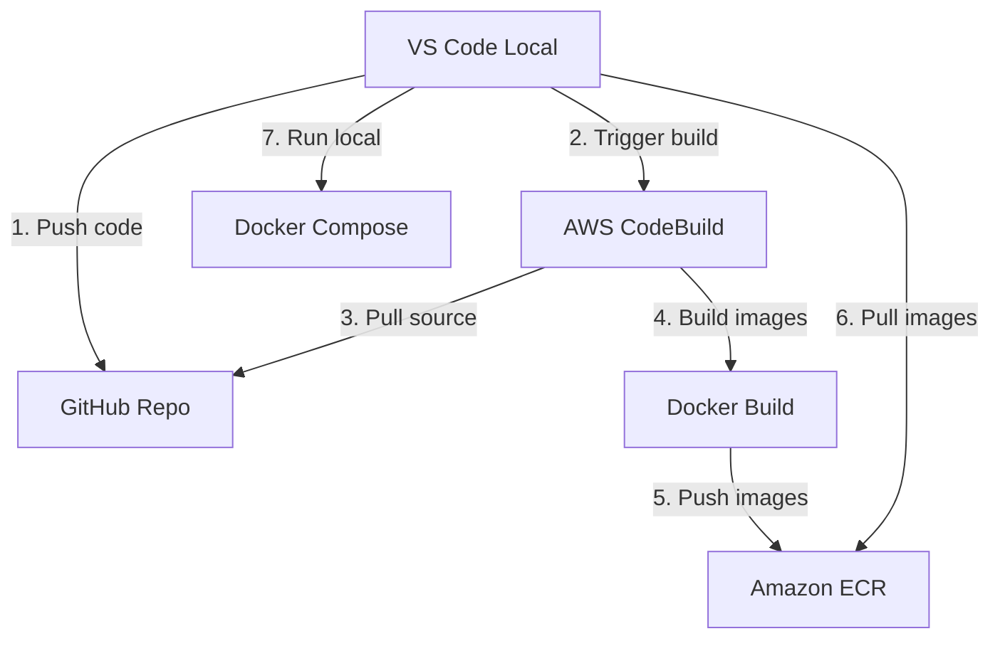

# 🚀 Guide Build Docker Distant avec AWS CodeBuild

*Déportez vos builds Docker sur des instances AWS puissantes pour éviter la surcharge de votre laptop*

## 🎯 Pourquoi ce Workflow ?

**Problème** : Build Docker avec MegaParse prend +30min sur laptop
**Solution** : Build distant sur instances AWS optimisées (2-5min)
**Économie** : ~$0.10 par build vs 30min de CPU local

## 📋 Architecture du Workflow



## 🛠️ Configuration Initiale

### 1. **Prérequis**
- AWS CLI configuré (`aws configure`)
- Git repository sur GitHub
- Docker Desktop installé

### 2. **Première Configuration** (Une fois)

```powershell
# Dans VS Code - Terminal
# Ctrl+Shift+P > "Tasks: Run Task" > "🛠️ Setup CodeBuild Project"

# Ou manuellement
.\scripts\setup-codebuild.ps1 -GitHubRepo "https://github.com/VOTRE_USERNAME/SAP_KB.git"
```

**Ce que fait le setup** :
✅ Crée le rôle IAM pour CodeBuild
✅ Configure les permissions ECR
✅ Crée le projet CodeBuild
✅ Configure les instances optimisées

### 3. **Configuration buildspec.yml**

Modifiez `buildspec.yml` ligne 8 :
```yaml
AWS_ACCOUNT_ID: "VOTRE_ACCOUNT_ID"  # Remplacez par votre Account ID
```

## 🚀 Utilisation Quotidienne

### **Option 1: Via VS Code Tasks** (Recommandé)

1. **Ctrl+Shift+P** → `Tasks: Run Task`
2. Sélectionner **`🚀 Build Docker Remote (CodeBuild)`**
3. ☕ Attendre ~5-10min (vs 30min+ local)
4. Une fois terminé : **`📦 Pull Images from ECR`**
5. Lancer : **`🐳 Docker Compose Up (Local Images)`**

### **Option 2: Via Scripts PowerShell**

```powershell
# 1. Déclencher le build distant
.\scripts\build-remote.ps1 -Wait

# 2. Récupérer les images
.\scripts\pull-images.ps1

# 3. Lancer les conteneurs
docker-compose up -d
```

### **Option 3: Build & Pull Automatique**

```powershell
# Build + Pull en une commande
.\scripts\build-remote.ps1 -Wait && .\scripts\pull-images.ps1
```

## 📊 Monitoring et Debugging

### **Suivre un Build en Cours**

```powershell
# Console AWS
https://us-east-1.console.aws.amazon.com/codesuite/codebuild/projects/sap-kb-docker-build

# Via CLI
aws codebuild batch-get-builds --ids "BUILD_ID"
```

### **Vérifier les Images**

```powershell
# Task VS Code: "🔍 Docker Images Status"
# Ou manuellement :
docker images | grep sap-kb
docker-compose ps
```

### **Nettoyer Docker Local**

```powershell
# Task VS Code: "🧹 Clean Local Docker"
# Ou manuellement :
docker system prune -f
docker volume prune -f
```

## 💰 Coûts et Performance

### **Instance CodeBuild Utilisée**
- Type : `BUILD_GENERAL1_LARGE`
- Specs : 8 vCPUs, 15 GB RAM
- Coût : ~$0.10 pour build 20min
- Cache : Activé pour builds suivants plus rapides

### **Comparaison Build Time**
| Environnement | Temps Build | Coût |
|---------------|-------------|------|
| Laptop Local | 30-45min | Gratuit (mais CPU saturé) |
| CodeBuild | 5-10min | ~$0.10 |

### **Économies ECR**
- Stockage : $0.10/GB/mois
- Images totales : ~2-3GB
- Coût stockage : ~$0.30/mois

## 🔧 Troubleshooting

### **Build qui Fail**

1. **Vérifier les logs** dans la console AWS
2. **Problème fréquent** : Account ID incorrect dans buildspec.yml
3. **Permissions** : Vérifier le rôle IAM CodeBuild

### **Images non Disponibles**

```powershell
# Vérifier connexion ECR
aws ecr get-login-password --region us-east-1

# Lister les images ECR
aws ecr describe-images --repository-name sap-kb-app
```

### **Première Utilisation Lente**

- Premier build : 15-20min (téléchargement dépendances)
- Builds suivants : 5-8min (cache activé)

## 🎯 Optimisations Avancées

### **Multi-région pour Latence**

```yaml
# buildspec.yml - modifier pour votre région préférée
AWS_DEFAULT_REGION: eu-west-1  # Europe
```

### **Cache Builds Plus Agressif**

```yaml
# buildspec.yml - augmenter le cache
cache:
  paths:
    - '/root/.cache/**/*'
    - '/var/lib/docker/**/*'
    - '/tmp/pip-cache/**/*'
```

### **Build Conditionnel**

```powershell
# Ne builder que si changements dans Dockerfiles
if (git diff HEAD~1 --name-only | grep -E "(Dockerfile|requirements)") {
    .\scripts\build-remote.ps1
}
```

## 📱 Integration CI/CD Future

Le setup actuel permet facilement d'évoluer vers :
- **GitHub Actions** : Trigger automatique sur push
- **AWS ECS Deploy** : Déploiement automatique production
- **Multi-environment** : Dev/Staging/Prod séparés

---

## 🔗 Liens Utiles

- [Console AWS CodeBuild](https://console.aws.amazon.com/codesuite/codebuild/)
- [Console Amazon ECR](https://console.aws.amazon.com/ecr/)
- [Documentation AWS CodeBuild](https://docs.aws.amazon.com/codebuild/)

**🎉 Avec ce workflow, vos builds Docker MegaParse passent de 30min+ à 5-10min !**