# True Semantic Intelligence KG Architecture - Complete Integration

**Objectif Principal:** Construire un Knowledge Graph intelligent et nuancé via une architecture dual-graph (Proto-KG → KG Published) qui capture la vraie intelligence sémantique tout en maîtrisant les coûts et la volumétrie.

**Philosophie Intégrée:** Intelligence sémantique réelle + Architecture dual-storage + Gatekeeper intelligent + Volumétrie maîtrisée = KG qui comprend vraiment le sens des documents.

---

## Architecture Globale : Dual Graph + Semantic Intelligence

```mermaid
flowchart TB
    START[📄 Document] --> SEMANTIC_ANALYSIS[🧠 Semantic Flow Analysis]
    SEMANTIC_ANALYSIS --> CONTEXTUAL_SEGMENTATION[📊 Contextual Segmentation]
    CONTEXTUAL_SEGMENTATION --> INTELLIGENT_EXTRACTION[🎭 Intelligent Extraction]
    
    INTELLIGENT_EXTRACTION --> DUAL_STORAGE{Dual Storage Strategy}
    
    DUAL_STORAGE -->|Concepts + Facts| QDRANT_PROTO[(🎯 Qdrant Proto<br/>Semantic Concepts)]
    DUAL_STORAGE -->|Entities + Relations| NEO4J_PROTO[(🧬 Neo4j Proto-KG<br/>Candidates + Evidence)]
    
    QDRANT_PROTO --> SEMANTIC_GATEKEEPER[⚖️ Semantic Gatekeeper]
    NEO4J_PROTO --> SEMANTIC_GATEKEEPER
    
    SEMANTIC_GATEKEEPER -->|Promote| QDRANT_PUBLISHED[(🎯 Qdrant Published<br/>Validated Concepts)]
    SEMANTIC_GATEKEEPER -->|Promote| NEO4J_PUBLISHED[(🕸️ Neo4j KG Published<br/>Clean Relations)]
    
    SEMANTIC_GATEKEEPER -->|Reject/Stage| VOLUMETRY_MANAGEMENT[📦 HOT/WARM/COLD/FROZEN]
    
    NEO4J_PUBLISHED --> QUERY_INTERFACE[🔍 Intelligent Query Interface]
    QDRANT_PUBLISHED --> QUERY_INTERFACE
    
    QUERY_INTERFACE --> LEARNING_LOOP[🔄 Continuous Learning]
    LEARNING_LOOP --> SEMANTIC_ANALYSIS

    style SEMANTIC_ANALYSIS fill:#e1f5ff
    style INTELLIGENT_EXTRACTION fill:#fff4e1
    style SEMANTIC_GATEKEEPER fill:#ffe1f5
    style NEO4J_PUBLISHED fill:#e1ffe1
    style QDRANT_PUBLISHED fill:#e1ffe1
```



---

## 1. Semantic Flow Analysis + Document Profiling

### 1.1 Narrative Intelligence Layer

```python
class SemanticDocumentProfiler:
    def analyze_document_intelligence(self, document):
        """Analyse l'intelligence sémantique du document pour guider tout le pipeline"""
        
        # 1. Narrative Flow Analysis (nouveau)
        narrative_threads = self.identify_narrative_threads(document)
        reasoning_chains = self.detect_reasoning_chains(document)
        
        # 2. Complexity Mapping (adapté des échanges précédents)
        complexity_zones = self.map_semantic_complexity_zones(document)
        
        # 3. Domain Classification (des échanges initiaux)
        domain_profile = self.classify_domain_and_archetype(document)
        
        # 4. Budget Intelligence (synthèse coût/intelligence)
        intelligence_budget = self.allocate_intelligence_budget(
            complexity_zones, domain_profile
        )
        
        return DocumentIntelligence(
            narrative_threads=narrative_threads,
            reasoning_chains=reasoning_chains,
            complexity_zones=complexity_zones,
            domain_profile=domain_profile,
            intelligence_budget=intelligence_budget
        )
    
    def identify_narrative_threads(self, document):
        """Identifie les fils narratifs qui connectent les segments"""
        threads = []
        
        # Connecteurs causaux (repris des discussions sémantiques)
        causal_connectors = self.detect_causal_connectors(document.full_text)
        
        # Références cross-segments (des discussions contextuelles)
        cross_references = self.detect_cross_segment_references(document)
        
        # Chaînes temporelles (logique temporelle)
        temporal_chains = self.detect_temporal_sequences(document)
        
        for connector_set in [causal_connectors, cross_references, temporal_chains]:
            for connector in connector_set:
                thread = NarrativeThread(
                    type=connector.type,
                    segments=connector.connected_segments,
                    strength=self.assess_connection_strength(connector)
                )
                threads.append(thread)
        
        return threads
```

---

## 2. Contextual Segmentation (MegaParse + Intelligence)

### 2.1 Intelligent Clustering Strategy

```python
class IntelligentSegmentationEngine:
    def create_intelligent_clusters(self, document, document_intelligence):
        """Crée des clusters qui préservent l'intelligence sémantique"""
        
        # Base MegaParse (des échanges initiaux)
        base_segments = self.megaparse_segmentation(document)
        
        # Enhancement avec intelligence narrative
        intelligent_clusters = []
        
        for segment in base_segments:
            # Trouve les narrative threads qui touchent ce segment
            relevant_threads = [
                thread for thread in document_intelligence.narrative_threads
                if segment in thread.segments
            ]
            
            # Détermine le niveau de clustering nécessaire
            if relevant_threads:
                cluster = self.build_narrative_cluster(segment, relevant_threads)
            else:
                cluster = self.build_standard_cluster(segment)
            
            intelligent_clusters.append(cluster)
        
        return intelligent_clusters
    
    def build_narrative_cluster(self, primary_segment, narrative_threads):
        """Cluster qui préserve les fils narratifs (intelligence sémantique)"""
        
        # Segments connectés par les fils narratifs
        connected_segments = set()
        connected_segments.add(primary_segment)
        
        for thread in narrative_threads:
            for segment in thread.segments:
                connected_segments.add(segment)
        
        # Contexte ordonné chronologiquement
        ordered_context = sorted(connected_segments, key=lambda s: s.position)
        
        return IntelligentCluster(
            primary_segment=primary_segment,
            narrative_context=ordered_context,
            narrative_threads=narrative_threads,
            extraction_strategy='SEMANTIC_REASONING',  # LLM premium nécessaire
            budget_allocation='HIGH'  # Intelligence coûte plus cher
        )
```

---

## 3. Dual Storage Intelligent Extraction

### 3.1 Strategic LLM Orchestration

```python
class DualStorageIntelligentExtractor:
    def extract_for_dual_storage(self, intelligent_cluster):
        """Extraction qui alimente intelligemment Qdrant ET Neo4j Proto-KG"""
        
        # Extraction avec préservation contextuelle (intelligence sémantique)
        if intelligent_cluster.extraction_strategy == 'SEMANTIC_REASONING':
            extraction_result = self.semantic_reasoning_extraction(intelligent_cluster)
        else:
            extraction_result = self.standard_extraction(intelligent_cluster)
        
        # Séparation pour dual storage (architecture des échanges)
        dual_storage_data = self.prepare_dual_storage(extraction_result)
        
        # Vers Qdrant Proto (concepts + facts avec embeddings)
        self.stage_to_qdrant_proto(dual_storage_data.concepts, dual_storage_data.facts)
        
        # Vers Neo4j Proto-KG (entities + relations avec candidature)
        self.stage_to_neo4j_proto(dual_storage_data.entities, dual_storage_data.relations)
        
        return dual_storage_data
    
    def semantic_reasoning_extraction(self, cluster):
        """Extraction préservant toute l'intelligence sémantique"""
        
        reasoning_prompt = f"""
        CONTEXTE NARRATIF COMPLET:
        {self.format_narrative_context(cluster)}
        
        FILS NARRATIFS IDENTIFIÉS:
        {self.format_narrative_threads(cluster.narrative_threads)}
        
        SEGMENT PRINCIPAL:
        {cluster.primary_segment.text}
        
        EXTRACTION DUAL-STORAGE:
        
        Pour QDRANT (concepts sémantiques + facts):
        - Extraire les concepts nuancés avec leur contexte narratif complet
        - Capturer les faits avec leurs conditions et modérateurs
        - Préserver les implications causales et temporelles
        
        Pour NEO4J (entités + relations candidates):
        - Entités avec normalisation (tenant_id, normalized_name, entity_type)
        - Relations avec force causale et certitude (confidence, conditions)
        - Résoudre les anaphores ("ce système" → nom réel)
        - Relations cross-segments si narrative thread le justifie
        
        CONTRAINTES ARCHITECTURALES:
        - Entités: MERGE par (tenant_id, normalized_name, entity_type) 
        - Relations: avec provenance et support_count
        - Facts: MERGE par (tenant_id, subject, predicate, value)
        - Tout avec source_document et evidence_text
        
        FORMAT DUAL-STORAGE:
        {{
            "for_qdrant": {{
                "concepts": [...],
                "facts": [...]
            }},
            "for_neo4j": {{
                "entities": [...],
                "relations": [...] 
            }},
            "semantic_metadata": {{
                "narrative_preservation": 0.0-1.0,
                "causal_chains_detected": [...],
                "cross_segment_relations": [...]
            }}
        }}
        """
        
        return self.call_reasoning_llm(reasoning_prompt, model='gpt-4', max_tokens=10000)
```

---

## 4. Proto-KG Staging (Dual Storage Implementation)

### 4.1 Qdrant Proto (Concepts + Facts)

```python
class QdrantProtoManager:
    def stage_concepts_and_facts(self, concepts, facts, metadata):
        """Stage des concepts/facts avec dédup sémantique intelligente"""
        
        for concept in concepts:
            # Embedding du concept avec contexte narratif
            concept_text = f"{concept.full_explanation} [Context: {concept.narrative_context}]"
            embedding = self.model.encode(concept_text, normalize_embeddings=True)
            
            # Dédup sémantique (des échanges initiaux sur surcharge Qdrant)
            similar_concepts = self.qdrant_client.search(
                collection_name="concepts_proto",
                query_vector=embedding,
                limit=3,
                score_threshold=0.95
            )
            
            if similar_concepts:
                # Agrégation plutôt que duplication
                self.aggregate_similar_concept(concept, similar_concepts[0])
            else:
                # Nouveau concept
                self.qdrant_client.upsert(
                    collection_name="concepts_proto",
                    points=[PointStruct(
                        id=uuid.uuid4().hex,
                        vector=embedding,
                        payload={
                            "text": concept.full_explanation,
                            "narrative_context": concept.narrative_context,
                            "semantic_richness": concept.semantic_richness,
                            "source_document": metadata.source_document,
                            "stage": "PROTO",  # Pas encore validé
                            "confidence": concept.confidence
                        }
                    )]
                )
        
        # Idem pour facts avec MERGE logique
        self.stage_facts_with_merge(facts, metadata)
```

### 4.2 Neo4j Proto-KG (Entities + Relations)

```python
class Neo4jProtoManager:
    def stage_entities_and_relations(self, entities, relations, metadata):
        """Stage en Neo4j Proto-KG avec architecture candidate"""
        
        # Entities candidates avec MERGE (des échanges sur dédoublonnage)
        for entity in entities:
            normalized_name = self.normalize_entity_name(entity.name)
            
            cypher_query = """
            MERGE (e:CandidateEntity {
                tenant_id: $tenant_id,
                normalized_name: $normalized_name, 
                entity_type: $entity_type
            })
            ON CREATE SET 
                e.uuid = $uuid,
                e.original_name = $original_name,
                e.description = $description,
                e.confidence = $confidence,
                e.stage = 'PROTO',
                e.source_count = 1,
                e.sources = [$source_doc],
                e.created_at = datetime()
            ON MATCH SET
                e.source_count = e.source_count + 1,
                e.sources = apoc.coll.toSet(e.sources + $source_doc),
                e.confidence = CASE 
                    WHEN $confidence > e.confidence THEN $confidence 
                    ELSE e.confidence 
                END,
                e.updated_at = datetime()
            RETURN e.uuid as entity_uuid
            """
            
            self.neo4j_session.run(cypher_query, 
                tenant_id="default",
                normalized_name=normalized_name,
                entity_type=entity.type,
                uuid=str(uuid.uuid4()),
                original_name=entity.name,
                description=entity.description,
                confidence=entity.confidence,
                source_doc=metadata.source_document
            )
        
        # Relations candidates avec support_count (des échanges sur aggregation)
        self.stage_relations_with_aggregation(relations, metadata)
```

---

## 5. Semantic Gatekeeper (Intelligence-Aware Promotion)

### 5.1 Multi-Criteria Intelligence Assessment

```python
class SemanticIntelligentGatekeeper:
    def evaluate_for_promotion(self, candidate, proto_context):
        """Évaluation qui privilégie l'intelligence sémantique réelle"""
        
        # Score de base (des échanges sur gatekeeper multi-critères)
        base_criteria = {
            'llm_confidence': candidate.confidence,
            'source_count': min(candidate.source_count / 3.0, 1.0),
            'type_validity': self.validate_ontology_compliance(candidate),
            'orphan_penalty': self.assess_orphan_penalty(candidate)
        }
        
        # Critères d'intelligence sémantique (nouveau)
        intelligence_criteria = {
            'narrative_coherence': self.assess_narrative_coherence(candidate, proto_context),
            'causal_reasoning_quality': self.assess_causal_reasoning(candidate),
            'contextual_richness': self.assess_contextual_richness(candidate),
            'semantic_uniqueness': self.assess_semantic_uniqueness(candidate)
        }
        
        # Profils par domaine (des échanges sur profils langue/domaine)
        domain_profile = self.get_domain_profile(proto_context.domain)
        
        # Score composite avec poids intelligence
        composite_score = self.compute_intelligence_weighted_score(
            base_criteria, 
            intelligence_criteria, 
            domain_profile
        )
        
        return PromotionDecision(
            action=self.decide_promotion_action(composite_score, intelligence_criteria),
            score=composite_score,
            evidence_level=self.classify_evidence_level(base_criteria, intelligence_criteria),
            intelligence_justification=self.generate_intelligence_justification(intelligence_criteria)
        )
    
    def assess_narrative_coherence(self, candidate, proto_context):
        """Évalue si le candidat s'intègre cohéremment dans les fils narratifs"""
        
        narrative_fit_score = 0.0
        
        # Le candidat fait-il partie d'une chaîne narrative cohérente?
        relevant_threads = self.find_relevant_narrative_threads(candidate, proto_context)
        
        if relevant_threads:
            for thread in relevant_threads:
                thread_coherence = self.assess_thread_coherence(candidate, thread)
                narrative_fit_score = max(narrative_fit_score, thread_coherence)
        
        return narrative_fit_score
    
    def decide_promotion_action(self, composite_score, intelligence_criteria):
        """Décision de promotion qui privilégie l'intelligence"""
        
        # Seuils adaptatifs selon l'intelligence
        if intelligence_criteria['narrative_coherence'] > 0.8:
            # Relations narratives riches: seuil plus bas acceptable
            promotion_threshold = 0.65
        elif intelligence_criteria['causal_reasoning_quality'] > 0.7:
            # Causalité forte: seuil standard
            promotion_threshold = 0.70
        else:
            # Pas d'intelligence particulière: seuil plus élevé
            promotion_threshold = 0.75
        
        if composite_score >= promotion_threshold:
            return 'PROMOTE'
        elif composite_score >= (promotion_threshold - 0.1):
            return 'STAGE_FOR_HUMAN_REVIEW'
        else:
            return 'REJECT'
```

### 5.2 Promotion to Published KG (Dual Storage)

```python
def promote_to_published_storage(self, promotion_decisions):
    """Promotion vers le dual storage publié (Qdrant + Neo4j clean)"""
    
    promoted_concepts = []
    promoted_entities = []
    promoted_relations = []
    promoted_facts = []
    
    for decision in promotion_decisions:
        if decision.action == 'PROMOTE':
            candidate = decision.candidate
            
            if isinstance(candidate, CandidateConcept):
                # Vers Qdrant Published avec tag de qualité
                self.promote_concept_to_qdrant_published(candidate, decision.evidence_level)
                promoted_concepts.append(candidate)
                
            elif isinstance(candidate, CandidateEntity):
                # Vers Neo4j Published avec MERGE clean
                self.promote_entity_to_neo4j_published(candidate)
                promoted_entities.append(candidate)
                
            elif isinstance(candidate, CandidateRelation):
                # Vers Neo4j Published comme relation typée
                self.promote_relation_to_neo4j_published(candidate)
                promoted_relations.append(candidate)
                
            elif isinstance(candidate, CandidateFact):
                # MERGE des facts avec source tracking
                self.promote_fact_with_merge(candidate)
                promoted_facts.append(candidate)
    
    return PromotionResults(
        concepts=promoted_concepts,
        entities=promoted_entities, 
        relations=promoted_relations,
        facts=promoted_facts
    )
```

---

## 6. Volumétrie Management (HOT/WARM/COLD/FROZEN)

### 6.1 Intelligent Retention Strategy

```python
class IntelligentVolumetryManager:
    def manage_proto_kg_lifecycle(self):
        """Gestion intelligente du cycle de vie du Proto-KG"""
        
        # HOT (7-14 jours): Tout récemment extrait avec caps intelligents
        self.manage_hot_tier_with_caps()
        
        # WARM (30-60 jours): Agrégation des candidats par intelligence
        self.aggregate_warm_tier_by_intelligence()
        
        # COLD: Archivage avec préservation métadonnées intelligence
        self.archive_to_cold_with_intelligence_metadata()
        
        # FROZEN: Statistiques pour pattern mining et learning loop
        self.create_frozen_statistics()
    
    def manage_hot_tier_with_caps(self):
        """Caps intelligents basés sur la valeur sémantique"""
        
        # Caps adaptés selon l'intelligence (pas fixes)
        hot_candidates = self.get_hot_tier_candidates()
        
        for candidate in hot_candidates:
            intelligence_score = self.assess_candidate_intelligence(candidate)
            
            if intelligence_score > 0.8:
                # Haute intelligence: garde plus longtemps, caps plus élevés
                candidate.retention_priority = 'HIGH'
                candidate.max_hot_duration = 21  # jours
            elif intelligence_score > 0.5:
                candidate.retention_priority = 'MEDIUM' 
                candidate.max_hot_duration = 14
            else:
                candidate.retention_priority = 'LOW'
                candidate.max_hot_duration = 7
        
        # Application des caps avec préférence intelligence
        self.apply_intelligent_caps(hot_candidates)
```

---

## 7. Living Ontology + Pattern Discovery

### 7.1 Real-Time Intelligent Pattern Mining

```python
class LivingIntelligentOntology:
    def discover_patterns_continuously(self, new_extractions, current_ontology):
        """Découverte continue de patterns avec validation intelligence"""
        
        # Analyse des nouveaux patterns émergents
        emergent_patterns = self.analyze_emergent_patterns(new_extractions)
        
        # Validation sémantique intelligente (pas juste statistique)
        for pattern in emergent_patterns:
            intelligence_validation = self.validate_pattern_intelligence(pattern)
            
            if intelligence_validation.is_semantically_coherent:
                # Test d'intégration avec l'ontologie existante
                integration_test = self.test_ontology_integration(pattern, current_ontology)
                
                if integration_test.is_compatible:
                    # Mode d'essai intelligent (K occurrences, T jours)
                    self.activate_pattern_trial(pattern, trial_params={
                        'max_occurrences': 50,
                        'trial_duration_days': 14,
                        'min_intelligence_score': 0.6
                    })
        
        return self.get_updated_ontology()
    
    def validate_pattern_intelligence(self, pattern):
        """Validation qui va au-delà de la fréquence statistique"""
        
        validation_prompt = f"""
        NOUVEAU PATTERN DÉTECTÉ:
        Type de relation: {pattern.relation_type}
        Contextes d'occurrence: {pattern.contexts}
        Support multi-documents: {pattern.document_support}
        
        VALIDATION INTELLIGENCE SÉMANTIQUE:
        
        1. Ce pattern capture-t-il une relation sémantique cohérente et stable?
        2. Apporte-t-il une nuance informationnelle distincte des relations existantes?
        3. S'intègre-t-il logiquement dans les chaînes causales/temporelles observées?
        4. Facilite-t-il des raisonnements ou requêtes spécifiques utiles?
        
        ÉVALUATION: COHERENT|REDUNDANT|NOISE avec justification sémantique.
        """
        
        return self.call_reasoning_llm(validation_prompt, model='gpt-4')
```

---

## 8. Cost Management for Complete Architecture

### 8.1 Intelligent Budget Distribution

```python
class ArchitecturalBudgetManager:
    def allocate_budget_across_architecture(self, document_intelligence, available_budget):
        """Allocation budgétaire à travers toute l'architecture dual-storage"""
        
        total_budget = available_budget
        
        # Distribution selon l'intelligence potentielle
        if document_intelligence.semantic_richness > 0.8:
            budget_allocation = {
                'semantic_analysis': 0.15,           # Analyse narrative + complexité
                'intelligent_extraction': 0.45,     # Extraction contextuelle premium
                'dual_storage_processing': 0.10,    # Préparation Qdrant + Neo4j
                'gatekeeper_evaluation': 0.20,      # Évaluation multi-critères
                'pattern_discovery': 0.05,          # Mining en temps réel
                'validation_llm': 0.05              # Second avis sur borderline
            }
        else:
            # Budget réduit pour documents moins riches
            budget_allocation = {
                'semantic_analysis': 0.10,
                'intelligent_extraction': 0.35,
                'dual_storage_processing': 0.15,
                'gatekeeper_evaluation': 0.25,
                'pattern_discovery': 0.10,
                'validation_llm': 0.05
            }
        
        return {
            component: total_budget * allocation 
            for component, allocation in budget_allocation.items()
        }
```

---

## 9. Query Interface & Learning Loop

### 9.1 Intelligent Query Processing

```python
class IntelligentQueryInterface:
    def process_semantic_query(self, user_query):
        """Interface de requête qui exploite toute l'intelligence du KG"""
        
        # Analyse sémantique de la requête
        query_semantics = self.analyze_query_semantics(user_query)
        
        # Stratégie de recherche dual-storage
        if query_semantics.requires_conceptual_search:
            # Recherche dans Qdrant Published pour concepts/insights
            conceptual_results = self.search_qdrant_published(query_semantics)
        
        if query_semantics.requires_relational_traversal:
            # Traversal dans Neo4j Published pour relations/chaînes
            relational_results = self.traverse_neo4j_published(query_semantics)
        
        # Synthèse intelligente des résultats dual-storage
        synthesized_answer = self.synthesize_dual_storage_results(
            conceptual_results, 
            relational_results,
            query_semantics
        )
        
        # Feedback pour learning loop
        self.capture_query_feedback(user_query, synthesized_answer)
        
        return synthesized_answer
```

### 9.2 Continuous Learning Integration

```python
class ArchitecturalLearningLoop:
    def learn_from_system_usage(self, usage_patterns, promotion_outcomes, query_feedback):
        """Apprentissage continu à travers toute l'architecture"""
        
        learning_updates = {}
        
        # Mise à jour des stratégies d'analyse sémantique
        semantic_analysis_updates = self.optimize_semantic_analysis(usage_patterns)
        learning_updates['semantic_analysis'] = semantic_analysis_updates
        
        # Optimisation des seuils du gatekeeper
        gatekeeper_updates = self.optimize_gatekeeper_thresholds(promotion_outcomes)
        learning_updates['gatekeeper'] = gatekeeper_updates
        
        # Amélioration des patterns d'ontologie
        ontology_updates = self.evolve_ontology_patterns(query_feedback)
        learning_updates['ontology'] = ontology_updates
        
        # Optimisation de l'allocation budgétaire
        budget_updates = self.optimize_budget_allocation(usage_patterns, promotion_outcomes)
        learning_updates['budget_management'] = budget_updates
        
        return ArchitecturalLearningUpdate(learning_updates)
```

---

## 10. Complete Performance Metrics

```python
complete_architecture_metrics = {
    'dual_storage_performance': {
        'qdrant_concept_retrieval_accuracy': 0.89,      # Précision recherche concepts
        'neo4j_relation_traversal_efficiency': 0.91,    # Efficacité traversal relations
        'dual_storage_coherence_score': 0.87,           # Cohérence entre storages
        'promotion_pipeline_throughput': 245.3,         # Candidats traités/heure
    },
    
    'semantic_intelligence_preservation': {
        'narrative_continuity_maintained': 0.92,        # Continuité narrative préservée
        'causal_chains_completeness': 0.84,             # Complétude chaînes causales
        'cross_segment_relations_captured': 0.78,       # Relations cross-segments
        'implicit_references_resolved': 0.86,           # Anaphores résolues
    },
    
    'gatekeeper_effectiveness': {
        'promotion_precision': 0.88,                    # Précision promotions
        'intelligence_bias_factor': 1.23,               # Boost relations intelligentes
        'false_rejection_rate': 0.09,                   # Taux faux rejects
        'semantic_coherence_maintained': 0.91,          # Cohérence préservée
    },
    
    'cost_intelligence_ratio': {
        'cost_per_semantic_insight': 0.34,              # $/insight sémantique
        'intelligence_roi_vs_basic': 2.8,               # ROI vs approche basique
        'budget_efficiency_score': 0.84,                # Efficacité allocation budget
        'premium_processing_justification': 0.92        # Justification coût premium
    },
    
    'system_scalability': {
        'proto_kg_volumetry_control': 0.88,            # Contrôle volume Proto-KG
        'published_kg_growth_sustainability': 0.91,     # Croissance soutenable Published
        'processing_speed_at_scale': 156.2,             # Docs/heure à grande échelle
        'memory_efficiency_optimization': 0.83          # Optimisation mémoire
    }
}
```

---

## Implementation Roadmap (Intégrée)

### Phase 1: Dual Architecture Foundation (Semaines 1-6)
- [ ] MegaParse + Contextual Segmentation
- [ ] Dual Storage Setup (Qdrant Proto + Neo4j Proto)
- [ ] Basic Semantic Analysis Engine
- [ ] Simple Gatekeeper (multi-criteria)

### Phase 2: Semantic Intelligence Layer (Semaines 7-12)
- [ ] Narrative Flow Analysis
- [ ] Context-Preserving Extraction
- [ ] Intelligent Gatekeeper Enhancement
- [ ] Living Ontology (basic pattern discovery)

### Phase 3: Advanced Intelligence (Semaines 13-18)
- [ ] Multi-Level Causal Reasoning
- [ ] Temporal Logic Processing
- [ ] Real-time Pattern Validation
- [ ] Volumétrie Management (HOT/WARM/COLD/FROZEN)

### Phase 4: Production & Optimization (Semaines 19-24)
- [ ] Complete Learning Loop Integration
- [ ] Advanced Budget Management
- [ ] Intelligent Query Interface
- [ ] Performance Optimization & Scaling

---

## Conclusion: Architecture Complète

Cette architecture intègre TOUS les principes de nos échanges:

**Dual Graph** (Proto-KG → Published KG) avec séparation Qdrant/Neo4j
**Semantic Intelligence** préservation narrative + raisonnement causal
**Intelligent Gatekeeper** promotion basée intelligence + critères multiples
**Volumétrie Maîtrisée** HOT/WARM/COLD/FROZEN pour scalabilité
**Living Ontology** patterns émergents + validation continue
**Cost Management** allocation intelligente selon valeur sémantique
**Learning Loop** amélioration continue toute architecture

**Trade-off Final**: 400-800$ pour 1000 documents (vs 60-140$ approches "optimisées") mais KG qui capture vraiment l'intelligence sémantique avec architecture scalable et governée.