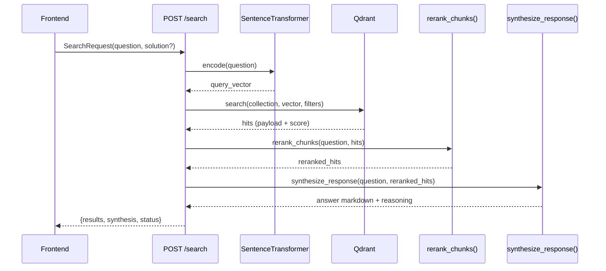
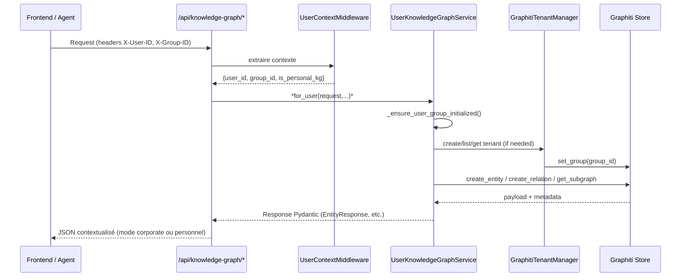

# Flux d’exécution majeurs

Ce document décrit les principaux workflows de Knowbase, du chargement d’un document à la génération de réponses et à la gestion du graph de connaissances. Chaque flux inclut un diagramme Mermaid synthétisant les étapes.

## 1. Ingestion documentaire (PPTX/PDF/Excel)

```mermaid
sequenceDiagram
    participant UI as UI / CLI
    participant API as POST /dispatch
    participant Redis as Redis Queue
    participant Worker as RQ Worker
    participant Pipeline as Pipelines ingestion
    participant Qdrant as Qdrant
    participant Storage as File Storage
    participant History as Redis Import History

    UI->>API: FormData(action_type=ingest, file, meta)
    API->>API: handle_dispatch()
    API->>History: add_import_record(uid,...)
    API->>Redis: enqueue_*_ingestion(job_id=uid)
    Redis-->>Worker: Job message
    Worker->>History: mark_job_as_processing()
    Worker->>Pipeline: process_pptx/process_pdf/process_excel
    Pipeline->>Storage: Enregistrement (slides, thumbnails, docs_done)
    Pipeline->>Qdrant: upsert embeddings
    Pipeline->>History: update_import_status(status=completed, chunks)
    Worker-->>History: update progress + heartbeat
    UI<<--API: {status:"queued", uid}
    UI->>API: GET /api/status/{uid}
    API->>Redis: fetch_job(uid)
    API->>History: get status + enrichissement
    API-->>UI: {status:"processing"|"done", details}
```

- `handle_dispatch()` bascule entre la recherche immédiate et l’ingestion. Pour les imports, il écrit le fichier dans `docs_in`, sauvegarde les métadonnées, enregistre l’événement dans Redis (`RedisImportHistoryService`) et pousse un job RQ (`enqueue_pptx_ingestion`, `enqueue_pdf_ingestion`, `enqueue_excel_ingestion`).
- Le worker (`ingestion.queue.worker`) réchauffe les clients (OpenAI, Qdrant) puis traite les jobs via `jobs.py`. Chaque pipeline (PPTX/PDF/Excel) gère l’extraction, la conversion en images, l’appel LLM (résumés, métadonnées), la vectorisation et la persistance dans Qdrant.
- Les mises à jour d’état (progression, heartbeat) sont injectées dans `job.meta` et répliquées dans l’historique Redis pour l’UI.

## 2. Remplissage automatique RFP Excel

```mermaid
flowchart TD
    A[Upload Excel RFP] --> B(handle_excel_rfp_fill)
    B --> C{Meta file?}
    C -- oui --> D[Enregistrer meta fournie]
    C -- non --> E[Générer meta par défaut]
    B --> F[Canonicalisation solution via LLM]
    B --> G[enqueue_fill_excel job]
    G --> H[Worker fill_excel_job]
    H --> I[smart_fill_excel_pipeline]
    I --> J[Analyse onglets & questions]
    J --> K[Recherche Qdrant + synthèse LLM]
    K --> L[Écriture réponses dans Excel]
    L --> M[Déplacement vers presentations_dir]
    M --> N[Mise à jour import history (chunks_filled)]
    N --> O[Endpoint /api/downloads/filled-rfp/{uid}]
```

- `handle_excel_rfp_fill()` prépare l’UID, stocke fichier & métadonnées, tente de canonicaliser la solution via OpenAI si fournie, puis enfile `fill_excel_job`.
- `smart_fill_excel_pipeline.main()` lit l’Excel, identifie les colonnes question/réponse, interroge Qdrant (`search_documents` ou pipelines dédiés) et remplit les cellules en utilisant les chunks les plus pertinents et des synthèses LLM.
- Le résultat est déposé dans `presentations_dir` avec suffixe `_filled.xlsx` et devient téléchargeable.

## 3. Recherche sémantique



- Les résultats incluent les liens statiques (`/static/slides`, `/static/presentations`) construits via `PUBLIC_URL` et le markdown généré par `_build_markdown_from_results()`.
- Le reranking (CrossEncoder) améliore la pertinence avant la synthèse LLM.

## 4. Knowledge Graph multi-tenant



- Lors du premier appel personnel, `_ensure_user_group_initialized()` crée un groupe dédié (`user_{id}`), provisionne un schéma de base (entité Profile) et met à jour les métadonnées utilisateur.
- Les caches `_ENTITY_CACHE` et `_RELATION_CACHE` conservent les créations récentes pour pallier les latences Graphiti tout en respectant le `group_id` courant.

## 5. Gouvernance des facts + intelligence IA

```mermaid
flowchart TD
    A[POST /api/facts] --> B[UserContext -> set_group]
    B --> C[detect_conflicts]
    C --> D[create_fact -> status proposed]
    D --> E[Conflicts?]
    E -- oui --> F[ConflictsListResponse]
    E -- non --> G[FactResponse]
    D --> H[Waiting for approval]
    H --> I[PUT /api/facts/{id}/approve]
    I --> J[approve_fact -> status approved]
    H --> K[PUT /api/facts/{id}/reject]
    K --> L[reject_fact -> status rejected]

    subgraph Intelligence IA
        M[POST /api/facts/intelligence/confidence-score]
        N[POST /api/facts/intelligence/detect-patterns]
        O[GET /api/facts/intelligence/alerts]
    end

    D --> M
    D --> N
    C --> O
```

- `FactsGovernanceService` manipule les faits dans Graphiti (ou caches transitoires) et maintient un audit trail (statuts, conflits). Les endpoints d’intelligence enrichissent ce processus via LLM (`FactsIntelligenceService`) pour scorer la confiance, suggérer des résolutions et détecter des tendances.

Ces diagrammes couvrent les chemins critiques. Les interactions détaillées (classes, fonctions) sont documentées dans `MODULES.md` et `registry.json`.
